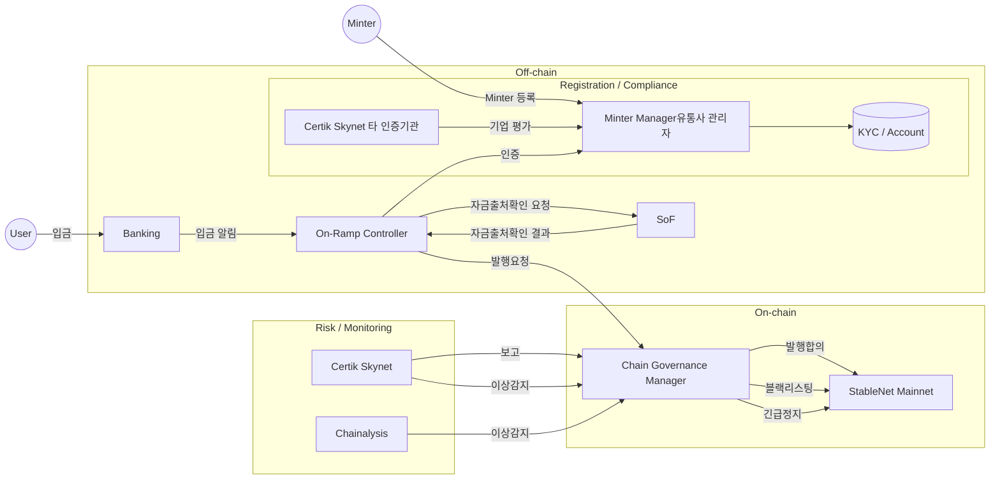
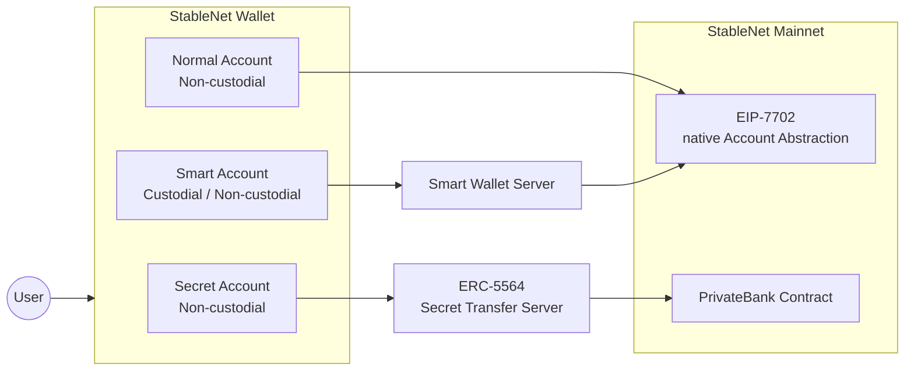
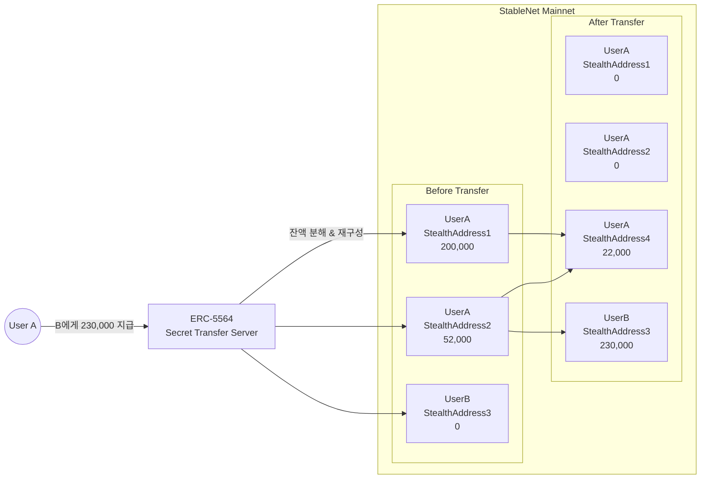

# 

# 편의점이 거부하는 기존 블록체인

* 지갑은 만들었는데, 무슨 코인으로 결제를 해야해?
  * 상점주는 코인을 받고 싶지 않다. 원화를 달라.
* 우리, 원화 스테이블코인을 찍었어. 이거 써!
  * 너네가 뭔데? 그거 진짜 원화랑 1:1 교환 보장해줘? 누가 보증해줘?
* 가장 널리 사용되는 이더리움 혹은 베이스 체인에 원화 스테이블코인 찍었으니 사용해!
  * 그거 쓰려면 이더리움 가스 코인이 있어야 하는데? 그거 어떻게 구해?
  * 거래소 계정 만들고, KYC하고, 은행 연결하고, 입금하고, 이더리움 사고, 3일 기다렸다가, 내 지갑으로 이더리움 보내면 돼. 간단하지?
* 편의점 알바분, 어디로 입금하면 되요?
  * 아네, 우리 주소가 뭐더라. 잠시만요… 영 엑스, 일칠비, 아니아니 알파벳 b요. 407…
* 우리 회사는 이번부터 월급을 원화 스테이블코인으로 드리겠습니다!
  * 저 부장님 주소가 0x1234…이래. 오! 월급이 이렇게 많았어? 스캔으로 모두 공개되는 월급액
* 또 해킹을 당했대! 브릿지에서 수천억이 털렸대나? 내 돈은 어찌 되는거야?
  * 저희는 완벽한 탈중앙 블록체인이라… 거래소에서 동결을… 대책을 고민하고 있습니…
* 지금 이 블록체인과 이 스테이블코인이 범죄자의 자금세탁처로 활용되고 있습니다. 규제를 해야겠습니다.
  * 저희는 수억개의 계좌가 있고, 전세계에 수백만개의 노드로 운영되는 탈중앙 체인입니다. 너네 나라에서 규제할 수 없습니다.
* 네 손님, 총 15,000원 결제하겠습니다.
  * 12초만 기다려주세요. 이더리움 블록 타임은 12초니까요.
  * 저희 L2체인은 1초입니다! 다만… 결제가 완.결.이. 되려면 “적당한(?)" 시간은 기다려주세요.
* 갑자기 체인 요청이 폭주하고 있어! 우리 페이 업체인데, 정산 관련 중요한 요청을 해야하는데, 처리가 안되고 있어. 어쩌지?
  * 수수료를 더 많이 지불하면 돼! 아니 다른 사람들도 수수료를 높여 지불하고 있어서 마찬가지인걸?
* 자, 우리는 이 모든 불편을 해소한 우리만의 프라이빗 체인을 만들었습니다! 쓰세요~ (하이퍼렛저 최신 기술을 이용했어요!)
  * 거래소: 네, 우리는 안받아줍니다.
  * 탈중앙 dapp: 너네 연동 못해, 너네끼리 놀아.
  * 미쿡사람: 우리는 USDC 갖고 it써요. 어떠케 한쿡에서 써yo?
  * 이 결제 앱으로만 사용할 수 있어요. 다른데 못 써요. 연동하세요!

# 편의점이 거부하는 기존 블록체인: 가스비 코인 문제

* 변동성이 심한 크립토코인으로 가스비를 지불하는 것은 장벽 그 자체이다.
  * 솔직히 크립토쟁이들은 자신이 만든 코인으로 돈을 벌고 싶어했다.
  * 이 가정이 맨 꼭대기에 있는 한, 사용자의 편의성 문제 근본을 해결할 방법이 없다.
* 자체 L2 체인에서 Paymaster를 통한 가스비 대납의 한계
  * L2 체인은 기본적으로 eth를 가스비로 사용
  * EIP-4337 Account Abstraction과 Paymater로 원화 스테이블코인을 받고 가스비를 대납 가능
  * “번들러”라는 권력에 의존하게 된다. eth 없이 일반 tx를 보낼 수 없다는 건 큰 제약
  * 사업자는 계속 이더리움(L1 roll up 비용)을 지불해야 한다.
  * L2 기술 표준으로부터 자유로울 수가 없다. -> “우리만의 기능” 개발에 큰 제약
* 결론은 원화 스테이블코인이 base coin인 L1 체인이 가장 타당
  * 기존 ERC20 표준 형태로 된 스테이블코인과 호환 필요
  * StableNet에서는 ERC20 wrapper 컨트랙트(NativeCoinAdapter) 제공

# StableNet: Minter(유통사)란?

* 엄격한 KYC를 마친 기관/스테이블코인 사업자
  * 예) 페이 업체, 카드사, 은행, 거래소 등
  * Certik의 Skynet 기업 평가 활용
  * 국내 인증 기관, 은행 등 신용도 평가 검사
  * AML 체크
  * 스테이블코인 소각 권한 및 StableNet의 authorized account 발급(트랜잭션 우선 적재)
* 원화를 입금하면 동일 수량의 스테이블코인 발행
  * 자금 출처 검사
  * StableNet의 Governance들이 모두 동의해야 스테이블코인 발행 (권한 분산)
  * 예치금 증명: 모든 스테이블코인 발행 트랜잭션에는 입금에 대한 proof를 온체인에 기록 
(Certik의 Proof of Reserve 서비스 사용가능)
* 유통
  * Minter 들은 각자의 서비스 도메인에 맞게 end user에게 스테이블코인 유통
  * 스테이블코인 트랜잭션 상시 모니터링
  * 글로벌 블록체인 공조 모니터링 가동
  * 긴급시 즉시 블랙리스팅: 계정 활동 원천 차단
* 출금
  * Minter는 언제든지 원화로 출금 가능
  * 일반인은 스테이블코인을 원화로 출금 불가능 -> 규제 관리를 위해

# StableNet: Mainnet

* WBFT 합의 알고리즘
  * go-ethereum, QBFT 구현체 기반
  * 1초 블록 타임, 1 block 블록 확정
  * 3000 TPS
  * 검증된 비잔틴 장애 내성
* No Inflation
  * 블록 생성 보상 없음
* 안정된 수수료 체계
  * 평상시 기본 트랜잭션 수수료를 1원에 맞춤
  * DoS 공격 방어를 위해 블록 혼잡시 BaseFee 증가
  * 마이너들이 단독으로 priority fee를 올릴 수 없음
* 기존 EVM과 완벽 호환
* Governance를 위한 Built-in System 컨트랙트
* NativeCoinAdapter 지원하여 기존 ERC20 토큰 인터페이스 동일 제공
  * Circle의 Arc 체인도 동일한 방식으로 지원
* 모든 스테이블코인 전송에 대해 Transfer event 로그 기록
* Blacklist 기능, authorized account 기능
  * 블록 혼잡시에도 authorized account의 TX를 우선 처리(기관 정산 트랜잭션 등)
* EIP-7702 구현
* 경쟁 체인: Circle의 Arc 체인, 스트라이프의 Tempo 체인
* 향후 마련되는 규제에 대응하여 커스터마이징 가능

# StableNet: Mainnet(계속) - 타체인과 비교
 
|   | StableNet | Arc | Public blockchain |
|---|---|---|---|
| 스테이블코인으로 가스비 지불 | 지원 | 지원 | 미지원 |
| 규제 준수 및 법정화폐 담보 | 지원 | 지원 | 미지원 |
| 거버넌스 기능 | 지원 | 미지원 | 미지원 |
| 성능 | 3000TPS | 3000TPS | 체인마다 상이 |
| evm 호환성 | 호환 | 호환 | 호환 |
| 블록완결시간 | 1초 | 1초 | 수분 |
| 수수료 대납 기능 | 지원 | Paymaster를 통해 가능(예정) | Paymaster를 통해 가능 |
| ERC20 컨트랙트 연동 | 지원 | 지원 | 미지원 |
| blacklist | 지원 | 지원 | 미지원 |
| 우선 처리용 인증 계정(authorized account) | 지원 | 미지원 | 미지원 |
| 수수료 체계 특징 | 안정적인 수수료 체계 | 변동성을 줄인 방식 | 변동성 허용 |
| 체인 소스코드 공개 | 공개 | 미공개 | 공개 |

# StableNet: Native Bridge

* Burn and Mint 방식
  * 타 체인으로 브릿지되면 StableNet에는 총통화량 감소, 타체인 총통화량 증가 -> 총통화량 유지
  * cf) Lock and Unlock 방식: 총통화량이 늘어나는 것 처럼 보임 -> 각종 Crypto Viewer들이 소명 요구함
  * Burn and Mint 방식이 되려면 해당 코인의 mint/burn 권한을 가질 수 있어야 함
* StableNet 스테이블코인은 타체인에 ERC20 토큰 형태로 배포
* Native Bridge를 통해 StableNet에서 발행한 토큰을 타체인에서 받을 수 있음
* Ethereum, Base chain, Arbitrum, Tron 등 다양한 블록체인에 대해 브릿지 제공 예정
* 타체인의 USDC, USDT 등은 CCIP나 써클 등 외부 공인 브릿지를 통해 브릿징 가능하도록 할 예정

# StableNet: Governance 구조

* 4가지 거버넌스에 역할 분산
  * GovValidator
  * GovMasterMinter
  * GovMinter
  * GovCouncil

# Wallet: Normal Account

* 탈중앙 방식
* Private Key, MNEMONIC
* 트랜잭션 수수료 필요
* 각종 Dapp 연동 가능
* StableNet 확장 기능
  * 수취인 지갑에 별명 표시
  * 송금 당시 잔액 내역
  * 정기 결제
* 체인과 직접 통신
  * 추가로 서버와 일부 통신

# Wallet: Smart Account

* EIP-7702 사용
* Account에 contract code 지정
* 수수료 대납 가능
  * 카드사, 은행 등이 수수료 대납 가능
* USDC, USDC 등 외부 토큰으로 수수료 지불 가능
* Private key 관리 없이 계정 기반으로 접근 제어 가능
  * private key는 중앙 서버가 관리
  * password 등으로 인증
  * 키 분실 대응 가능
* Sub account 연동 가능
  * Bot 계정에 특정 권한만 부여 가능
* 기타 응용 분야 무궁무진
* 진정한 mass-adoption을 위한 필수 기능

# Wallet: Secret Account

* 주소 추적이 난해하도록 하는 요구 사항
* 금액을 숨기고 싶은 요구 사항
  * 예) 급여, 기간간 대량 송금 등
* ZKP 기술의 한계
  * 암호화된 balance를 +, - 연산 증명 가능한 방식
  * 상용화까진 멀고도 험난: 데이터 사이즈가 너무 크거나 연산 속도가 너무 비싸거나…
* ERC-5564(Stealth Address) 활용하여 PoC

# Wallet: Secret Account(계속)

* 등록 Flow
  * A -> Secret Transfer Server로 주소 및 view key 등록
* 입금
  * Normal Account -> Secret Account로 입금
  * Normal Account로 가스비 수수료. 주소 금액 노출
* 비밀 송금
  * A -> Secret Transfer Server로 B의 stealth address 요청 및 응답
  * A: stealth spending private key로 B의 주소로 송금하는 내용에 대한 signature 생성
  * A -> Secret Transfer Server로 signature 전달
  * Secret Transfer Server는 n명의 요청을 묶어 하나의 트랜잭션으로 Contract call
  * Secret Transfer Server -> B에게 입금 내용 notify(새로 생성된 stealth address와 잔액)
  * B: 자신의 secret wallet에서 새로운 stealth address 목록 갱신
* 출금
  * Secret Account -> Normal Account로 출금
* 규제
  * 규제 당국이 Secret Transfer Server에게 전 송금 내역 요청 시 송수신자 및 금액 모두 공개 가능

# 결론: StableNet이기에…

* 지갑은 만들었는데, 무슨 코인으로 결제를 해야해?
  * **원화 스테이블코인을 바로 사용할 수 있습니다.**
* 우리, 원화 스테이블코인을 찍었어. 이거 써!
  * **StableNet 스테이블코인은 원화 담보를 보증하고 있으며, 언제든지 1:1 교환이 가능합니다.**
* 편의점 알바분, 어디로 입금하면 되요?
  * **QR 코드 찍으세요. 지갑에는 편의점 결제 내용으로 표시됩니다.**
* 우리 회사는 이번부터 월급을 원화 스테이블코인으로 드리겠습니다!
  * **Secret Account로 월급을 받아서 연봉을 숨길 수 있어요!**
* 또 해킹을 당했대! 브릿지에서 수천억이 털렸대나? 내 돈은 어찌 되는거야?
  * **해커의 계정을 바로 동결했습니다.**
* 지금 이 블록체인과 이 스테이블코인이 범죄자의 자금세탁처로 활용되고 있습니다. 규제를 해야겠습니다.
  * **Chainalysis와 Certik 등 글로벌 업체와 실시간 동조하여 해커 계정과 그와 연관된 모든 계정을 동결했습니다.**
* 네 손님, 총 15,000원 결제하겠습니다.
  * **바로 결제 완료 되었습니다.**
* 갑자기 체인 요청이 폭주하고 있어! 우리 페이 업체인데, 정산 관련 중요한 요청을 해야하는데, 처리가 안되고 있어. 어쩌지?
  * **아무리 혼잡해도 Minter 트랜잭션이 먼저 처리됩니다.**
* L1 블록체인 스테이블코인으로서,
  * **거래소: 상장됩니다.**
  * **탈중앙 dapp: 바로 연동됩니다.**
  * **미쿡사람: Smart Account로 바로 수수료로 사용할 수 있어요!**
  * **메타마스크 등 기타 외부 지갑 모두 연동됩니다. 브릿지도 지원하여 타체인으로도 전송이 가능합니다. 다양한 블록체인 DeFi에 활용될 수 있습니다.**

⠀
# 결론: 왜 블록체인이어야 하는가?

* 블록체인이 가져온 가장 큰 혁신은,
  * 연동을 하기 위해 계약서를 썼어야 했다 -> 이제는 프로토콜 기반이라 누구나 연동할 수 있다.
  * DB를 가진자가 갑 -> 모두가 데이터를 활용할 수 있다.
* 그럼에도 불구하고
  * 아무나 서비스를 만들게 했더니 사기꾼들만 난무하더라.
  * 너무 큰 자유는 우리에게 버거운 무게더라. 냉혹한 무법지대 같은…
  * 크립토쟁이들은 그들만의 생태계에만 몰두하더라.
* 양극단의 해악을 교훈 삼아
  * 아무나 도전할 수 있게 하되, 온체인으로 감시하고 규제하는게 필요하더라
  * 탈중앙적 테크로 구축하되 우리의 질서로 운영하자
  * ~탈중앙적 프로토콜은 “운영의 유연성”을 제공하는 가장 강력한 도구로서 여전히 건재하다!~
* “이런 건전하고 심오한 블록체인 철학을 가진 사업자가 만든 StableNet 입니다. 여러분.”

