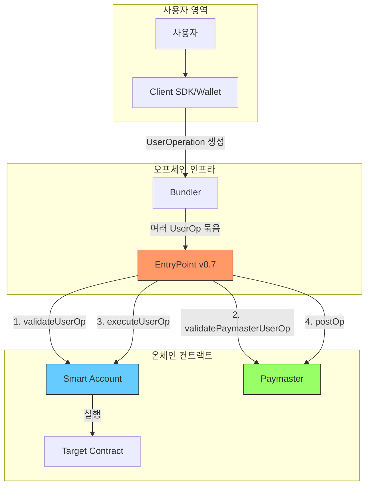
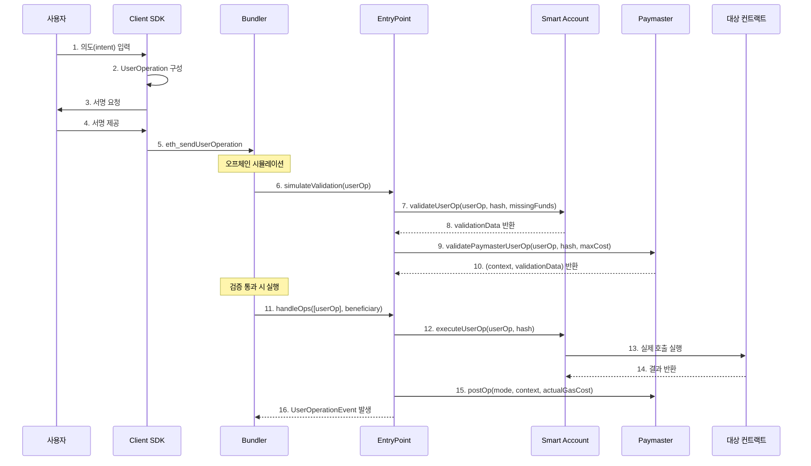
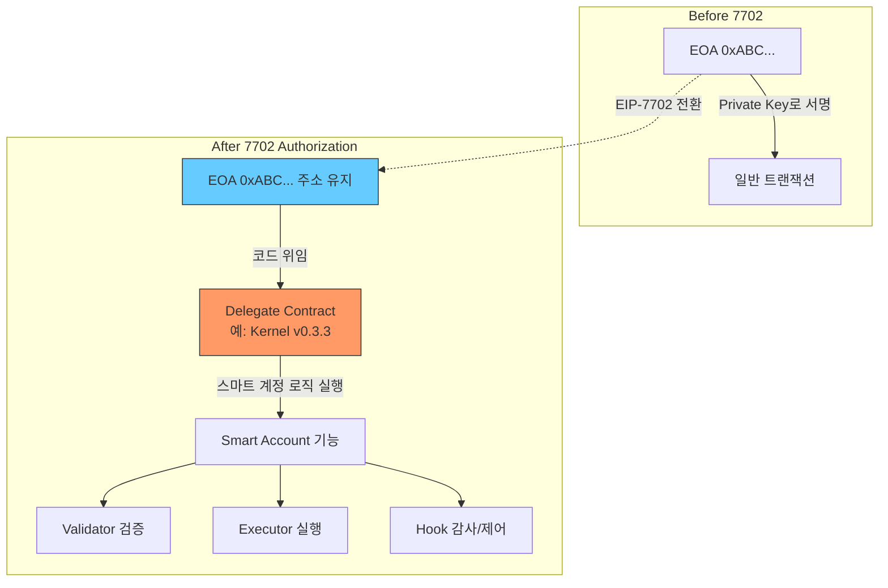
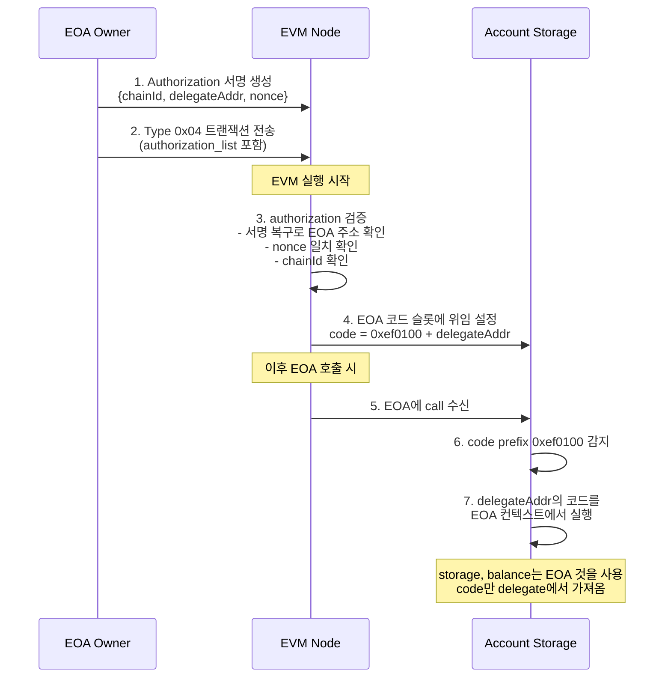
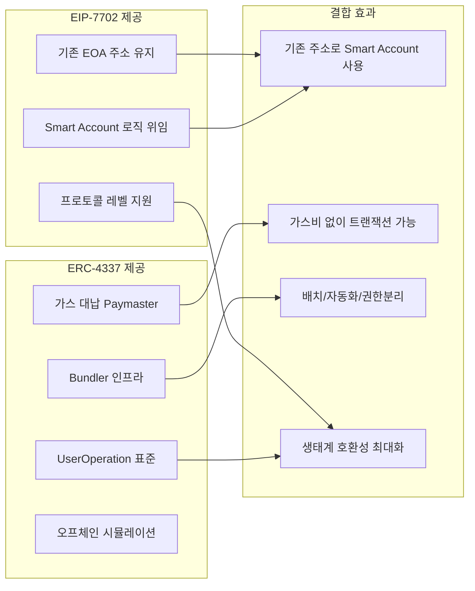
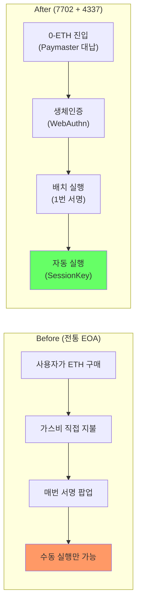

# 1. EIP-7702, ERC-4337 기술 등장 배경과 설명

## 1.1 현재 이더리움 계정의 한계

### EOA (Externally Owned Account)의 구조적 문제

이더리움에는 두 가지 계정 유형이 존재합니다:
- **EOA**: Private Key로 제어되는 일반 지갑 (MetaMask 등)
- **CA (Contract Account)**: 코드로 제어되는 스마트 컨트랙트

EOA는 단순하지만 치명적 한계가 있습니다:

| 한계 | 설명 | 영향 |
|---|---|---|
| 단일 키 의존 | Private Key 분실 = 영구 자산 손실 | 복구 불가 |
| 권한 분리 불가 | 모든 작업에 동일한 키 사용 | 위임/제한 불가 |
| 가스비 직접 부담 | ETH가 없으면 트랜잭션 불가 | 신규 사용자 진입장벽 |
| 자동화 불가 | 매번 사용자 서명 필요 | 구독/정기결제 구현 불가 |
| 배치 처리 불가 | 한 번에 하나의 작업만 실행 | 복합 DeFi 작업에 비효율적 |

### 스마트 계정 (CA)의 문제

CA 기반 Smart Account(예: Safe, Argent)는 위 문제를 해결하지만:
- **새로운 주소 생성 필요**: 기존 EOA의 자산/승인/이력 이관 필요
- **배포 비용**: 컨트랙트 배포에 높은 가스비 소요
- **생태계 호환성**: 많은 dApp이 EOA를 전제로 설계됨
- **마이그레이션 비용**: 수백 개의 토큰 승인(approve) 재설정 필요

## 1.2 ERC-4337: 프로토콜 변경 없는 계정 추상화

### 등장 배경

2021년 Vitalik Buterin이 제안한 ERC-4337은 이더리움 프로토콜(컨센서스 레이어)을 변경하지 않고, 완전히 상위 레이어에서 계정 추상화를 구현합니다.

### 핵심 아키텍처



### 핵심 컴포넌트

#### EntryPoint (싱글톤 컨트랙트)
- 모든 UserOperation의 진입점
- 검증(validation)과 실행(execution)을 분리하여 처리
- 가스 회계(accounting) 및 페이마스터 정산 담당

#### UserOperation (트랜잭션 대체)
기존 트랜잭션 대신 사용하는 구조체:

```
PackedUserOperation {
    address sender;           // 스마트 계정 주소
    uint256 nonce;            // [validationMode:2][validationType:1][validationId:20][sequence:8]
    bytes   initCode;         // 최초 배포 시 factory + initData
    bytes   callData;         // 실행할 실제 로직
    bytes32 accountGasLimits; // verificationGasLimit(16) + callGasLimit(16)
    uint256 preVerificationGas;
    bytes32 gasFees;          // maxPriorityFeePerGas(16) + maxFeePerGas(16)
    bytes   paymasterAndData; // paymaster 주소 + 검증데이터 + 후처리데이터
    bytes   signature;        // 계정이 검증할 서명
}
```

| 필드 | 필수/옵션 | 설명 |
|---|---|---|
| `sender` | **필수** | Smart Account 주소 (7702에서는 기존 EOA) |
| `nonce` | **필수** | 상위 2바이트: validation mode, 이후 validator ID + sequence |
| `initCode` | 조건부 | 첫 사용 시 배포 or 7702 마커(`0x7702`) |
| `callData` | **필수** | 실행할 함수 호출 데이터 |
| `accountGasLimits` | **필수** | 검증 + 실행 가스 한도 (packed) |
| `preVerificationGas` | **필수** | 번들러 오버헤드 가스 |
| `gasFees` | **필수** | EIP-1559 가스 가격 (packed) |
| `paymasterAndData` | 옵션 | 가스 대납 시 Paymaster 정보 |
| `signature` | **필수** | Validator가 검증할 서명 데이터 |

#### Bundler (오프체인)
- UserOperation을 수집하여 하나의 트랜잭션으로 번들링
- 시뮬레이션으로 유효성 사전 검증
- MEV 보호 및 DoS 방지 규칙 적용

#### Paymaster (가스 대납)
- 사용자 대신 가스비를 지불
- 스폰서십, ERC-20 결제, 캠페인 등 다양한 모드 지원

### EVM에서의 UserOperation 처리 흐름



## 1.3 EIP-7702: EOA를 Smart Account로 전환

### 등장 배경

ERC-4337만으로는 **기존 EOA 사용자의 전환 문제**를 해결할 수 없었습니다:
- 새 CA 주소로 자산을 이관해야 함
- 기존 approve/allowance를 모두 재설정해야 함
- EOA 주소로 받은 에어드롭, NFT, 화이트리스트 등의 혜택을 잃게 됨

EIP-7702는 **이더리움 프로토콜 레벨**에서 EOA가 스마트 컨트랙트처럼 동작할 수 있도록 합니다.

### 핵심 메커니즘



### Authorization 트랜잭션

EIP-7702는 새로운 트랜잭션 타입(`0x04`)을 도입합니다:

```
Authorization = {
    chain_id: uint256,       // 체인 ID (0 = 모든 체인)
    address: address,        // delegate할 컨트랙트 주소 (예: Kernel)
    nonce: uint64,           // EOA의 현재 nonce
    y_parity: uint8,         // 서명 v
    r: uint256,              // 서명 r
    s: uint256               // 서명 s
}
```

| 필드 | 필수/옵션 | 설명 |
|---|---|---|
| `chain_id` | **필수** | 0이면 모든 체인에서 유효 (cross-chain) |
| `address` | **필수** | 위임할 스마트 컨트랙트 주소 |
| `nonce` | **필수** | EOA의 현재 nonce (replay 방지) |
| `signature` | **필수** | EOA private key로 서명 |

### EVM에서의 7702 처리 절차



### 7702 코드 구조 (EVM 내부)

```
EOA 주소의 code:
┌──────────┬────────────────────┐
│ 0xef0100 │ delegate address   │
│ (3 bytes)│ (20 bytes)         │
└──────────┴────────────────────┘
  prefix      Kernel 컨트랙트 주소
```

이 프리픽스(`0xef0100`)를 감지하면 EVM은:
1. delegate 주소의 **코드**를 가져와서
2. EOA의 **컨텍스트**(storage, balance, address)에서 실행

## 1.4 왜 EIP-7702 + ERC-4337을 함께 사용하는가?



### 개발자 관점: Before/After UX 비교



| 항목 | Before (EOA) | After (7702+4337) | 개발자 구현 |
|---|---|---|---|
| 첫 트랜잭션 | ETH 구매 필수 | 즉시 가능 (가스 대납) | `gasPayment: { type: 'sponsor' }` |
| 서명 방식 | 매번 수동 서명 | 생체인증/세션키 | `WebAuthnValidator` 설치 |
| 다중 실행 | N번 서명 | 1번 서명 (배치) | `CALLTYPE_BATCH(0x01)` |
| 정기결제 | 매번 수동 | 자동 실행 | `RecurringPaymentExecutor` |
| 보안 | Private Key 하나 | 모듈형 권한 분리 | Validator + Hook + Policy |

### 비즈니스 의미 요약

| 기술 기능 | 비즈니스 가치 | KPI 영향 |
|---|---|---|
| **EOA 주소 유지** (7702) | 기존 자산/승인 이관 불필요 | 전환 비용 $0, 마이그레이션 리스크 0 |
| **가스 대납** (4337 Paymaster) | 사용자 0-ETH 진입 | CAC 50~80% 절감 |
| **배치 실행** (Kernel.execute batch) | 복수 작업 원클릭 | 전환율 2~3x 향상 |
| **세션키** (SessionKeyExecutor) | dApp 자동화, UX 개선 | DAU/리텐션 향상 |
| **모듈형 확장** (7579) | 맞춤형 기능 제공 | 서비스 차별화, 프리미엄 매출 |
| **다중 서명** (WeightedECDSA) | 기업 자금관리 | Enterprise 고객 확보 |
| **감사 추적** (AuditHook) | 컴플라이언스 대응 | 규제 시장 진입 가능 |

### 비교 요약

| 관점 | EIP-7702 단독 | ERC-4337 단독 | 7702 + 4337 결합 |
|---|---|---|---|
| 주소 | 기존 EOA 유지 | 새 CA 주소 필요 | **기존 EOA 유지** |
| 가스 대납 | 불가 | Paymaster 지원 | **Paymaster 지원** |
| 번들러 인프라 | 없음 | 있음 | **있음** |
| 자동화 | 제한적 | UserOp 기반 | **완전 지원** |
| 모듈 시스템 | delegate로 가능 | CA 내부 구현 | **ERC-7579 표준** |
| 기존 자산 이관 | 불필요 | 필요 | **불필요** |
| 프로토콜 변경 | 필요 (하드포크) | 불필요 | 필요 (7702 부분) |

---

> **핵심 메시지**: EIP-7702는 "EOA의 정체성(주소)을 유지하면서 스마트하게" 만들고, ERC-4337은 "스마트 계정을 효율적으로 운영"하는 인프라를 제공합니다. 둘의 결합이 현재 Account Abstraction의 최적 경로입니다.
