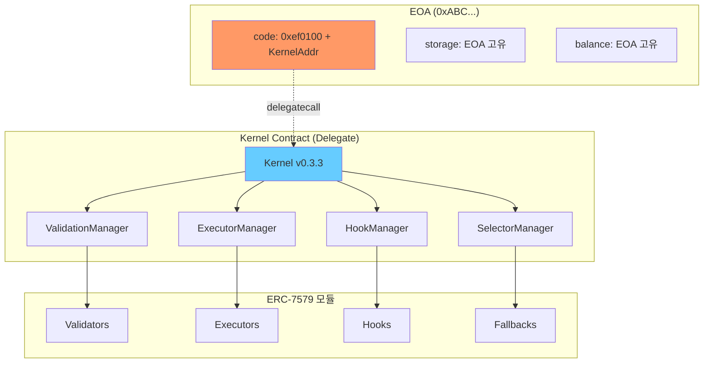
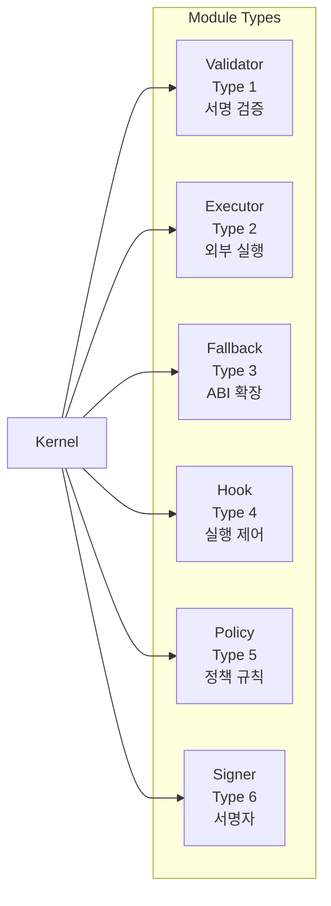
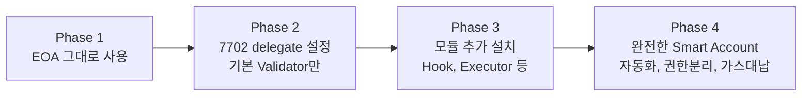
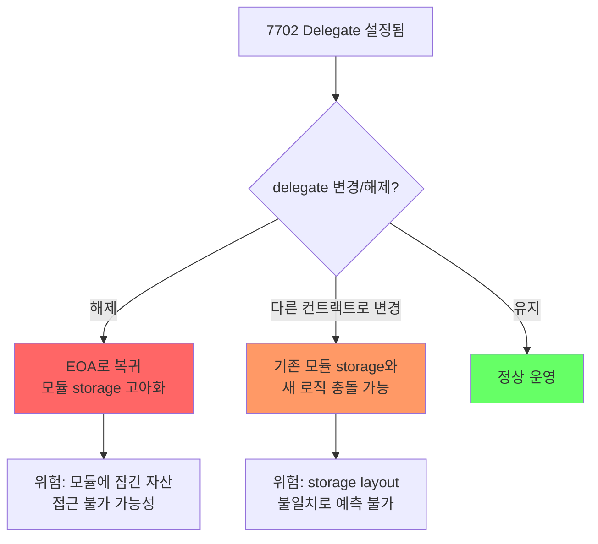
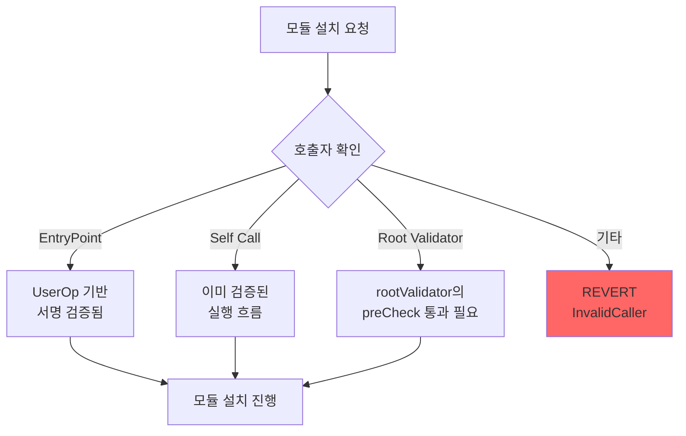
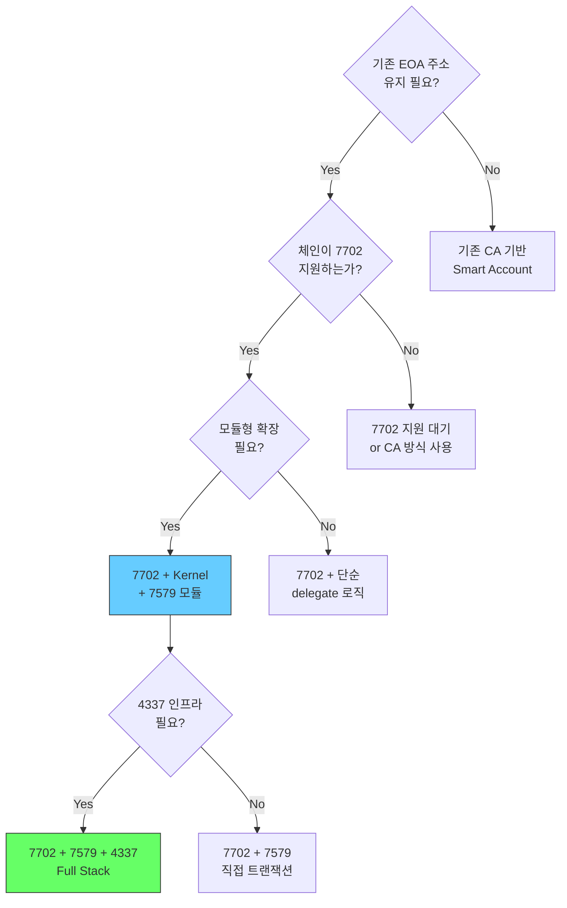
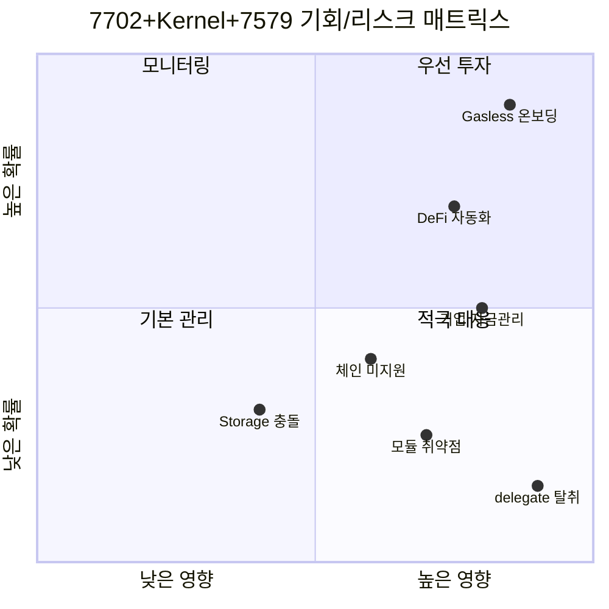

# 2. EIP-7702 + ERC-7579 Kernel Delegate 설정의 장점 및 단점

## 2.1 아키텍처 개요

EIP-7702를 통해 EOA에 Kernel 컨트랙트를 delegate로 설정하면, EOA가 ERC-7579 호환 Smart Account로 동작합니다.



## 2.2 장점

### 1) 기존 EOA 주소 완전 유지
- 자산(ETH, ERC-20, NFT) 이관 불필요
- 기존 approve/allowance 유지
- 에어드롭, 화이트리스트, ENS 등 그대로 사용
- 거래소 출금 주소 변경 불필요

### 2) 모듈형 확장 (ERC-7579)


- **Validator**: ECDSA, MultiSig, WebAuthn 등 다양한 서명 검증
- **Executor**: Session Key, 정기결제 등 위임 실행
- **Hook**: 지출 한도, 감사 로그 등 pre/post 제어
- **Fallback**: Flash Loan 콜백 등 ABI 확장
- **Policy**: 세분화된 접근 제어 규칙
- **Signer**: Permission 기반 서명 검증

### 3) 비용 효율성
- Proxy 없이 직접 delegate → hop 1회 절감
- 신규 CA 배포 비용 불필요 (7702 authorization만 필요)
- 모듈을 필요할 때만 설치/제거 → 초기 비용 최소화

### 4) 점진적 전환


### 5) Cross-chain 일관성
- `chain_id = 0` 으로 authorization 시 모든 체인에서 동일 delegate 적용 가능
- Kernel의 `_buildChainAgnosticDomainSeparator()` 로 chain-agnostic 서명 지원

## 2.3 단점 및 주의점

### 1) 체인 지원 의존성

| 리스크 | 설명 | 대응방안 |
|---|---|---|
| 하드포크 필요 | 7702는 프로토콜 변경이므로 모든 체인이 지원하진 않음 | 지원 체인 목록 관리, 미지원 체인은 기존 CA 방식 사용 |
| 호환성 불일치 | 체인별 EVM 구현 차이로 동작 불일치 가능 | 체인별 테스트 필수 |

### 2) Delegate 변경/해제 리스크



**핵심 주의사항:**
- delegate를 해제하면 Kernel storage에 기록된 모듈 설정이 고아(orphan)가 됨
- 다른 컨트랙트로 delegate를 변경하면 storage slot 충돌 위험
- **권장**: delegate 변경/해제 전 모든 모듈 uninstall 및 자산 회수

### 3) 초기화/재초기화 제어

Kernel 코드에서:
```solidity
function initialize(...) external {
    if (ValidationId.unwrap(vs.rootValidator) != bytes21(0)
        || bytes3(address(this).code) == EIP7702_PREFIX) {
        revert AlreadyInitialized();
    }
}
```

- 7702로 설정된 EOA는 `initialize()` 호출 불가 (`EIP7702_PREFIX` 체크)
- 대신 `VALIDATION_TYPE_7702`를 통해 EOA 소유자 서명으로 직접 검증
- **위험**: rootValidator 설정 없이 사용 시 모듈 설치 권한 제어 불가

### 4) 모듈 설치 권한 오남용



**주의사항:**
- `installModule()`은 `onlyEntryPointOrSelfOrRoot` modifier로 보호
- 하지만 rootValidator가 단순 ECDSA이고 키가 유출되면 모든 모듈 설치/제거 가능
- **권장**: rootValidator에 MultiSig나 시간지연(delay) 적용

### 5) Storage 관리 복잡성
- Kernel은 고정 storage slot(keccak256 기반)을 사용
- 모듈별로 독립 storage(`mapping(address => ...)`)를 사용하므로 slot 충돌은 낮음
- 하지만 delegate 변경 시 잔존 storage가 문제될 수 있음

## 2.4 필수/옵션 설정 매트릭스

| 설정 항목 | 필수 여부 | 이유 | POC 참조 |
|---|---|---|---|
| Root Validator | **필수** | 기본 서명 검증 경로, 없으면 계정 무방비 | `ECDSAValidator` |
| Nonce 정책 | **필수** | Replay 공격 방지, 취소 제어 | `invalidateNonce()` |
| Module Allowlist | **강력 권장** | 악성 모듈 설치 차단 | `KernelFactory` |
| Hook 설정 | 권장 | 실행 제어/감사, 없으면 무제한 실행 | `SpendingLimitHook` |
| Paymaster Policy | 상용 필수 | 가스 비용 통제 | `SponsorPaymaster` |
| Executor 제한 | 권장 | 자동화 오남용 방지 | `SessionKeyExecutor` |
| Selector 접근제어 | 권장 | 특정 함수만 허용 | `grantAccess()` |

## 2.5 의사결정 가이드



## 2.6 비즈니스 리스크/기회 분석

### 기회/리스크 매트릭스



| 구분 | 항목 | 영향도 | 확률 | 대응 |
|---|---|---|---|---|
| **기회** | Gasless 온보딩 | 높음 | 높음 | Paymaster 캠페인 즉시 구축 |
| **기회** | DeFi 자동화 | 높음 | 중간 | SessionKey 서비스 파일럿 |
| **기회** | 기업 자금관리 | 높음 | 중간 | Enterprise 패키지 설계 |
| **리스크** | Delegate 탈취 | 매우높음 | 낮음 | Root Validator 보안 강화 |
| **리스크** | 체인 미지원 | 중간 | 중간 | 멀티체인 준비, CA 폴백 |
| **리스크** | 모듈 취약점 | 높음 | 낮음 | 감사/허용목록 정책 |
| **리스크** | Storage 충돌 | 중간 | 낮음 | 표준 슬롯 설계 검증 |

---

## 2.7 비용 분석

### Gas 비용 비교표

> 📁 `stable-platform/packages/sdk-ts/core/src/config/gas.ts` 기반

| 작업 | EOA (전통) | 7702 직접 | 7702 + 4337 (UserOp) |
|---|---|---|---|
| **단순 ETH 전송** | 21,000 | 21,000 | ~120,000 |
| **ERC-20 전송** | ~65,000 | ~65,000 | ~165,000 |
| **7702 Delegation 설정** | - | ~58,500* | ~58,500* |
| **모듈 설치 (1개)** | - | ~200,000 | ~350,000 |
| **배치 설치 (3개)** | - | ~450,000 | ~550,000 |
| **세션키 실행** | - | - | ~150,000 |

*`SETCODE_BASE_GAS(21K) + EIP7702_AUTH_GAS(25K) + GAS_PER_AUTHORIZATION(12.5K)`

### 비용 분석: 4337 오버헤드 vs 비즈니스 가치

```
4337 추가 가스 비용 (단순 전송 기준):
  UserOp 오버헤드 = ~100,000 gas
  가스 가격 10 gwei 기준 = 0.001 ETH ≈ $2.5 (ETH @$2,500)

비즈니스 가치:
  가스 대납 → 신규 사용자 0-ETH 진입 → CAC 절감 효과 >>$2.5
  배치 실행 → 3건 개별 전송(63K * 3) > 배치 1건(~200K) → 가스 절약
  자동화 → 수동 실행 불필요 → 운영 인건비 절감
```

| 관점 | 추가 비용 | 절감/수익 | ROI 판단 |
|---|---|---|---|
| **사용자** | +100K gas/tx | 가스 대납 (0원) | 매우 긍정적 |
| **서비스** | Paymaster 비용 | CAC 절감, LTV 증가 | 2~5x ROI |
| **기업** | 인프라 운영비 | 인건비 절감, 컴플라이언스 | 6개월 BEP |

---

> **핵심 메시지**: 7702+Kernel+7579 조합은 EOA 주소를 유지하면서 강력한 모듈형 확장을 제공하지만, delegate 변경/해제 리스크, 초기화 제어, 모듈 권한 관리에 대한 운영 정책이 반드시 수반되어야 합니다.
