# 3. EIP-7702를 통해 EOA를 Smart Account로 사용하는 방법

## 3.1 전체 흐름 개요

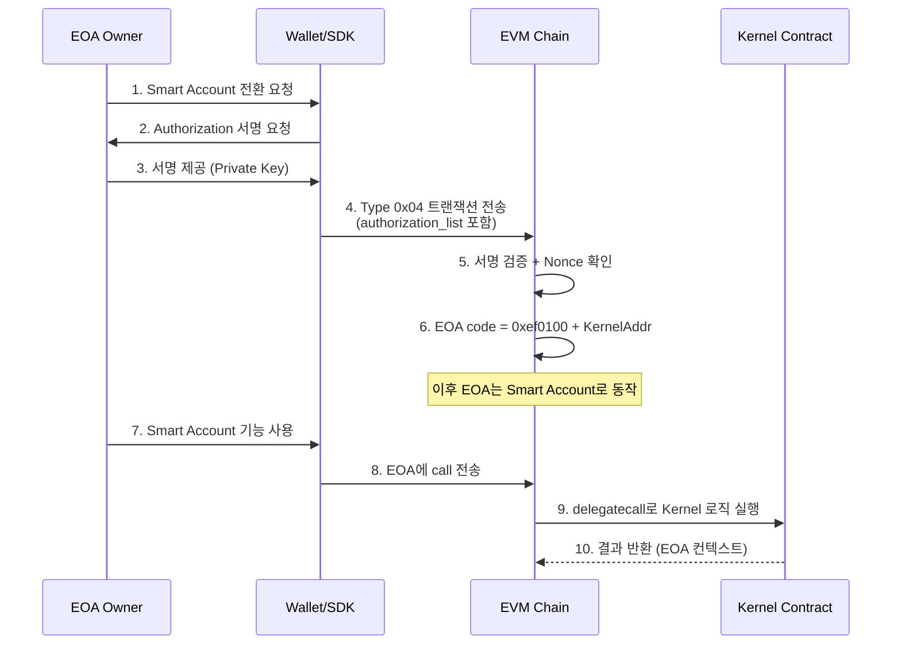

## 3.2 Step 1: Authorization 생성 및 서명

### Authorization 구조체

```
Authorization = {
    chain_id: uint256,    // 체인 ID (0 = 모든 체인에서 유효)
    address: address,     // Kernel 컨트랙트 주소
    nonce: uint64         // EOA의 현재 nonce
}
```

### 서명 과정

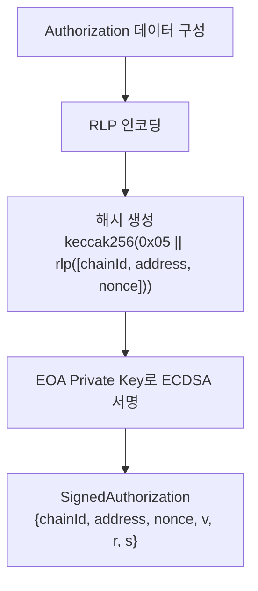

### SDK 레벨 구현 (stable-platform)

```typescript
// Authorization 생성 (sdk-ts/core/src/eip7702/authorization.ts)
interface Authorization {
    chainId: bigint       // 0 = 모든 체인
    address: Address      // Kernel 컨트랙트 주소
    nonce: bigint         // EOA 현재 nonce
}

interface SignedAuthorization extends Authorization {
    v: number
    r: Hex
    s: Hex
    yParity?: number      // EIP-7702 형식
}

// 해시 생성
function createAuthorizationHash(auth: Authorization): Hex {
    // keccak256(0x05 || rlp([chainId, address, nonce]))
}

// 서명
function signAuthorization(auth: Authorization, signer): SignedAuthorization
```

| 매개변수 | 필수 | 설명 |
|---|---|---|
| `chainId` | **필수** | 0이면 cross-chain, 특정 값이면 해당 체인만 |
| `address` | **필수** | Kernel 싱글톤 컨트랙트 주소 |
| `nonce` | **필수** | EOA의 현재 nonce (replay 방지) |
| `signature` | **필수** | EOA 소유자의 ECDSA 서명 |

## 3.A Step-by-Step 개발자 가이드: 7702 Authorization

### EIP-7702 핵심 상수

> 📁 `stable-platform/packages/sdk-ts/core/src/eip7702/constants.ts:11-20`

```typescript
export const EIP7702_MAGIC = 0x05       // Authorization hash prefix
export const SETCODE_TX_TYPE = 0x04     // Type 0x04 트랜잭션
export const DELEGATION_PREFIX = '0xef0100'  // bytecode delegation 마커
export const ZERO_ADDRESS: Address = '0x0000000000000000000000000000000000000000'
```

### createAuthorization() 실제 코드

> 📁 `authorization.ts:44-54`

```typescript
export function createAuthorization(
  chainId: number | bigint,
  delegateAddress: Address,
  nonce: number | bigint
): Authorization {
  return {
    chainId: BigInt(chainId),
    address: delegateAddress,
    nonce: BigInt(nonce),
  }
}
```

### createAuthorizationHash() 실제 코드

> 📁 `authorization.ts:22-34`

```typescript
export function createAuthorizationHash(authorization: Authorization): Hex {
  // RLP encode: [chainId, address, nonce]
  const rlpEncoded = toRlp([
    authorization.chainId === BigInt(0) ? '0x' : numberToHex(authorization.chainId),
    authorization.address,
    authorization.nonce === BigInt(0) ? '0x' : numberToHex(authorization.nonce),
  ])

  // 0x05 prefix + RLP → keccak256
  const prefixedData = concat([toHex(EIP7702_MAGIC, { size: 1 }), rlpEncoded])
  return keccak256(prefixedData)
}
```

**해싱 구조:**
```
Hash = keccak256( 0x05 || rlp([chainId, address, nonce]) )
                   │              │         │       │
                   │              │         │       └─ EOA 현재 nonce
                   │              │         └─ Kernel 컨트랙트 주소
                   │              └─ 0이면 cross-chain
                   └─ EIP-7702 Magic byte
```

### parseSignature() v값 정규화

> 📁 `authorization.ts:76-89`

```typescript
export function parseSignature(signature: Hex): { v: number; r: Hex; s: Hex } {
  const sig = signature.slice(2)

  const r = `0x${sig.slice(0, 64)}` as Hex    // 32 bytes
  const s = `0x${sig.slice(64, 128)}` as Hex   // 32 bytes
  const v = Number.parseInt(sig.slice(128, 130), 16)  // 1 byte

  // EIP-155 v (27, 28) → EIP-7702 v (0, 1)로 정규화
  const normalizedV = v >= 27 ? v - 27 : v

  return { v: normalizedV, r, s }
}
```

> EIP-7702는 `v` 값으로 `0` 또는 `1`만 허용합니다. 기존 지갑의 `27`/`28` 값은 자동 변환됩니다.

### createSignedAuthorization() 전체 흐름

> 📁 `authorization.ts:98-110`

```typescript
export function createSignedAuthorization(
  authorization: Authorization,
  signature: Hex
): SignedAuthorization {
  const { v, r, s } = parseSignature(signature)
  return { ...authorization, v, r, s }
}
```

### 사용 예시: Authorization 전체 흐름

```typescript
import {
  createAuthorization,
  createAuthorizationHash,
  createSignedAuthorization
} from '@stablenet/sdk-ts/eip7702'

// 1. Authorization 생성
const auth = createAuthorization(
  31337,                                    // chainId (Devnet)
  '0xA7c59f010700930003b33aB25a7a0679C860f29c',  // Kernel v3.0
  await provider.getTransactionCount(eoa)    // 현재 nonce
)

// 2. 서명할 해시 생성
const hash = createAuthorizationHash(auth)

// 3. EOA Private Key로 서명
const signature = await signer.signMessage(hash)

// 4. Signed Authorization 조립
const signedAuth = createSignedAuthorization(auth, signature)
// → { chainId: 31337n, address: '0xA7c5...', nonce: 0n, v: 0, r: '0x...', s: '0x...' }
```

---

## 3.B 파라미터 상세: 각 값의 출처

### chainId

| 값 | 의미 | 사용 시나리오 |
|---|---|---|
| `0n` | 모든 체인에서 유효 (cross-chain) | 멀티체인 동시 설정 |
| `31337` | Devnet (Anvil) | 로컬 개발 |
| `11155111` | Sepolia Testnet | 테스트 |
| `1` | Ethereum Mainnet | 프로덕션 |

### Delegate Address: DELEGATE_PRESETS

> 📁 `constants.ts:25-46`

```typescript
export const DELEGATE_PRESETS: Record<number, DelegatePreset[]> = {
  31337: [{  // Devnet
    name: 'Kernel v3.0',
    address: '0xA7c59f010700930003b33aB25a7a0679C860f29c',
    features: ['ERC-7579', 'Modular', 'Gas Sponsorship', 'Session Keys'],
  }],
  11155111: [{  // Sepolia
    name: 'Kernel v3.0',
    address: '0x0000...0000',  // To be configured
  }],
  1: [],  // Mainnet - 아직 미설정
}
```

### Nonce 조회

```typescript
// EOA의 현재 nonce 조회
const nonce = await provider.request({
  method: 'eth_getTransactionCount',
  params: [eoaAddress, 'pending']  // 'pending' 사용 중요
})
```

> `'pending'`을 사용해야 아직 확인되지 않은 트랜잭션의 nonce도 반영됩니다.

### Gas 비용 상수

> 📁 `stable-platform/packages/sdk-ts/core/src/config/gas.ts:71-81`

| 상수 | 값 | 용도 |
|---|---|---|
| `SETCODE_BASE_GAS` | 21,000 | SetCode TX 기본 가스 |
| `EIP7702_AUTH_GAS` | 25,000 | Authorization 검증 오버헤드 |
| `GAS_PER_AUTHORIZATION` | 12,500 | 각 authorization 항목당 가스 |

**총 가스 계산:**
```
totalGas = SETCODE_BASE_GAS + EIP7702_AUTH_GAS
         + (GAS_PER_AUTHORIZATION × authorizationList.length)
         + calldataGas
```

---

## 3.C Delegation 상태 확인

Authorization을 전송한 후, SDK는 delegation 상태를 프로그래밍적으로 확인할 수 있습니다.

### isDelegatedAccount()

> 📁 `authorization.ts:119-124`

```typescript
export function isDelegatedAccount(code: Hex | undefined | null): boolean {
  if (!code || code === '0x' || code.length < 46) {
    return false
  }
  // bytecode가 0xef0100으로 시작하면 delegation됨
  return code.toLowerCase().startsWith(DELEGATION_PREFIX.toLowerCase())
}
```

### extractDelegateAddress()

> 📁 `authorization.ts:132-138`

```typescript
export function extractDelegateAddress(code: Hex | undefined | null): Address | null {
  if (!isDelegatedAccount(code)) {
    return null
  }
  // 0xef0100 (3 bytes) 뒤의 20 bytes가 delegate 주소
  return `0x${code!.slice(8, 48)}` as Address
}
```

```
bytecode 구조:
0xef0100 + delegateAddress
│          │
│          └─ code[4:44] → 20 bytes delegate address
└─ code[0:3] → delegation prefix
```

### getDelegationStatus() 통합 조회

> 📁 `authorization.ts:146-155`

```typescript
export function getDelegationStatus(code: Hex | undefined | null): DelegationStatus {
  return {
    isDelegated: isDelegatedAccount(code),
    delegateAddress: extractDelegateAddress(code),
    code: code ?? null,
  }
}
```

### 사용 예시

```typescript
// EOA bytecode 조회
const code = await provider.request({
  method: 'eth_getCode',
  params: [eoaAddress, 'latest']
})

// 상태 확인
const status = getDelegationStatus(code)
if (status.isDelegated) {
  console.log(`Delegated to: ${status.delegateAddress}`)
} else {
  console.log('Not delegated - standard EOA')
}
```

---

## 3.D Revocation 완전 가이드

### createRevocationAuthorization()

> 📁 `authorization.ts:63-68`

```typescript
export function createRevocationAuthorization(
  chainId: number | bigint,
  nonce: number | bigint
): Authorization {
  // ZERO_ADDRESS로 delegate → delegation 해제
  return createAuthorization(chainId, ZERO_ADDRESS, nonce)
}
```

### 안전한 제거 전 체크리스트

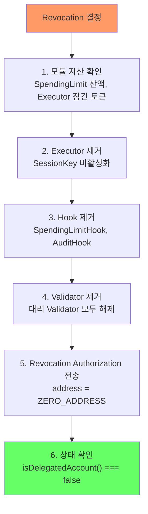

### Revocation 실행 예시

```typescript
import { createRevocationAuthorization, isDelegatedAccount } from '@stablenet/sdk-ts/eip7702'

// 1. 모듈 정리 완료 확인 (수동 또는 자동화)
// ... uninstallModule() 호출들 ...

// 2. Revocation Authorization 생성
const revocation = createRevocationAuthorization(
  31337,  // chainId
  await provider.getTransactionCount(eoa, 'pending')
)

// 3. 서명 및 Type 0x04 TX 전송
const signedRevocation = createSignedAuthorization(revocation, signature)
// → authorization.address === ZERO_ADDRESS

// 4. TX 전송 후 상태 확인
const code = await provider.getCode(eoa)
console.log(isDelegatedAccount(code))  // false → 해제 성공
```

> Revocation 후 EOA의 storage에는 이전 모듈 데이터가 **고아 상태**로 남습니다. 다시 같은 Kernel로 delegate하면 이전 설정이 **복원**될 수 있으므로, 필요 시 storage를 명시적으로 정리하세요.

---

## 3.3 Step 2: Delegation 트랜잭션 전송

### Type 0x04 트랜잭션

EIP-7702는 새로운 트랜잭션 타입 `0x04`를 정의합니다:

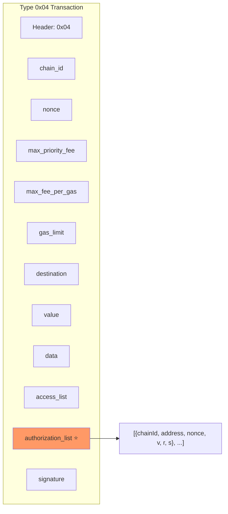

### 트랜잭션 필드 설명

| 필드 | 필수/옵션 | 설명 |
|---|---|---|
| `chain_id` | **필수** | 트랜잭션 제출 체인 |
| `nonce` | **필수** | 트랜잭션 발신자의 nonce |
| `max_fee_per_gas` | **필수** | EIP-1559 최대 가스 가격 |
| `gas_limit` | **필수** | 가스 한도 |
| `destination` | **필수** | 수신 주소 (초기화 시 EOA 자신) |
| `data` | 옵션 | 초기화 calldata |
| `authorization_list` | **필수** | 서명된 Authorization 배열 |

### 가스 비용

```
총 가스 = 기본 가스(21,000)
        + EIP-7702 인증 가스(21,100)
        + Authorization 당 가스(2,100 × 개수)
        + calldata 가스
```

## 3.4 Step 3: EVM에서의 Delegation 처리

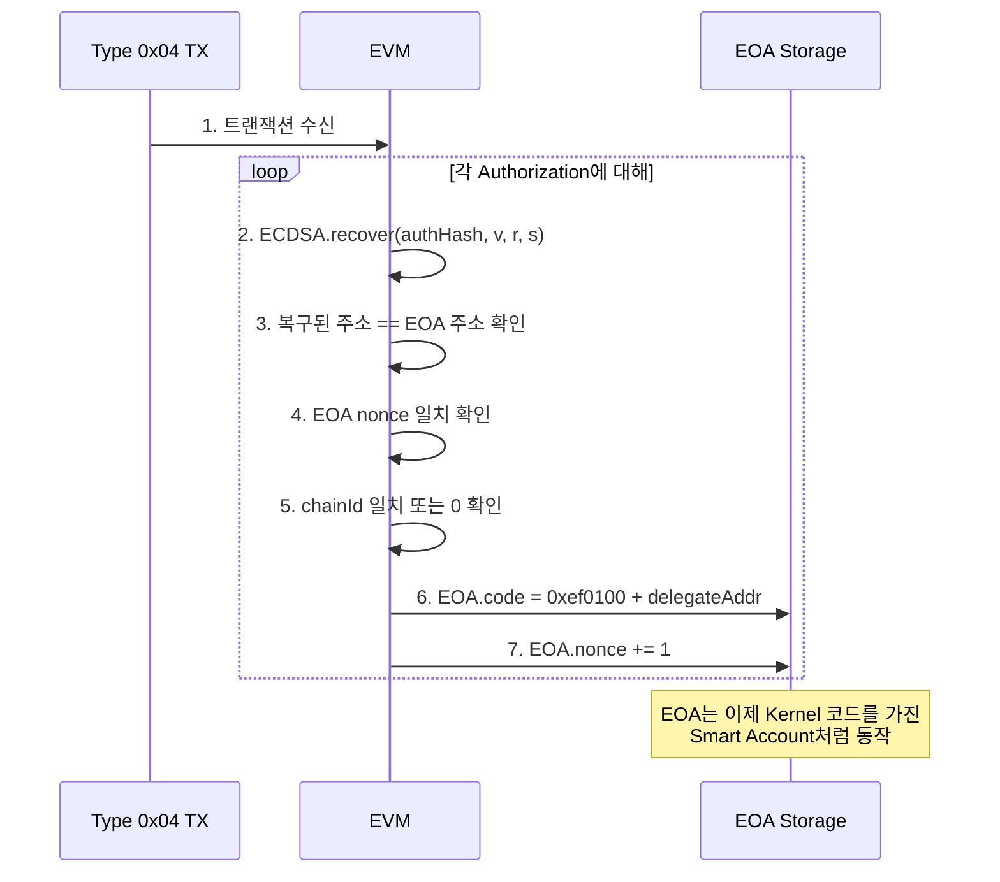

### Delegation 후 EOA 상태

```
EOA (0xABC...def) 상태:
┌─────────────────────────────────────────────┐
│ code:    0xef0100 + KernelContractAddress    │  ← 변경됨
│ balance: 기존 ETH 잔액 유지                   │  ← 유지
│ storage: EOA 고유 storage                    │  ← 유지 (모듈 설정 저장)
│ nonce:   기존 nonce + 1                      │  ← 증가
│ address: 0xABC...def (변경 없음)              │  ← 유지
└─────────────────────────────────────────────┘
```

## 3.5 Step 4: Smart Account 기능 사용

Delegation 설정 후, EOA는 다음과 같이 Smart Account 기능을 사용합니다:

### 직접 호출 (Direct Call)

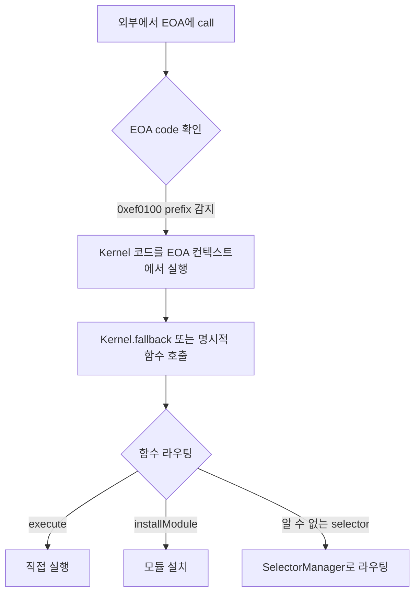

### UserOperation 기반 (ERC-4337)

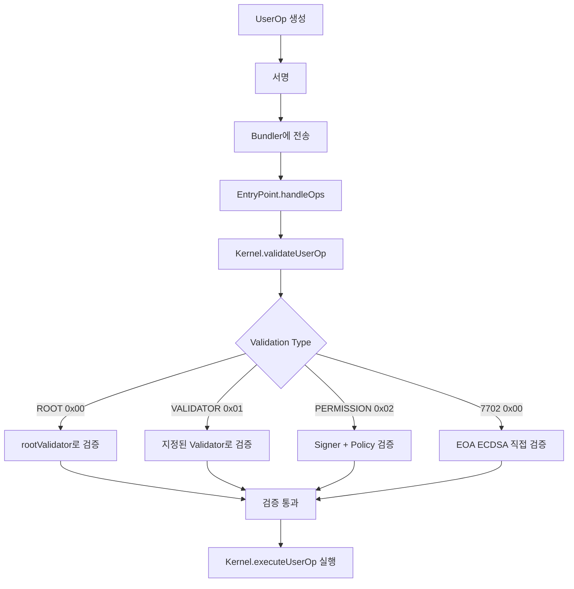

## 3.6 7702 Validation 타입 상세

EIP-7702로 설정된 EOA는 특별한 검증 경로를 가집니다:

```mermaid
flowchart TB
    A["validateUserOp 호출"] --> B{code prefix 확인}
    B -->|"0xef0100 감지"| C["VALIDATION_TYPE_7702"]
    C --> D["_verify7702Signature()"]
    D --> E["userOpHash에 대해<br/>ECDSA.recover()"]
    E --> F{복구된 주소 == address(this)?}
    F -->|Yes| G["검증 성공<br/>(EOA 소유자 서명 확인)"]
    F -->|No| H["검증 실패<br/>SIG_VALIDATION_FAILED"]
```

**핵심 코드 (ValidationManager.sol):**

```solidity
function _verify7702Signature(
    bytes32 hash,
    bytes calldata signature
) internal view returns (ValidationData) {
    // EOA 주소(= address(this))를 서명자로 사용
    address recovered = ECDSA.recover(hash, signature);
    if (recovered == address(this)) {
        return ValidationData.wrap(0); // 성공
    }
    return SIG_VALIDATION_FAILED;
}
```

## 3.7 Delegation 해제 및 복원

### Delegation 해제

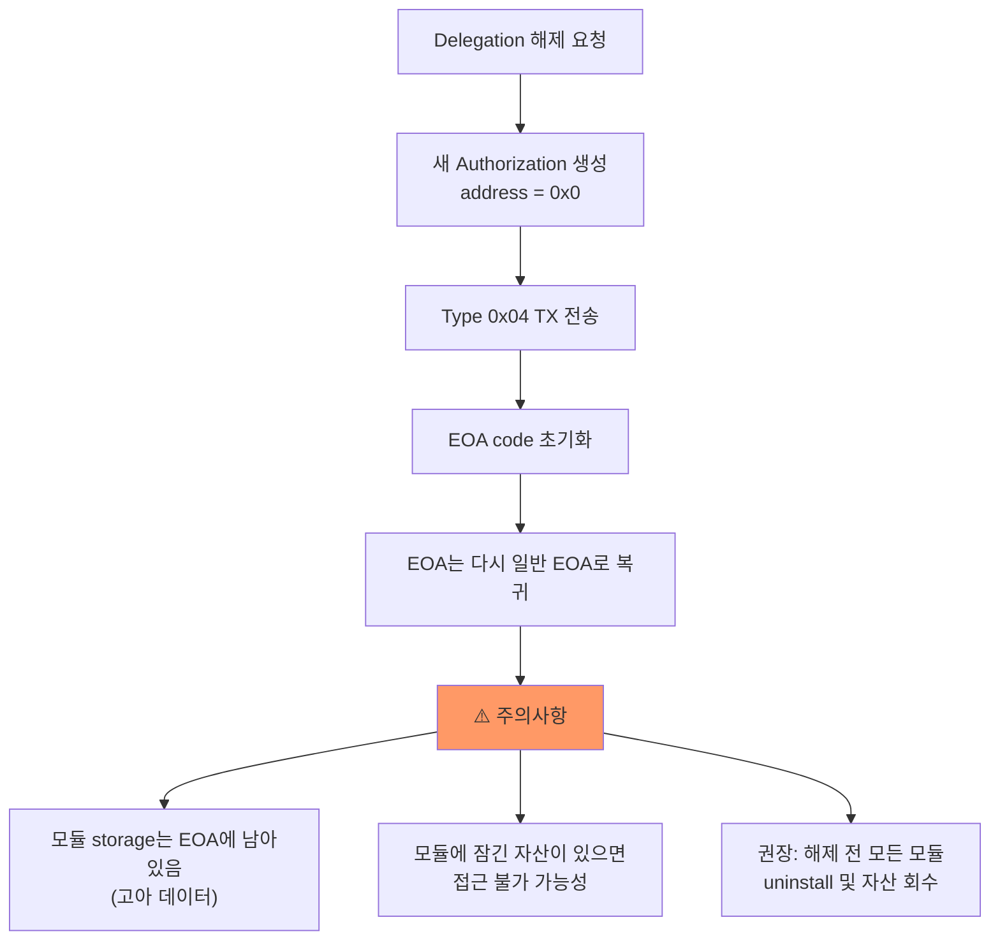

### SDK 레벨 해제

```typescript
// Revocation Authorization (sdk-ts)
function createRevocationAuthorization(account: Address): Authorization {
    return {
        chainId: 0n,        // 모든 체인
        address: ZERO_ADDRESS, // delegate 제거
        nonce: currentNonce
    }
}
```

## 3.8 Cross-chain Delegation

### chain_id = 0 사용 시

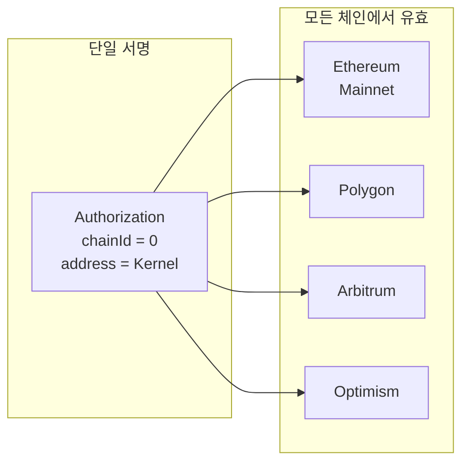

**장점**: 한 번의 서명으로 모든 체인에서 동일한 delegate 설정
**위험**: 어떤 체인에서든 replayed 될 수 있음 (nonce로 제어)

### Kernel의 chain-agnostic 지원

```solidity
// ValidationManager.sol
function _buildChainAgnosticDomainSeparator() internal pure returns (bytes32) {
    // chainId = 0으로 domain separator 생성
    // cross-chain 서명 검증에 사용
}
```

## 3.9 실제 사용 시나리오

### 시나리오 1: 기본 설정

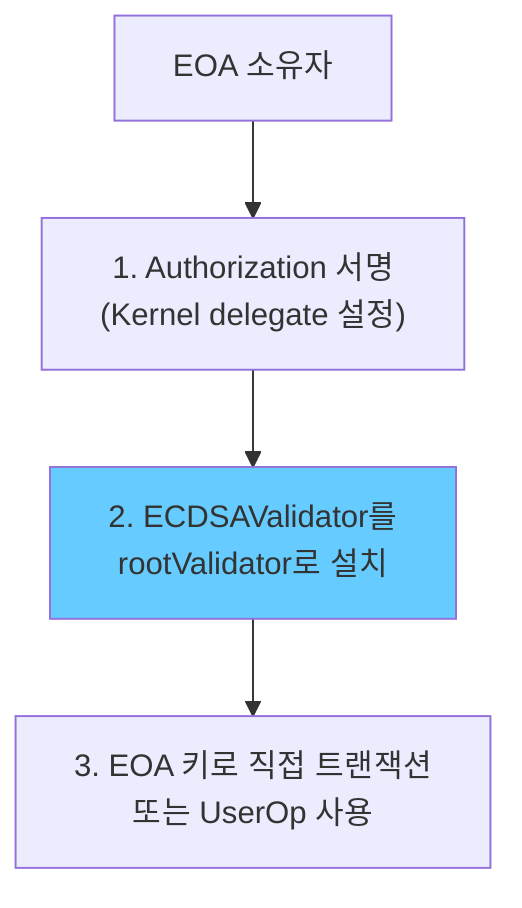

### 시나리오 2: 점진적 확장

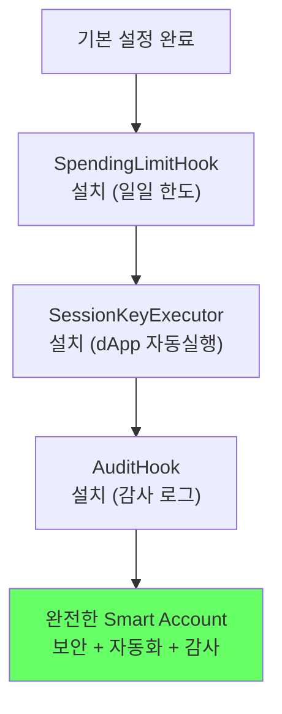

### 시나리오 3: 4337 통합 사용

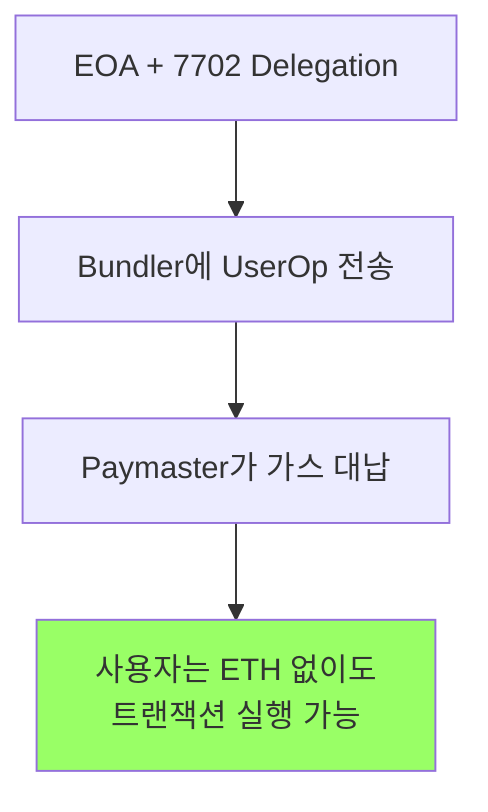

## 3.10 주의사항 체크리스트

| 항목 | 상태 확인 | 위험도 |
|---|---|---|
| Kernel 컨트랙트 주소 정확성 | 배포된 주소 확인 | **높음** |
| chainId 설정 | 0 vs 특정 체인 의도 확인 | **높음** |
| rootValidator 설정 | 반드시 설정 필요 | **필수** |
| nonce 동기화 | 현재 EOA nonce 확인 | **높음** |
| 기존 approve/allowance | delegation 후에도 유지 확인 | 중간 |
| Delegate 변경 전 모듈 정리 | 자산 회수 및 uninstall | **필수** |
| Cross-chain replay 위험 | chainId=0 사용 시 검토 | 중간 |

---

> **핵심 메시지**: EIP-7702는 EOA에 Authorization 서명 한 번으로 Smart Account 기능을 부여합니다. 핵심은 delegation 설정 후 반드시 rootValidator를 설정하고, 해제 전에는 모든 모듈과 자산을 정리하는 것입니다.
