# 4. EIP-7702 + ERC-7579를 ERC-4337과 함께 사용하는 방법

## 4.1 통합 아키텍처

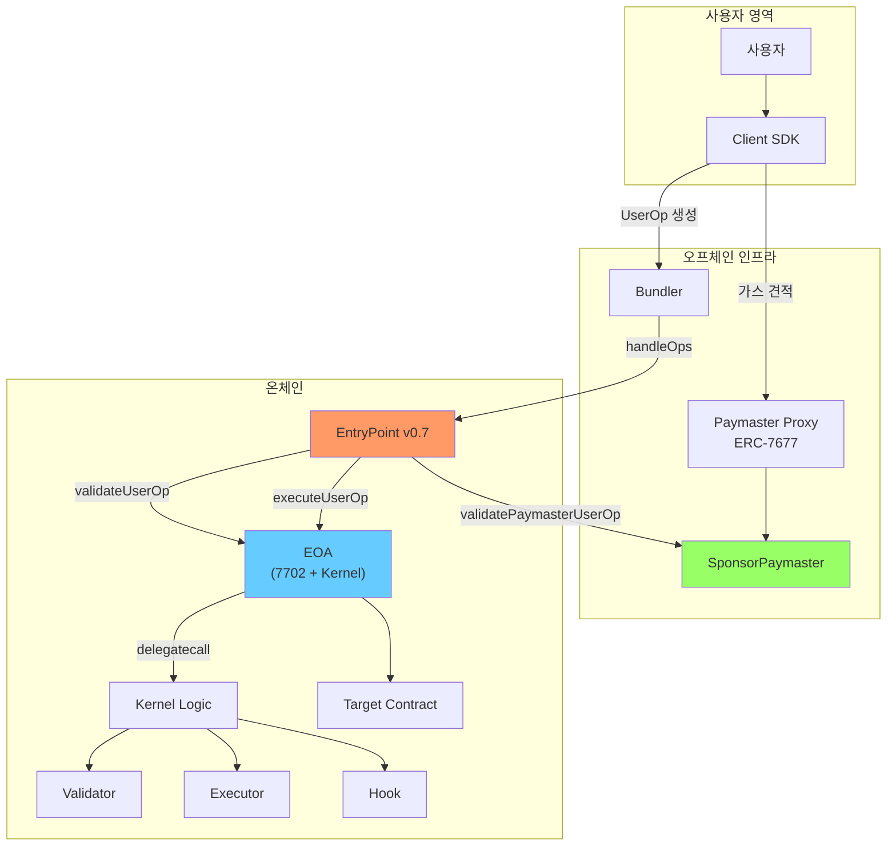
```mermaid
flowchart TB
    subgraph "사용자 영역"
        U[사용자] --> SDK[Client SDK]
    end

    subgraph "오프체인 인프라"
        SDK --> |UserOp 생성| B[Bundler]
        SDK --> |가스 견적| PM_PROXY[Paymaster Proxy<br/>ERC-7677]
        PM_PROXY --> PM[SponsorPaymaster]
    end

    subgraph "온체인"
        B --> |handleOps| EP[EntryPoint v0.7]
        EP --> |validateUserOp| EOA["EOA<br/>(7702 + Kernel)"]
        EP --> |validatePaymasterUserOp| PM
        EP --> |executeUserOp| EOA
        EOA --> |delegatecall| K[Kernel Logic]
        K --> V[Validator]
        K --> E[Executor]
        K --> H[Hook]
        EOA --> TARGET[Target Contract]
    end

    style EOA fill:#6cf
    style EP fill:#f96
    style PM fill:#9f6
```

## 4.2 7702 + 4337의 UserOperation 필드

### 표준 UserOperation 구조

```
PackedUserOperation {
    address sender;           // ← EOA 주소 (7702 delegation 설정됨)
    uint256 nonce;            // ← [validationMode:2][validationType+Id:21][sequence:8]
    bytes   initCode;         // ← 첫 사용 시 0x7702 마커 또는 빈 값
    bytes   callData;         // ← Kernel.execute() 호출 데이터
    bytes32 accountGasLimits; // ← verificationGasLimit(16) + callGasLimit(16)
    uint256 preVerificationGas;
    bytes32 gasFees;          // ← maxPriorityFeePerGas(16) + maxFeePerGas(16)
    bytes   paymasterAndData; // ← Paymaster 사용 시
    bytes   signature;        // ← Validator가 검증할 서명
}
```

### 필드별 상세 설명

| 필드 | 필수/옵션 | 7702+4337 특이사항 |
|---|---|---|
| `sender` | **필수** | 기존 EOA 주소 그대로 사용 |
| `nonce` | **필수** | 상위 2바이트: validation mode, 이후 validator/permission ID |
| `initCode` | 조건부 | 7702 최초 온보딩: `0x7702` 마커 사용, 이미 설정 시 빈 값 |
| `callData` | **필수** | `Kernel.execute(execMode, executionCalldata)` |
| `accountGasLimits` | **필수** | packed: `verificationGasLimit || callGasLimit` |
| `preVerificationGas` | **필수** | Bundler 오버헤드 + L2 비용(Arbitrum/Optimism 등) |
| `gasFees` | **필수** | packed: `maxPriorityFeePerGas || maxFeePerGas` |
| `paymasterAndData` | 옵션 | Paymaster 주소 + 검증 데이터 + 서명 |
| `signature` | **필수** | rootValidator 또는 지정된 validator의 서명 |

## 4.A UserOp 바이트 레벨 패킹 상세

Bundler RPC에 전송하기 전, SDK는 UserOperation을 PackedUserOperation으로 변환합니다.

### packUserOperation() 구현

> 📁 `stable-platform/packages/sdk-ts/core/src/utils/userOperation.ts:8-51`

```typescript
export function packUserOperation(userOp: UserOperation): PackedUserOperation {
  // initCode: factory(20 bytes) + factoryData(variable)
  const initCode = userOp.factory && userOp.factoryData
    ? concat([userOp.factory, userOp.factoryData]) : '0x'

  // accountGasLimits: verificationGasLimit(16) + callGasLimit(16)
  const accountGasLimits = concat([
    pad(toHex(userOp.verificationGasLimit), { size: 16 }),
    pad(toHex(userOp.callGasLimit), { size: 16 }),
  ]) as Hex

  // gasFees: maxPriorityFeePerGas(16) + maxFeePerGas(16)
  const gasFees = concat([
    pad(toHex(userOp.maxPriorityFeePerGas), { size: 16 }),
    pad(toHex(userOp.maxFeePerGas), { size: 16 }),
  ]) as Hex

  // paymasterAndData: paymaster(20) + verGasLimit(16) + postOpGasLimit(16) + data(var)
  let paymasterAndData: Hex = '0x'
  if (userOp.paymaster) {
    paymasterAndData = concat([
      userOp.paymaster,
      pad(toHex(userOp.paymasterVerificationGasLimit ?? 0n), { size: 16 }),
      pad(toHex(userOp.paymasterPostOpGasLimit ?? 0n), { size: 16 }),
      userOp.paymasterData ?? '0x',
    ]) as Hex
  }

  return {
    sender: userOp.sender,
    nonce: toHex(userOp.nonce),
    initCode,
    callData: userOp.callData,
    accountGasLimits,
    preVerificationGas: toHex(userOp.preVerificationGas),
    gasFees,
    paymasterAndData,
    signature: userOp.signature,
  }
}
```

### 바이트 레이아웃 다이어그램

```
accountGasLimits (32 bytes):
┌──────────────────────────┬──────────────────────────┐
│ verificationGasLimit     │ callGasLimit             │
│ (16 bytes, uint128)      │ (16 bytes, uint128)      │
└──────────────────────────┴──────────────────────────┘
 offset 0                   offset 16                  offset 32

gasFees (32 bytes):
┌──────────────────────────┬──────────────────────────┐
│ maxPriorityFeePerGas     │ maxFeePerGas             │
│ (16 bytes, uint128)      │ (16 bytes, uint128)      │
└──────────────────────────┴──────────────────────────┘
 offset 0                   offset 16                  offset 32

paymasterAndData (52+ bytes):
┌──────────────┬──────────────────────┬──────────────────┬───────────┐
│ paymaster    │ pmVerificationGas    │ pmPostOpGas      │ pmData    │
│ (20 bytes)   │ (16 bytes, uint128)  │ (16 bytes)       │ (variable)│
└──────────────┴──────────────────────┴──────────────────┴───────────┘
 offset 0       offset 20              offset 36          offset 52
```

### getUserOperationHash() 2단계 해싱

> 📁 `userOperation.ts:120-160`

UserOp 해시는 **2단계**로 계산됩니다:

```
1단계: innerHash = keccak256(encode(
    sender, nonce,
    keccak256(initCode), keccak256(callData),
    accountGasLimits, preVerificationGas,
    gasFees, keccak256(paymasterAndData)
))

2단계: finalHash = keccak256(encode(innerHash, entryPoint, chainId))
```

이 2단계 구조는 **동일 UserOp가 다른 EntryPoint/체인에서 다른 해시**를 갖게 하여 replay 공격을 방지합니다.

---

## 4.B callData 인코딩: Kernel.execute()

UserOp의 `callData`는 Kernel Smart Account의 `execute(bytes32 mode, bytes executionCalldata)` 호출로 인코딩됩니다.

### encodeSmartAccountCall() 구현

> 📁 `stable-platform/packages/sdk-ts/core/src/transaction/strategies/smartAccountStrategy.ts:327-343`

```typescript
function encodeSmartAccountCall(to: Address, value = 0n, data: Hex = '0x'): Hex {
  // ExecMode: 0x00 (single call), padded to 32 bytes
  const execMode = pad('0x00' as Hex, { size: 32 })

  // executionCalldata: abi.encodePacked(target[20], value[32], callData[variable])
  const executionCalldata = concat([
    to,                            // 20 bytes: target address
    pad(toHex(value), { size: 32 }), // 32 bytes: value
    data,                          // variable: callData
  ]) as Hex

  return encodeFunctionData({
    abi: KERNEL_ABI,
    functionName: 'execute',
    args: [execMode, executionCalldata],
  })
}
```

### ExecMode 바이트 구성

```
ExecMode (32 bytes):
┌──────────────┬──────────────────────────────────────────┐
│ callType     │ padding                                  │
│ 0x00=single  │ (31 bytes of zeros)                      │
│ 0x01=batch   │                                          │
└──────────────┴──────────────────────────────────────────┘

executionCalldata (Single Mode):
┌──────────────┬──────────────────────────────────┬───────────┐
│ target       │ value                            │ callData  │
│ (20 bytes)   │ (32 bytes, uint256)              │ (variable)│
└──────────────┴──────────────────────────────────┴───────────┘

executionCalldata (Batch Mode, CALLTYPE_BATCH = 0x01):
  encode(Execution[]) where Execution = { target, value, callData }
```

### Batch 모드 인코딩 예시

```typescript
// Batch: 여러 호출을 하나의 UserOp에 묶기
const batchExecMode = pad('0x01' as Hex, { size: 32 }) // CALLTYPE_BATCH

// executionCalldata = abi.encode(Execution[])
// Execution[] = [
//   { target: tokenAddr, value: 0, callData: approve(...) },
//   { target: dexAddr,   value: 0, callData: swap(...)    },
// ]
```

---

## 4.C SDK 전체 흐름: prepare → sign → send

### TransactionRouter 설정

> 📁 `stable-platform/packages/sdk-ts/core/src/transaction/transactionRouter.ts:97-118`

```typescript
const router = createTransactionRouter({
  rpcUrl: 'https://rpc.example.com',
  chainId: 1,
  bundlerUrl: 'https://bundler.example.com',   // Smart Account 모드 필수
  paymasterUrl: 'https://paymaster.example.com', // 가스 대납 시 필수
})
```

Router는 **Strategy 패턴**으로 3가지 모드를 관리합니다:

| 모드 | Strategy | 용도 |
|---|---|---|
| `EOA` | `createEOAStrategy()` | 일반 EOA 트랜잭션 |
| `EIP_7702` | `createEIP7702Strategy()` | 7702 delegation 설정 |
| `SMART_ACCOUNT` | `createSmartAccountStrategy()` | 4337 UserOp 기반 |

### prepare() 내부 흐름

> 📁 `smartAccountStrategy.ts:153-232`

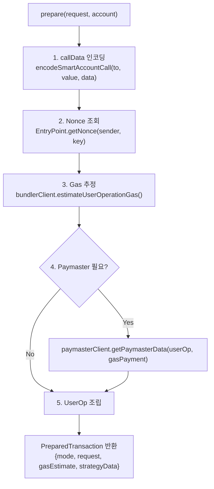
```mermaid
flowchart TB
    A["prepare(request, account)"] --> B["1. callData 인코딩<br/>encodeSmartAccountCall(to, value, data)"]
    B --> C["2. Nonce 조회<br/>EntryPoint.getNonce(sender, key)"]
    C --> D["3. Gas 추정<br/>bundlerClient.estimateUserOperationGas()"]
    D --> E{"4. Paymaster 필요?"}
    E -->|Yes| F["paymasterClient.getPaymasterData(userOp, gasPayment)"]
    E -->|No| G["5. UserOp 조립"]
    F --> G
    G --> H["PreparedTransaction 반환<br/>{mode, request, gasEstimate, strategyData}"]
```

### execute() 내부 흐름

> 📁 `smartAccountStrategy.ts:238-297`

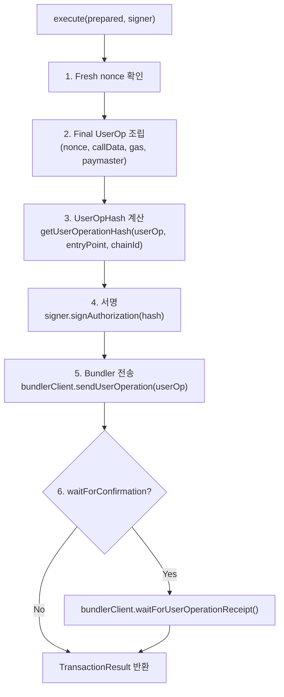
```mermaid
flowchart TB
    A["execute(prepared, signer)"] --> B["1. Fresh nonce 확인"]
    B --> C["2. Final UserOp 조립<br/>(nonce, callData, gas, paymaster)"]
    C --> D["3. UserOpHash 계산<br/>getUserOperationHash(userOp, entryPoint, chainId)"]
    D --> E["4. 서명<br/>signer.signAuthorization(hash)"]
    E --> F["5. Bundler 전송<br/>bundlerClient.sendUserOperation(userOp)"]
    F --> G{"6. waitForConfirmation?"}
    G -->|Yes| H["bundlerClient.waitForUserOperationReceipt()"]
    G -->|No| I["TransactionResult 반환"]
    H --> I
```

### 핵심 코드: execute() 서명 및 전송

```typescript
// UserOperation hash 계산
const userOpHash = calculateUserOpHash(userOp, entryPointAddress, chainId)

// EOA 또는 대리 키로 서명
const signature = await signer.signAuthorization(userOpHash)
userOp.signature = encodeSignature(signature)  // r(32) + s(32) + v(1)

// Bundler로 전송
const hash = await bundlerClient.sendUserOperation(userOp)
```

---

## 4.D Bundler 내부 검증 파이프라인

### 8단계 병렬/순차 검증

> 📁 `erc-4337/alto-bundler/src/rpc/methods/eth_sendUserOperation.ts:234-263`

`eth_sendUserOperation` 수신 시, Alto Bundler는 다음 검증을 수행합니다:

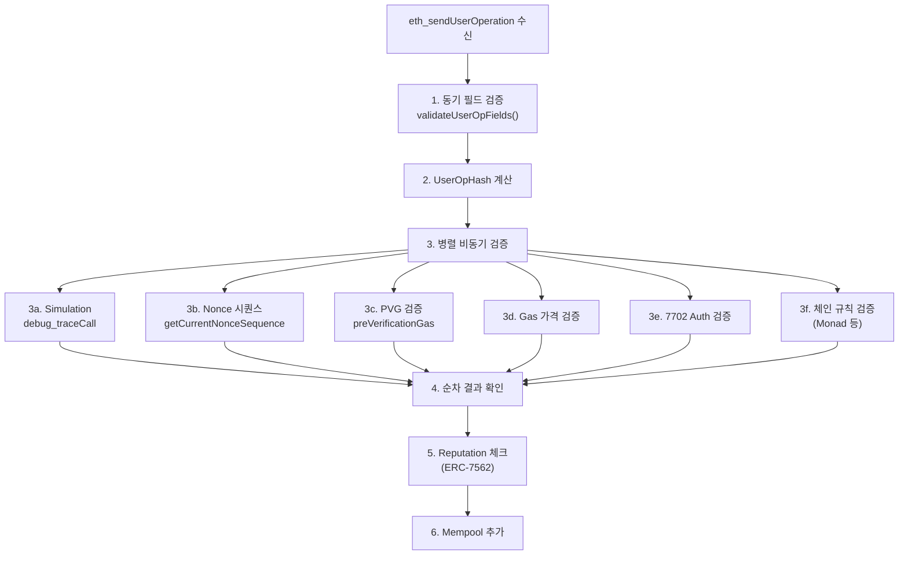
```mermaid
flowchart TB
    A["eth_sendUserOperation 수신"] --> B["1. 동기 필드 검증<br/>validateUserOpFields()"]
    B --> C["2. UserOpHash 계산"]
    C --> D["3. 병렬 비동기 검증"]

    D --> D1["3a. Simulation<br/>debug_traceCall"]
    D --> D2["3b. Nonce 시퀀스<br/>getCurrentNonceSequence"]
    D --> D3["3c. PVG 검증<br/>preVerificationGas"]
    D --> D4["3d. Gas 가격 검증"]
    D --> D5["3e. 7702 Auth 검증"]
    D --> D6["3f. 체인 규칙 검증<br/>(Monad 등)"]

    D1 & D2 & D3 & D4 & D5 & D6 --> E["4. 순차 결과 확인"]
    E --> F["5. Reputation 체크<br/>(ERC-7562)"]
    F --> G["6. Mempool 추가"]
```

### 각 검증 단계 상세

| 단계 | 검증 | 실패 시 |
|---|---|---|
| 1. Field 검증 | UserOp 필드 형식, 필수값 존재 | 즉시 거부 (동기) |
| 2. Hash 계산 | `getUserOpHash()` - 추적용 해시 생성 | - |
| 3a. Simulation | `debug_traceCall` 으로 EntryPoint 시뮬레이션 | `AA` 에러 코드 반환 |
| 3b. Nonce | 순서 검증, pending nonce 확인 | 큐잉 또는 대체 |
| 3c. PVG | preVerificationGas 최소값 확인 | 거부 |
| 3d. Gas 가격 | maxFeePerGas ≥ 현재 baseFee | 거부 |
| 3e. 7702 Auth | EIP-7702 authorization 서명 유효성 | 거부 |
| 3f. 체인 규칙 | 체인별 특수 규칙 (Monad: 10 MON 잔고) | 거부 |

### Mempool 상태 머신

```
outstanding ──(번들 포함)──→ submitted ──(온체인 포함)──→ included
     │                           │
     └──(만료/대체)──→ dropped   └──(실패)──→ dropped
```

- **outstanding**: Mempool에 저장됨, 번들 대기
- **submitted**: Bundle TX에 포함되어 네트워크에 전송됨
- **included**: 온체인 블록에 포함 확인됨

### Bundle 생성 흐름

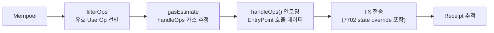
```mermaid
flowchart LR
    A["Mempool"] --> B["filterOps<br/>유효 UserOp 선별"]
    B --> C["gasEstimate<br/>handleOps 가스 추정"]
    C --> D["handleOps() 인코딩<br/>EntryPoint 호출 데이터"]
    D --> E["TX 전송<br/>(7702 state override 포함)"]
    E --> F["Receipt 추적"]
```

### EIP-7702 state override 처리

Bundler는 7702 delegation이 아직 온체인에 반영되지 않은 UserOp를 시뮬레이션할 때, **state override**를 사용합니다:

```typescript
// State override: 아직 delegation이 없는 EOA를 시뮬레이션
stateOverride = {
  [senderAddress]: {
    code: '0xef0100' + delegateAddress.slice(2)  // delegation prefix + target
  }
}
```

### Monad 체인 특수 규칙

7702 delegation된 UserOp의 경우, 트랜잭션 실행 후에도 sender가 최소 **10 MON 잔고**를 유지해야 합니다. 이는 delegation 해제 가스를 보장하기 위한 안전장치입니다.

---

## 4.E Paymaster 2-Phase 흐름 상세

ERC-7677 Paymaster Proxy는 2단계로 동작합니다:

### Phase 1: Stub Data (Gas 추정용)

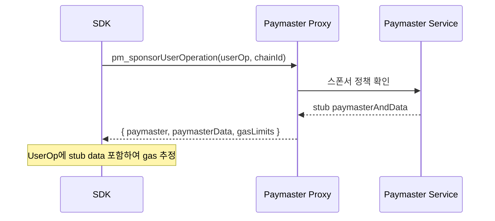
```mermaid
sequenceDiagram
    participant SDK
    participant Proxy as Paymaster Proxy
    participant PM as Paymaster Service

    SDK->>Proxy: pm_sponsorUserOperation(userOp, chainId)
    Proxy->>PM: 스폰서 정책 확인
    PM-->>Proxy: stub paymasterAndData
    Proxy-->>SDK: { paymaster, paymasterData, gasLimits }
    Note over SDK: UserOp에 stub data 포함하여 gas 추정
```

### Phase 2: Final Data (최종 서명)

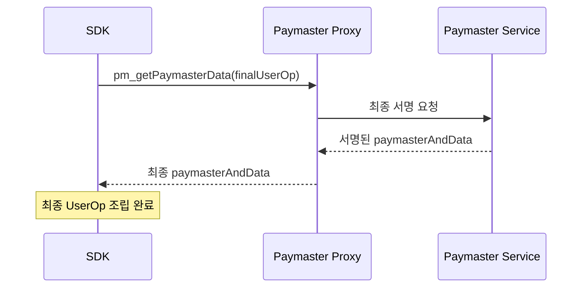
```mermaid
sequenceDiagram
    participant SDK
    participant Proxy as Paymaster Proxy
    participant PM as Paymaster Service

    SDK->>Proxy: pm_getPaymasterData(finalUserOp)
    Proxy->>PM: 최종 서명 요청
    PM-->>Proxy: 서명된 paymasterAndData
    Proxy-->>SDK: 최종 paymasterAndData
    Note over SDK: 최종 UserOp 조립 완료
```

### getPaymasterData() 3가지 모드

> 📁 `stable-platform/packages/sdk-ts/core/src/paymasterClient.ts:258-285`

```typescript
async function getPaymasterData(userOp, gasPayment): Promise<PaymasterResponse | null> {
  switch (gasPayment.type) {
    case GAS_PAYMENT_TYPE.NATIVE:
      return null  // Paymaster 불필요, 사용자가 직접 ETH 지불

    case GAS_PAYMENT_TYPE.SPONSOR:
      return getSponsoredPaymasterData(userOp)  // 무료 가스 대납

    case GAS_PAYMENT_TYPE.ERC20:
      return getERC20PaymasterData(userOp, gasPayment.tokenAddress)  // 토큰으로 지불
  }
}
```

| 모드 | 설명 | 사용 시나리오 |
|---|---|---|
| `NATIVE` | Paymaster 없음, ETH 직접 지불 | 일반 사용자 |
| `SPONSOR` | 서비스 제공자가 가스 대납 | 온보딩, 프로모션 |
| `ERC20` | USDC/USDT 등 토큰으로 가스 지불 | 스테이블코인 사용자 |

### Paymaster RPC 메서드 상수

> 📁 `paymasterClient.ts:115-121`

```typescript
const RPC_METHODS = {
  SPONSOR_USER_OPERATION: 'pm_sponsorUserOperation',
  GET_PAYMASTER_DATA:     'pm_getPaymasterData',
  SUPPORTED_TOKENS:       'pm_supportedTokens',
  GET_SPONSOR_POLICY:     'pm_getSponsorPolicy',
  ESTIMATE_ERC20_PAYMENT: 'pm_estimateERC20Payment',
} as const
```

---

## 4.F Gas 추정 전체 흐름

### GAS_CONFIG 객체

> 📁 `stable-platform/packages/sdk-ts/core/src/config/gas.ts:120-146`

```typescript
export const GAS_CONFIG = {
  priorityFee: {
    min: parseGwei('1'),    // 1 gwei - 최소 보장
    max: parseGwei('50'),   // 50 gwei - 과지불 방지
    default: parseGwei('1'),
  },
  baseLimits: {
    transfer: 21_000n,       // ETH 단순 전송
    maxBlock: 30_000_000n,   // 블록 가스 한도
  },
  buffer: {
    multiplier: 110n,        // 10% 안전 마진
    divisor: 100n,           // (gas * 110) / 100
  },
  eip7702: {
    authGas: 25_000n,        // Authorization 검증
    perAuthorization: 12_500n, // 개별 auth 비용
    setCodeBase: 21_000n,    // SetCode TX 기본 가스
  },
  smartAccount: {
    verificationGasLimit: 150_000n,   // UserOp 검증 가스
    preVerificationGas: 50_000n,      // Bundler 오버헤드
    callGasLimit: 100_000n,           // 실행 가스
    paymasterVerification: 30_000n,   // Paymaster 검증
    paymasterPostOp: 50_000n,         // PostOp 처리
  },
} as const
```

### maxFeePerGas 계산 로직

```
maxFeePerGas = baseFee * 2n + maxPriorityFeePerGas

where:
  baseFee        = eth_getBlock('latest').baseFeePerGas
  priorityFee    = clamp(estimatedPriority, MIN=1gwei, MAX=50gwei)
  maxFeePerGas   = baseFee * 2 + priorityFee  // 2블록 버퍼
```

### EntryPoint 가스 페널티

> 📁 `poc-contract/src/erc4337-entrypoint/EntryPoint.sol`

```
UNUSED_GAS_PENALTY_PERCENT = 10
PENALTY_GAS_THRESHOLD = 40,000

if (unusedGas > PENALTY_GAS_THRESHOLD) {
  penalty = unusedGas * UNUSED_GAS_PENALTY_PERCENT / 100
}
```

**의미**: UserOp가 선언한 가스의 10% 이상을 사용하지 않으면 **미사용 가스 페널티**가 부과됩니다. 이는 Bundler가 가스를 과다 추정하는 것을 방지합니다. 따라서 SDK는 가스 추정 시 10% 버퍼(`GAS_BUFFER_MULTIPLIER = 110`)를 적용하되, 과도한 여유분은 피해야 합니다.

### Gas 추정 흐름 다이어그램

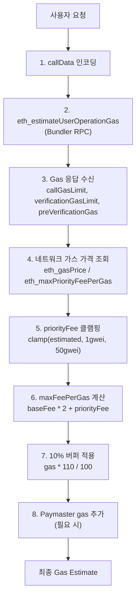
```mermaid
flowchart TB
    A["사용자 요청"] --> B["1. callData 인코딩"]
    B --> C["2. eth_estimateUserOperationGas<br/>(Bundler RPC)"]
    C --> D["3. Gas 응답 수신<br/>callGasLimit, verificationGasLimit, preVerificationGas"]
    D --> E["4. 네트워크 가스 가격 조회<br/>eth_gasPrice / eth_maxPriorityFeePerGas"]
    E --> F["5. priorityFee 클램핑<br/>clamp(estimated, 1gwei, 50gwei)"]
    F --> G["6. maxFeePerGas 계산<br/>baseFee * 2 + priorityFee"]
    G --> H["7. 10% 버퍼 적용<br/>gas * 110 / 100"]
    H --> I["8. Paymaster gas 추가<br/>(필요 시)"]
    I --> J["최종 Gas Estimate"]
```

---

## 4.3 Nonce 인코딩 상세

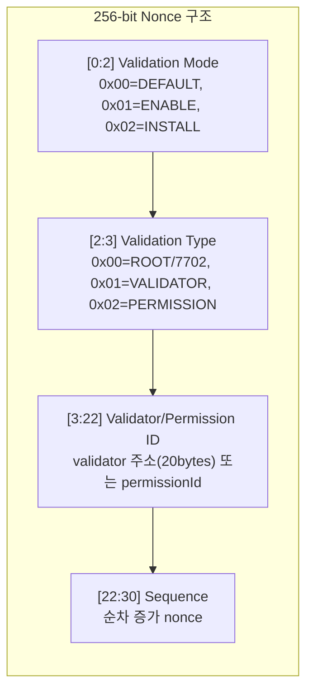
```mermaid
flowchart LR
    subgraph "256-bit Nonce 구조"
        direction TB
        A["[0:2] Validation Mode<br/>0x00=DEFAULT, 0x01=ENABLE, 0x02=INSTALL"]
        B["[2:3] Validation Type<br/>0x00=ROOT/7702, 0x01=VALIDATOR, 0x02=PERMISSION"]
        C["[3:22] Validator/Permission ID<br/>validator 주소(20bytes) 또는 permissionId"]
        D["[22:30] Sequence<br/>순차 증가 nonce"]
    end

    A --> B --> C --> D
```

### Nonce 예시

```
Root Validator 사용:
  0x0000 00 0000000000000000000000000000000000000000 0000000000000001
  |mode| |t| |              unused                  | |   sequence   |

특정 Validator(0xABCD...) 사용:
  0x0000 01 ABCD...1234 (validator address)           0000000000000001
  |mode| |t| |      validator ID (20 bytes)         | |   sequence   |

Permission 사용:
  0x0000 02 <permissionId (20 bytes)>                 0000000000000001
```

## 4.4 initCode: 7702 온보딩

### 7702 마커 방식

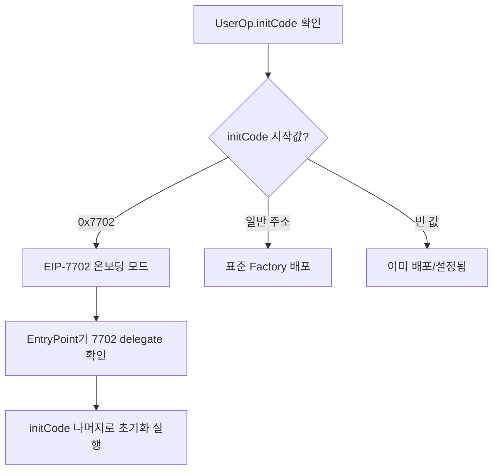
```mermaid
flowchart TB
    A[UserOp.initCode 확인] --> B{initCode 시작값?}
    B -->|0x7702| C["EIP-7702 온보딩 모드"]
    B -->|일반 주소| D["표준 Factory 배포"]
    B -->|빈 값| E["이미 배포/설정됨"]

    C --> F["EntryPoint가 7702 delegate 확인"]
    F --> G["initCode 나머지로 초기화 실행"]
```

**EntryPoint의 7702 처리 (Eip7702Support.sol):**

```solidity
// initCode가 0x7702로 시작하면 EIP-7702 모드
function _isEip7702InitCode(bytes calldata initCode) internal pure returns (bool) {
    return initCode.length >= 2 && bytes2(initCode[0:2]) == bytes2(0x7702);
}

// EOA의 bytecode에서 delegate 주소 추출
function _getEip7702Delegate(address account) internal view returns (address) {
    // account의 code 앞 23바이트를 읽어서
    // 0xef0100 prefix 확인 후 delegate 주소 반환
}
```

## 4.5 EVM 처리 흐름: UserOperation 전체 라이프사이클

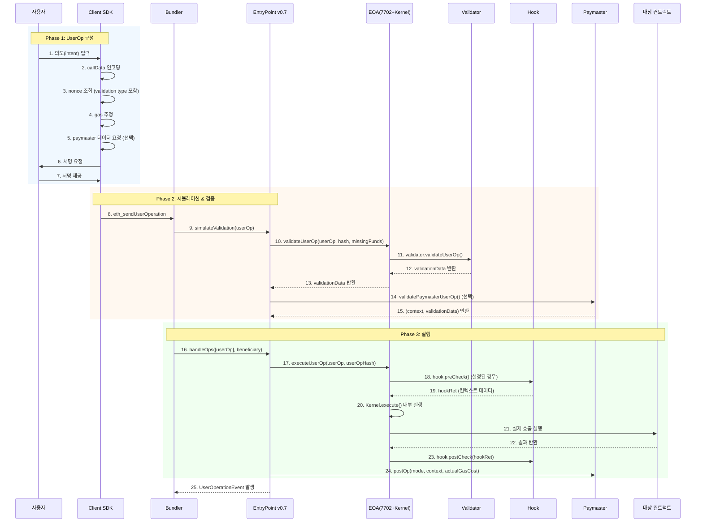
```mermaid
sequenceDiagram
    participant User as 사용자
    participant SDK as Client SDK
    participant Bundler as Bundler
    participant EP as EntryPoint v0.7
    participant EOA as EOA(7702+Kernel)
    participant Val as Validator
    participant Hook as Hook
    participant PM as Paymaster
    participant Target as 대상 컨트랙트

    rect rgb(240, 248, 255)
        Note over User,SDK: Phase 1: UserOp 구성
        User->>SDK: 1. 의도(intent) 입력
        SDK->>SDK: 2. callData 인코딩
        SDK->>SDK: 3. nonce 조회 (validation type 포함)
        SDK->>SDK: 4. gas 추정
        SDK->>SDK: 5. paymaster 데이터 요청 (선택)
        SDK->>User: 6. 서명 요청
        User->>SDK: 7. 서명 제공
    end

    rect rgb(255, 248, 240)
        Note over SDK,EP: Phase 2: 시뮬레이션 & 검증
        SDK->>Bundler: 8. eth_sendUserOperation
        Bundler->>EP: 9. simulateValidation(userOp)
        EP->>EOA: 10. validateUserOp(userOp, hash, missingFunds)
        EOA->>Val: 11. validator.validateUserOp()
        Val-->>EOA: 12. validationData 반환
        EOA-->>EP: 13. validationData 반환
        EP->>PM: 14. validatePaymasterUserOp() (선택)
        PM-->>EP: 15. (context, validationData) 반환
    end

    rect rgb(240, 255, 240)
        Note over Bundler,Target: Phase 3: 실행
        Bundler->>EP: 16. handleOps([userOp], beneficiary)
        EP->>EOA: 17. executeUserOp(userOp, userOpHash)
        EOA->>Hook: 18. hook.preCheck() (설정된 경우)
        Hook-->>EOA: 19. hookRet (컨텍스트 데이터)
        EOA->>EOA: 20. Kernel.execute() 내부 실행
        EOA->>Target: 21. 실제 호출 실행
        Target-->>EOA: 22. 결과 반환
        EOA->>Hook: 23. hook.postCheck(hookRet)
        EP->>PM: 24. postOp(mode, context, actualGasCost)
    end

    EP-->>Bundler: 25. UserOperationEvent 발생
```

## 4.6 EntryPoint 상세

### EntryPoint v0.7 역할

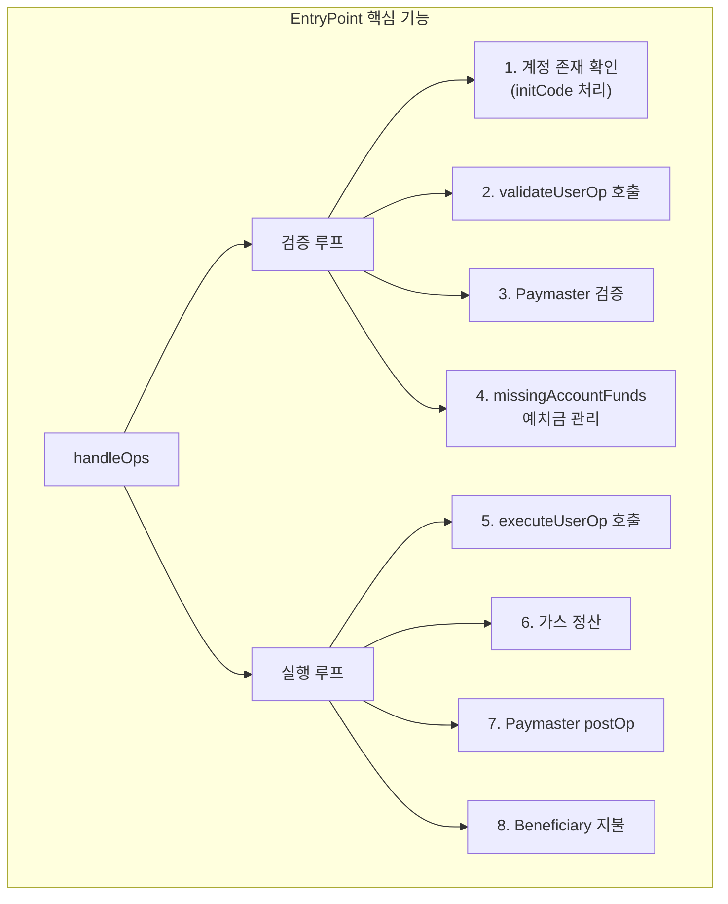
```mermaid
flowchart TB
    subgraph "EntryPoint 핵심 기능"
        A[handleOps] --> B[검증 루프]
        A --> C[실행 루프]

        B --> B1["1. 계정 존재 확인<br/>(initCode 처리)"]
        B --> B2["2. validateUserOp 호출"]
        B --> B3["3. Paymaster 검증"]
        B --> B4["4. missingAccountFunds<br/>예치금 관리"]

        C --> C1["5. executeUserOp 호출"]
        C --> C2["6. 가스 정산"]
        C --> C3["7. Paymaster postOp"]
        C --> C4["8. Beneficiary 지불"]
    end
```

### EntryPoint 트랜잭션 필드

| 함수 | 입력 | 설명 |
|---|---|---|
| `handleOps(ops[], beneficiary)` | UserOp 배열 + 수수료 수신자 | 배치 처리 메인 함수 |
| `simulateValidation(userOp)` | 단일 UserOp | 오프체인 시뮬레이션용 |
| `getNonce(sender, key)` | 계정 주소 + key | nonce 조회 |
| `depositTo(account)` | 계정 주소 + ETH | 가스 예치금 추가 |
| `getDepositInfo(account)` | 계정 주소 | 예치금/스테이크 조회 |

## 4.7 Bundler 상세

### Bundler의 역할

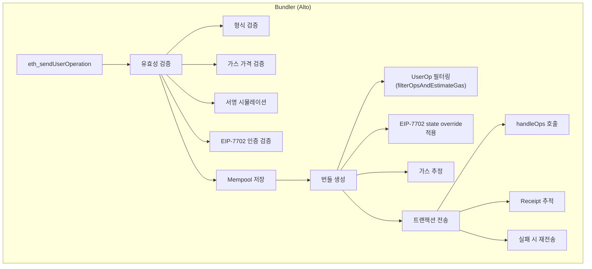
```mermaid
flowchart TB
    subgraph "Bundler (Alto)"
        A[eth_sendUserOperation] --> B[유효성 검증]
        B --> B1[형식 검증]
        B --> B2[가스 가격 검증]
        B --> B3[서명 시뮬레이션]
        B --> B4["EIP-7702 인증 검증"]

        B --> C[Mempool 저장]
        C --> D[번들 생성]
        D --> D1["UserOp 필터링<br/>(filterOpsAndEstimateGas)"]
        D --> D2["EIP-7702 state override<br/>적용"]
        D --> D3[가스 추정]

        D --> E[트랜잭션 전송]
        E --> E1[handleOps 호출]
        E --> E2[Receipt 추적]
        E --> E3[실패 시 재전송]
    end
```

### Bundler RPC 메서드

| 메서드 | 설명 |
|---|---|
| `eth_sendUserOperation(userOp, entryPoint)` | UserOp 제출 |
| `eth_estimateUserOperationGas(userOp, entryPoint)` | 가스 추정 |
| `eth_getUserOperationByHash(hash)` | UserOp 조회 |
| `eth_getUserOperationReceipt(hash)` | 실행 결과 조회 |
| `eth_supportedEntryPoints()` | 지원 EntryPoint 목록 |
| `eth_chainId()` | 체인 ID |

### 7702 관련 Bundler 특수 처리

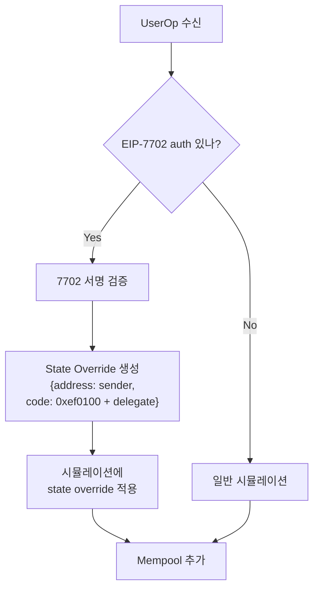
```mermaid
flowchart TB
    A[UserOp 수신] --> B{EIP-7702 auth 있나?}
    B -->|Yes| C["7702 서명 검증"]
    C --> D["State Override 생성<br/>{address: sender,<br/> code: 0xef0100 + delegate}"]
    D --> E["시뮬레이션에<br/>state override 적용"]
    B -->|No| F[일반 시뮬레이션]
    E --> G[Mempool 추가]
    F --> G
```

## 4.8 Paymaster 상세

### SponsorPaymaster 모드

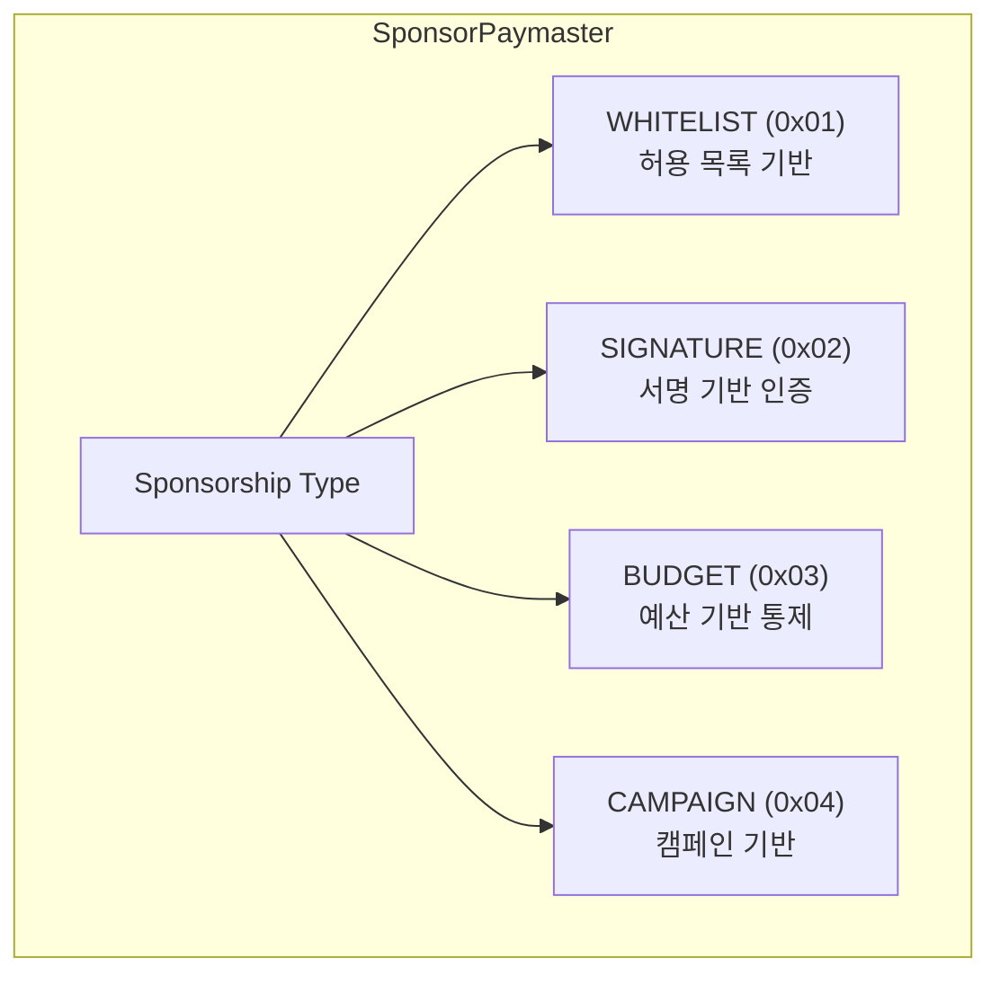
```mermaid
flowchart TB
    subgraph "SponsorPaymaster"
        A[Sponsorship Type]
        A --> B["WHITELIST (0x01)<br/>허용 목록 기반"]
        A --> C["SIGNATURE (0x02)<br/>서명 기반 인증"]
        A --> D["BUDGET (0x03)<br/>예산 기반 통제"]
        A --> E["CAMPAIGN (0x04)<br/>캠페인 기반"]
    end
```

### PaymasterAndData 형식

```
paymasterAndData 구조:
┌──────────────┬─────────────────────────┬─────────────────┐
│ paymaster    │ paymasterVerGasLimit    │ paymasterPostOp │
│ (20 bytes)   │ (16 bytes)              │ GasLimit(16b)   │
├──────────────┴─────────────────────────┴─────────────────┤
│ paymasterData                                            │
│ ┌───────────────┬────────────┬────────────┬────────────┐ │
│ │ sponsorType   │ validUntil │ validAfter │ signature  │ │
│ │ (4 bytes)     │ (6 bytes)  │ (6 bytes)  │ (64 bytes) │ │
│ └───────────────┴────────────┴────────────┴────────────┘ │
└──────────────────────────────────────────────────────────┘
```

### Paymaster Proxy (ERC-7677)

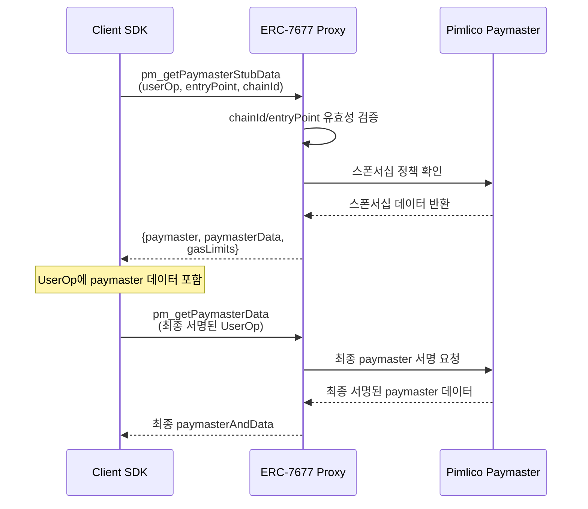
```mermaid
sequenceDiagram
    participant SDK as Client SDK
    participant Proxy as ERC-7677 Proxy
    participant PM as Pimlico Paymaster

    SDK->>Proxy: pm_getPaymasterStubData<br/>(userOp, entryPoint, chainId)
    Proxy->>Proxy: chainId/entryPoint 유효성 검증
    Proxy->>PM: 스폰서십 정책 확인
    PM-->>Proxy: 스폰서십 데이터 반환
    Proxy-->>SDK: {paymaster, paymasterData,<br/>gasLimits}

    Note over SDK: UserOp에 paymaster 데이터 포함

    SDK->>Proxy: pm_getPaymasterData<br/>(최종 서명된 UserOp)
    Proxy->>PM: 최종 paymaster 서명 요청
    PM-->>Proxy: 최종 서명된 paymaster 데이터
    Proxy-->>SDK: 최종 paymasterAndData
```

### Paymaster RPC 메서드

| 메서드 | 설명 |
|---|---|
| `pm_getPaymasterStubData` | 가스 추정용 stub 데이터 |
| `pm_getPaymasterData` | 최종 서명된 데이터 |
| `pm_supportedTokens` | 지원 ERC-20 목록 |
| `pm_estimateERC20Payment` | 토큰 결제 견적 |
| `pm_getSponsorPolicy` | 스폰서십 정책 확인 |

## 4.9 캠페인 기반 가스 대납

### Campaign 구조

```solidity
struct Campaign {
    uint48 validUntil;        // 캠페인 종료 시간
    uint48 validAfter;        // 캠페인 시작 시간
    uint256 totalBudget;      // 총 예산 (wei)
    uint256 usedBudget;       // 사용된 예산
    uint256 perUserLimit;     // 사용자당 한도
    address[] targetContracts; // 대상 컨트랙트 목록
    bool isActive;            // 활성화 여부
}
```

### 비즈니스 시나리오

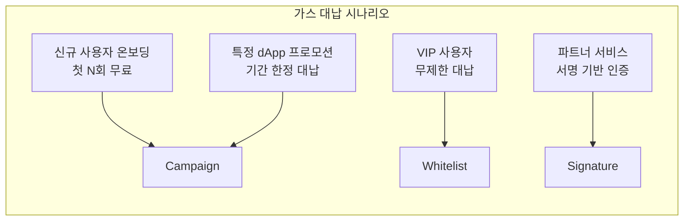
```mermaid
flowchart LR
    subgraph "가스 대납 시나리오"
        A["신규 사용자 온보딩<br/>첫 N회 무료"] --> X[Campaign]
        B["특정 dApp 프로모션<br/>기간 한정 대납"] --> X
        C["VIP 사용자<br/>무제한 대납"] --> Y[Whitelist]
        D["파트너 서비스<br/>서명 기반 인증"] --> Z[Signature]
    end
```

## 4.10 전체 스택 통합 요약

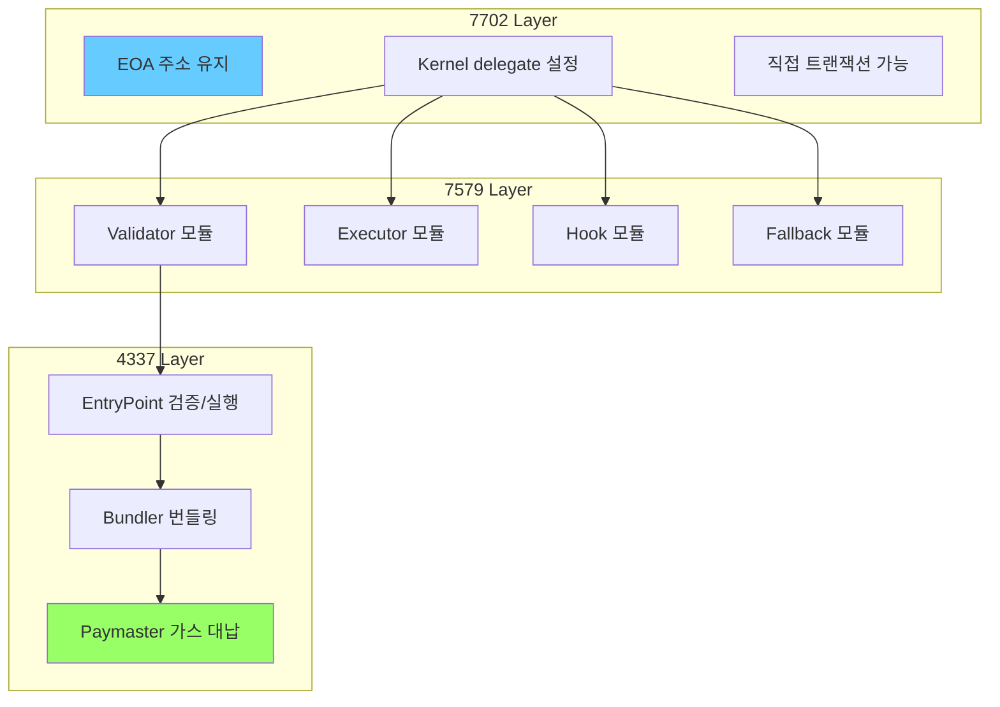
```mermaid
flowchart TB
    subgraph "7702 Layer"
        A1[EOA 주소 유지]
        A2[Kernel delegate 설정]
        A3[직접 트랜잭션 가능]
    end

    subgraph "7579 Layer"
        B1[Validator 모듈]
        B2[Executor 모듈]
        B3[Hook 모듈]
        B4[Fallback 모듈]
    end

    subgraph "4337 Layer"
        C1[EntryPoint 검증/실행]
        C2[Bundler 번들링]
        C3[Paymaster 가스 대납]
    end

    A2 --> B1 & B2 & B3 & B4
    B1 --> C1
    C1 --> C2
    C2 --> C3

    style A1 fill:#6cf
    style C3 fill:#9f6
```

| 레이어 | 역할 | 없을 때 |
|---|---|---|
| **EIP-7702** | EOA → Smart Account 전환 | 새 CA 주소 필요, 자산 이관 |
| **ERC-7579** | 모듈형 기능 확장 | 단일 로직, 확장 불가 |
| **ERC-4337** | 가스 대납, 번들링, 자동화 | 사용자가 직접 ETH 보유 필요 |

---

> **핵심 메시지**: 7702가 EOA를 Smart Account로 만들고, 7579가 모듈로 기능을 확장하며, 4337이 가스 대납과 번들링 인프라를 제공합니다. 세 표준의 결합이 "기존 주소 유지 + 완전한 Smart Account UX"를 실현합니다.
