# 5. 정책 관리 및 통제 컨트랙트

## 5.1 왜 정책 통제가 필요한가?

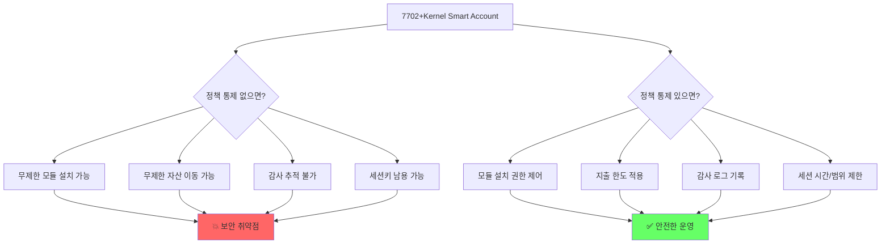

## 5.2 정책 통제 아키텍처

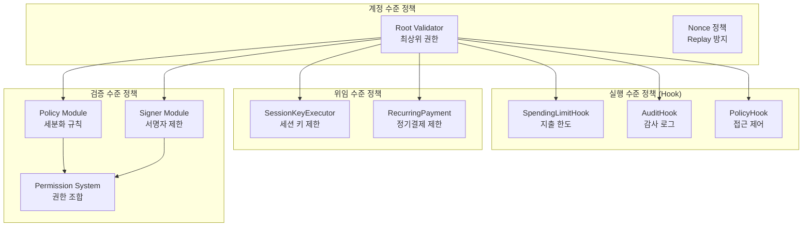

## 5.3 Root Validator - 최상위 권한 통제

### 역할

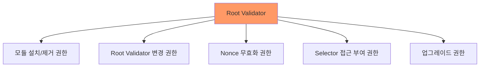

### 호출자 권한 검사 (Kernel.sol)

```solidity
modifier onlyEntryPointOrSelfOrRoot() {
    bytes memory hookRet = _checkEntryPointOrSelfOrRoot();
    _;
    _postCheckHook(hookRet);
}

function _checkEntryPointOrSelfOrRoot() internal returns (bytes memory) {
    if (msg.sender != address(ENTRYPOINT) && msg.sender != address(this)) {
        // Root Validator의 preCheck로 추가 검증
        IValidator validator = ValidatorLib.getValidator(
            _validationStorage().rootValidator
        );
        return IHook(address(validator)).preCheck(msg.sender, msg.value, msg.data);
    }
    return "";
}
```

### 호출 경로별 권한

| 호출자 | 권한 | 추가 검증 |
|---|---|---|
| EntryPoint | UserOp 검증 통과 시 | validateUserOp()에서 이미 검증 |
| Self (내부 호출) | 이미 검증된 실행 흐름 | 없음 |
| Root Validator | preCheck() 통과 필요 | Root Validator가 IHook도 구현 |
| 기타 | **거부** (InvalidCaller) | - |

### Root Validator 권장 설정

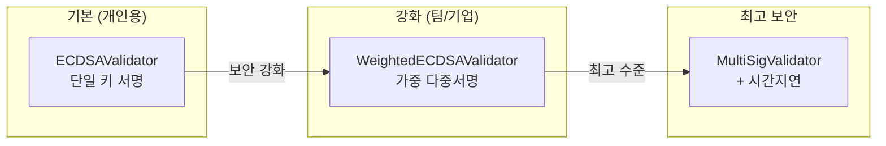

## 5.4 SpendingLimitHook - 지출 한도 제어

### 구조

```solidity
struct SpendingLimit {
    uint256 limit;         // 기간별 최대 한도
    uint256 spent;         // 현재 기간 사용량
    uint256 periodLength;  // 기간 길이 (초)
    uint256 periodStart;   // 현재 기간 시작 시간
    bool isEnabled;        // 활성화 여부
}

// 토큰별, 계정별 한도 관리
mapping(address account => mapping(address token => SpendingLimit))
```

### 동작 흐름

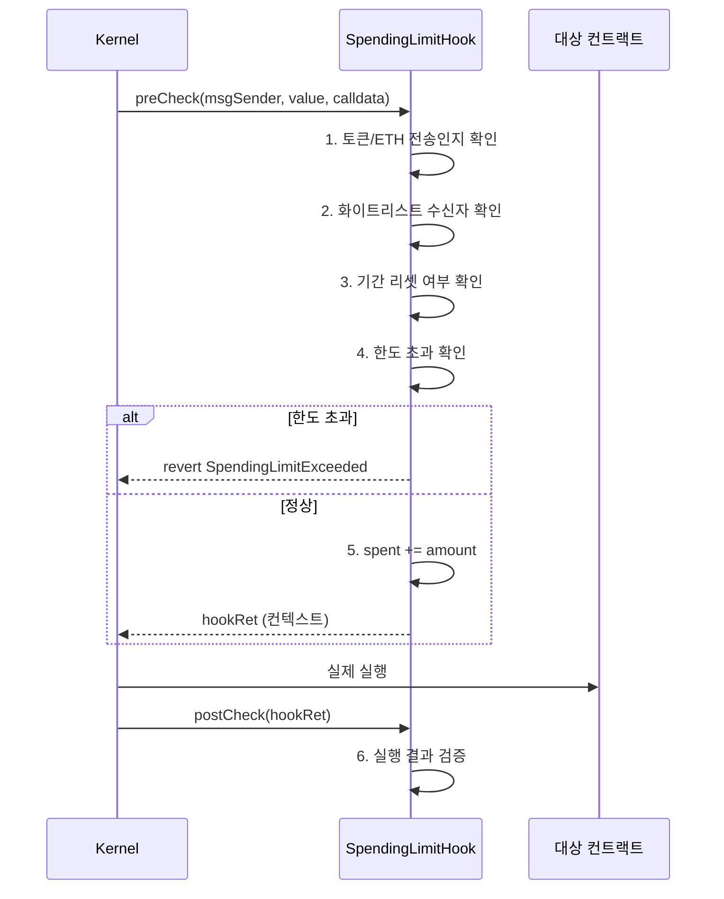

### 지원 기간

| 기간 | 상수 | 초 |
|---|---|---|
| 시간별 | `PERIOD_HOURLY` | 3,600 |
| 일별 | `PERIOD_DAILY` | 86,400 |
| 주별 | `PERIOD_WEEKLY` | 604,800 |
| 월별 | `PERIOD_MONTHLY` | 2,592,000 |

### 추적 대상

| 대상 | 감지 방법 |
|---|---|
| ETH 전송 | `msg.value` 확인 |
| ERC-20 transfer | `calldata` selector `0xa9059cbb` |
| ERC-20 transferFrom | `calldata` selector `0x23b872dd` |
| ERC-20 approve | `calldata` selector `0x095ea7b3` |

### 관리 함수

| 함수 | 설명 | 호출 권한 |
|---|---|---|
| `setSpendingLimit(token, limit, period)` | 한도 설정 | 계정 소유자 |
| `removeSpendingLimit(token)` | 한도 제거 | 계정 소유자 |
| `addToWhitelist(address)` | 무제한 수신자 | 계정 소유자 |
| `removeFromWhitelist(address)` | 화이트리스트 제거 | 계정 소유자 |
| `pause()` / `unpause()` | 긴급 중지/재개 | 계정 소유자 |

## 5.5 AuditHook - 감사 추적

### 구조

```solidity
struct AuditLog {
    address caller;        // 호출자
    address target;        // 대상
    uint256 value;         // ETH 금액
    bytes4 selector;       // 함수 selector
    uint256 timestamp;     // 시간
    bool flagged;          // 고위험 플래그
}

struct AccountConfig {
    uint256 highValueThreshold;  // 고위험 기준 금액
    uint256 delayPeriod;         // 플래그 시 지연 시간
    mapping(address => bool) blocklist;  // 차단 목록
    uint256 totalTransactions;   // 총 트랜잭션 수
    uint256 flaggedCount;        // 플래그된 수
}
```

### 동작 흐름

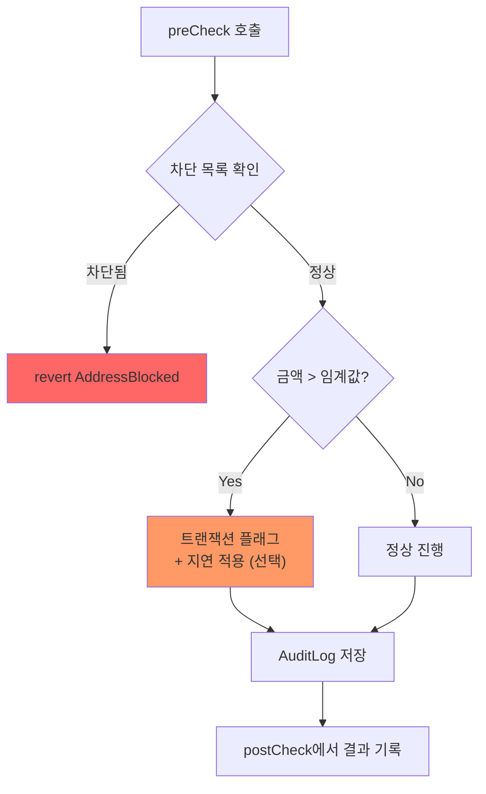

### 비즈니스 활용

| 시나리오 | 설정 |
|---|---|
| 기업 계정 감사 | highValueThreshold = 10 ETH, 모든 트랜잭션 로그 |
| 컴플라이언스 | 차단 목록 설정, 고위험 지연 |
| 개인 보안 | highValueThreshold = 1 ETH, 플래그 알림 |

## 5.6 PolicyHook - 접근 제어 정책

### 운영 모드

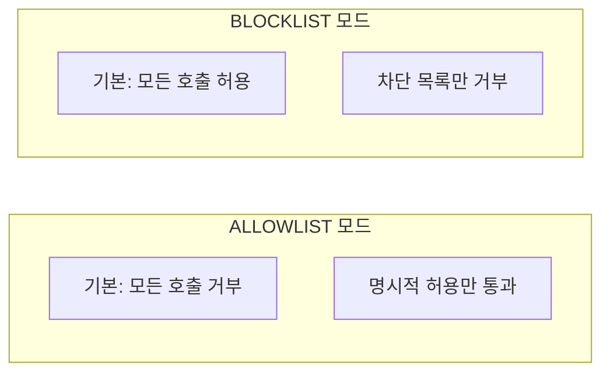

### 세부 제어

```solidity
struct TargetConfig {
    bool isConfigured;
    uint256 valueLimit;              // 최대 ETH 금액
    bool strictSelectorMode;         // selector별 제어
    mapping(bytes4 => bool) allowedSelectors;  // 허용 함수
    mapping(bytes4 => bool) blockedSelectors;  // 차단 함수
}
```

## 5.7 Permission System (ERC-7579 Type 5, 6)

### Permission = Policy + Signer

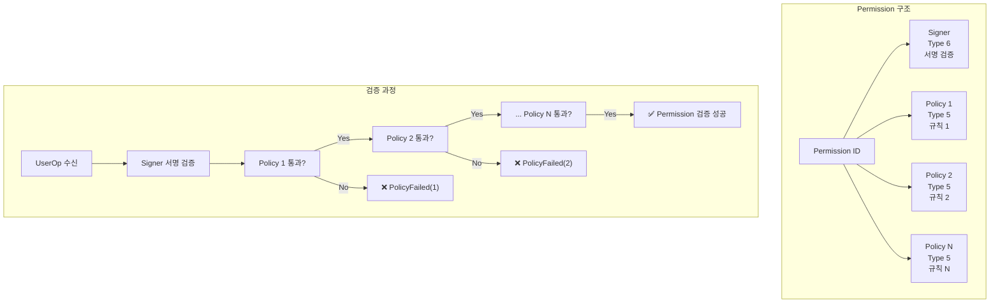

### Permission 검증 코드 (ValidationManager.sol)

```solidity
function _checkUserOpPolicy(
    PermissionId permissionId,
    PackedUserOperation calldata userOp,
    bytes calldata sig
) internal returns (ValidationData vd) {
    PermissionConfig storage pc = _validationStorage()
        .permissionConfig[permissionId];

    // 각 Policy를 순회하며 검증
    for (uint256 i = 0; i < pc.policyData.length; i++) {
        PolicyData p = pc.policyData[i];
        IPolicy policy = IPolicy(address(bytes20(PolicyData.unwrap(p))));

        ValidationData policyResult = policy.checkUserOpPolicy(
            address(this),
            permissionId,
            userOp,
            sig
        );

        vd = _intersectValidationData(vd, policyResult);
    }
}
```

### Permission 설정 예시

| 사용 사례 | Signer | Policy 조합 |
|---|---|---|
| 세션 키 (시간 제한) | SessionKeySigner | TimePolicy + TargetPolicy |
| 정기결제 (금액 제한) | ECDSASigner | SpendingPolicy + IntervalPolicy |
| 서브계정 (범위 제한) | SubAccountSigner | ContractPolicy + SelectorPolicy |
| 관리자 (승인 필요) | MultiSigSigner | ApprovalPolicy + AuditPolicy |

## 5.8 Nonce 정책

### Nonce 기반 제어

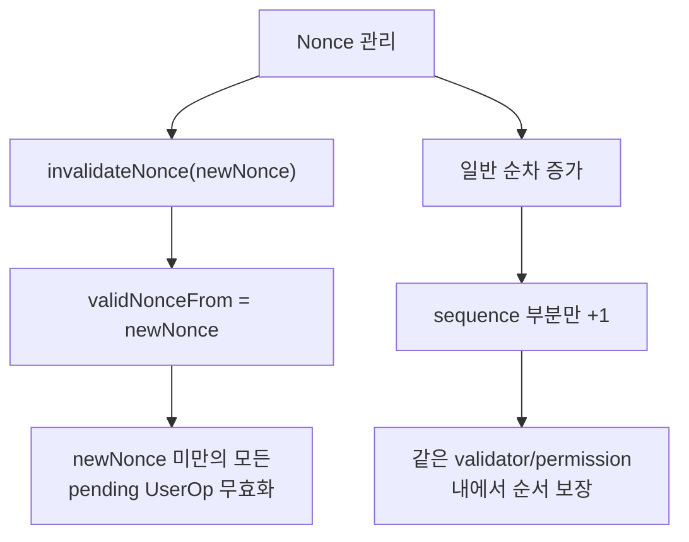

### Nonce 무효화

```solidity
function invalidateNonce(uint32 newNonce) external onlyEntryPointOrSelfOrRoot {
    ValidationStorage storage vs = _validationStorage();
    // newNonce가 현재보다 크고 MAX_NONCE_INCREMENT_SIZE 이내여야 함
    if (newNonce <= vs.validNonceFrom
        || newNonce > vs.currentNonce + MAX_NONCE_INCREMENT_SIZE) {
        revert NonceInvalidationError();
    }
    vs.validNonceFrom = newNonce;
    emit NonceInvalidated(newNonce);
}
```

| 매개변수 | 설명 | 제한 |
|---|---|---|
| `newNonce` | 새로운 최소 유효 nonce | 현재값보다 크고, 최대 +10 이내 |

## 5.9 ERC-7715 Permission Manager

### 구독/정기결제 권한 관리

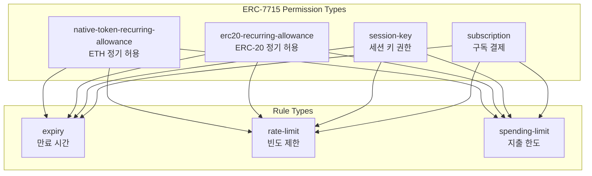

### Permission 구조

```solidity
struct Permission {
    PermissionType permissionType;
    address target;         // 대상 컨트랙트
    bytes4 selector;        // 허용 함수
    uint256 value;          // 최대 금액
    uint48 validAfter;      // 시작 시간
    uint48 validUntil;      // 종료 시간
    Rule[] rules;           // 적용 규칙
    bool isActive;
}
```

## 5.10 정책 조합 매트릭스

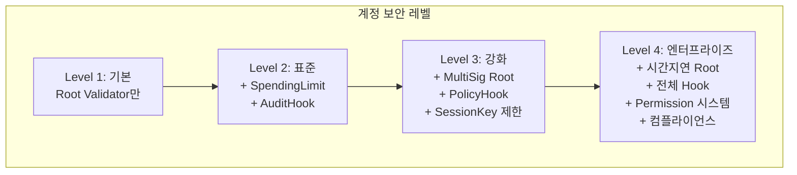

| 보안 레벨 | Root Validator | Hook | Executor | Policy | 대상 |
|---|---|---|---|---|---|
| 기본 | ECDSA | 없음 | 없음 | 없음 | 개인 테스트 |
| 표준 | ECDSA | SpendingLimit | SessionKey | 없음 | 개인 사용 |
| 강화 | MultiSig | Spending+Audit | SessionKey | Target+Time | 팀/프로젝트 |
| 엔터프라이즈 | Weighted+지연 | 전체 | 제한적 | 전체 | 기업/기관 |

## 5.11 비즈니스 거버넌스 시나리오

### 시나리오 1: 핀테크 규제 준수

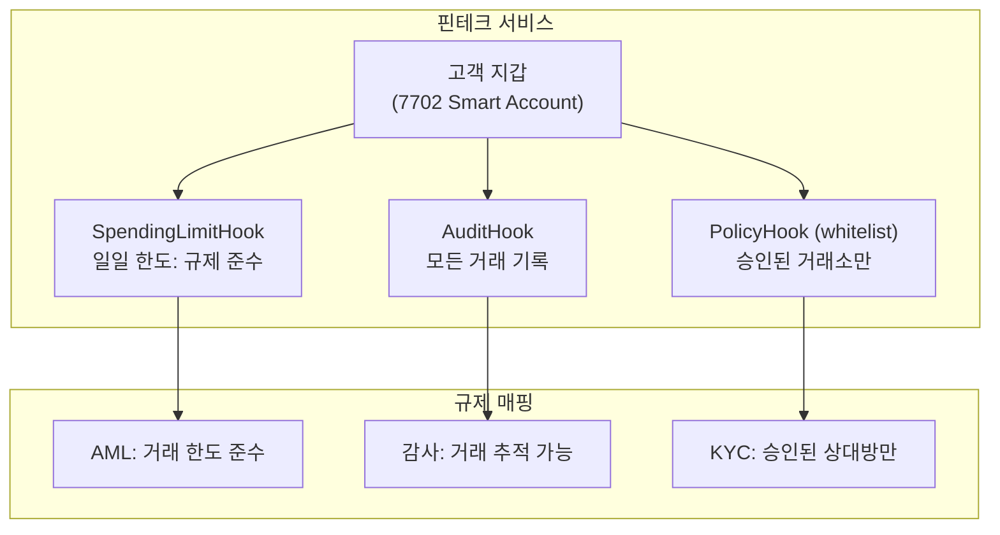

### 시나리오 2: DAO 자금관리

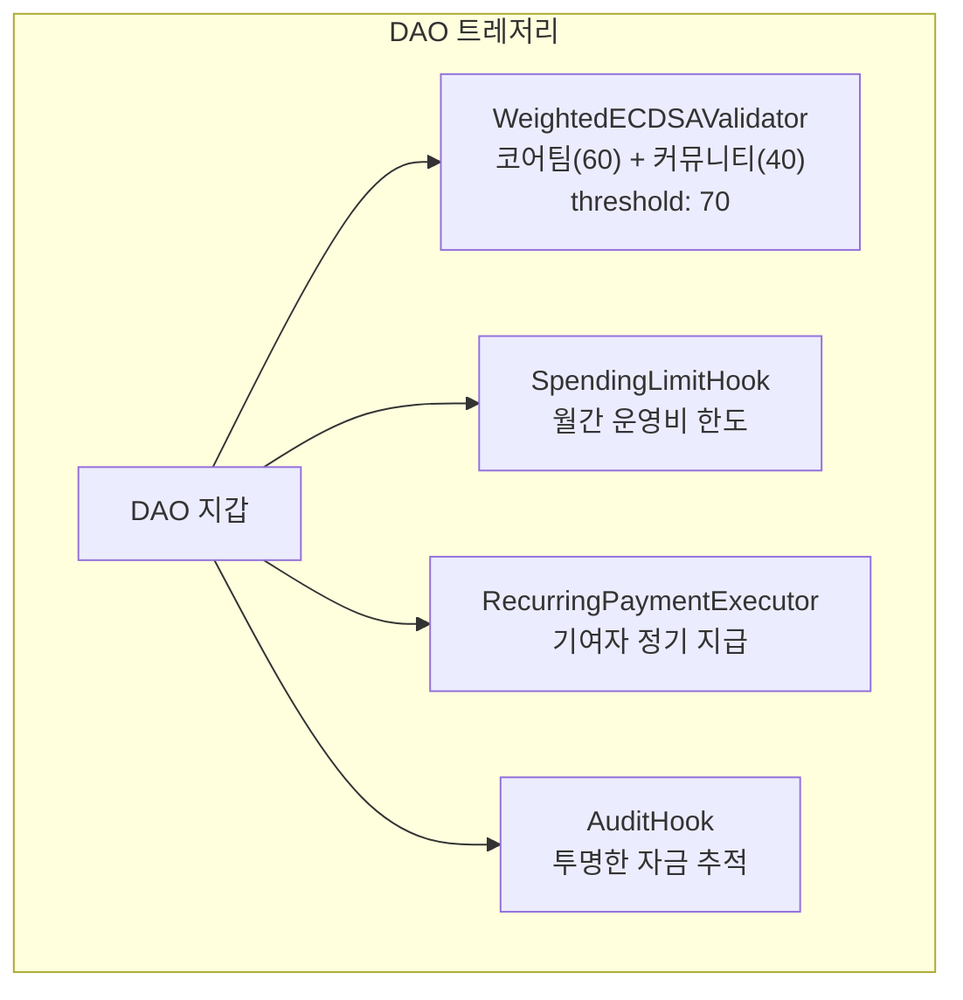

### 시나리오 3: 게임 운영사

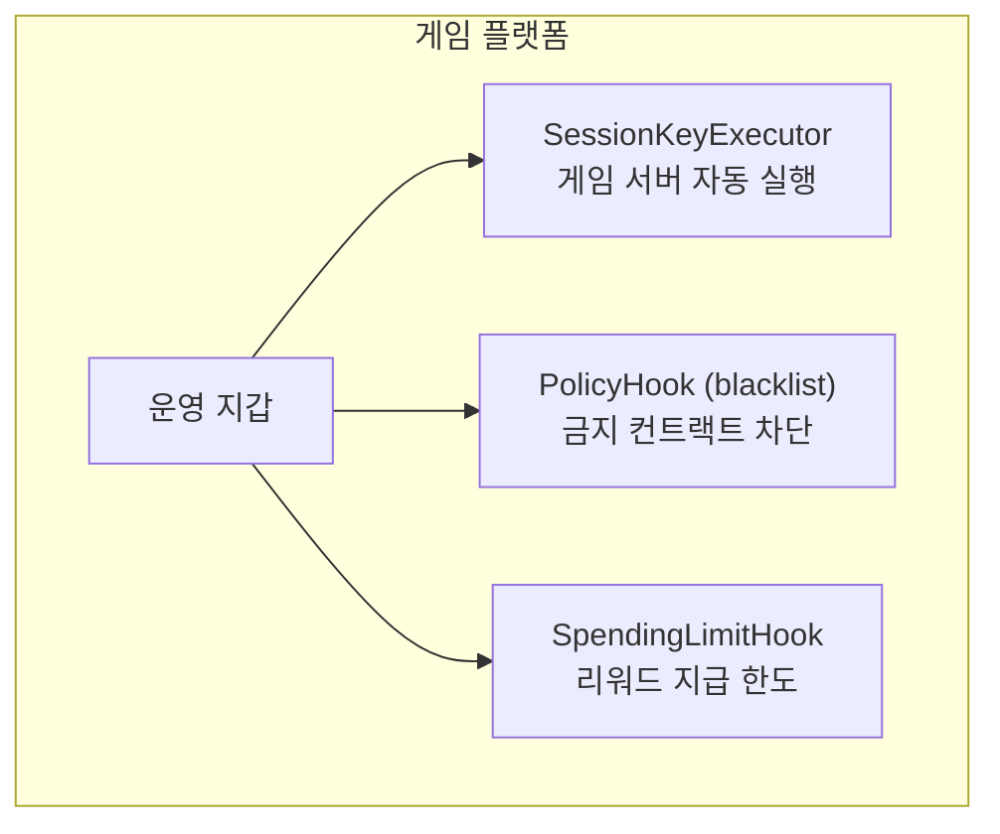

### 컴플라이언스 매핑

| 규제 | 요구사항 | 대응 모듈 | 구현 방법 |
|---|---|---|---|
| **KYC/AML** | 거래 상대방 확인, 한도 | PolicyHook(whitelist) + SpendingLimit | 승인 목록 + 일일 한도 |
| **SOX** | 내부 통제, 감사 추적 | AuditHook + WeightedECDSA | 다중 서명 + 감사 로그 |
| **GDPR** | 데이터 삭제 권리 | 오프체인 매핑 + 온체인 해시 | AuditHook에 해시만 기록 |
| **PCI DSS** | 결제 보안 | SpendingLimit + PolicyHook | 결제 한도 + 승인 가맹점 |
| **Travel Rule** | 송금인/수신인 정보 | AuditHook + 오프체인 KYC | 온체인 이벤트 + 오프체인 DB |

---

> **핵심 메시지**: 정책 통제는 Smart Account의 보안과 운영성의 핵심입니다. Root Validator로 최상위 권한을 보호하고, Hook으로 실행을 제어하며, Permission으로 세분화된 접근 규칙을 적용하세요.
