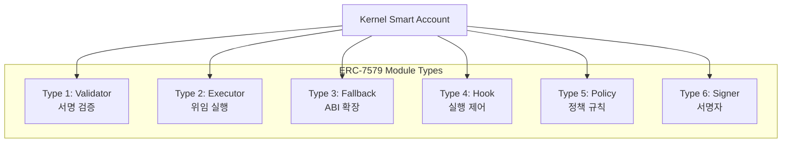
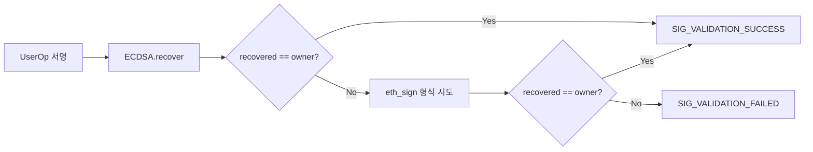
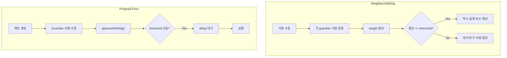
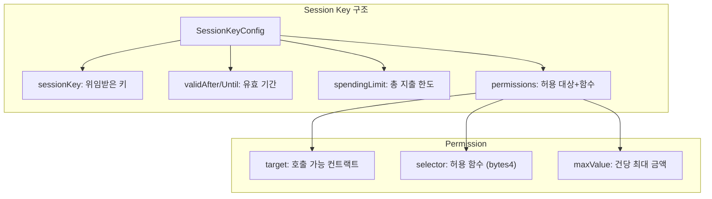
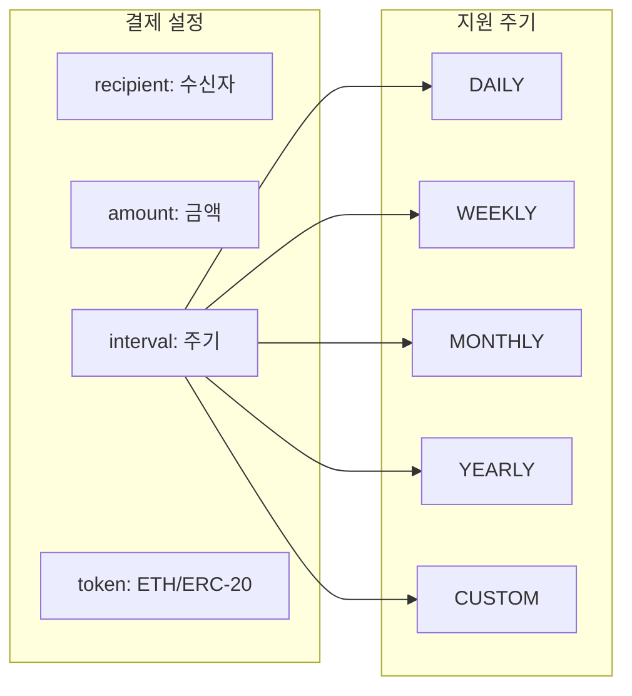
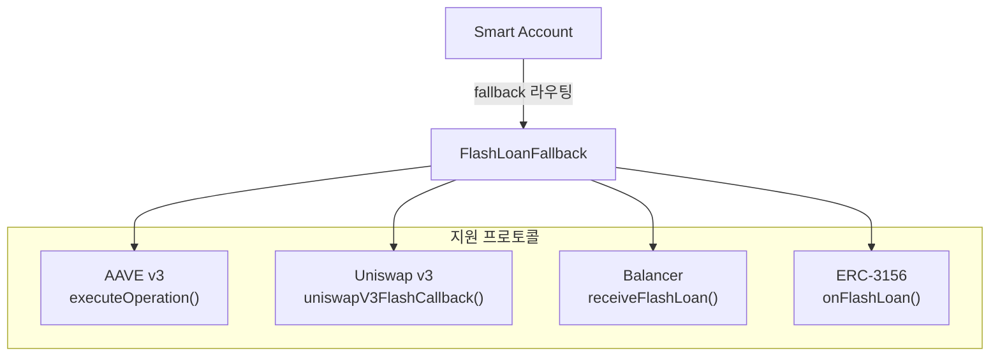
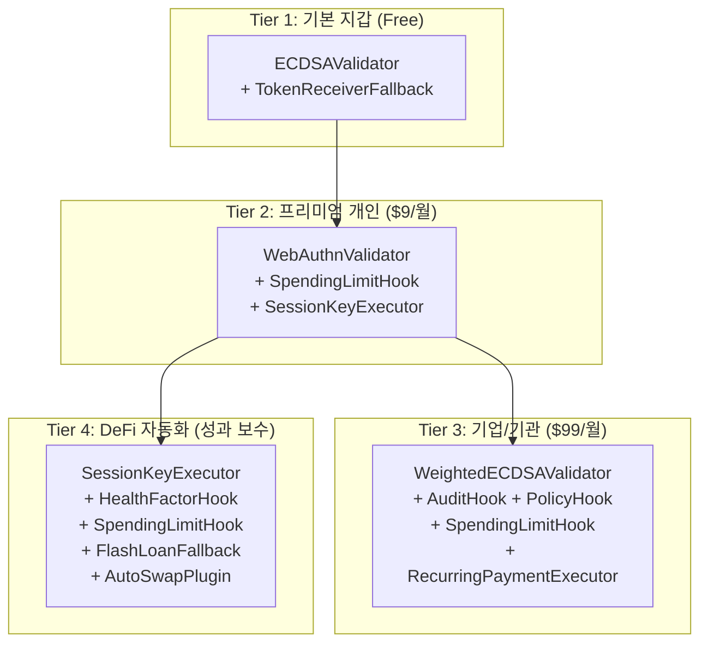

# 6. ERC-7579 모듈 컨트랙트 카탈로그

## 6.1 모듈 타입 개요



### 모듈 기본 인터페이스

```solidity
interface IModule {
    function onInstall(bytes calldata data) external payable;
    function onUninstall(bytes calldata data) external payable;
    function isModuleType(uint256 moduleTypeId) external view returns (bool);
    function isInitialized(address smartAccount) external view returns (bool);
}
```

## 6.2 Validator 모듈 (Type 1)

### 인터페이스

```solidity
interface IValidator is IModule {
    function validateUserOp(
        PackedUserOperation calldata userOp,
        bytes32 userOpHash
    ) external payable returns (ValidationData);

    function isValidSignatureWithSender(
        address sender,
        bytes32 hash,
        bytes calldata sig
    ) external view returns (bytes4);
}
```

---

### ECDSAValidator

| 항목 | 내용 |
|---|---|
| **파일** | `poc-contract/src/erc7579-validators/ECDSAValidator.sol` |
| **용도** | 단일 ECDSA 키 기반 서명 검증 |
| **모듈 타입** | Validator (1) + Hook (4) |
| **onInstall 데이터** | `bytes20(ownerAddress)` |



**주요 기능:**
- 단일 소유자 ECDSA 서명 검증
- EIP-191 (eth_sign) 폴백 지원
- IHook 구현: `preCheck()`로 `msgSender == owner` 검증

**사용 사례:** 기본 rootValidator, 개인 계정

---

### WeightedECDSAValidator

| 항목 | 내용 |
|---|---|
| **파일** | `poc-contract/src/erc7579-validators/WeightedECDSAValidator.sol` |
| **용도** | 가중 다중서명 (Weighted Multi-Sig) |
| **모듈 타입** | Validator (1) |
| **onInstall 데이터** | `guardians[], weights[], threshold, delay` |



**주요 기능:**
- Guardian 링크드 리스트 관리
- 가중치 기반 임계값 (예: guardian A=3, B=2, C=1, threshold=4)
- 제안/승인/거부(veto) 흐름
- 설정 가능한 시간 지연
- 배치 서명 승인 (`approveWithSig`)

**사용 사례:** 팀 계정, 기업 금고, DAO 금고

---

### WebAuthnValidator

| 항목 | 내용 |
|---|---|
| **파일** | `poc-contract/src/erc7579-validators/WebAuthnValidator.sol` |
| **용도** | WebAuthn/Passkey 기반 인증 |
| **모듈 타입** | Validator (1) |

**주요 기능:**
- P-256 (secp256r1) 타원곡선 서명 검증
- 브라우저/디바이스 네이티브 지원
- 백업 코드 기능
- 다중 패스키 등록

**사용 사례:** 모바일 앱, 생체인증, 하드웨어 키

---

### MultiSigValidator

| 항목 | 내용 |
|---|---|
| **파일** | `poc-contract/src/erc7579-validators/MultiSigValidator.sol` |
| **용도** | M-of-N 다중서명 |
| **모듈 타입** | Validator (1) |

**주요 기능:**
- 설정 가능한 임계값 (M of N)
- 정렬된 서명 검증
- 관리자/복구 키 지원

**사용 사례:** 공동 계정, 프로젝트 금고

---

### MultiChainValidator

| 항목 | 내용 |
|---|---|
| **파일** | `poc-contract/src/erc7579-validators/MultiChainValidator.sol` |
| **용도** | 크로스체인 트랜잭션 검증 |
| **모듈 타입** | Validator (1) |

**주요 기능:**
- 체인 ID 검증
- 크로스체인 위임
- 오라클 통합 지원

**사용 사례:** 멀티체인 계정, 브릿지 트랜잭션

## 6.3 Executor 모듈 (Type 2)

### 인터페이스

```solidity
interface IExecutor is IModule {
    // Executor는 Kernel.executeFromExecutor()를 호출하여
    // Smart Account 대신 트랜잭션을 실행
}
```

---

### SessionKeyExecutor

| 항목 | 내용 |
|---|---|
| **파일** | `poc-contract/src/erc7579-executors/SessionKeyExecutor.sol` |
| **용도** | 시간 제한 위임 실행 |
| **onInstall 데이터** | `sessionKey, validAfter, validUntil, spendingLimit` |



**실행 방법:**
1. `executeOnBehalf()`: 세션키 서명으로 실행 (외부 호출)
2. `executeAsSessionKey()`: 세션키 직접 호출 (msg.sender 확인)

**사용 사례:** 게임 자동실행, DeFi 봇, dApp UX 개선

---

### RecurringPaymentExecutor

| 항목 | 내용 |
|---|---|
| **파일** | `poc-contract/src/erc7579-executors/RecurringPaymentExecutor.sol` |
| **용도** | 자동 정기결제 |



**주요 기능:**
- ETH 및 ERC-20 결제 지원
- 설정 가능한 결제 간격
- 누구나 결제 시점에 트리거 가능
- 배치 실행 지원

**사용 사례:** 구독 서비스, 급여 지급, 정기 기부

---

### 기타 Executor

| Executor | 파일 | 용도 |
|---|---|---|
| StakingExecutor | `erc7579-executors/StakingExecutor.sol` | 스테이킹 관리 |
| SwapExecutor | `erc7579-executors/SwapExecutor.sol` | 토큰 스왑 |
| LendingExecutor | `erc7579-executors/LendingExecutor.sol` | 대출 프로토콜 |

## 6.4 Fallback 모듈 (Type 3)

### 인터페이스

```solidity
interface IFallback is IModule {
    // Kernel의 fallback()에서 selector 라우팅으로 호출됨
}
```

---

### FlashLoanFallback

| 항목 | 내용 |
|---|---|
| **파일** | `poc-contract/src/erc7579-fallbacks/FlashLoanFallback.sol` |
| **용도** | 플래시론 콜백 처리 |



**주요 기능:**
- 프로토콜별 콜백 함수 구현
- 프로토콜 화이트리스트
- 플래시론 로깅
- ERC-2771 컨텍스트 추출

**사용 사례:** DeFi 청산, 차익 거래, 포지션 리밸런싱

---

### TokenReceiverFallback

| 항목 | 내용 |
|---|---|
| **파일** | `poc-contract/src/erc7579-fallbacks/TokenReceiverFallback.sol` |
| **용도** | 토큰 수신 콜백 처리 |

**지원 표준:**

| 표준 | 콜백 함수 |
|---|---|
| ERC-721 | `onERC721Received()` |
| ERC-1155 | `onERC1155Received()`, `onERC1155BatchReceived()` |
| ERC-777 | `tokensReceived()` |

**사용 사례:** NFT 수신, 게임 아이템, 멀티토큰 관리

## 6.5 Hook 모듈 (Type 4)

### 인터페이스

```solidity
interface IHook is IModule {
    function preCheck(
        address msgSender,
        uint256 value,
        bytes calldata msgData
    ) external payable returns (bytes memory hookData);

    function postCheck(
        bytes calldata hookData
    ) external payable;
}
```

---

### SpendingLimitHook

(상세는 05-policy-control-contracts.md 참조)

| 항목 | 내용 |
|---|---|
| **파일** | `poc-contract/src/erc7579-hooks/SpendingLimitHook.sol` |
| **용도** | 토큰별 지출 한도 적용 |
| **onInstall 데이터** | `tokens[], limits[], periods[]` |

---

### AuditHook

| 항목 | 내용 |
|---|---|
| **파일** | `poc-contract/src/erc7579-hooks/AuditHook.sol` |
| **용도** | 온체인 감사 추적 |
| **onInstall 데이터** | `highValueThreshold, delayPeriod` |

**주요 기능:**
- 모든 트랜잭션 로깅
- 고위험 트랜잭션 플래그
- 선택적 시간 지연 (time-lock)
- 차단 목록 관리
- 통계 추적

---

### PolicyHook

| 항목 | 내용 |
|---|---|
| **파일** | `poc-contract/src/erc7579-hooks/PolicyHook.sol` |
| **용도** | 접근 제어 정책 적용 |

**두 가지 모드:**
- **ALLOWLIST**: 기본 거부, 명시적 허용만 통과
- **BLOCKLIST**: 기본 허용, 차단 목록만 거부

---

### HealthFactorHook

| 항목 | 내용 |
|---|---|
| **파일** | `poc-contract/src/erc7579-hooks/HealthFactorHook.sol` |
| **용도** | DeFi 건전성 지표 모니터링 |

**사용 사례:** 대출 포지션 청산 방지, 담보 비율 유지

## 6.6 Policy 모듈 (Type 5)

### 인터페이스

```solidity
interface IPolicy is IModule {
    function checkUserOpPolicy(
        address account,
        PermissionId permissionId,
        PackedUserOperation calldata userOp,
        bytes calldata policyProof
    ) external payable returns (ValidationData);

    function checkSignaturePolicy(
        address account,
        PermissionId permissionId,
        address caller,
        bytes32 hash,
        bytes calldata proof
    ) external view returns (ValidationData);
}
```

**용도:** Permission 시스템에서 세분화된 규칙 적용

## 6.7 Signer 모듈 (Type 6)

### 인터페이스

```solidity
interface ISigner is IModule {
    function checkUserOpSignature(
        address account,
        PermissionId permissionId,
        bytes32 userOpHash,
        bytes calldata signature
    ) external payable returns (ValidationData);

    function checkSignature(
        address account,
        PermissionId permissionId,
        address caller,
        bytes32 hash,
        bytes calldata signature
    ) external view returns (ValidationData);
}
```

**용도:** Permission 내 서명 검증 담당

## 6.8 Plugin (확장 모듈)

### AutoSwapPlugin

| 항목 | 내용 |
|---|---|
| **파일** | `poc-contract/src/erc7579-plugins/AutoSwapPlugin.sol` |
| **용도** | 자동 토큰 스왑 |

### MicroLoanPlugin

| 항목 | 내용 |
|---|---|
| **파일** | `poc-contract/src/erc7579-plugins/MicroLoanPlugin.sol` |
| **용도** | 소액 대출 |

### OnRampPlugin

| 항목 | 내용 |
|---|---|
| **파일** | `poc-contract/src/erc7579-plugins/OnRampPlugin.sol` |
| **용도** | 법정화폐 온램프 |

## 6.9 모듈 카탈로그 요약표

| 모듈 | 타입 | 용도 | 복잡도 | 권장 용도 |
|---|---|---|---|---|
| ECDSAValidator | 1 | ECDSA 서명 검증 | 낮음 | 기본 rootValidator |
| WeightedECDSAValidator | 1 | 가중 다중서명 | 높음 | 팀/기업 rootValidator |
| WebAuthnValidator | 1 | 패스키 인증 | 중간 | 모바일/웹 |
| MultiSigValidator | 1 | M-of-N 다중서명 | 중간 | 공동 계정 |
| MultiChainValidator | 1 | 크로스체인 검증 | 높음 | 멀티체인 |
| SessionKeyExecutor | 2 | 세션키 실행 | 중간 | dApp 자동화 |
| RecurringPaymentExecutor | 2 | 정기결제 | 중간 | 구독 서비스 |
| FlashLoanFallback | 3 | 플래시론 콜백 | 높음 | DeFi |
| TokenReceiverFallback | 3 | 토큰 수신 | 낮음 | NFT/토큰 수신 |
| SpendingLimitHook | 4 | 지출 한도 | 중간 | 보안 필수 |
| AuditHook | 4 | 감사 추적 | 중간 | 컴플라이언스 |
| PolicyHook | 4 | 접근 제어 | 중간 | 기업 정책 |

## 6.10 모듈별 비즈니스 서비스 매핑

각 모듈이 어떤 비즈니스 서비스를 가능하게 하는지, 그리고 수익화 방법을 정리합니다.

| 모듈 | 서비스 유형 | 수익 모델 | 대상 고객 |
|---|---|---|---|
| **ECDSAValidator** | 기본 지갑 서비스 | Freemium 기반 확장 | 모든 사용자 |
| **WeightedECDSAValidator** | 기업 자금관리 | SaaS 월정액 | 기업, DAO |
| **WebAuthnValidator** | 생체인증 지갑 | 프리미엄 구독 | 모바일 사용자 |
| **MultiSigValidator** | 공동 계정 관리 | per-account 수수료 | 팀, 커플, 가족 |
| **SessionKeyExecutor** | dApp 자동화 | per-tx 수수료 | DeFi 사용자, 게이머 |
| **RecurringPaymentExecutor** | 구독/급여 자동화 | 건당 수수료 | SaaS, 기업 |
| **FlashLoanFallback** | DeFi 차익거래 | 성과 보수 | 트레이더, 프로토콜 |
| **SpendingLimitHook** | 보안 서비스 | 보안 패키지 번들 | 고액 자산가 |
| **AuditHook** | 컴플라이언스 | 감사 서비스 구독 | 규제 대상 기업 |
| **PolicyHook** | 접근 제어 | 엔터프라이즈 번들 | 금융기관 |
| **AutoSwapPlugin** | 자동 환전 | 스프레드 수수료 | 소매 사용자 |

### 모듈 조합 서비스 패키지



| 패키지 | 모듈 구성 | 가격 모델 | 예상 ARPU |
|---|---|---|---|
| **기본 지갑** | ECDSA + TokenReceiver | Free (가스 대납으로 유입) | $0 (CAC 투자) |
| **프리미엄 개인** | WebAuthn + SpendingLimit + SessionKey | 월 $9 또는 연 $89 | $9/월 |
| **기업/기관** | Weighted + Audit + Policy + Spending + Recurring | 월 $99 + 인원당 $10 | $200+/월 |
| **DeFi 자동화** | SessionKey + HealthFactor + Spending + FlashLoan | 수익의 5~20% | 가변 |

---

> **핵심 메시지**: ERC-7579는 6가지 모듈 타입으로 Smart Account의 기능을 무한히 확장합니다. 각 모듈은 `onInstall()/onUninstall()`로 라이프사이클이 관리되며, 필요에 따라 조합하여 사용합니다.
