# 7. ERC-7579 모듈 설치 및 사용 방법

## 7.1 모듈 라이프사이클

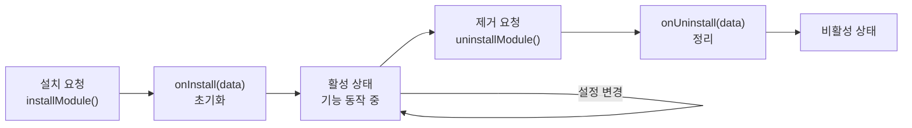

## 7.2 모듈 설치 권한

### 누가 모듈을 설치할 수 있는가?

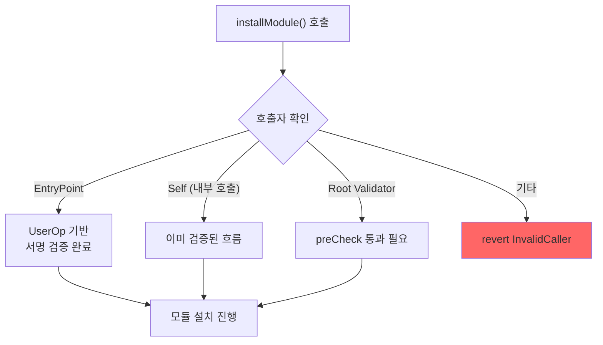

### Kernel.sol의 installModule 구현

```solidity
function installModule(
    uint256 moduleType,
    address module,
    bytes calldata initData
) external payable onlyEntryPointOrSelfOrRoot {
    if (moduleType == MODULE_TYPE_VALIDATOR) {
        // Validator 설치
        _installValidation(validationId, config, data, hooks);
    } else if (moduleType == MODULE_TYPE_EXECUTOR) {
        // Executor 설치
        _installExecutor(module, initData);
    } else if (moduleType == MODULE_TYPE_FALLBACK) {
        // Fallback 설치 (selector별)
        _installFallback(selector, module, hookAddr, data);
    } else if (moduleType == MODULE_TYPE_HOOK) {
        // Hook은 다른 모듈과 함께 설치
        revert InvalidModuleType();
    } else if (moduleType == MODULE_TYPE_POLICY) {
        // Policy 설치
        _installPolicy(permissionId, policy, data);
    } else if (moduleType == MODULE_TYPE_SIGNER) {
        // Signer 설치
        _installSigner(permissionId, signer, data);
    }
}
```

## 7.3 타입별 설치 데이터 형식

### Validator (Type 1) 설치

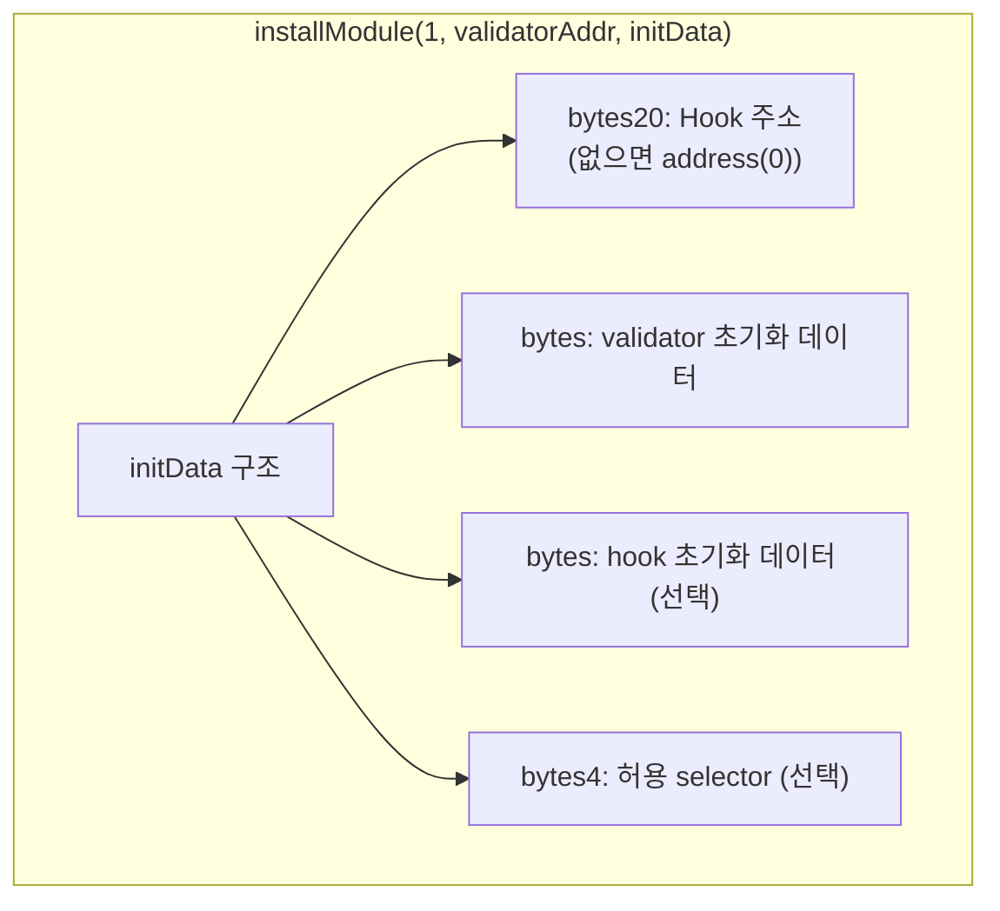

```
InstallValidatorDataFormat:
┌──────────────────────────────────────────────┐
│ [0:20]   hookAddress (address)               │
│ [20:]    validatorData (bytes)               │
│          hookData (bytes)                    │
│          selectorData (bytes4) (optional)    │
└──────────────────────────────────────────────┘
```

**예시: ECDSAValidator 설치**

```
installModule(
    1,                          // MODULE_TYPE_VALIDATOR
    ecdsaValidatorAddress,      // validator 컨트랙트 주소
    abi.encodePacked(
        address(0),             // hook 없음
        abi.encode(
            ownerAddress        // validator initData: owner 주소 (20 bytes)
        )
    )
)
```

### Executor (Type 2) 설치

```
InstallExecutorDataFormat:
┌──────────────────────────────────────────────┐
│ [0:20]   hookAddress (address)               │
│ [20:]    executorData (bytes)                │
│          hookData (bytes)                    │
└──────────────────────────────────────────────┘
```

**예시: SessionKeyExecutor 설치**

```
installModule(
    2,                          // MODULE_TYPE_EXECUTOR
    sessionKeyExecutorAddress,
    abi.encodePacked(
        spendingLimitHookAddress,  // hook 주소 (실행 시 한도 체크)
        abi.encode(
            sessionKeyAddress,     // 세션 키 주소
            validAfter,            // 시작 시간
            validUntil,            // 종료 시간
            spendingLimit          // 지출 한도
        ),
        abi.encode(
            // hook initData (SpendingLimitHook 설정)
        )
    )
)
```

### Fallback (Type 3) 설치

```
InstallFallbackDataFormat:
┌──────────────────────────────────────────────┐
│ [0:4]    selector (bytes4)                   │
│ [4:24]   hookAddress (address)               │
│ [24:]    selectorData (bytes)                │
│          hookData (bytes)                    │
└──────────────────────────────────────────────┘
```

**예시: FlashLoanFallback 설치**

```
installModule(
    3,                          // MODULE_TYPE_FALLBACK
    flashLoanFallbackAddress,
    abi.encodePacked(
        bytes4(keccak256("executeOperation(address,uint256,uint256,address,bytes)")),
        address(0),             // hook 없음
        abi.encode(...)         // fallback initData
    )
)
```

### Policy (Type 5) 설치

```
installModule(
    5,                          // MODULE_TYPE_POLICY
    policyAddress,
    abi.encodePacked(
        permissionId,           // 연결할 Permission ID
        abi.encode(...)         // policy initData
    )
)
```

### Signer (Type 6) 설치

```
installModule(
    6,                          // MODULE_TYPE_SIGNER
    signerAddress,
    abi.encodePacked(
        permissionId,           // 연결할 Permission ID
        abi.encode(...)         // signer initData
    )
)
```

## 7.4 UserOperation을 통한 모듈 설치

### 전체 흐름

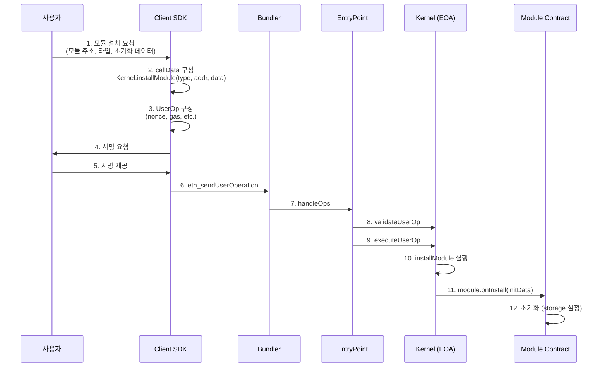

### SDK 레벨 구현 (stable-platform)

```typescript
// 모듈 설치 요청 구성
interface ModuleInstallRequest {
    address: Address         // 모듈 컨트랙트 주소
    type: ModuleType         // 1=Validator, 2=Executor, ...
    initData: Hex            // 초기화 데이터
}

// callData 생성
function prepareInstall(account: Address, request: ModuleInstallRequest): Hex {
    return encodeFunctionData({
        abi: KernelAbi,
        functionName: 'installModule',
        args: [request.type, request.address, request.initData]
    })
}

// UserOp 전송
async function installModule(client: SmartAccountClient, request: ModuleInstallRequest) {
    const callData = prepareInstall(account, request)
    const userOp = await buildUserOperation({ callData, ... })
    const hash = await client.sendUserOperation(userOp)
    return await client.waitForUserOperationReceipt(hash)
}
```

## 7.4A SDK를 이용한 모듈 설치 완전 가이드

### TransactionRouter를 통한 모듈 설치 전체 흐름

> 📁 `stable-platform/packages/sdk-ts/core/src/transaction/`

SDK에서 모듈 설치는 일반 Smart Account 트랜잭션과 동일한 `prepare → execute` 흐름을 따릅니다.

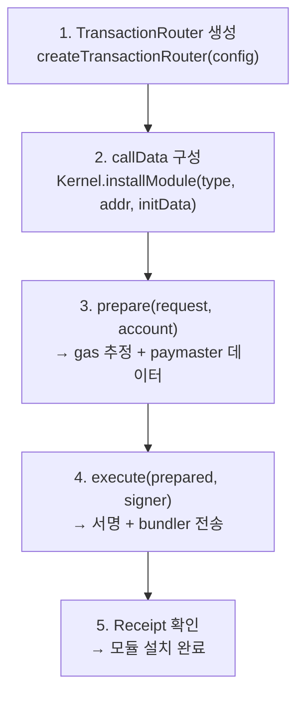

### 단계별 코드

```typescript
import { createTransactionRouter } from '@stablenet/sdk-ts'
import { encodeFunctionData } from 'viem'
import { KERNEL_ABI } from '@stablenet/sdk-ts/abis'

// 1. Router 생성
const router = createTransactionRouter({
  rpcUrl: 'https://rpc.example.com',
  chainId: 31337,
  bundlerUrl: 'https://bundler.example.com',
  paymasterUrl: 'https://paymaster.example.com',
})

// 2. installModule callData 구성
const callData = encodeFunctionData({
  abi: KERNEL_ABI,
  functionName: 'installModule',
  args: [
    1,                      // moduleType: Validator
    validatorAddress,        // 모듈 컨트랙트 주소
    initData,               // 초기화 데이터
  ]
})

// 3. prepare: callData를 Kernel.execute()로 감싸기
//    내부적으로 encodeSmartAccountCall()이 호출됨
const prepared = await router.prepare({
  from: eoaAddress,        // 7702 delegation된 EOA
  to: eoaAddress,          // 자기 자신에게 호출 (installModule)
  data: callData,
  gasPayment: { type: 'sponsor' },  // 가스 대납
}, account)

// 4. execute: 서명 → bundler 전송
const result = await router.execute(prepared, signer, {
  waitForConfirmation: true,
})
```

### encodeSmartAccountCall()의 역할

> 📁 `smartAccountStrategy.ts:327-343`

`prepare()` 내부에서 사용자의 `callData`(installModule)가 `Kernel.execute()`로 한번 더 감싸집니다:

```
최종 callData = Kernel.execute(
  execMode: 0x00...00 (32 bytes, single call),
  executionCalldata: abi.encodePacked(
    target(20 bytes) = EOA 주소 자신,
    value(32 bytes) = 0,
    data(variable) = installModule(type, addr, initData)
  )
)
```

### Gas 추정과 Paymaster 연동

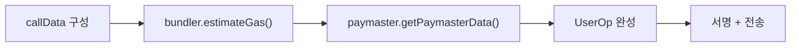

Gas 기본값 (`gas.ts`):
- `verificationGasLimit`: 150,000 (모듈 설치는 검증 복잡)
- `callGasLimit`: 100,000 (installModule + onInstall 실행)
- `preVerificationGas`: 50,000 (Bundler 오버헤드)

---

## 7.4B 각 설치 타입별 구체적 initData 인코딩

### ECDSAValidator 설치

```typescript
// initData = abi.encodePacked(hookAddress, abi.encode(ownerAddress))
const initData = concat([
  '0x0000000000000000000000000000000000000000',  // hookAddr (없으면 zero)
  encodeAbiParameters(
    [{ type: 'address' }],
    [ownerAddress]  // EOA 소유자 주소
  )
])

// installModule(1, ecdsaValidatorAddr, initData)
```

| 필드 | 크기 | 값 | 설명 |
|---|---|---|---|
| hookAddress | 20 bytes | `address(0)` | Hook 없음 |
| validatorData | 32 bytes | owner 주소 (padded) | ECDSA 검증할 소유자 |

### SessionKeyExecutor 설치

```typescript
// initData = abi.encodePacked(hookAddress, executorData)
// executorData = abi.encode(sessionConfig)
const sessionConfig = {
  sessionKey: sessionKeyAddress,    // 세션 키 주소
  validUntil: Math.floor(Date.now() / 1000) + 86400,  // 24시간
  validAfter: Math.floor(Date.now() / 1000),
  targets: [dexAddress, tokenAddress],  // 허용 대상
  maxValue: parseEther('1'),  // 최대 전송 값
}

const initData = concat([
  spendingLimitHookAddress,  // Hook 연결 (지출 제한)
  encodeAbiParameters(
    [{ type: 'tuple', components: [...] }],
    [sessionConfig]
  ),
  encodeAbiParameters(  // hookData (SpendingLimit 초기화)
    [{ type: 'address[]' }, { type: 'uint256[]' }, { type: 'uint256[]' }],
    [tokens, limits, periods]
  )
])
```

### SpendingLimitHook 설치 (독립 설치 시)

```typescript
// Hook은 다른 모듈 설치 시 함께 설치되지만, 독립 설치도 가능
// initData = abi.encode(tokens[], limits[], periods[])
const initData = encodeAbiParameters(
  [
    { type: 'address[]' },  // 추적할 토큰 주소들
    { type: 'uint256[]' },  // 각 토큰의 지출 한도
    { type: 'uint256[]' },  // 리셋 주기 (초)
  ],
  [
    [usdcAddress, wethAddress],    // 토큰 목록
    [parseUnits('1000', 6), parseEther('10')],  // USDC 1000, WETH 10
    [86400n, 86400n],              // 일일 리셋
  ]
)

// installModule(4, spendingLimitHookAddr, initData)
```

### 배치 설치: 한 트랜잭션으로 여러 모듈 설치

```typescript
// Batch mode (CALLTYPE_BATCH = 0x01)를 사용하여 atomically 설치
const execMode = pad('0x01' as Hex, { size: 32 })

// 여러 installModule 호출을 배열로 인코딩
const executions = [
  { target: eoaAddress, value: 0n, data: installValidatorCallData },
  { target: eoaAddress, value: 0n, data: installExecutorCallData },
  { target: eoaAddress, value: 0n, data: installHookCallData },
]

// Kernel.execute(batchExecMode, abi.encode(executions))
```

> 배치 설치는 원자적(atomic)입니다. 하나라도 실패하면 전체가 롤백됩니다.

---

## 7.5 ENABLE 모드로 Validator 설치

### Nonce를 통한 Validator 활성화

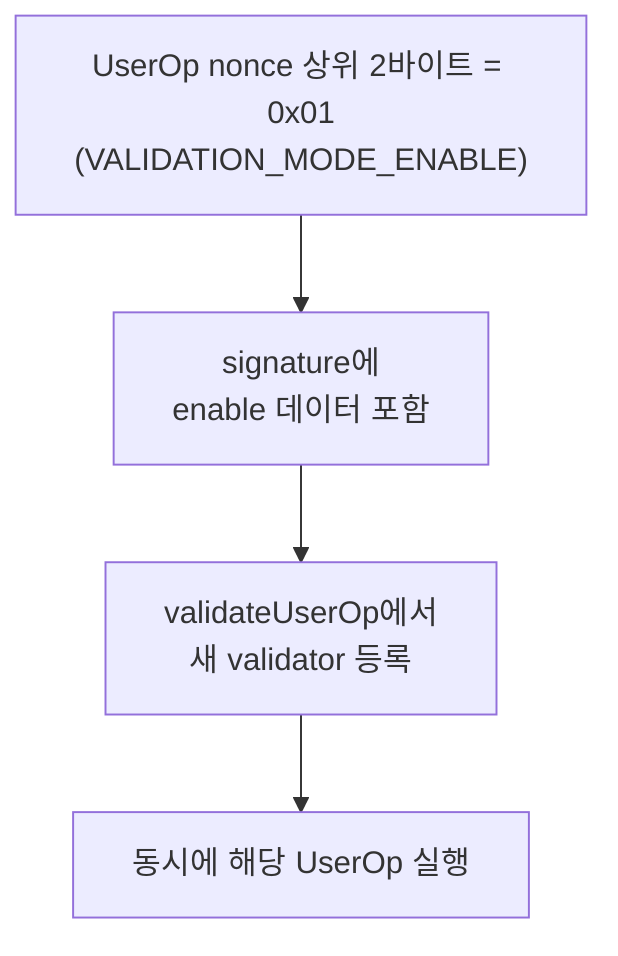

### Enable 데이터 구조

```solidity
// signature 앞부분에 enable 데이터가 포함됨
struct UserOpSigEnableDataFormat {
    bytes4  selector;           // 허용할 함수 selector
    address hookAddress;        // 연결할 hook
    bytes   hookData;           // hook 초기화 데이터
    bytes   validatorData;      // validator 초기화 데이터
    bytes   enableSig;          // root validator의 승인 서명
    bytes   userOpSig;          // 새 validator의 UserOp 서명
}
```

### EIP-712 ENABLE_TYPE_HASH

```solidity
// 활성화에 대한 root validator 승인 서명
bytes32 constant ENABLE_TYPE_HASH = keccak256(
    "Enable(bytes21 validationId,uint32 nonce,address hook,bytes validatorData,bytes hookData)"
);
```

## 7.6 모듈 제거

### uninstallModule 흐름

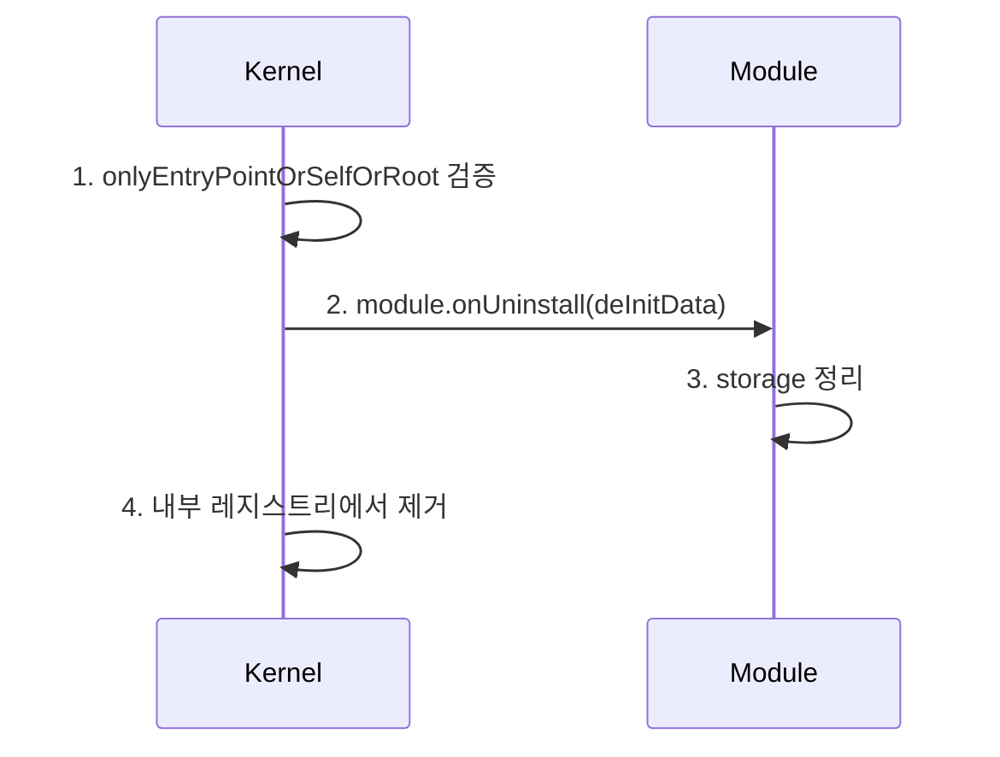

### 타입별 제거

| 타입 | 제거 시 동작 |
|---|---|
| Validator | validationConfig 초기화, hook 해제 |
| Executor | executor 레지스트리에서 제거, hook 해제 |
| Fallback | selector 매핑 제거, hook 해제 |
| Policy | permission에서 policy 제거 |
| Signer | permission에서 signer 제거 |

### 주의사항

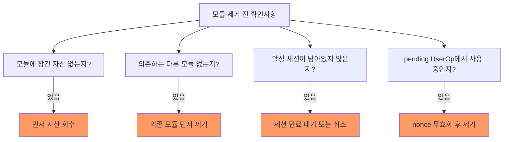

## 7.7 배치 설치 (installValidations)

### 한 번에 여러 Validator/Hook 설치

```solidity
// Kernel.sol
function installValidations(
    ValidationId[] calldata validators,
    ValidationConfig[] calldata configs,
    bytes[] calldata validatorData,
    bytes[] calldata hookData
) external payable onlyEntryPointOrSelfOrRoot {
    for (uint256 i = 0; i < validators.length; i++) {
        _installValidation(validators[i], configs[i], validatorData[i], hookData[i]);
    }
}
```

### 배치 UserOp (execute batched)

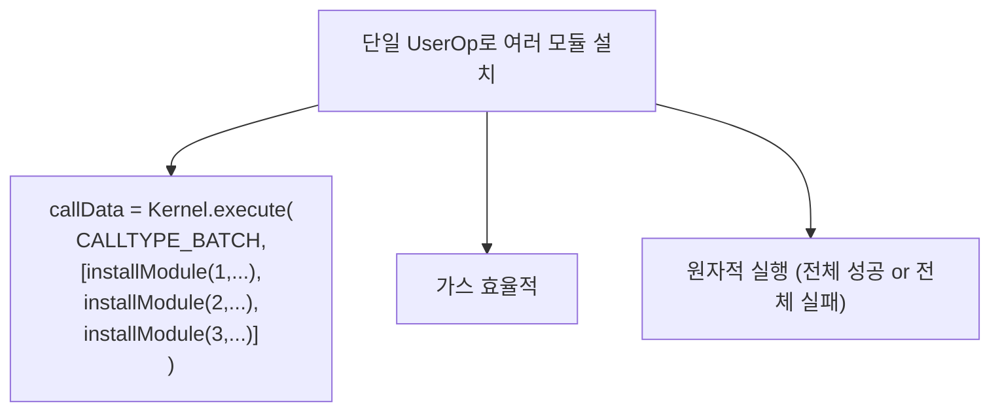

## 7.8 Selector 접근 권한 부여

### grantAccess

특정 Validator에게 특정 함수 호출 권한을 부여:

```solidity
function grantAccess(
    ValidationId vId,      // Validator ID
    bytes4 selector,       // 허용할 함수 selector
    bool allow             // true=허용, false=거부
) external onlyEntryPointOrSelfOrRoot {
    _grantAccess(vId, selector, allow);
    emit SelectorSet(selector, vId, allow);
}
```

### 예시

```
// SessionKeyExecutor가 transfer만 실행할 수 있도록 제한
grantAccess(
    sessionKeyValidatorId,
    bytes4(keccak256("transfer(address,uint256)")),
    true
)
```

## 7.9 모듈 설치 확인

### isModuleInstalled

```solidity
// IERC7579Account.sol
function isModuleInstalled(
    uint256 moduleType,
    address module,
    bytes calldata additionalContext
) external view returns (bool);
```

### SDK 레벨

```typescript
// 설치 확인
const isInstalled = await client.readContract({
    address: accountAddress,
    abi: KernelAbi,
    functionName: 'isModuleInstalled',
    args: [MODULE_TYPE_VALIDATOR, ecdsaValidatorAddress, '0x']
})
```

## 7.10 실전 설치 시나리오

### 시나리오 1: 기본 계정 설정

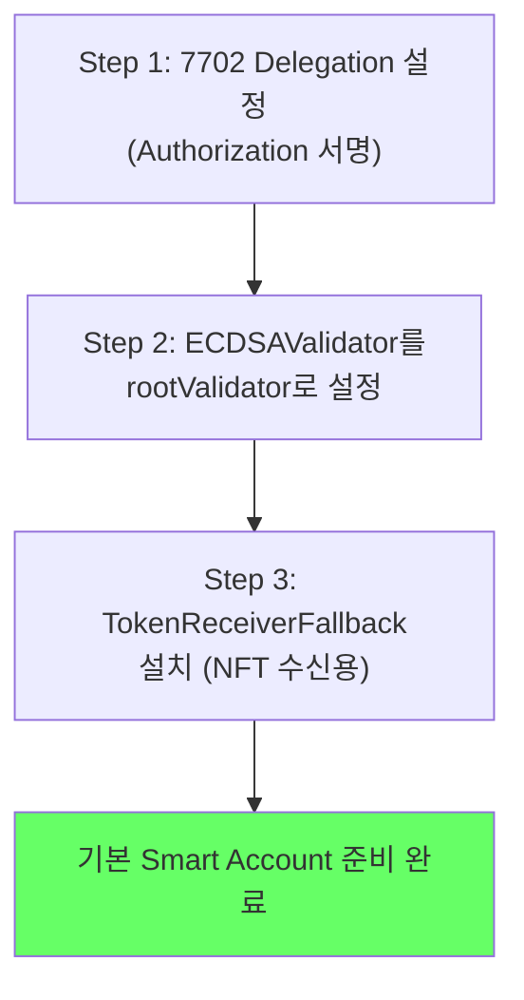

### 시나리오 2: 보안 강화

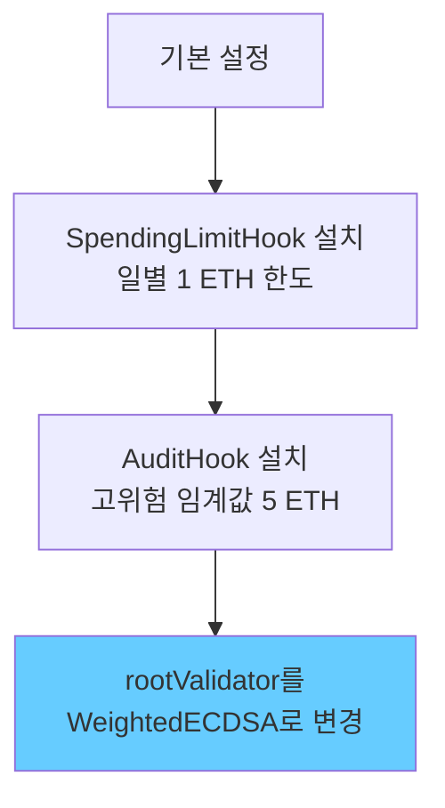

### 시나리오 3: 자동화

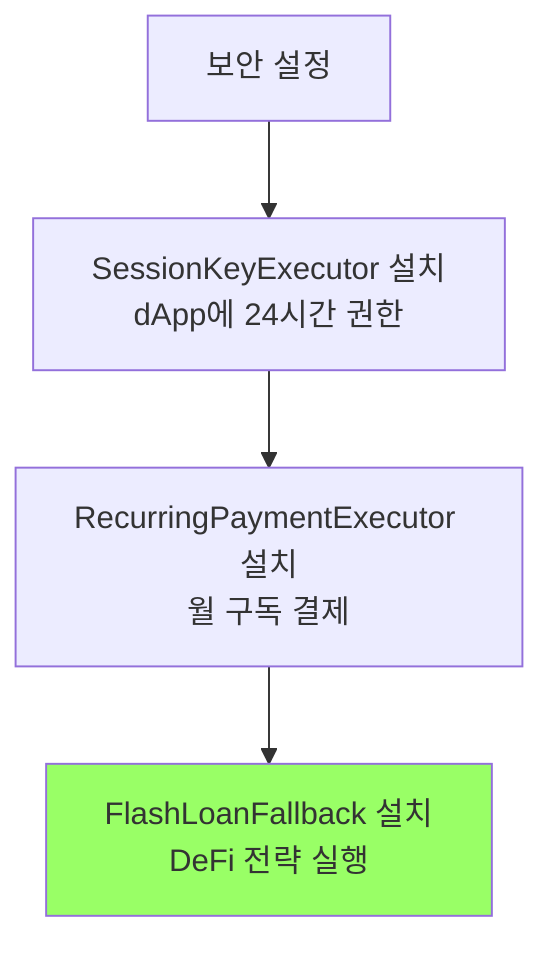

### 시나리오 4: 배치 설치 (한 트랜잭션)

```typescript
// 단일 UserOp로 여러 모듈 설치
const batchCallData = encodeExecuteBatch([
    {
        target: kernelAddress,
        value: 0n,
        data: encodeInstallModule(1, ecdsaValidator, ownerData)
    },
    {
        target: kernelAddress,
        value: 0n,
        data: encodeInstallModule(4, spendingLimitHook, limitData)
    },
    {
        target: kernelAddress,
        value: 0n,
        data: encodeInstallModule(2, sessionKeyExecutor, sessionData)
    }
])
```

---

> **핵심 메시지**: 모듈 설치는 `installModule(type, address, initData)` 한 번의 호출로 이루어집니다. UserOp를 통해 안전하게 설치하고, 배치 실행으로 여러 모듈을 원자적으로 설치하며, 제거 전에는 반드시 자산과 의존성을 확인하세요.
