# 8. Validator/Executor를 통한 위임 실행과 대리 키 인증

## 8.1 위임 실행의 필요성

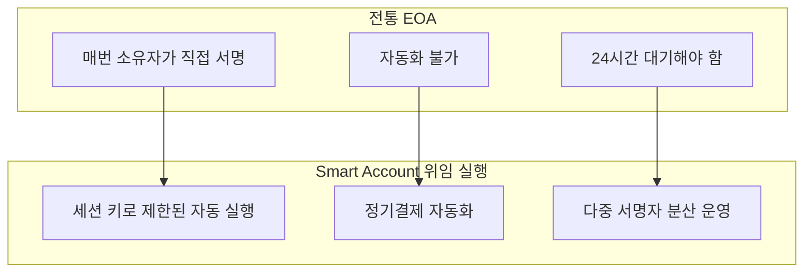

## 8.2 Validator 기반 서명 위임

### Validation Type과 서명 경로

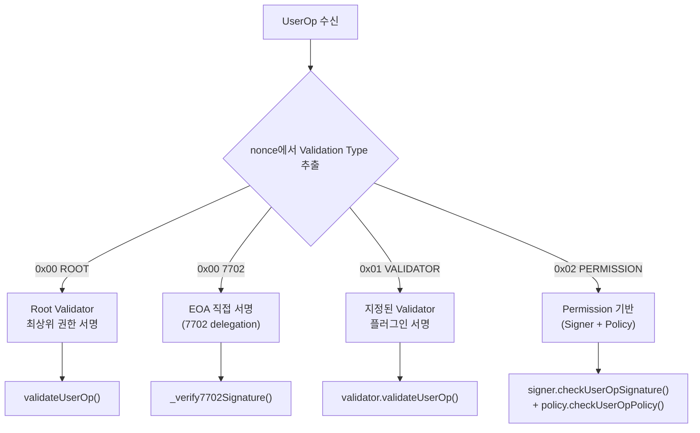

### Root Validator 위임

```solidity
// Root Validator 변경으로 서명 권한 위임
function changeRootValidator(
    ValidationId newRoot,
    IHook hook,
    bytes calldata validatorData,
    bytes calldata hookData
) external payable onlyEntryPointOrSelfOrRoot {
    _changeRootValidator(newRoot, hook, validatorData, hookData);
}
```

| 매개변수 | 설명 |
|---|---|
| `newRoot` | 새 Root Validator ID (validator 주소 + 타입) |
| `hook` | 연결할 Hook (없으면 address(0)) |
| `validatorData` | 새 validator 초기화 데이터 |
| `hookData` | hook 초기화 데이터 |

### 대리 Validator 추가

기존 rootValidator를 유지하면서 추가 Validator를 설치:

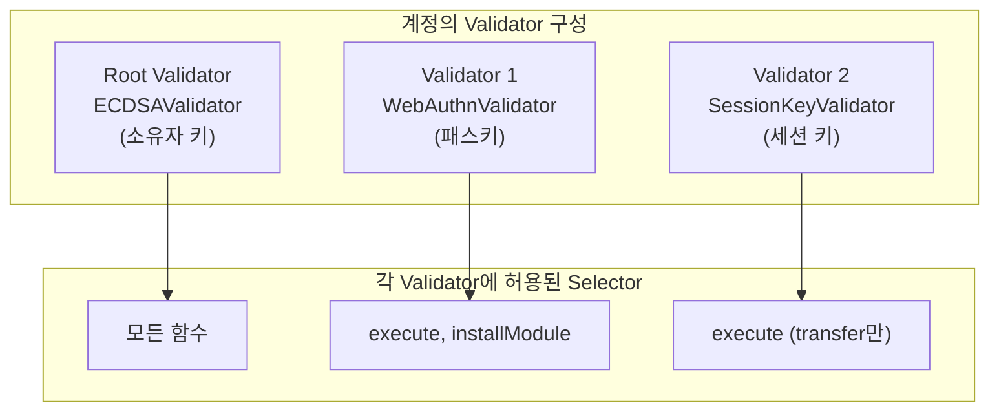

## 8.3 Executor 기반 위임 실행

### Executor의 실행 경로

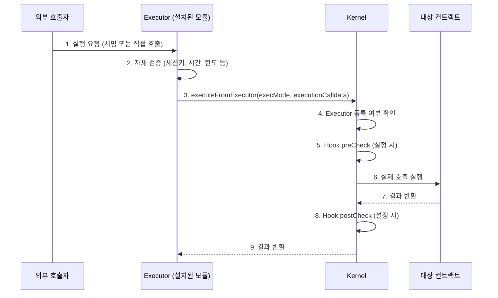

### executeFromExecutor 구현 (Kernel.sol)

```solidity
function executeFromExecutor(
    ExecMode execMode,
    bytes calldata executionCalldata
) external payable returns (bytes[] memory returnData) {
    // 1. Executor 등록 확인
    if (!_isExecutorInstalled(msg.sender)) {
        revert InvalidExecutor();
    }

    // 2. Hook preCheck
    IHook hook = _getExecutorHook(msg.sender);
    bytes memory hookRet;
    if (address(hook) != HOOK_MODULE_NOT_INSTALLED) {
        hookRet = hook.preCheck(msg.sender, msg.value, msg.data);
    }

    // 3. 실행
    returnData = ExecLib._execute(execMode, executionCalldata);

    // 4. Hook postCheck
    if (hookRet.length > 0) {
        hook.postCheck(hookRet);
    }
}
```

## 8.4 SessionKeyExecutor 상세

### 세션 키 아키텍처

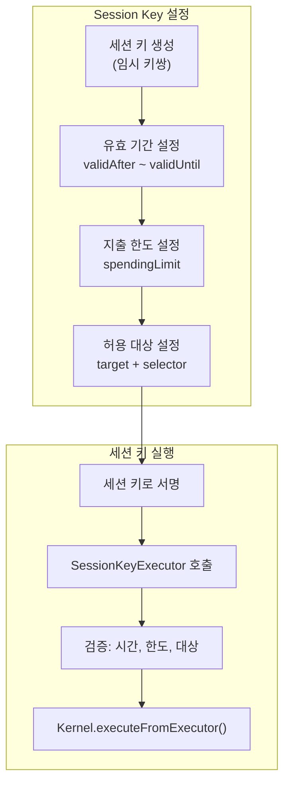

### Session Key 설정 구조

```solidity
struct SessionKeyConfig {
    address sessionKey;       // 세션 키 주소
    uint48 validAfter;        // 세션 시작 시간
    uint48 validUntil;        // 세션 만료 시간
    uint256 spendingLimit;    // 총 지출 한도 (wei)
    uint256 spentAmount;      // 현재까지 사용 금액
    uint256 nonce;            // 재생 방지 nonce
    bool isActive;            // 활성화 상태
}

struct Permission {
    address target;           // 호출 가능 컨트랙트
    bytes4 selector;          // 허용 함수 selector
    uint256 maxValue;         // 건당 최대 금액 (0=무제한)
    bool allowed;             // 허용 여부
}
```

### 실행 방법 비교

| 방법 | 함수 | 호출자 | 검증 방식 |
|---|---|---|---|
| 서명 기반 | `executeOnBehalf()` | 누구나 | 세션 키 서명 검증 |
| 직접 호출 | `executeAsSessionKey()` | 세션 키 소유자 | msg.sender == sessionKey |

### 세션 키 생명주기

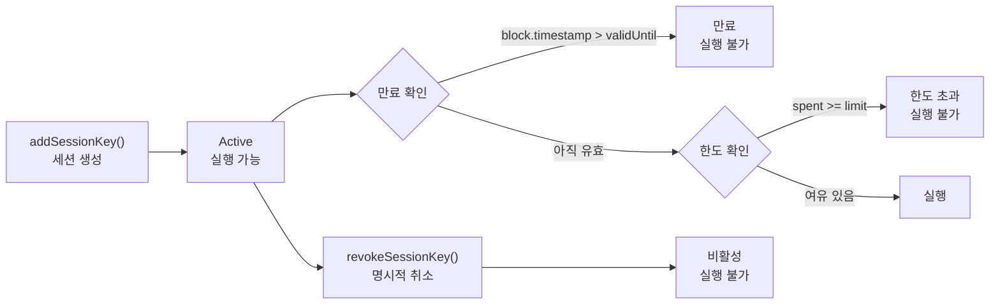

## 8.5 Permission 기반 세분화 위임

### Permission = Signer + Policy 조합

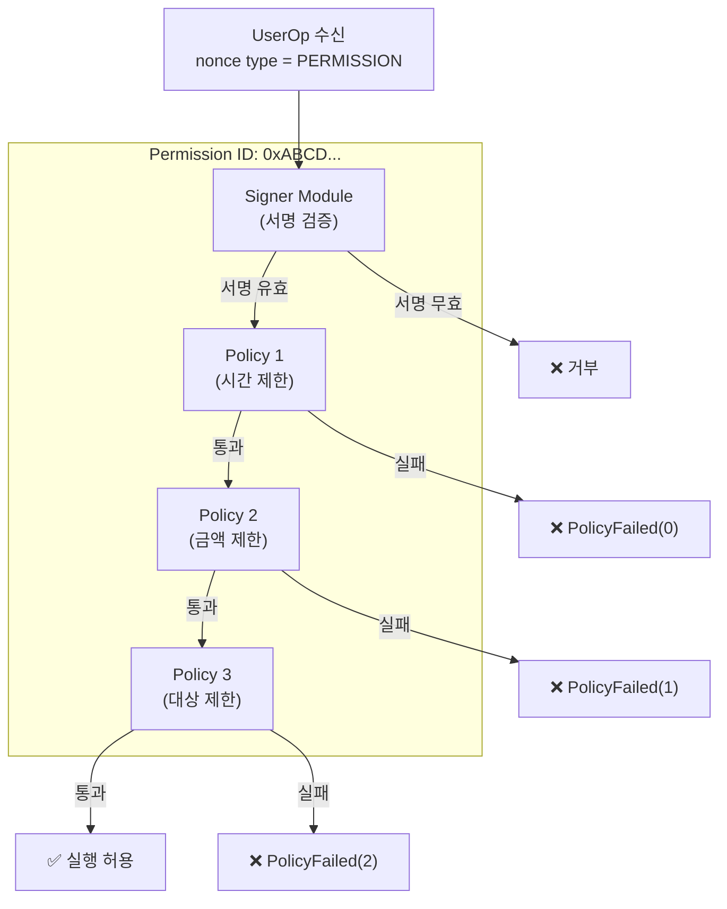

### Permission 설치 과정

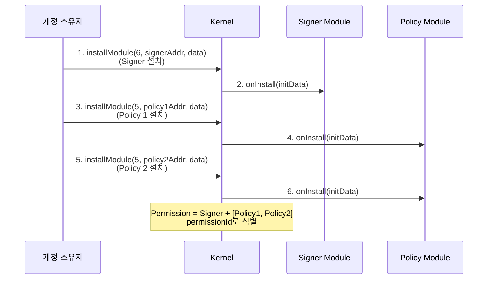

### PassFlag 제어

```solidity
// Permission 검증 시 skip 플래그
PassFlag constant SKIP_USEROP = PassFlag.wrap(0x0001);
// → UserOp 정책 검사 생략 (서명 정책만 적용)

PassFlag constant SKIP_SIGNATURE = PassFlag.wrap(0x0002);
// → 서명 정책 검사 생략 (UserOp 정책만 적용)
```

## 8.6 대리 키 인증 (Alternative Key Authorization)

### 대리 키의 개념

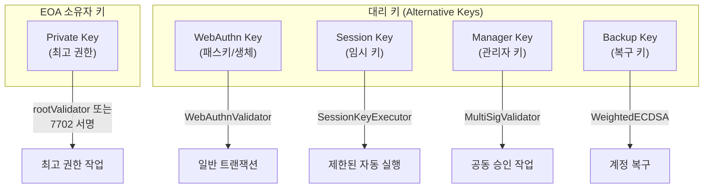

### 키 유형별 설정

| 키 유형 | 모듈 | 권한 범위 | 유효 기간 |
|---|---|---|---|
| EOA Private Key | 7702 직접 / ECDSA Root | 무제한 | 영구 |
| WebAuthn Key | WebAuthnValidator | 설정된 selector | 영구 (패스키 수명) |
| Session Key | SessionKeyExecutor | 특정 target+selector | 제한 (시간+한도) |
| Guardian Key | WeightedECDSAValidator | 복구/변경 | 영구 (가중치 제한) |
| Sub-account Key | Permission (Signer+Policy) | Policy에 의해 제한 | Policy 규칙에 따름 |

### WebAuthn 대리 키 설정

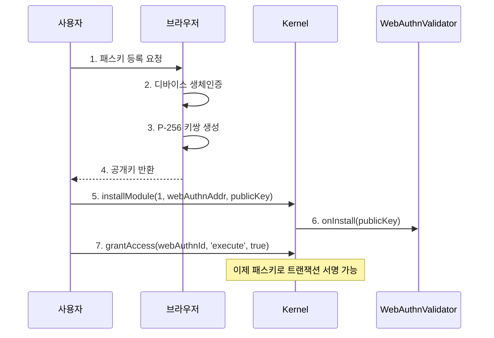

### Guardian 기반 계정 복구

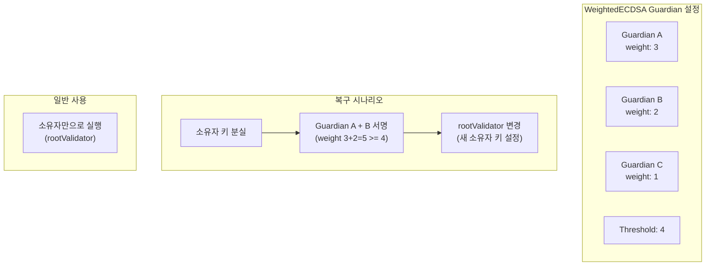

### 복구 흐름 상세

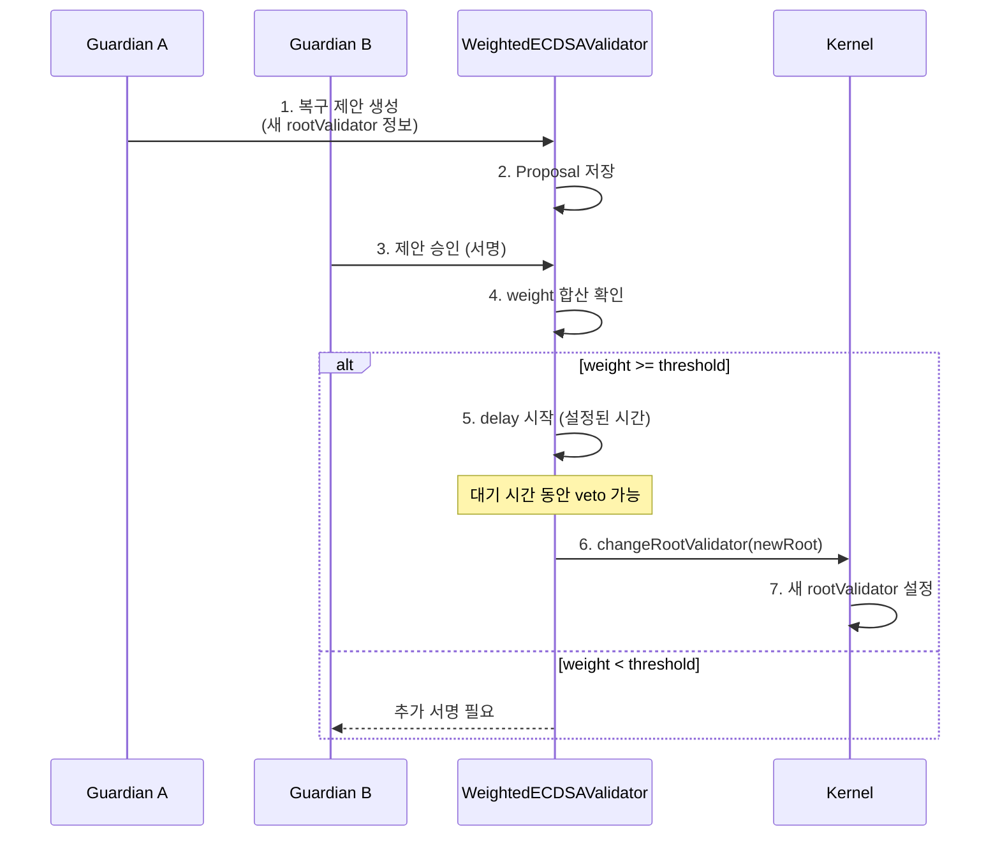

## 8.7 EIP-7702 + Validator 위임 조합

### 이중 서명 체계

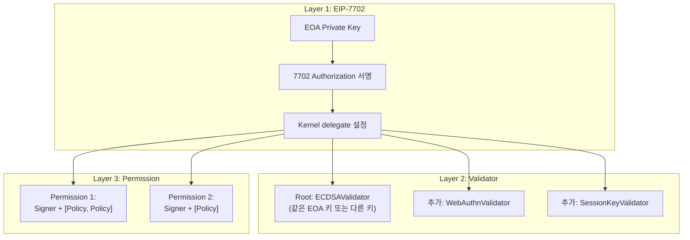

### 키 분리 전략

| 전략 | EOA 키 용도 | Root Validator 키 | 장점 |
|---|---|---|---|
| 동일 키 | 7702 + Root | EOA 키 = Root | 단순, 호환성 |
| 분리 | 7702만 | 별도 키 (콜드월렛) | 보안 강화 |
| Guardian | 7702만 | MultiSig/Weighted | 최고 보안, 복구 가능 |

## 8.8 실전 위임 시나리오

### 시나리오: 게임 dApp 자동실행

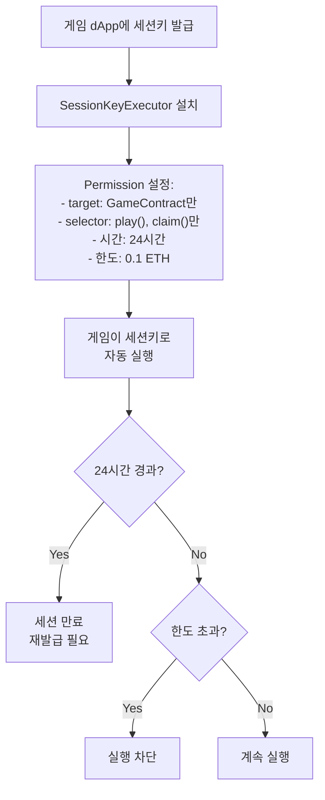

### 시나리오: 기업 급여 자동 지급

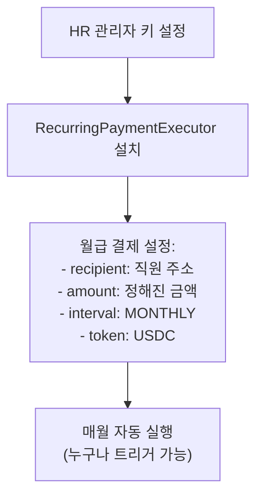

## 8.9 비즈니스 자동화 시나리오

### 이커머스 결제 자동화

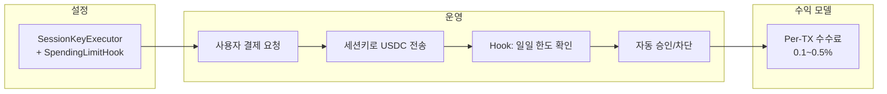

| 구성 요소 | 모듈 | 파라미터 |
|---|---|---|
| 결제 키 | SessionKeyExecutor | target: 결제 컨트랙트, validUntil: 구매 세션 |
| 지출 한도 | SpendingLimitHook | USDC 일일 1,000, 건당 500 |
| 감사 로그 | AuditHook | 모든 결제 기록 온체인 |
| **수익**: per-tx 수수료 (0.1~0.5%) 또는 월정액 SaaS | | |

### DeFi 자동 리밸런싱

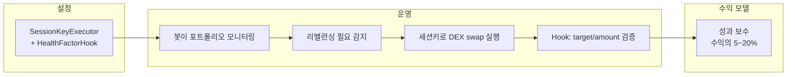

| 구성 요소 | 모듈 | 파라미터 |
|---|---|---|
| 자동화 키 | SessionKeyExecutor | targets: [Uniswap, Aave], validUntil: 30일 |
| 건전성 확인 | HealthFactorHook | minHealthFactor: 1.5 (청산 방지) |
| 지출 한도 | SpendingLimitHook | 일일 포트폴리오 10% 이내 |
| **수익**: 성과 보수 (수익의 5~20%) 또는 per-rebalance 수수료 | | |

### 기업 급여 + 감사 시스템

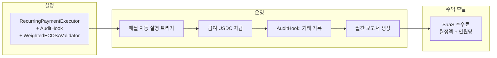

| 구성 요소 | 모듈 | 파라미터 |
|---|---|---|
| 급여 자동화 | RecurringPaymentExecutor | recipients: 직원 목록, interval: MONTHLY |
| 다중 승인 | WeightedECDSAValidator | CFO(60) + HR(40), threshold: 80 |
| 감사 추적 | AuditHook | 모든 급여 지급 이벤트 기록 |
| 지출 통제 | SpendingLimitHook | 월 급여 총액 한도 |
| **수익**: SaaS 구독 (월정액 + 인원당 과금) | | |

---

## 8.10 세션 키 서비스 설계 패턴

### 패턴 1: Time-boxed (게임/소셜)

```
┌─────────────────────────────────────────┐
│ Time-boxed Session Key                  │
├─────────────┬───────────────────────────┤
│ 유효 기간    │ 1~24시간                   │
│ 대상 제한    │ 특정 게임 컨트랙트           │
│ 가치 제한    │ 매우 낮음 (0.01 ETH)        │
│ 모듈 조합    │ SessionKey + PolicyHook     │
│ 적합 서비스  │ 게임, 소셜 dApp             │
│ 가스 비용    │ 설치 ~200K gas              │
│ 보안 수준    │ 중 (시간 제한이 핵심)         │
└─────────────┴───────────────────────────┘
```

### 패턴 2: Budget-controlled (DeFi)

```
┌─────────────────────────────────────────┐
│ Budget-controlled Session Key           │
├─────────────┬───────────────────────────┤
│ 유효 기간    │ 7~30일                     │
│ 대상 제한    │ 승인된 DEX/Lending 프로토콜   │
│ 가치 제한    │ 일일/주간 예산 기반           │
│ 모듈 조합    │ SessionKey + SpendingLimit  │
│              │ + HealthFactorHook         │
│ 적합 서비스  │ DeFi 자동화, 봇              │
│ 가스 비용    │ 설치 ~350K gas              │
│ 보안 수준    │ 높음 (예산 + 건전성 체크)      │
└─────────────┴───────────────────────────┘
```

### 패턴 3: Approval-gated (기업)

```
┌─────────────────────────────────────────┐
│ Approval-gated Session Key              │
├─────────────┬───────────────────────────┤
│ 유효 기간    │ 무기한 (권한으로 관리)        │
│ 대상 제한    │ 내부 컨트랙트 + 승인 목록     │
│ 가치 제한    │ 다중 서명 승인 필요           │
│ 모듈 조합    │ WeightedECDSA + SessionKey  │
│              │ + AuditHook + SpendingLimit │
│ 적합 서비스  │ 기업 재무, DAO               │
│ 가스 비용    │ 설치 ~500K gas              │
│ 보안 수준    │ 최고 (다중 서명 + 감사)        │
└─────────────┴───────────────────────────┘
```

### 패턴 비교 요약

| 항목 | Time-boxed | Budget-controlled | Approval-gated |
|---|---|---|---|
| 대상 | 게임/소셜 | DeFi | 기업/DAO |
| 유효 기간 | 시간 단위 | 일/주 단위 | 무기한 |
| 핵심 제한 | 시간 | 예산 | 승인 |
| 모듈 수 | 2개 | 3개 | 4개 |
| 설치 가스 | ~200K | ~350K | ~500K |
| 수익 모델 | 무료/광고 | 성과 보수 | SaaS |

---

> **핵심 메시지**: ERC-7579의 Validator와 Executor 조합으로 "누가(Signer), 무엇을(Policy), 어떻게(Executor)" 실행할 수 있는지 세밀하게 제어합니다. EOA 키는 최고 권한으로 보존하면서, 대리 키로 일상 운영을 자동화하세요.
