# 9. 기존 컨트랙트/인프라와의 호환성

## 9.1 호환성이 중요한 이유

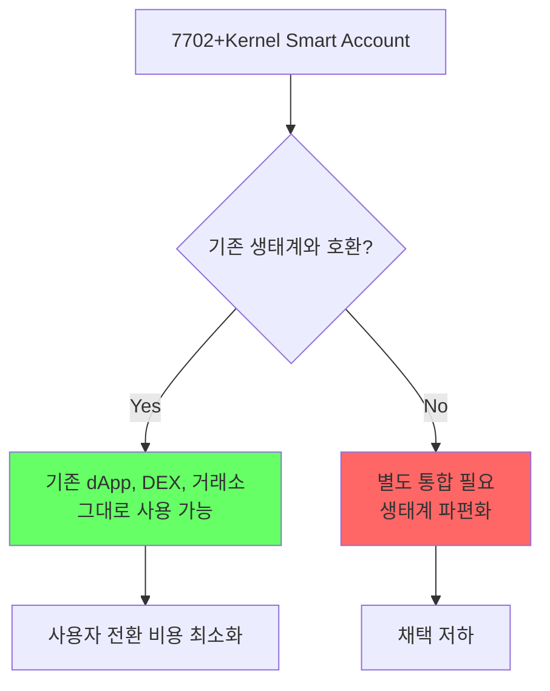

## 9.2 ERC-20/ERC-721/ERC-1155 호환성

### 토큰 수신

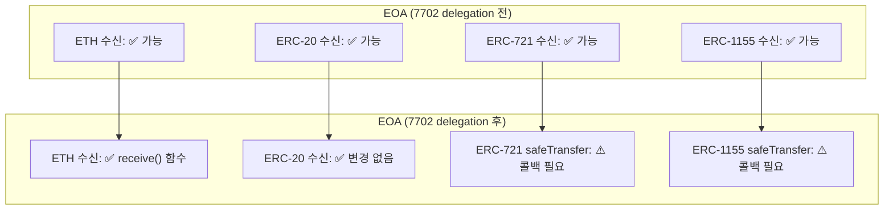

### safeTransfer 콜백 해결

ERC-721과 ERC-1155의 `safeTransferFrom`은 수신자가 콜백 함수를 구현해야 합니다:

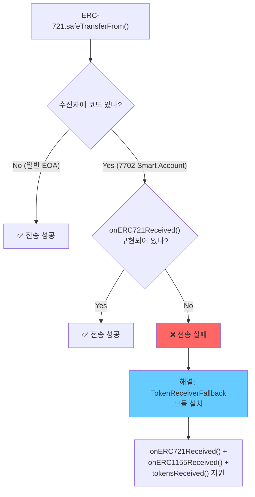

### TokenReceiverFallback 설치

```solidity
// Fallback 모듈 설치로 토큰 수신 콜백 지원
installModule(
    MODULE_TYPE_FALLBACK,        // Type 3
    tokenReceiverFallbackAddr,
    abi.encodePacked(
        // onERC721Received selector
        bytes4(0x150b7a02),
        address(0),              // hook 없음
        ""                       // initData
    )
)
```

### 토큰 전송 (발신)

| 작업 | 호환성 | 비고 |
|---|---|---|
| ERC-20 transfer | ✅ 완전 호환 | Kernel.execute() 통해 실행 |
| ERC-20 approve | ✅ 완전 호환 | 기존 approve 유지 |
| ERC-721 transferFrom | ✅ 완전 호환 | |
| ERC-1155 safeTransferFrom | ✅ 완전 호환 | |
| ETH transfer | ✅ 완전 호환 | |

## 9.3 기존 approve/allowance 유지

### 7702 전환 후 기존 승인

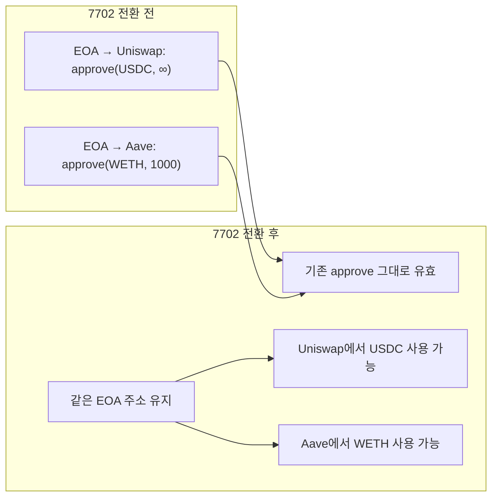

**핵심**: EIP-7702는 EOA의 **code만 변경**하고 **storage/balance/address를 유지**하므로, ERC-20 컨트랙트에 저장된 기존 allowance는 영향 없음.

## 9.4 DeFi 프로토콜 호환성

### 주요 DeFi 프로토콜 호환 매트릭스

| 프로토콜 | 호환성 | 주의사항 |
|---|---|---|
| Uniswap V2/V3 | ✅ 호환 | swap, LP 모두 정상 |
| Aave V3 | ✅ 호환 | FlashLoanFallback으로 콜백 지원 |
| Compound | ✅ 호환 | |
| Curve | ✅ 호환 | |
| Balancer | ✅ 호환 | FlashLoanFallback 필요 |
| 1inch | ✅ 호환 | |
| OpenSea | ⚠️ 조건부 | 서명 검증 방식 확인 필요 |

### DeFi 콜백 지원 (FlashLoanFallback)

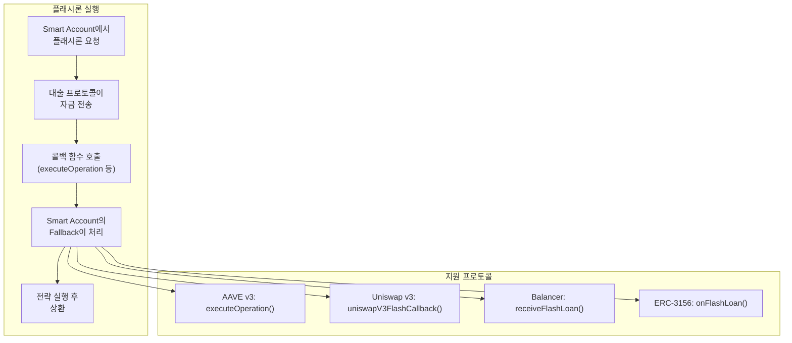

## 9.5 ERC-1271 서명 호환

### isValidSignature 지원

7702+Kernel은 ERC-1271을 지원하여 컨트랙트 서명 검증이 가능:

```solidity
// Kernel 내부 구현
function isValidSignature(
    bytes32 hash,
    bytes calldata signature
) external view returns (bytes4) {
    // Root Validator의 isValidSignatureWithSender() 호출
    // 성공 시: 0x1626ba7e (ERC1271_MAGICVALUE)
    // 실패 시: 0xffffffff (ERC1271_INVALID)
}
```

### ERC-1271 호환 서비스

| 서비스 | ERC-1271 사용 | 호환성 |
|---|---|---|
| OpenSea (오프체인 오더) | ✅ | 서명 검증 통과 |
| Gnosis Safe (메시지 서명) | ✅ | 호환 |
| Permit2 (승인 서명) | ✅ | 호환 |
| EIP-712 서명 | ✅ | Kernel이 EIP-712 지원 |

## 9.6 거래소 호환성

### 입출금 호환

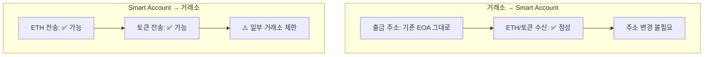

### 거래소 제한 사항

| 항목 | 상세 | 대응 |
|---|---|---|
| 코드 체크 | 일부 거래소가 `extcodesize > 0`이면 거부 | 7702 해제 후 출금 |
| 입금 확인 | 일부 거래소가 내부 트랜잭션 미감지 | 직접 transfer 사용 |
| 출금 주소 | 기존 EOA 주소 유지 | 문제 없음 |

## 9.7 msg.sender vs tx.origin

### 7702 Smart Account에서의 차이

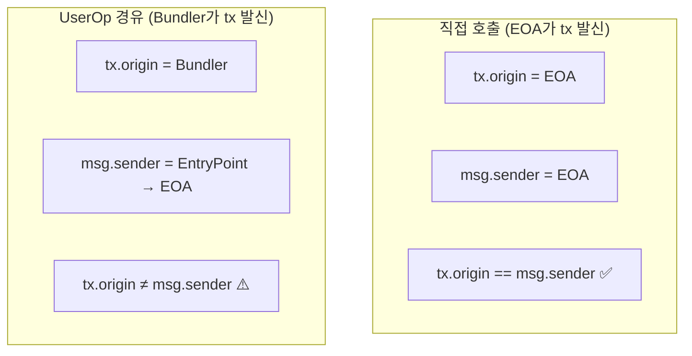

### tx.origin 체크 컨트랙트와의 호환

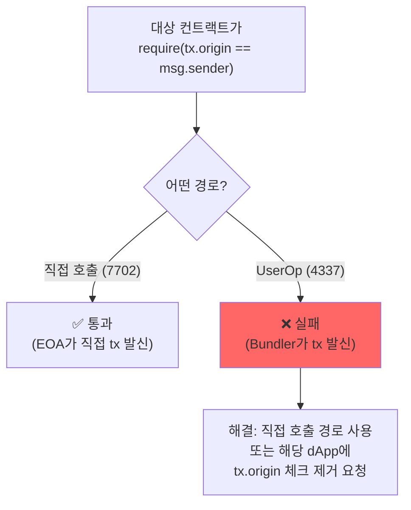

## 9.8 Delegate 변경 시 호환성

### Storage Layout 호환

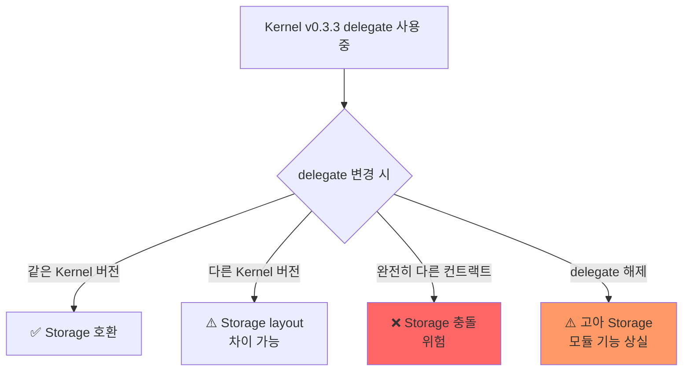

### Kernel Storage Slot 설계

Kernel은 고정된 keccak256 기반 storage slot을 사용하여 충돌을 최소화:

```solidity
// 고정 slot - 다른 컨트랙트와 충돌 가능성 낮음
bytes32 constant VALIDATION_MANAGER_STORAGE_SLOT =
    0x7bca...;  // keccak256('kernel.v3.validation') - 1
bytes32 constant EXECUTOR_MANAGER_STORAGE_SLOT =
    0x1bbe...;  // keccak256('kernel.v3.executor') - 1
bytes32 constant HOOK_MANAGER_STORAGE_SLOT =
    0x4605...;  // keccak256('kernel.v3.hook') - 1
bytes32 constant SELECTOR_MANAGER_STORAGE_SLOT =
    0x7c34...;  // keccak256('kernel.v3.selector') - 1
```

## 9.9 ENS, 에어드롭, 화이트리스트 호환

### 주소 기반 서비스

| 서비스 | 호환성 | 이유 |
|---|---|---|
| ENS (이름 서비스) | ✅ 완전 호환 | 주소 변경 없음 |
| 에어드롭 | ✅ 완전 호환 | 같은 주소로 수신 |
| 화이트리스트 | ✅ 완전 호환 | 주소 기반 확인 |
| 소울바운드 토큰 (SBT) | ✅ 완전 호환 | 주소에 바인딩 |
| DAO 투표권 | ✅ 완전 호환 | 주소/토큰 기반 |
| 스냅샷 투표 | ✅ 완전 호환 | ERC-1271 서명 지원 |

## 9.10 크로스체인 호환

### 멀티체인 사용

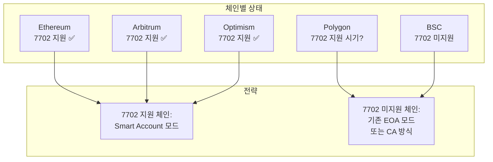

### 크로스체인 일관성

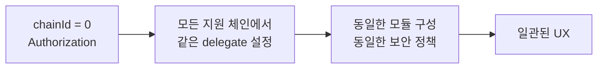

## 9.11 호환성 체크리스트

### 7702 전환 전 확인사항

| 항목 | 확인 방법 | 위험도 |
|---|---|---|
| 기존 approve 유지 | ERC-20 allowance 조회 | 낮음 (자동 유지) |
| NFT 수신 가능 | TokenReceiverFallback 설치 | **중간** |
| DeFi 콜백 | FlashLoanFallback 설치 | 중간 (사용 시) |
| 거래소 출금 | 주소 변경 없음 확인 | 낮음 |
| ENS/에어드롭 | 주소 유지 확인 | 낮음 |
| tx.origin 의존 dApp | 해당 dApp 목록 확인 | **중간** |
| 서명 검증 (ERC-1271) | 오프체인 서명 서비스 확인 | **중간** |

### 7702 해제 시 확인사항

| 항목 | 확인 방법 | 위험도 |
|---|---|---|
| 모듈 내 잠긴 자산 | 각 모듈 잔액 확인 | **높음** |
| 활성 세션키 | SessionKeyExecutor 상태 확인 | **높음** |
| 진행 중 정기결제 | RecurringPayment 상태 확인 | 중간 |
| 모듈 storage 정리 | uninstallModule 실행 | **높음** |
| pending UserOp | nonce 무효화 | 중간 |

## 9.12 기존 서비스 마이그레이션 전략

### 4단계 마이그레이션 프레임워크

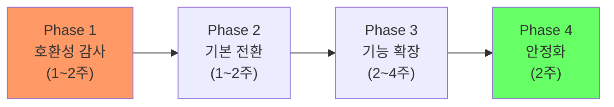

| Phase | 기간 | 작업 | 산출물 |
|---|---|---|---|
| **1. 호환성 감사** | 1~2주 | tx.origin 의존 확인, approve 현황 조회, DeFi 콜백 확인 | 호환성 보고서 |
| **2. 기본 전환** | 1~2주 | 7702 delegation 설정, rootValidator(ECDSA) 설치, TokenReceiverFallback 설치 | 기본 Smart Account |
| **3. 기능 확장** | 2~4주 | SessionKey, SpendingLimit, Paymaster 연동, 비즈니스 로직 모듈 설치 | 완전한 Smart Account |
| **4. 안정화** | 2주 | 모니터링, 에지 케이스 수정, 성능 최적화, 사용자 피드백 | 프로덕션 출시 |

### 각 Phase 상세

**Phase 1: 호환성 감사 체크리스트**

```
□ 기존 EOA의 모든 토큰 잔액 조회 (ERC-20, ERC-721, ERC-1155)
□ 기존 approve/allowance 현황 전수 조사
□ 사용 중인 DeFi 프로토콜 목록 + 콜백 요구사항 확인
□ tx.origin 체크 사용하는 컨트랙트 식별
□ 오프체인 서명 검증 서비스 (OpenSea 등) ERC-1271 지원 확인
□ 거래소 출금 주소 등록 현황 확인
```

**Phase 2: 기본 전환**

```
1. TokenReceiverFallback 설치 (NFT/ERC-1155 수신 가능)
2. 7702 Authorization 서명 + 전송
3. ECDSAValidator를 rootValidator로 설정
4. 기존 기능 동작 확인 (토큰 전송, DeFi 사용)
```

**Phase 3: 기능 확장 (비즈니스 요구에 따라 선택)**

```
□ SpendingLimitHook: 일일/월간 지출 한도 설정
□ SessionKeyExecutor: dApp 자동화 활성화
□ AuditHook: 거래 감사 로그 활성화
□ Paymaster 연동: 가스 대납 활성화
□ WebAuthnValidator: 생체인증 대리키 추가 (선택)
```

---

## 9.13 거래소 통합 가이드

### CEX (중앙 거래소) 통합

| 항목 | 7702 영향 | 대응 방법 |
|---|---|---|
| 출금 주소 | **변경 없음** - 동일 EOA 주소 | 별도 조치 불필요 |
| 입금 확인 | **호환** - ETH/ERC-20 수신 정상 | TokenReceiverFallback 권장 |
| code 체크 | **주의** - 일부 거래소가 CA 출금 차단 | 거래소별 확인 필요 |
| 서명 검증 | **호환** - ECDSA 서명 유지 | rootValidator가 ECDSA면 호환 |

### DEX (분산 거래소) 통합

| 프로토콜 | 호환성 | 필요 조치 |
|---|---|---|
| Uniswap V2/V3 | **완전 호환** | 없음 (approve 유지) |
| Aave V3 | **호환** | FlashLoanFallback 설치 (flash loan 시) |
| Compound V3 | **호환** | 없음 |
| Curve | **호환** | 없음 |
| 1inch | **호환** | 없음 (approve 유지) |

### Bridge 통합

| 브릿지 | 호환성 | 주의사항 |
|---|---|---|
| 네이티브 브릿지 | **호환** | EOA 주소 유지 |
| LayerZero | **호환** | 수신 체인에서도 7702 필요 시 별도 설정 |
| Wormhole | **호환** | 멀티체인 주소 일관성 유지 |
| 주의사항 | | `chainId=0` Authorization 시 양쪽 체인 동시 delegation 가능 |

### 통합 시 공통 주의사항

1. **code 길이 체크**: 일부 서비스가 `code.length > 0`으로 CA를 감지 → 7702 EOA도 감지됨
2. **ERC-1271 지원**: 오프체인 서명 검증이 필요한 서비스는 ERC-1271 `isValidSignature()` 지원 필요
3. **tx.origin 체크**: UserOp 경로(EntryPoint → EOA)에서는 `tx.origin ≠ msg.sender` → 해당 체크가 있는 컨트랙트는 직접 호출 사용

---

> **핵심 메시지**: EIP-7702는 EOA 주소를 유지하므로 대부분의 기존 생태계와 자연스럽게 호환됩니다. 핵심 주의점은 (1) 토큰 수신 콜백을 위한 Fallback 설치, (2) tx.origin 체크 컨트랙트 확인, (3) delegate 변경/해제 시 자산 안전입니다.
