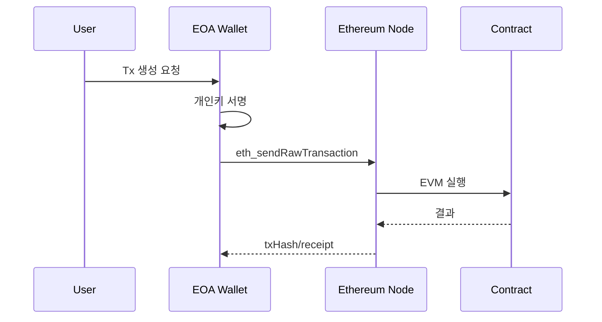

# 01. EVM 계정 모델과 EOA 한계 (상세판)

## 1) 시작 문장 (세미나 오프닝용)

Ethereum에서 네이티브 트랜잭션을 만들고 네트워크에 요청하는 주체는 EOA다. 문제는 EOA 자체가 코드를 가질 수 없다는 점이다. 이 제약 때문에 제품에서 필요한 정책 실행, 자동화, 위임, 가스 대납 같은 기능은 별도 구조가 필요해진다.

## 2) EVM 계정 모델 핵심

- EOA
- 특징: private key로 서명, 코드 없음
- 장점: 단순함, 네이티브 호환성
- 한계: 정책 실행/모듈 확장/자동화에 취약

- Contract Account (CA)
- 특징: 코드 보유, 로직 실행 가능
- 장점: 확장성, 정책화, 복합 실행
- 한계: 기본 상태에서는 "Tx 직접 발신 주체"가 아님

## 3) 왜 EOA만으로는 제품 개발이 어려운가

주요 제품 요구와 EOA 한계 매핑:

- 배치 실행: 여러 호출을 원자적으로 묶고 싶다 -> EOA 단일 Tx 모델만으로 복잡
- 권한 분리: 결제 권한/스왑 권한/세션키 분리 -> EOA 키 단일 권한 모델
- 조건부 실행: 시간/금액/상태 기반 정책 -> EOA는 서명만 제공
- 가스 UX: 사용자가 native token 없이도 사용 -> EOA는 가스 납부 책임 고정
- 복구/운영: 위험 모듈 제거, 권한 회수, 로그 감사 -> EOA만으로 구조화 어려움

## 4) 네이티브 Tx 흐름과 한계

이 모델은 단순하지만, "계정 동작" 자체를 코드로 진화시키기 어렵다.

## 5) 해결 방향: Account Abstraction

핵심 발상:

- User가 서명하는 메시지(UserOperation)를 Tx 요청처럼 다룬다.
- 검증/실행/수수료를 EntryPoint + Account + Paymaster로 코드화한다.
- Bundler가 UserOp를 모아 온체인으로 제출한다.

즉, Tx 프로토콜 외부(계약 레벨)에서 Tx 의미론을 재구성한다.

## 6) 왜 4337 + 7702 + 7579 조합인가

- 4337: UserOp 파이프라인(검증/실행/정산) 표준
- 7702: EOA를 버리지 않고 위임을 통해 코드 경로 확보
- 7579: Account 내부 모듈 확장 규격(Validator/Executor/Hook/Fallback)

이 조합은 "기존 EOA UX"와 "스마트 계정 확장성"을 동시에 가져간다.

## 7) 발표에서 강조할 오해 방지 포인트

- 7702는 EOA 제거가 아니라 EOA 확장 경로다.
- 4337은 프로토콜 하드포크가 아니라 계약 기반 스킴이다.
- 7579는 4337 대체가 아니라 Account 내부 확장 규격이다.

## 8) 구현 체크리스트

- EOA nonce와 UserOp nonce를 혼동하지 않는다.
- 지갑 레이어와 DApp 레이어의 파라미터 책임을 분리한다.
- "누가 서명하는가"와 "누가 전송하는가"를 분리 설계한다.
- 실패 시 재시도 지점을 레이어별로 정의한다.

## 9) 코드 근거

- `stable-platform/apps/wallet-extension/src/background/rpc/handler.ts`
- `stable-platform/apps/web/hooks/useSmartAccount.ts`
- `stable-platform/apps/web/hooks/useUserOp.ts`
