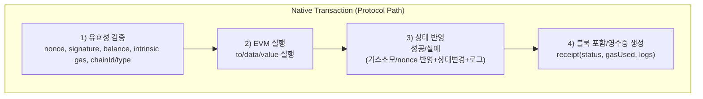

# 01. Ethereum 상태 머신과 계정 모델 한계

## 배경
Ethereum은 "트랜잭션 입력 -> 상태 전이 -> 상태 기록"으로 동작하는 상태 기반 상태 머신이다.

- 입력: tx
  - 필수 입력(실질적으로 항상 필요): `chainId`, `nonce`, `gasLimit`, `to`, `value`, `data`, `signature(v,r,s)`
  - 수수료 입력(타입별 필수): `gasPrice`(Legacy) 또는 `maxPriorityFeePerGas` + `maxFeePerGas`(EIP-1559 계열)
  - 확장 입력(타입별 필수): `accessList`(2930/1559/7702), blob 관련 필드(4844), `authorizationList`(7702)
  - 선택 입력(진짜 옵션): 해당 tx 타입에서 해석되지 않고 생략해도 실행 의미가 바뀌지 않는 필드만 해당
- 전이 함수: EVM 실행
- 출력: state root 변경, 로그, 영수증

기본 계정 타입:
- EOA: 개인키 기반 서명 계정
- CA: 코드 기반 계정

### Tx 처리 구조

## 문제
EOA 중심 모델의 구조적 한계:
- 단일 서명 규칙: 멀티시그/소셜복구/세션키를 네이티브로 표현하기 어렵다.
- 가스 결제 고정: ETH(Native Coin) 없는 사용자는 시작 자체가 어렵다.
- 자동화 부재: 조건부/반복 실행 로직을 계정 레벨에서 갖기 어렵다. (EOA는 Code 사용 불가(legacy) -> contract에서 eoa 계정 구분을 code 섹션의 값이 0 인지 아닌지로 판별)
- 정책 부재: 지출 한도, dApp allowlist 같은 권한 정책을 네이티브로 강제하기 어렵다.

## 해결 방향
핵심 아이디어는 "트랜잭션 처리 로직을 프로토콜 tx 형식 밖으로 추상화"하는 것이다.

- 검증/실행/정산 로직을 컨트랙트 계층으로 올린다.
- 계정을 단순 주소가 아니라 정책(1일 출금한도, 특정 컨트랙트만 호출 허용등)을 강제할 수 있는 실행 주체로 본다.
- 이 방향에서 4337(처리 경로), 7702(EOA 전환), 7579(모듈 구조)가 등장한다.
