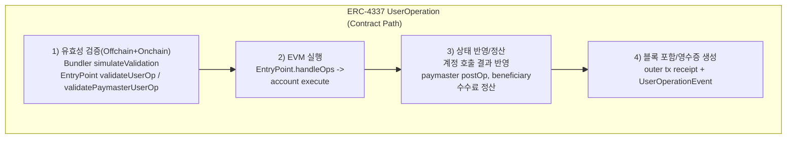

# 02. ERC-4337 (Account Abstraction)

## 배경

네이티브 계정 추상화(프로토콜 변경)는 도입 난이도와 생태계 전환 비용이 크다.
실용적인 대안으로 "프로토콜 변경 없이" 동작하는 상위 레이어 AA가 필요했다.

## 문제

- 기존 tx 형식은 고급 검증 정책을 담기 어렵다.
- 사용자 경험 개선(가스 대납, 배치, 자동화)에 필요한 운영 컴포넌트가 표준화돼 있지 않았다.
- 지갑/인프라/서비스 간 상호운용 기준이 부족했다.

## 해결

ERC-4337은 다음 구조로 문제를 해결한다.

- `UserOperation`: tx 대신 의도 중심 실행 단위
- `EntryPoint`: 검증/실행/정산의 표준 **온체인 진입점**
- `Bundler`: 오프체인 수집/시뮬레이션/번들링
- `Paymaster`: 가스 대납 정책

처리 요약:

1. 사용자 서명 기반 UserOperation 생성
2. Bundler가 `simulateValidation` 수행
3. EntryPoint `handleOps`로 검증/실행/정산

### Native Tx 흐름 vs ERC-4337 UserOp 흐름

### 단계별 모듈/컨트랙트 매핑

| 단계           | Native tx (프로토콜)           | ERC-4337 UserOp (컨트랙트/인프라)                                                    |
| -------------- | ------------------------------ | ------------------------------------------------------------------------------------ |
| 유효성 검증    | Execution client tx validation | Bundler, EntryPoint, Account(`validateUserOp`), Paymaster(`validatePaymasterUserOp`) |
| EVM 실행       | EVM call/create                | EntryPoint(`handleOps`), Smart Account(`execute`), 대상 컨트랙트                     |
| 상태 반영/정산 | state trie 갱신, gas 차감      | EntryPoint 가스 회계, deposit/paymaster 정산, 이벤트 기록                            |
| 완료(블록)     | tx receipt + block inclusion   | outer tx receipt + `UserOperationEvent` 기반 UserOp 결과 추적                        |

## 왜 이렇게 쓰는가

- 4337은 "계정 내부 구조"가 아니라 "실행 파이프라인 표준"이다.
- 따라서 계정 구현(예: 7579 모듈형)과 독립적으로 결합 가능하다.

## 개발자 포인트

- 핵심 실패 지점은 `nonce`, `gas packing`, `validationData`, `paymasterAndData`다.
- 구현은 반드시 "시뮬레이션 성공 -> 실제 번들 제출" 경로로 검증해야 한다.

참조:

- `docs/claude/spec/EIP-4337_스펙표준_정리.md`

---
