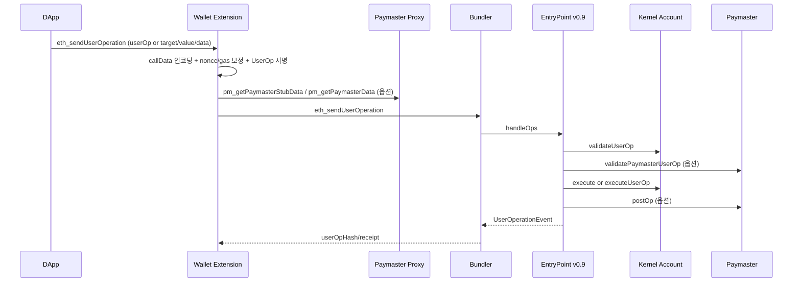

# 02. ERC-4337 철학, Actor, 처리 흐름 (상세판)

## 1) 철학: "UserOp를 Tx처럼 다루는 계약-레벨 실행 스킴"

ERC-4337의 핵심은 다음 한 문장으로 정리된다.

- 사용자는 UserOperation 메시지를 만들고,
- 실제 온체인 Tx 제출은 Bundler가 담당하며,
- 검증/실행/정산은 EntryPoint + Account + Paymaster 컨트랙트가 처리한다.

즉, 네이티브 Tx 한계를 계약 계층에서 우회해 "계정 동작을 코드화"한다.

## 2) Actor와 책임

- User/Wallet
- UserOp 생성, 서명, 승인 UX

- DApp
- 비즈니스 의도(전송/스왑/모듈설치)를 callData로 표현

- Bundler
- `eth_sendUserOperation` 수신, 검증, 번들 제출

- EntryPoint (v0.9)
- validate + execute + postOp + 정산

- Smart Account (Kernel)
- `validateUserOp`, `execute/executeUserOp`, 모듈 라우팅

- Paymaster
- 가스 후원 정책 검증, postOp 정산

## 3) 고수준 처리 흐름

## 4) 이 프로젝트 기준 실제 파라미터 주입 지점

### 4.1 Wallet Extension `eth_sendUserOperation`

코드: `stable-platform/apps/wallet-extension/src/background/rpc/handler.ts`

핵심 동작:

- `target/value/data`가 들어오면 `callData`로 변환
- 변환 함수: `encodeKernelExecute(to, value, data)`
- `nonce == 0`이면 EntryPoint `getNonce(sender, 0)` 조회
- 수수료 필드가 비어 있으면 RPC + Bundler 추정으로 채움
- `gasPayment` 타입이 sponsor/erc20이면 Paymaster Proxy 2단계 호출
- `getUserOperationHash(userOp, entryPoint, chainId)`로 해시 후 서명
- Bundler RPC에 제출

### 4.2 UserOperation 필드별 책임

- `sender`
- DApp/Wallet이 명시

- `nonce`
- Wallet이 EntryPoint에서 authoritative 조회

- `callData`
- DApp intent를 Kernel `execute(bytes32,bytes)` 포맷으로 인코딩

- `callGasLimit`, `verificationGasLimit`, `preVerificationGas`
- 우선 Bundler 추정값 사용, 실패 시 안전 기본값 fallback

- `maxFeePerGas`, `maxPriorityFeePerGas`
- 네트워크 fee 추정 기반

- `paymaster*`
- Paymaster Proxy 응답으로 주입

- `signature`
- UserOpHash 서명 결과

## 5) Bundler 서버 기준 동작

코드: `stable-platform/services/bundler/src/rpc/server.ts`

- `eth_sendUserOperation`
- packed UserOp 언팩 -> validator 검증 -> mempool 저장

- `eth_estimateUserOperationGas`
- packed UserOp 언팩 -> gas estimator 결과 반환

- `eth_getUserOperationByHash`, `eth_getUserOperationReceipt`
- 메모리 mempool 우선
- 없으면 EntryPoint `UserOperationEvent` 로그 fallback 조회

## 6) EntryPoint v0.9 핵심 포인트

코드: `poc-contract/src/erc4337-entrypoint/EntryPoint.sol`

- `getUserOpHash`는 EIP-712 typed hash 기반
- `handleOps`에서 validate -> execute -> postOp 순으로 처리
- 7702 initCode 경로(`0x7702` marker) 지원
- paymaster deposit/prefund/actualGasCost 정산 수행

## 7) 실무에서 자주 틀리는 지점

- EOA nonce와 UserOp nonce를 동일하게 취급
- `callData`를 단순 target calldata로 보내 Kernel 포맷 누락
- paymaster 호출에서 chainId 타입(정수/hex 문자열) 혼용
- `signature` 포맷(validator prefix 포함 여부) 불일치
- Bundler가 받는 packed 포맷과 앱 내부 unpacked 포맷 혼동

## 8) 세미나 전달 문장

- "4337의 본질은 UserOp를 Tx처럼 다루기 위한 실행 인프라를 계약 계층에 만든 것이다."
- "누가 보냈는가보다 중요한 것은, 어디서 어떤 필드를 만들고 검증하느냐다."

## 9) 코드 근거

- `stable-platform/apps/wallet-extension/src/background/rpc/handler.ts`
- `stable-platform/apps/wallet-extension/src/background/rpc/paymaster.ts`
- `stable-platform/services/bundler/src/rpc/server.ts`
- `poc-contract/src/erc4337-entrypoint/EntryPoint.sol`
