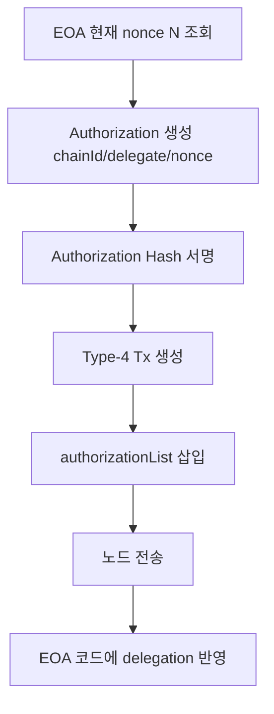

# 04. EIP-7702: Delegation과 Type-4 트랜잭션 (상세판)

## 1) EIP-7702의 역할

EIP-7702는 EOA를 폐기하지 않고, EOA 주소에 "위임 코드 실행" 경로를 부여한다. 즉 기존 EOA UX를 유지한 채 Smart Account 기능으로 진입하는 온보딩 수단이다.

## 2) 핵심 개념

- Authorization tuple
- `(chainId, delegateAddress, nonce)`

- Authorization hash
- `keccak256(0x05 || rlp([chainId, address, nonce]))`

- Type-4 Transaction
- `authorizationList`를 포함한 전송 트랜잭션

## 3) 이 프로젝트의 두 가지 위임 패턴

### 3.1 한 번에 처리: `wallet_delegateAccount`

코드: `stable-platform/apps/wallet-extension/src/background/rpc/handler.ts`

- 지갑이 Authorization 생성/서명 + Type-4 Tx 전송을 내부에서 원샷 처리
- `txNonce = N`, `authNonce = N+1` 규칙 적용
- 이유: authority와 tx sender가 동일한 self-executor 패턴

### 3.2 분리 처리: `wallet_signAuthorization` + relayer 전송

- 지갑은 Authorization만 서명
- relayer가 Type-4 Tx를 전송
- 이 경우 authority nonce 증분 시점이 다르므로 nonce 설계가 self 패턴과 다름

## 4) nonce 주의사항 (중요)

- EOA nonce
- 네이티브 Tx nonce

- Authorization nonce
- 7702 권한 검증용 nonce

- UserOp nonce
- EntryPoint 계정 nonce

세미나에서 반드시 분리 설명한다. 이 3개를 혼동하면 재현 불가능한 버그가 반복된다.

## 5) 메시지 포맷 다이어그램



## 6) 실무용 JSON-RPC 예시

### 6.1 Authorization 서명

```json
{
  "jsonrpc": "2.0",
  "id": 1,
  "method": "wallet_signAuthorization",
  "params": [
    {
      "account": "0xYourEOA",
      "contractAddress": "0xKernelImpl",
      "chainId": 8283
    }
  ]
}
```

### 6.2 위임 원샷

```json
{
  "jsonrpc": "2.0",
  "id": 2,
  "method": "wallet_delegateAccount",
  "params": [
    {
      "account": "0xYourEOA",
      "contractAddress": "0xKernelImpl",
      "chainId": 8283
    }
  ]
}
```

## 7) 4337과의 연결 포인트

- EntryPoint v0.9는 7702 initCode marker(`0x7702`) 경로를 인지한다.
- 코드: `poc-contract/src/erc4337-entrypoint/Eip7702Support.sol`
- 즉 7702는 "계정 온보딩", 4337은 "UserOp 실행 파이프라인"으로 역할 분리가 명확하다.

## 8) 실패 포인트

- authorization nonce 계산 오류
- `v/r/s` 정규화 오류(0/1 vs 27/28)
- relayer 체인/가스 설정 불일치
- 위임 후 코드 확인(`eth_getCode`) 생략

## 9) 구현 체크리스트

- 위임 전/후 `eth_getCode`를 비교 확인한다.
- 위임 대상(delegate)가 실제 Kernel 구현인지 검증한다.
- authority nonce 규칙을 self/relayer 패턴별로 분리 테스트한다.
- 위임 성공 후 Smart Account 정보(`rootValidator`, `accountId`)를 읽어 정합성 검증한다.

## 10) 코드 근거

- `stable-platform/apps/wallet-extension/src/background/rpc/handler.ts`
- `stable-platform/apps/web/hooks/useSmartAccount.ts`
- `stable-platform/packages/sdk-ts/core/src/eip7702/authorization.ts`
- `poc-contract/src/erc4337-entrypoint/Eip7702Support.sol`
