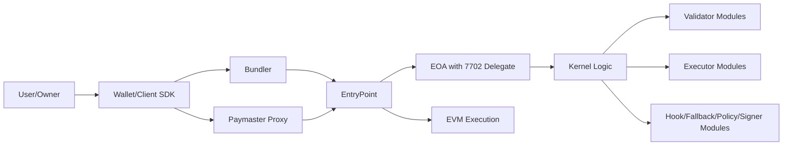
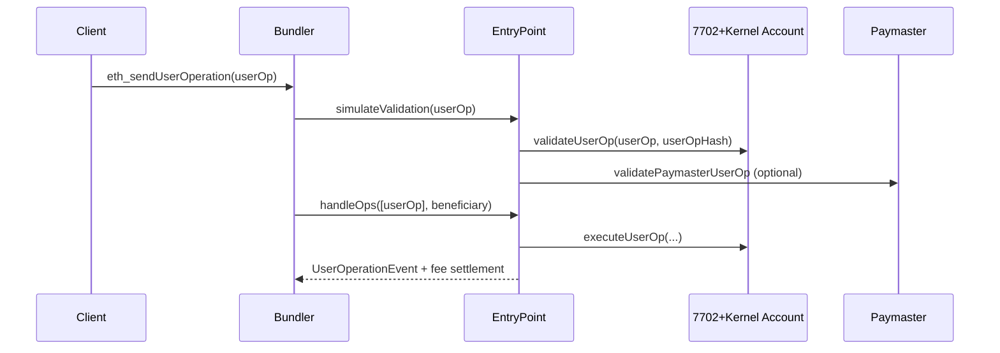

# EIP-7702 + ERC-4337 + ERC-7579 세미나 전체 그림

## 이 문서의 목적
이 PoC(`poc-contract/`, `stable-platform/`)를 기반으로, BD/개발자/CTO가 같은 그림으로 의사결정하도록 전체 구조를 한 번에 정리합니다.

## 1분 요약
- `EIP-7702`: 기존 EOA 주소를 유지한 채, delegate code를 붙여 스마트 계정처럼 동작하게 함
- `ERC-7579 Kernel`: 계정 기능을 Validator/Executor/Hook/Fallback/Policy/Signer 모듈로 확장
- `ERC-4337`: Bundler/EntryPoint/Paymaster로 UX(가스 대납, 배치, 자동화)와 운영성을 제공
- 결론: `7702(계정 전환) + 7579(기능 확장) + 4337(운영/비용/생태계)` 조합이 본 PoC의 핵심

## 전체 아키텍처

## 트랜잭션/유저오퍼레이션 핵심 필드
기준: `poc-contract/src/erc4337-entrypoint/interfaces/PackedUserOperation.sol`

| 필드 | 필수 | 설명 |
|---|---|---|
| `sender` | 필수 | 스마트 계정 주소(7702에서는 기존 EOA 주소) |
| `nonce` | 필수 | `uint192(key) || uint64(sequence)` |
| `initCode` | 조건부 | 신규 배포/7702 온보딩 시 필요 (`0x7702 + initPayload`) |
| `callData` | 필수 | 실행할 실제 액션 |
| `accountGasLimits` | 필수(패킹형) | `verificationGasLimit || callGasLimit` |
| `preVerificationGas` | 필수 | 번들러 검증/오버헤드 |
| `gasFees` | 필수(패킹형) | `maxPriorityFeePerGas || maxFeePerGas` |
| `paymasterAndData` | 옵션 | Paymaster 사용 시 설정 |
| `signature` | 필수 | 계정(validator)이 검증할 서명 |

## EVM 처리 절차(요약)

## 세미나 문서 맵
- `01-background-eip-7702-4337.md`
- `02-7702-kernel-7579-pros-cons.md`
- `03-how-to-use-7702-kernel-smart-account.md`
- `04-7702-7579-with-4337.md`
- `05-policy-control-contracts.md`
- `06-7579-module-catalog.md`
- `07-install-and-use-7579-modules.md`
- `08-delegation-validator-executor-and-alt-key.md`
- `09-compatibility-with-existing-contracts.md`

## 추천 추가 세션
- 위협모델/운영보안: 모듈 설치 권한, 업그레이드 권한, 서명키 분실 복구
- KPI/비즈니스 지표: CAC 절감(가스 대납), 전환율(서명 UX), LTV(자동화 기능)
- 거버넌스: 모듈 허용목록, Paymaster 정책 승인 프로세스
