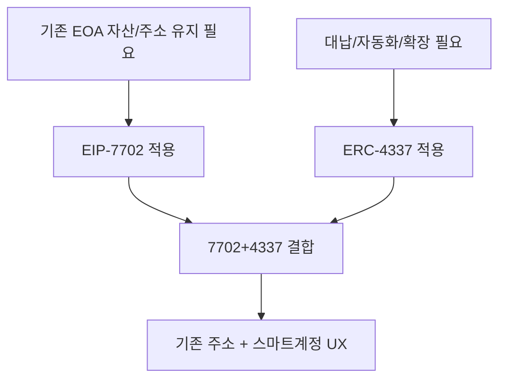
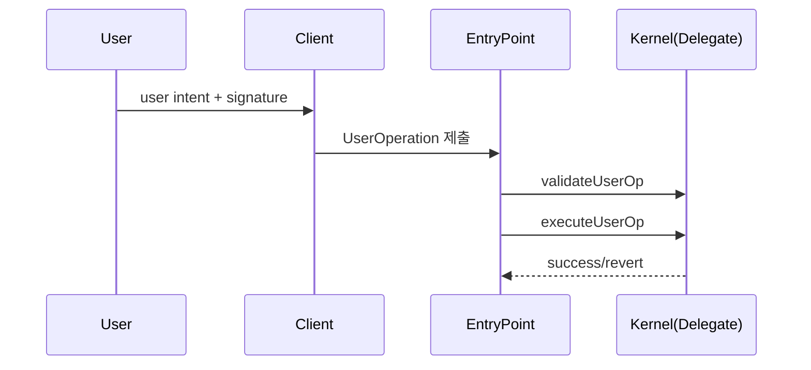

# 1) EIP-7702, ERC-4337 등장 배경과 핵심 설명

## 배경
- 기존 EOA는 단일 private key 중심이라 복구/권한분리/자동화가 약함
- 스마트 계정은 강력하지만, 새 주소 생성/마이그레이션 비용이 큼
- `ERC-4337`은 프로토콜 변경 없이 계정추상화를 제공
- `EIP-7702`는 기존 EOA 주소를 유지하며 스마트 계정 기능으로 전환하는 경로 제공

## 핵심 개념 비교
| 항목 | EIP-7702 | ERC-4337 |
|---|---|---|
| 목표 | EOA에 delegate code 설정 | UserOperation 기반 실행 체계 |
| 주소 | 기존 EOA 유지 | 보통 CA/AA 주소 사용 |
| 운영 컴포넌트 | delegate logic | Bundler, EntryPoint, Paymaster |
| 강점 | 주소 연속성, 전환 용이 | UX/수수료/정책 자동화 |

## 왜 둘을 같이 쓰는가

## 트랜잭션 필드 관점
- 7702 관점: `sender`는 기존 EOA, `initCode`는 `0x7702` marker 사용 가능
- 4337 관점: `nonce/callData/gas/signature`가 실행 단위
- paymaster 사용 시: `paymasterAndData`(또는 unpacked 3개 필드) 추가

## EVM 처리 절차

