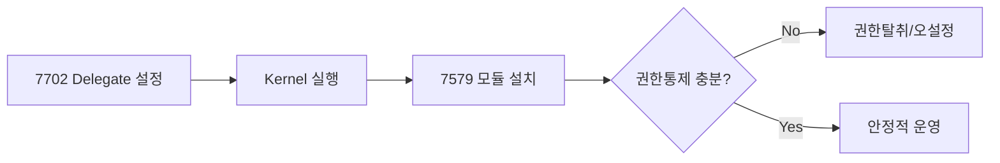

# 2) EIP-7702로 ERC-7579 Kernel Delegate 설정 시 장점/단점

## 장점
- 기존 EOA 주소 유지: 자산/NFT/허용목록 연속성 유지
- 모듈형 확장: Validator/Executor/Hook/Policy로 기능 확장
- 비용 절감 가능성: proxy hop 없이 직접 실행 경로

## 단점/주의점
- 체인 지원 의존: 7702 지원 체인에서만 동일 방식 가능
- delegate 코드 변경/해제 리스크: 운영정책 없으면 계정 동작 불안정
- 초기화/재초기화 제어 필수: 잘못 설계 시 계정 잠금 위험
- 모듈 설치 권한 오남용: 강력한 권한관리/감사로그 필요

## 리스크 맵

## 필수/옵션 설정
| 설정 | 필수 | 이유 |
|---|---|---|
| root validator | 필수 | 기본 서명검증 경로 |
| nonce 정책 | 필수 | replay/취소 제어 |
| module allowlist | 강력 권장 | 악성 모듈 차단 |
| paymaster policy | 옵션(상용은 사실상 필수) | 비용 통제 |
| executor 제한 | 권장 | 자동화 오남용 방지 |

## EVM 처리 포인트
- `validateUserOp`에서 validation type/selector 접근권한이 검사됨
- `executeUserOp`는 pre/post hook 경유 가능
- fallback/selector routing이 있어 ABI 호환 설계를 신중히 해야 함
