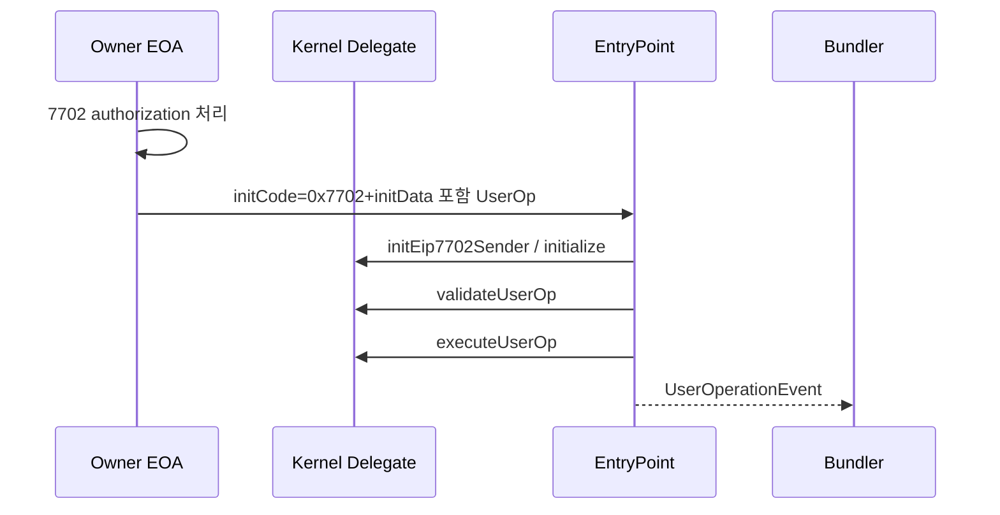

# 3) EIP-7702로 EOA를 CA처럼 바꾼 뒤 Smart Account 사용하는 방법

## 실무 순서
1. EOA에 7702 delegate(Kernel) 설정
2. `Kernel.initialize(...)`로 root validator/hook 초기화
3. 필요 모듈 설치(`installModule`, `installValidations`)
4. UserOperation 생성 후 Bundler 제출

## 온보딩 플로우

## UserOperation 필드 가이드
| 필드 | 필수 | 값 예시 |
|---|---|---|
| `sender` | 필수 | 7702 설정된 EOA |
| `nonce` | 필수 | `getNonce(sender,key)` 기반 |
| `initCode` | 조건부 | 초기화 시 `0x7702...` |
| `callData` | 필수 | `execute(...)` 또는 앱 호출 데이터 |
| `verificationGasLimit` | 필수 | validate 경로 충분히 크게 |
| `callGasLimit` | 필수 | 실행 경로 gas |
| `preVerificationGas` | 필수 | 번들 오버헤드 |
| `maxFeePerGas` | 필수 | EIP-1559 max fee |
| `maxPriorityFeePerGas` | 필수 | tip |
| `paymaster*` | 옵션 | sponsor 사용 시 |
| `signature` | 필수 | 선택 validator 포맷에 맞춘 서명 |

## EVM 처리 절차
- EntryPoint가 `getUserOpHash` 계산
- 계정에서 `validateUserOp` 실행 후 validationData 반환
- 통과하면 `executeUserOp` 수행
- revert면 이벤트/에러 코드로 원인 추적
