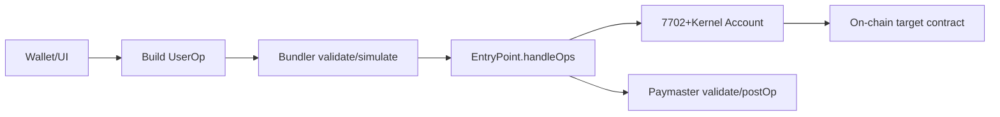

# 4) 7702+7579 계정을 4337과 융합하는 방식 (EntryPoint, Paymaster 등)

## 융합 포인트
- 계정 로직: `Kernel(7579)`
- 실행 오케스트레이션: `EntryPoint(4337)`
- 비용 추상화: `Paymaster`
- 운영 인프라: `Bundler`

## 처리 플로우

## 엔티티별 책임
- EntryPoint: nonce/validation/execution/정산
- Bundler: mempool 관리, 시뮬레이션, 번들 제출
- Paymaster: 정책 기반 대납 승인/거절
- Account(Kernel): 실제 권한검증/실행

## 필수/옵션 필드
| 필드/요소 | 필수 | 비고 |
|---|---|---|
| EntryPoint 주소 | 필수 | 클라이언트/번들러/페이마스터 공통 기준 |
| `paymasterAndData` | 옵션 | 대납 시 필수 |
| paymaster stake/deposit | 대납 시 필수 | 운영 안정성 |
| 시뮬레이션 | 실무 필수 | 실패율/리스크 절감 |

## PoC 운영 관점
- `stable-platform/services/bundler`: format/reputation/simulation/opcode 검증 파이프라인
- `stable-platform/services/paymaster-proxy`: 정책(`sponsorPolicy`) 기반 승인 + 서명 데이터 발급
