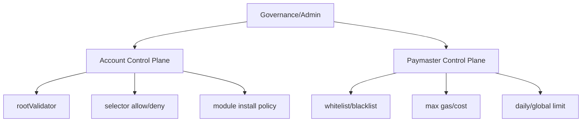

# 5) Smart Account 확장/관리 제어를 위한 설정, Policy, Control 컨트랙트

## 핵심 제어면
- 계정 레벨: root validator, nonce invalidation, selector 접근권한
- 모듈 레벨: install/uninstall 권한, allowlist
- 비용 레벨: paymaster sponsor policy
- 운영 레벨: reputation, rate-limit, stake/deposit

## 제어 구조

## 권장 정책 체크리스트
1. `root validator` 변경은 멀티시그 승인으로 제한
2. `installModule`은 허용된 module 해시/주소만
3. `invalidateNonce`를 incident response 절차에 포함
4. Paymaster는 sender whitelist + 금액 한도 + 시간창
5. Bundler는 시뮬레이션 실패율 모니터링

## 트랜잭션 필드와 정책 매핑
| 필드 | 정책 |
|---|---|
| `sender` | whitelist/blacklist |
| `callData` | selector/target 허용목록 |
| `callGasLimit+verificationGasLimit+preVerificationGas` | maxGasLimit |
| `maxFeePerGas` | maxGasCost 계산 |
| `paymaster*` | sponsor 조건/한도 |

## EVM 절차상 제어 포인트
- validation 단계에서 빠르게 fail-fast
- execution 단계 전 hook preCheck에서 추가 검사
- postOp/로그로 비용·행위 회계 처리
