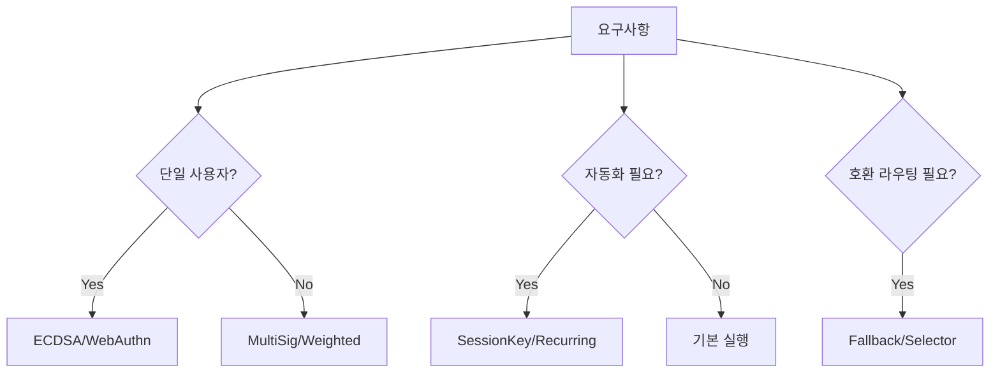

# 6) ERC-7579 기반 모듈 소개 및 특징

## 모듈 타입
- Validator: 서명/인증
- Executor: 자동 실행/권한 위임 실행
- Hook: pre/post 제어
- Fallback: 함수 라우팅/호환
- Policy/Signer: permission 기반 세분화 제어

## PoC 주요 모듈 예시
- Validator
  - `ECDSAValidator`: 단일 키
  - `MultiSigValidator`: M-of-N
  - `WeightedECDSAValidator`: 가중치 멀티시그
  - `WebAuthnValidator`: 패스키/P256
- Executor
  - `SessionKeyExecutor`: 세션키 기반 제한 실행
  - `RecurringPaymentExecutor`: 반복 결제 자동화
- Plugin
  - `AutoSwapPlugin`: 자동 스왑 전략(POC)

## 모듈 선택 흐름

## 설계 원칙
- 최소권한: 필요한 모듈만 설치
- 가시성: 설치/해제 이벤트와 인덱싱
- 롤백성: 모듈 제거/nonce 무효화 시나리오 사전 테스트
