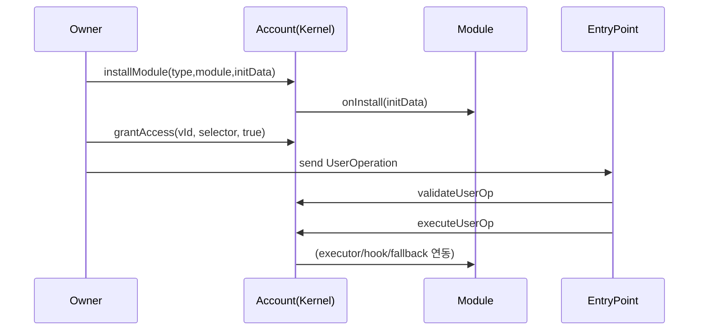

# 7) ERC-7579 모듈을 Smart Account에 install하고 사용하는 방법

## 설치 API
기준: `Kernel.installModule`, `Kernel.installValidations`, `Kernel.uninstall*`

## 기본 절차
1. root validator 초기화
2. validator/permission 추가 설치
3. 필요한 selector 접근권한 grant
4. executor/hook/fallback 모듈 설치
5. UserOperation으로 실제 호출

## 설치/실행 플로우

## `initData` 설계 팁
- validator 설치 시: hook 주소 + validatorData + hookData + selectorData 구조를 명확히 분리
- executor/fallback 설치 시: selector 충돌 여부 사전 검사
- 모듈마다 `onInstall` 기대 포맷이 다르므로 ABI 버전 고정 권장

## 필수/옵션
| 항목 | 필수 | 설명 |
|---|---|---|
| moduleType/module | 필수 | 설치 대상 |
| initData | 보통 필수 | 모듈 초기 상태 세팅 |
| grantAccess | 권장 | validator별 호출 범위 제한 |
| uninstall 경로 | 필수(운영) | 장애 복구/권한회수 |

## 검증 체크
- `isModuleInstalled`로 설치 상태 확인
- 시뮬레이션에서 selector/nonce/signature 경로 확인
- 실패시 nonce invalidation 및 rollback playbook 실행
