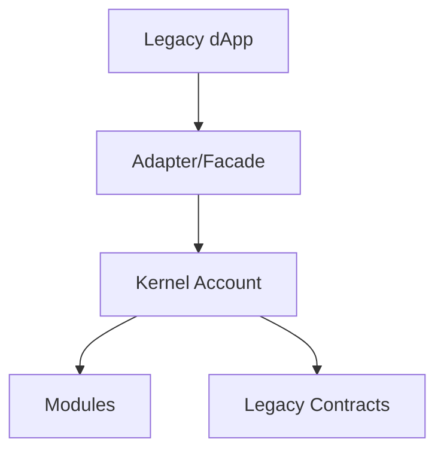

# 9) 기존 컨트랙트와의 호환성 방안

## 문제 정의
- 기존 dApp/컨트랙트는 EOA 서명/`msg.sender` 가정을 갖는 경우가 많음
- 7702+7579 계정은 내부 모듈 라우팅/execute 모델을 사용

## 호환 전략
1. 표준 인터페이스 준수: ERC-1271, ERC-165, ERC-7579
2. fallback/selector routing으로 기존 호출 형태 수용
3. adapter 컨트랙트로 도메인별 호환 레이어 제공
4. 점진 전환: 고위험 기능부터 AA 경로로 이동

## 호환 플로우

## 트랜잭션 관점 체크포인트
- signature 포맷: dApp이 EOA 서명만 기대하면 1271 검증 경로 제공
- nonce 모델: 단순 nonce 기대 시스템과 4337 nonce key 모델 간 매핑
- gas payment: paymaster 사용 시 수수료 책임주체 문서화

## 실무 체크리스트
- 통합 테스트: 기존 주요 컨트랙트별 happy/sad path
- 이벤트/인덱싱: sender 해석(EOA 유지 vs account abstraction 경로)
- 보안검토: delegatecall/fallback 경로와 selector collision
