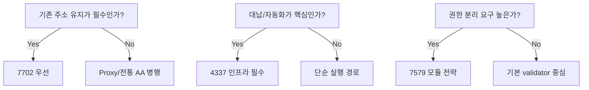

# 세미나 운영 Playbook (추가 제안)

## 청중별 핵심 메시지
- BD: 주소 연속성(7702) + 비용추상화(4337)로 온보딩 전환율 개선
- 개발자: 7579 모듈 조합으로 기능을 빠르게 제품화
- CTO: 정책/통제/관측성 설계를 통해 확장 가능한 운영 모델 확보

## 권장 세션 구성(90분)
1. 문제정의(10분): 왜 기존 EOA UX가 한계인지
2. 기술 핵심(25분): 7702/4337/7579 역할 분리
3. PoC 코드 투어(20분): Kernel/EntryPoint/Bundler/Paymaster
4. 데모(20분): 모듈 설치, 세션키 실행, paymaster 대납
5. 의사결정 프레임(15분): 제품/리스크/거버넌스

## 데모 시나리오
1. 기존 EOA를 7702로 스마트화
2. Validator 교체(ECDSA -> MultiSig)
3. SessionKeyExecutor로 제한된 자동 실행
4. Paymaster 정책 한도 초과 거절 케이스
5. nonce invalidation으로 권한 회수

## 의사결정 프레임

## 성과 지표 제안
- 제품: 트랜잭션 성공률, 사용자 재시도율, 온보딩 이탈률
- 비용: sponsored tx 비율, 평균 가스비, 정책 거절률
- 보안: 이상 호출 탐지 건수, 권한 회수 소요시간, 모듈 변경 감사율
