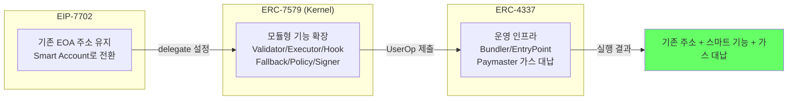
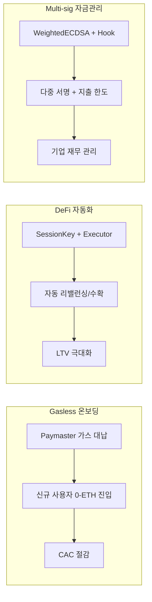
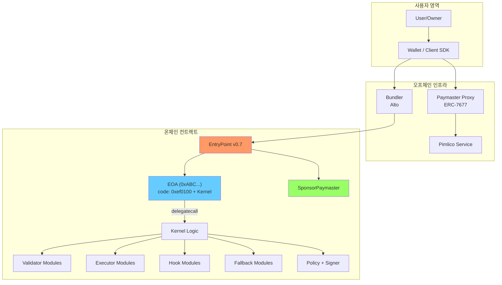
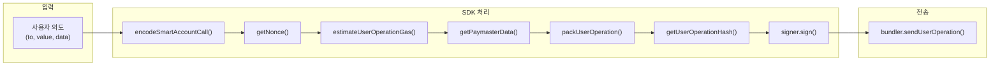
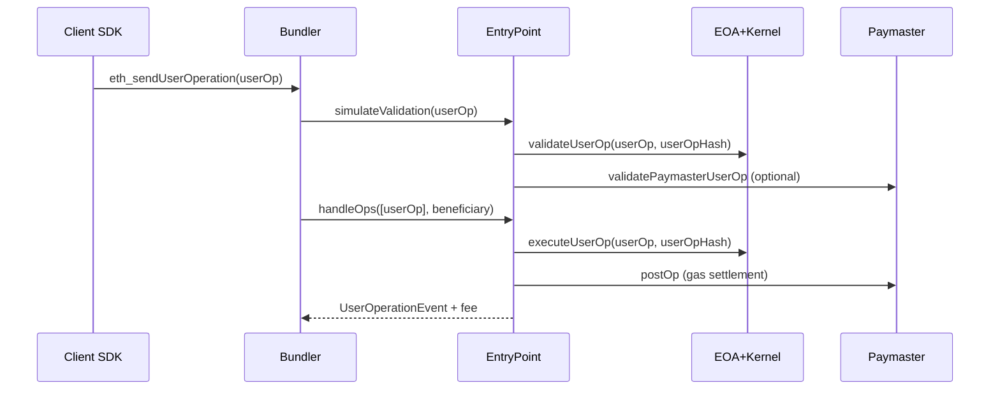
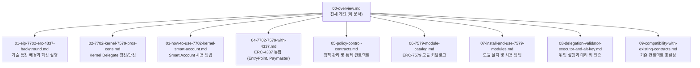
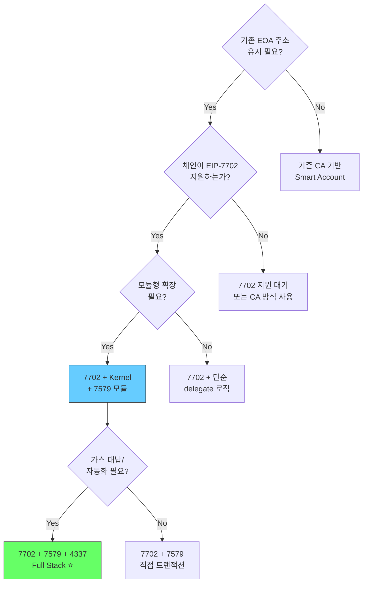
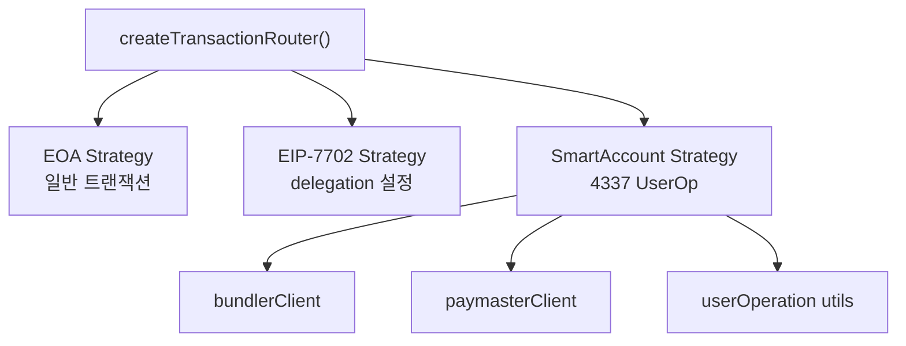

# EIP-7702 + ERC-4337 + ERC-7579 세미나 자료 전체 개요

## 이 문서의 목적

이 PoC(`poc-contract/`, `stable-platform/`)를 기반으로, BD/개발자/CTO가 같은 그림으로 의사결정할 수 있도록 전체 기술 구조와 비즈니스 의미를 정리합니다.

## 1분 요약



- **EIP-7702**: 기존 EOA 주소를 유지한 채, delegate code를 붙여 스마트 계정처럼 동작
- **ERC-7579 Kernel**: 계정 기능을 Validator/Executor/Hook/Fallback/Policy/Signer 6가지 모듈로 확장
- **ERC-4337**: Bundler/EntryPoint/Paymaster로 UX(가스 대납, 배치, 자동화)와 운영성을 제공
- **결론**: `7702(계정 전환) + 7579(기능 확장) + 4337(운영/비용/생태계)` 조합이 본 PoC의 핵심

## 비즈니스 기회 개요

### 3가지 서비스 아키타입



| 서비스 아키타입 | 핵심 모듈 | KPI 매핑 | 수익 모델 |
|---|---|---|---|
| **Gasless 온보딩** | Paymaster + WebAuthnValidator | CAC 절감, 전환율 | 가스 대납 수수료 마진 |
| **DeFi 자동화** | SessionKeyExecutor + SpendingLimitHook | LTV, 리텐션 | 성과 보수, per-tx 수수료 |
| **Multi-sig 자금관리** | WeightedECDSAValidator + AuditHook | AUM, 거래량 | SaaS 구독, 관리 수수료 |

### KPI-기술 매핑

| KPI | 관련 기술 | 측정 방법 |
|---|---|---|
| **CAC** (고객획득비용) | Paymaster 가스 대납 | 대납 비용 / 신규 활성 사용자 |
| **LTV** (고객생애가치) | SessionKey 자동화 | 자동화 사용자의 평균 거래액 × 유지기간 |
| **전환율** | WebAuthn 생체인증 | 서명 요청 → 완료 비율 |
| **리텐션** | 모듈 활용도 | 30일 내 모듈 기능 재사용률 |

---

## 전체 아키텍처



## UserOperation 핵심 필드

| 필드 | 필수 | 7702+4337 에서의 의미 | Source / How to get |
|---|---|---|---|
| `sender` | **필수** | 기존 EOA 주소 (7702 delegation 설정됨) | EOA 주소 직접 지정 |
| `nonce` | **필수** | `[validationMode:2][validationType+Id:21][sequence:8]` | `EntryPoint.getNonce(sender, key)` |
| `initCode` | 조건부 | 7702 최초 온보딩: `0x7702` 마커 | 최초 1회만, 이후 `'0x'` |
| `callData` | **필수** | `Kernel.execute(execMode, executionCalldata)` | `encodeSmartAccountCall(to, value, data)` |
| `accountGasLimits` | **필수** | `verificationGasLimit(16) + callGasLimit(16)` | `bundler.estimateUserOperationGas()` |
| `preVerificationGas` | **필수** | Bundler 오버헤드 + L2 비용 | `bundler.estimateUserOperationGas()` |
| `gasFees` | **필수** | `maxPriorityFeePerGas(16) + maxFeePerGas(16)` | `eth_gasPrice` + `GAS_CONFIG` 클램핑 |
| `paymasterAndData` | 옵션 | Paymaster 사용 시: 주소 + gas limit + 서명 | `paymasterClient.getPaymasterData()` |
| `signature` | **필수** | Validator가 검증할 서명 데이터 | `signer.signAuthorization(userOpHash)` |

### 데이터 흐름 상세: 파라미터 소싱 파이프라인



| SDK 함수 | 파일 경로 | 산출 필드 |
|---|---|---|
| `encodeSmartAccountCall()` | `smartAccountStrategy.ts:327` | `callData` |
| `getNonce()` | `smartAccountStrategy.ts:97` | `nonce` |
| `estimateUserOperationGas()` | Bundler RPC | `accountGasLimits`, `preVerificationGas` |
| `getPaymasterData()` | `paymasterClient.ts:258` | `paymasterAndData` |
| `packUserOperation()` | `userOperation.ts:8` | packed 형식 변환 |
| `getUserOperationHash()` | `userOperation.ts:120` | 서명할 hash |

## EVM 처리 흐름 (요약)



## 세미나 문서 맵



### 문서별 요약

| # | 문서 | 핵심 내용 | 대상 |
|---|---|---|---|
| 01 | 기술 배경 | EOA 한계, 4337 아키텍처, 7702 메커니즘, 결합 이유 | BD, 개발자, CTO |
| 02 | 장점/단점 | 주소 유지, 모듈 확장, 비용 효율 vs 체인 의존, delegate 리스크 | CTO, 개발자 |
| 03 | 사용 방법 | Authorization 서명, delegation 설정, 7702 validation, 해제 | 개발자 |
| 04 | 4337 통합 | UserOp 필드, EntryPoint, Bundler, Paymaster, 캠페인 | 개발자, BD |
| 05 | 정책 통제 | Root Validator, SpendingLimit, AuditHook, Permission | CTO, 개발자 |
| 06 | 모듈 카탈로그 | 6가지 모듈 타입, 각 모듈 기능/용도/인터페이스 | 개발자, BD |
| 07 | 모듈 설치 | 설치 데이터 형식, UserOp 기반 설치, 배치 설치, 제거 | 개발자 |
| 08 | 위임/대리키 | Validator 위임, Executor 실행, 세션키, Guardian 복구 | 개발자, CTO |
| 09 | 호환성 | 토큰 호환, DeFi, 거래소, ERC-1271, tx.origin, 크로스체인 | 개발자, BD |

## 의사결정 가이드



## POC 컨트랙트 맵

### 핵심 컨트랙트

```
poc-contract/src/
├── erc7579-smartaccount/
│   ├── Kernel.sol                    ← Smart Account 메인
│   ├── core/
│   │   ├── ValidationManager.sol     ← 검증 로직
│   │   ├── SelectorManager.sol       ← Fallback 라우팅
│   │   ├── HookManager.sol           ← Hook 관리
│   │   └── ExecutorManager.sol       ← Executor 관리
│   └── factory/KernelFactory.sol     ← 계정 생성
│
├── erc4337-entrypoint/
│   ├── EntryPoint.sol                ← UserOp 처리
│   └── Eip7702Support.sol            ← 7702 통합
│
├── erc4337-paymaster/
│   └── SponsorPaymaster.sol          ← 가스 대납
│
├── erc7579-validators/               ← 서명 검증 모듈
│   ├── ECDSAValidator.sol
│   ├── WeightedECDSAValidator.sol
│   ├── WebAuthnValidator.sol
│   ├── MultiSigValidator.sol
│   └── MultiChainValidator.sol
│
├── erc7579-executors/                ← 위임 실행 모듈
│   ├── SessionKeyExecutor.sol
│   └── RecurringPaymentExecutor.sol
│
├── erc7579-hooks/                    ← 실행 제어 모듈
│   ├── SpendingLimitHook.sol
│   ├── AuditHook.sol
│   └── PolicyHook.sol
│
├── erc7579-fallbacks/                ← ABI 확장 모듈
│   ├── FlashLoanFallback.sol
│   └── TokenReceiverFallback.sol
│
└── erc7579-plugins/                  ← 확장 플러그인
    ├── AutoSwapPlugin.sol
    ├── MicroLoanPlugin.sol
    └── OnRampPlugin.sol
```

### SDK 진입점 구조

> 📁 `stable-platform/packages/sdk-ts/core/src/transaction/transactionRouter.ts`

SDK의 핵심 진입점은 `createTransactionRouter()`이며, **Strategy 패턴**으로 3가지 트랜잭션 모드를 관리합니다:



```typescript
const router = createTransactionRouter({
  rpcUrl: 'https://rpc.example.com',    // 필수: 노드 RPC
  chainId: 1,                            // 필수: 체인 ID
  bundlerUrl: 'https://bundler.example.com',   // Smart Account 필수
  paymasterUrl: 'https://paymaster.example.com', // 가스 대납 시 필수
})

// 사용: prepare → execute 2단계
const prepared = await router.prepare(request, account)
const result = await router.execute(prepared, signer)
```

| 모드 | Strategy | 필요 조건 | 용도 |
|---|---|---|---|
| `EOA` | `createEOAStrategy()` | rpcUrl만 | 일반 ETH 전송 |
| `EIP_7702` | `createEIP7702Strategy()` | rpcUrl + 7702 지원 체인 | Delegation 설정/해제 |
| `SMART_ACCOUNT` | `createSmartAccountStrategy()` | bundlerUrl 필수 | UserOp 기반 실행 |

### SDK/플랫폼

```
stable-platform/packages/
├── sdk-ts/core/          ← SDK 핵심 (UserOp, 7702, 모듈)
├── sdk-ts/accounts/      ← Kernel 계정 구현
├── sdk-ts/plugins/       ← Validator 플러그인
├── wallet-sdk/           ← 지갑 통합 (EIP-6963)
├── contracts/            ← 컨트랙트 주소/ABI
└── config/               ← 네트워크 설정

stable-platform/services/
├── bundler/              ← Bundler 서비스
├── paymaster-proxy/      ← Paymaster 프록시
└── contract-registry/    ← 모듈 레지스트리
```

## 필수/권장 설정 요약

| 설정 항목 | 필수 여부 | 이유 | POC 참조 |
|---|---|---|---|
| Root Validator | **필수** | 기본 서명 검증, 계정 무방비 방지 | ECDSAValidator |
| Nonce 정책 | **필수** | Replay 공격 방지 | invalidateNonce() |
| Module Allowlist | **강력 권장** | 악성 모듈 설치 차단 | KernelFactory |
| Hook 설정 | 권장 | 지출 제어, 감사 | SpendingLimitHook |
| Paymaster Policy | 상용 필수 | 가스 비용 통제 | SponsorPaymaster |
| Executor 제한 | 권장 | 자동화 오남용 방지 | SessionKeyExecutor |
| TokenReceiver | 권장 | NFT/토큰 수신 | TokenReceiverFallback |

## 추천 추가 세션

### 1. 위협 모델 / 운영 보안

| 주제 | 내용 |
|---|---|
| 모듈 설치 권한 | rootValidator 탈취 시 대응 |
| 업그레이드 권한 | Kernel 업그레이드 경로 |
| 키 분실 복구 | Guardian 기반 복구 시나리오 |
| delegate 변경 위험 | storage 충돌 방지 정책 |

### 2. KPI / 비즈니스 지표

| 지표 | 측정 방법 |
|---|---|
| CAC 절감 | 가스 대납을 통한 신규 사용자 유입 비용 |
| 전환율 | 서명 UX 개선 (WebAuthn) 효과 |
| LTV | 자동화 기능 (정기결제, 세션키) 활용률 |
| 리텐션 | Smart Account 기능 활용 지속성 |

### 3. 거버넌스

| 주제 | 내용 |
|---|---|
| 모듈 허용목록 | 신뢰할 수 있는 모듈만 설치 허용 |
| Paymaster 정책 | 가스 대납 예산 및 승인 프로세스 |
| 업그레이드 정책 | Kernel 버전 업그레이드 절차 |
| 인시던트 대응 | 보안 사고 시 긴급 조치 절차 |

---

> **핵심 메시지**: 7702+Kernel+7579+4337 조합은 "기존 EOA 주소를 유지하면서, 모듈형으로 확장 가능한, 가스 대납이 지원되는 Smart Account"를 실현합니다. 이 세미나 자료 시리즈가 BD의 사업 기획, 개발자의 구현, CTO의 기술 의사결정에 동일한 기술 이해를 제공하는 것을 목표로 합니다.
