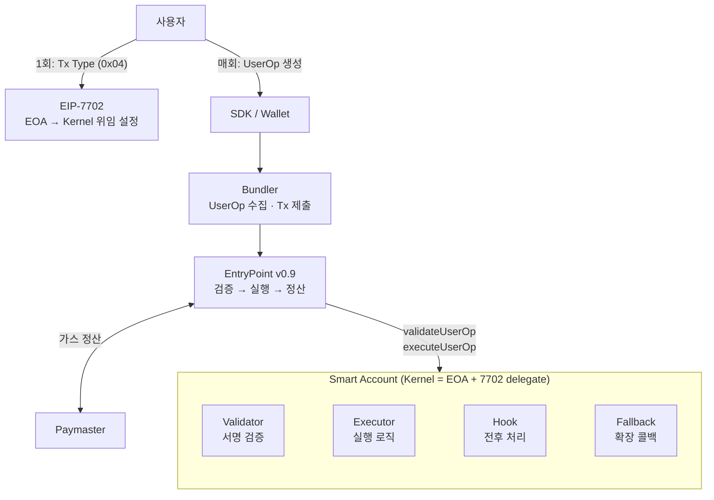

# Smart Account (Overview)

Smart Account는 EVM의 컨트랙트 계정(CA)을 트랜잭션의 주체로 격상시킨 프로그래머블 계정이다. 기존 EOA는 "하나의 개인키로 서명하고, 본인이 가스를 내고, 단일 호출만 실행한다"는 고정된 규칙에 묶여 있지만, Smart Account는 검증 로직(누가 승인하는가), 실행 로직(무엇을 어떻게 실행하는가), 정산로직(누가 가스를 내는가)을 각각 교체 가능한 모듈로 분리하여, 계정 자체가 자신의 동작 정책을 코드로 정의할 수 있게 한다. ERC-4337이 이 계정을 온체인에서 구동하는 실행 파이프라인(EntryPoint → Bundler → Paymaster)을 제공하고, EIP-7702가 기존 EOA 주소를 버리지 않고 Smart Account로 위임하는 경로를 열며, ERC-7579가 계정 내부의 모듈(Validator/Executor/Hook/Fallback) 인터페이스를 표준화함으로써, 세 표준의 조합이 "주소 연속성 + 실행 파이프라인 + 계정 확장성"을 동시에 달성하는 실무 아키텍처를 구성한다.

## 목표

- Smart Account 관련 표준을 이해한다.
- 각 표준이 해결하려는 문제 경계를 분리해서 이해한다.
- 구현 시 어떤 조합을 선택해야 하는지 의사결정 기준을 확보한다.

## 핵심 메시지

- Ethereum은 상태 기반 상태 머신(state transition machine)이다.
- EOA 트랜잭션 모델은 단순하지만, 고급 권한/자동화/UX 요구를 직접 담기 어렵다.
- 그래서 계정 추상화가 등장했고, 4337/7702/7579는 서로 다른 레이어 문제를 해결한다.

### 구조

- **EIP-7702 (1회 설정)**: EOA 주소를 유지한 채 Kernel 코드를 delegate로 지정. 이후 EOA 주소가 곧 Smart Account로 동작
- **ERC-4337 (외부 파이프라인)**: Bundler가 UserOp을 수집해 EntryPoint에 제출하고, EntryPoint가 계정의 검증·실행을 **호출**하며, Paymaster가 가스를 정산
- **ERC-7579 (계정 내부 구조)**: EntryPoint 호출을 받은 Kernel 내부에서 Validator/Executor/Hook/Fallback 모듈이 동작
- **관계**: `4337(파이프라인) ⊃ 7579(계정 내부)` — 4337이 바깥에서 계정을 호출하고, 7579 모듈이 안에서 응답한다. 7702는 이 계정을 기존 EOA 주소에 연결하는 설정 계층

## Agenda(목차)

1. state-machine-and-account-limits
   - 배경: Ethereum 상태 전이 모델과 EOA/CA 기본 구조
   - 문제: EOA 중심 트랜잭션 모델의 한계
   - 해결 방향: 계정 추상화 필요성

2. erc-4337-background-problem-solution
   - 배경: 프로토콜 변경의 어려움
   - 문제: 네이티브 계정 추상화 부재, 가스/자동화/배치 한계
   - 해결: EntryPoint + UserOperation + Bundler + Paymaster

3. erc-4337-version-evolution
   - 배경: 오픈소스/SDK/인프라가 서로 다른 시점의 버전을 반영
   - 문제: v0.6/v0.7/v0.9 간 필드/해시/검증 로직 불일치
   - 해결: v0.6 → v0.7 → v0.9 변천사 정리, 프로젝트 기준 v0.9 정렬

4. eip-7702-background-problem-solution
   - 배경: 기존 EOA 자산/이력/승인 생태계
   - 문제: CA 전환 시 주소 변경과 마이그레이션 비용
   - 해결: EOA 주소 유지 + delegation code (type-0x04)

5. erc-7579-background-problem-solution
   - 배경: Smart Account 구현 파편화
   - 문제: 모듈 생태계 상호운용성 부족
   - 해결: 모듈형 계정 표준(Validator/Executor/Hook/Fallback)

6. how-they-fit-together
   - 배경: 실제 서비스는 단일 표준으로 완결되지 않음
   - 문제: 4337/7702/7579 역할 혼동
   - 해결: 레이어별 책임 분리와 조합 패턴

7. implementation-playbook
   - 배경: 이론 이해 후 구현 간극
   - 문제: 파라미터/검증/운영 포인트 누락
   - 해결: 개발 체크리스트와 실패 패턴 기반 플레이북

8. real-use-cases-and-architecture-mapping
   - 배경: 스펙 이해와 실제 서비스 요구 사이의 간극
   - 문제: “왜 이 조합을 쓰는지”가 흐려져 구현 우선순위가 흔들림
   - 해결: Smart Account 실전 유즈케이스 4종을 4337/7702/7579 책임에 매핑

9. paymaster-erc7677-alignment-brief
   - 배경: Paymaster RPC 흐름과 표준 범위(4337/7677/확장) 해석 차이
   - 문제: 구현/문서/세션 간 흐름 불일치로 후속 작업 맥락 손실
   - 해결: `stub -> estimate -> final` + `isFinal` 최적화 목표와 표준/확장 경계 정의

#### Use Case

- 유즈케이스 A: native coin 없는 유저, Paymaster 스폰서 가스
- 유즈케이스 B: native coin 있는 유저, Bundler 정산 비용 지불
- 유즈케이스 C: native coin 없음 + ERC-20 보유, Paymaster 선지불 후 ERC-20 사후 정산
- 유즈케이스 D: 7579 DeFi swap 모듈 + AI agent로 DCA/Limit order 자동 실행

## References

- ERC-4337 Spec
- ERC-7702 Spec
- ERC-7579 Spec

---
