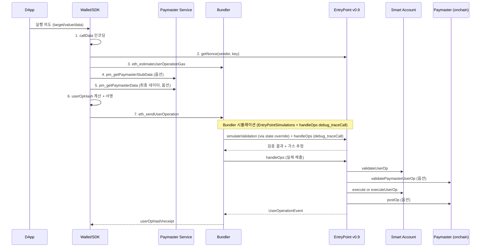
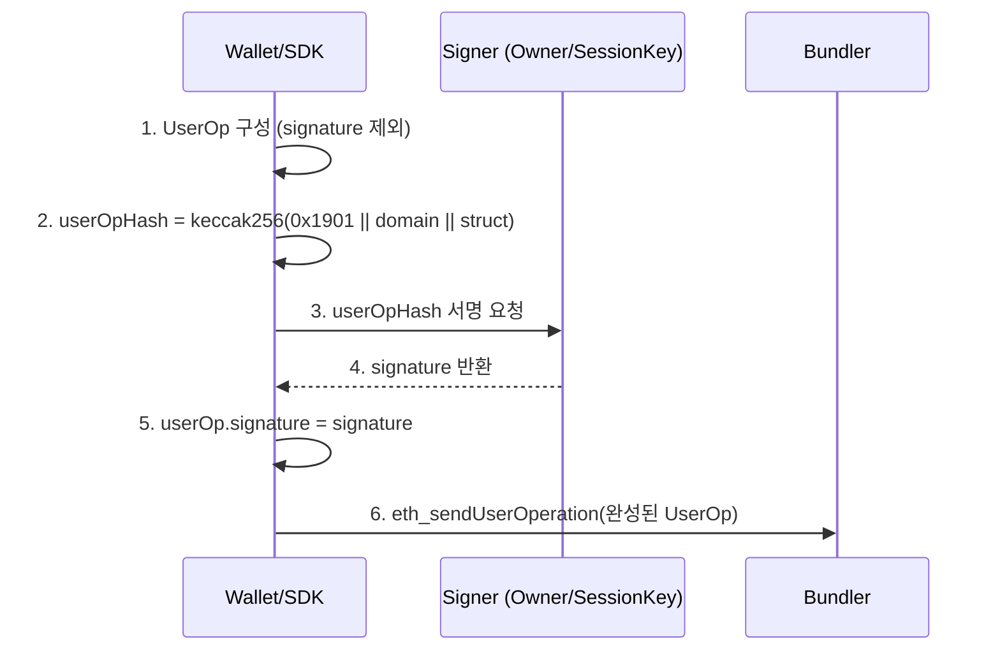
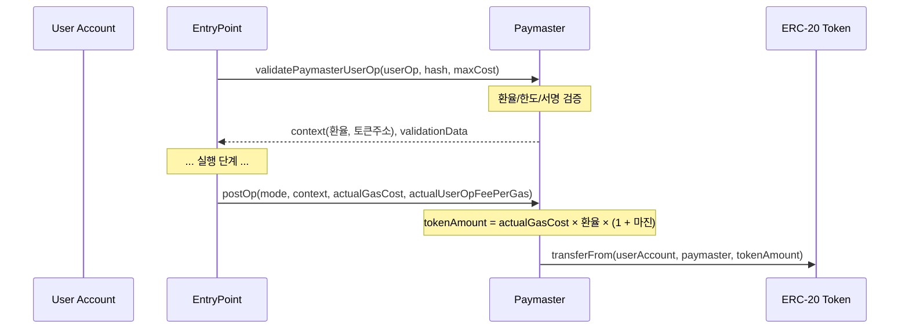
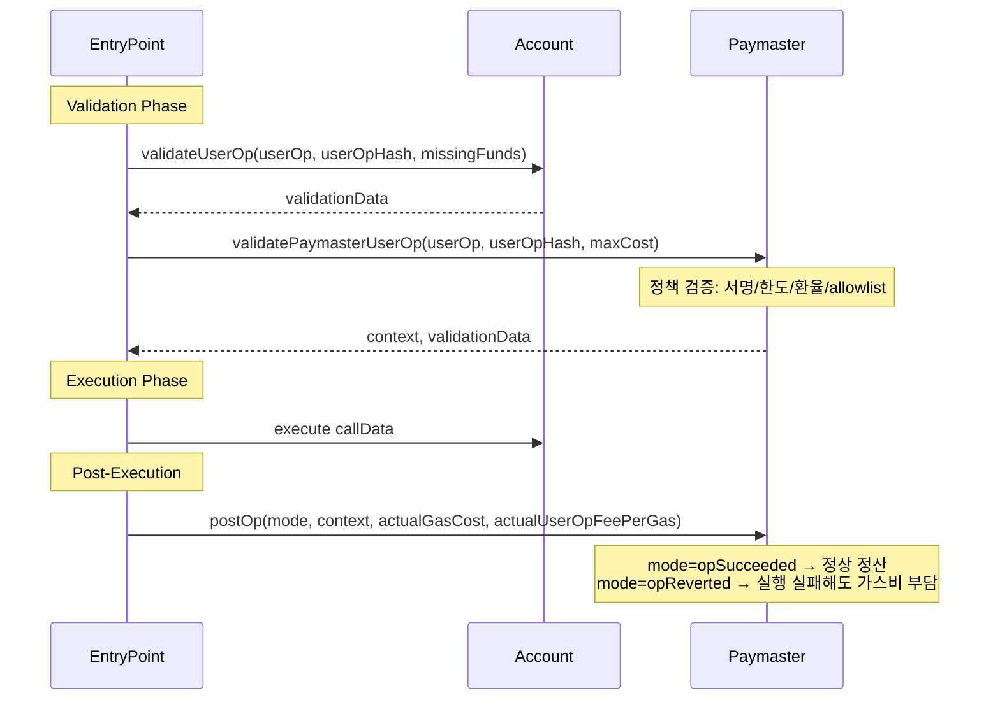

# 02. ERC-4337 (Account Abstraction)

## 배경

네이티브 계정 추상화(프로토콜 변경)는 도입 난이도와 생태계 전환 비용이 크다.
실용적인 대안으로 "프로토콜 변경 없이" 동작하는 상위 레이어 AA가 필요했다.

## 문제

- 기존 tx 형식은 고급 검증 정책을 담기 어렵다.
- 사용자 경험 개선(가스 대납, 배치, 자동화)에 필요한 운영 컴포넌트가 표준화돼 있지 않았다.
- 지갑/인프라/서비스 간 상호운용 기준이 부족했다.

## 해결

ERC-4337은 다음 구조로 문제를 해결한다.

- `UserOperation`: tx 대신 의도 중심 실행 단위
- `EntryPoint`: 검증/실행/정산의 표준 **온체인 진입점**
- `Bundler`: 오프체인 수집/시뮬레이션/번들링
- `Paymaster`: 가스 대납 정책

## 철학: "UserOp를 Tx처럼 다루는 계약-레벨 실행 스킴"

ERC-4337의 핵심은 다음 한 문장으로 정리된다.

- 사용자는 UserOperation 메시지를 만들고,
- 실제 온체인 Tx 제출은 Bundler가 담당하며,
- 검증/실행/정산은 EntryPoint + Account + Paymaster 컨트랙트가 처리한다.

즉, 네이티브 Tx 한계를 계약 계층에서 우회해 "계정 동작을 코드화"한다.

## Actor와 책임

| Actor | 책임 |
|-------|------|
| User/Wallet | UserOp 생성, 서명, 승인 UX |
| DApp | 비즈니스 의도(전송/스왑/모듈설치)를 callData로 표현 |
| Bundler | `eth_sendUserOperation` 수신, 검증, 번들 제출 |
| EntryPoint (v0.9) | validate + execute + postOp + 정산 |
| Smart Account (Kernel) | `validateUserOp`, `execute/executeUserOp`, 모듈 라우팅 |
| Paymaster | 가스 후원 정책 검증, postOp 정산 |

## 처리 흐름



### Native Tx vs ERC-4337 UserOp 비교

| 단계           | Native tx (프로토콜)           | ERC-4337 UserOp (컨트랙트/인프라)                                                    |
| -------------- | ------------------------------ | ------------------------------------------------------------------------------------ |
| 유효성 검증    | Execution client tx validation | Bundler, EntryPoint, Account(`validateUserOp`), Paymaster(`validatePaymasterUserOp`) |
| EVM 실행       | EVM call/create                | EntryPoint(`handleOps`), Smart Account(`execute`), 대상 컨트랙트                     |
| 상태 반영/정산 | state trie 갱신, gas 차감      | EntryPoint 가스 회계, deposit/paymaster 정산, 이벤트 기록                            |
| 완료(블록)     | tx receipt + block inclusion   | outer tx receipt + `UserOperationEvent` 기반 UserOp 결과 추적                        |

---

## UserOperation 구조와 필드별 생성 가이드

### PackedUserOperation (on-chain 구조)

```solidity
struct PackedUserOperation {
    address sender;
    uint256 nonce;
    bytes initCode;
    bytes callData;
    bytes32 accountGasLimits;
    uint256 preVerificationGas;
    bytes32 gasFees;
    bytes paymasterAndData;
    bytes signature;
}
```

스펙은 두 가지 형태를 정의한다.
- **Off-chain UserOperation**: RPC 전송용. 필드가 분리된 형태 (`factory`, `factoryData`, `callGasLimit`, `verificationGasLimit` 등 개별 필드)
- **PackedUserOperation**: on-chain 처리용. 필드가 패킹된 형태

### Off-chain → Packed 매핑

| Off-chain 필드 | Packed 대응 |
|----------------|-------------|
| `factory` + `factoryData` | → `initCode` (factory(20B) + factoryData) |
| `verificationGasLimit` + `callGasLimit` | → `accountGasLimits` (각 uint128 패킹) |
| `maxPriorityFeePerGas` + `maxFeePerGas` | → `gasFees` (각 uint128 패킹) |
| `paymaster` + `paymasterVerificationGasLimit` + `paymasterPostOpGasLimit` + `paymasterData` | → `paymasterAndData` |

### 필드별 생성 절차

#### `sender` — Smart Account 주소

- 이미 배포된 계정이면 해당 주소를 직접 지정
- 미배포 계정이면 `initCode`를 통해 배포될 counterfactual 주소(CREATE2 기반)와 일치해야 함
- EIP-7702 경로에서는 기존 EOA 주소가 sender

#### `nonce` — 재실행 방지

```
nonce = uint192(key) || uint64(sequence)
```

- EntryPoint가 sender별로 관리하는 키 기반 nonce
- `key`(상위 192비트): 병렬 실행 채널 분리에 사용. 서로 다른 key는 독립적으로 sequence 관리
- `sequence`(하위 64비트): key 내에서 순차 증가
- 조회: `EntryPoint.getNonce(sender, key)` → 현재 사용할 nonce 반환
- **실패 케이스**: nonce 불일치 → `AA25 invalid account nonce`

#### `initCode` — 계정 배포 (조건부)

- 이미 배포된 계정: `0x` (빈 값). v0.9에서는 이미 배포된 계정에 initCode를 제공하면 revert 대신 무시하고 `IgnoredInitCode` 이벤트 발행
- 미배포 계정: `factory(20B) + factoryCalldata`. Factory는 CREATE2를 사용해 결정론적 주소 생성 MUST
- EIP-7702 경로: `0x7702`(20B right-padded)로 시작. 20B 초과 시 나머지로 초기화 함수 호출

#### `callData` — 실행할 호출

- DApp의 실행 의도를 Smart Account의 execute 인터페이스로 인코딩
- 예: Kernel의 `execute(bytes32 execMode, bytes calldata executionCalldata)`
- 단일 호출, 배치 호출(`executeBatch`), delegateCall 등 Account 구현에 따라 포맷이 다름
- **주의**: raw target calldata를 그대로 넣으면 안 됨. Account의 execute 포맷으로 래핑해야 함

#### `accountGasLimits` — 검증/실행 가스 한도

```
accountGasLimits = bytes32(uint128(verificationGasLimit) || uint128(callGasLimit))
```

- `verificationGasLimit`: `validateUserOp` 실행에 사용할 최대 가스. Bundler 사전 검증 규칙: < 500,000 gas
- `callGasLimit`: 실제 callData 실행에 사용할 최대 가스. non-zero value CALL 비용 이상
- 추정: Bundler의 `eth_estimateUserOperationGas` 결과를 사용

#### `preVerificationGas` — 번들러 오버헤드 보상

다음 비용을 커버해야 한다:
- 기본 번들 비용: 21,000 gas ÷ 번들 내 UserOp 수
- Calldata 가스 (EIP-2028 기준)
- EntryPoint 고정 실행 비용 + 메모리 로딩
- EIP-7702 해당 시: +25,000 gas (authorization cost)
- Bundler 슬랙 포함

과소추정 시 Bundler가 거부한다.

#### `gasFees` — 수수료

```
gasFees = bytes32(uint128(maxPriorityFeePerGas) || uint128(maxFeePerGas))
```

- EIP-1559 수수료 모델과 동일한 의미
- 네트워크 RPC(`eth_gasPrice`, `eth_maxPriorityFeePerGas`)로 추정

#### `paymasterAndData` — Paymaster 정보 (선택)

미사용 시 `0x`. 사용 시:

```
paymasterAndData =
  paymaster(20B)
  || paymasterVerificationGasLimit(16B)
  || paymasterPostOpGasLimit(16B)
  || paymasterData(variable)
  || [optional] paymasterSignature + length + magic
```

상세는 아래 Paymaster 섹션에서 설명.

#### `signature` — 서명

상세는 아래 서명 섹션에서 설명.

---

## 서명: userOpHash 계산과 서명 절차

### EIP-712 Typed Data Hash (v0.7+)

v0.6까지는 자체 해싱(raw bytes hash)을 사용했으나, v0.7+부터 EIP-712를 도입했다.

도입 이유:
- 지갑 UI에서 `eth_signTypedData_v4`를 통해 필드별 구조화 표시 가능
- 하드웨어 월렛 typed data signing 지원
- 피싱 방지 강화 (사용자가 서명 내용을 확인 가능)

### 해시 계산

```solidity
// Domain Separator
bytes32 constant TYPE_HASH = keccak256(
    "EIP712Domain(string name,string version,uint256 chainId,address verifyingContract)"
);
// domain: name="ERC4337", version="1", chainId=네트워크 chainId, verifyingContract=EntryPoint 주소

// Struct Hash
bytes32 constant PACKED_USEROP_TYPEHASH = keccak256(
    "PackedUserOperation(address sender,uint256 nonce,bytes initCode,bytes callData,"
    "bytes32 accountGasLimits,uint256 preVerificationGas,bytes32 gasFees,"
    "bytes paymasterAndData)"
);

// 최종 hash
userOpHash = keccak256(0x19\x01 || domainSeparator || structHash)
```

**포함되는 필드**: sender, nonce, initCode, callData, accountGasLimits, preVerificationGas, gasFees, paymasterAndData

**제외되는 필드**:
- `signature` — 서명 전에 hash를 계산해야 하므로
- `paymasterSignature` (paymasterData 내 옵션 부분) — 병렬 서명을 가능하게 하기 위해

### 서명 절차



### 도메인 분리와 Replay 방지

`userOpHash`에 `chainId`와 `EntryPoint 주소`가 포함되므로:
- 같은 UserOp이라도 다른 체인에서 재사용 불가
- 같은 체인이라도 다른 EntryPoint에서 재사용 불가

### 누가 서명하는가

"계정이 서명한다"는 Account가 기대하는 승인 주체가 서명한다는 의미:
- Owner EOA key (ECDSA)
- Multisig의 참여자들
- Session Key
- WebAuthn (passkey)
- 기타 Account의 `validateUserOp`이 인정하는 서명 방식

온체인에서는 Account의 `validateUserOp(userOp, userOpHash, missingAccountFunds)`가 해당 서명이 유효한지 검증한다.

### validationData 반환값

```
validationData (uint256):
| authorizer (20 bytes) | validUntil (6 bytes) | validAfter (6 bytes) |
```

- `authorizer`: 0 = 유효, 1 = SIG_VALIDATION_FAILED, 기타 주소 = aggregator
- `validUntil`: 유효 만료 시간 (0 = 무한)
- `validAfter`: 유효 시작 시간
- **서명 실패 시**: revert하지 않고 `SIG_VALIDATION_FAILED`(값: 1)를 반환해야 함 (가스 추정 정확도를 위해)

---

## Bundler 상세: 검증, 시뮬레이션, 번들링

### Bundler가 검증해야 하는 이유

Bundler는 `handleOps`를 호출할 때 자신의 ETH로 가스비를 선지불한다. 만약 검증 없이 무효한 UserOp을 제출하면:
- 가스비는 Bundler가 소모하지만
- UserOp 실행이 실패하면 정산이 되지 않아 Bundler가 손해

따라서 Bundler는 제출 전에 반드시 UserOp의 유효성을 확인해야 한다.

### 사전 검증 규칙 (MUST)

| 규칙 | 설명 |
|------|------|
| sender 존재 확인 | sender에 코드가 있거나 initCode가 제공되어야 함 (둘 다 또는 둘 다 아님은 거부) |
| verificationGasLimit 상한 | < 500,000 gas |
| paymasterVerificationGasLimit 상한 | < 500,000 gas |
| preVerificationGas 최소값 | calldata cost + 50,000 overhead 이상 |
| callGasLimit 최소값 | non-zero value CALL 비용 이상 |
| 수수료 최소값 | `maxFeePerGas`, `maxPriorityFeePerGas` > 설정 가능한 최소값 |
| Paymaster 검증 | 지정된 경우: 코드 존재, 충분한 deposit, 미차단 상태 확인 |
| sender 중복 금지 | 번들 내 sender당 1개 UserOp만 허용 (staked sender 예외) |

### 시뮬레이션: v0.6 vs v0.7+

| 항목 | v0.6 | v0.7+ (v0.9 포함) |
|------|------|-------------------|
| 스펙 정의 시뮬레이션 방식 | 전용 `simulateValidation()` 함수 (EntryPoint 내장) | `handleOps()`를 **view/trace call**로 호출 |
| reference impl 보조 수단 | — | `EntryPointSimulations` (별도 컨트랙트, 온체인 미배포) |
| 호출 방식 | EntryPoint에 직접 호출 | Bundler가 `eth_call` state override로 `EntryPointSimulations` 바이트코드를 EntryPoint 주소에 주입하여 호출 |
| ERC-7562 규칙 검증 | opcode 트레이싱 | `handleOps()` + `debug_traceCall`로 opcode/storage 접근 규칙 검증 |

#### v0.7+ 시뮬레이션 아키텍처

v0.7+에서 스펙은 별도 시뮬레이션 함수를 온체인 EntryPoint에 정의하지 않는다. 스펙의 시뮬레이션 방식은 `handleOps()`를 view/trace call로 호출하는 것이다.

다만, reference implementation(eth-infinitism)은 보조 수단으로 `EntryPointSimulations` 컨트랙트를 제공한다. 이 컨트랙트는 EntryPoint를 상속하되 **온체인에 배포되지 않으며**, Bundler가 `eth_call` state override를 통해 EntryPoint 주소에 바이트코드를 덮어씌워 `simulateValidation()` / `simulateHandleOp()`을 호출한다. v0.9 reference implementation에서도 이 구조는 동일하다.

> v0.7 스펙 원문: "The EntryPoint itself does not implement the simulation methods. Instead, when making the simulation view call, the bundler should provide the alternate EntryPointSimulations code, which extends the EntryPoint with the simulation methods."

프로덕션 Bundler는 두 가지 시뮬레이션을 병행한다:

1. **구조화 검증/가스 추정** — `EntryPointSimulations`의 `simulateValidation()` / `simulateHandleOp()`으로 검증 결과(validationData, stake info, gas 등)를 구조체로 반환
2. **ERC-7562 opcode/storage 규칙 검증** — `handleOps()`를 `debug_traceCall`로 호출하여 검증 단계의 opcode 사용, storage 접근 패턴을 트레이싱

> **본 프로젝트 참고**: 프로젝트의 EntryPoint(`poc-contract`)는 `IEntryPointSimulations`를 직접 구현하여 simulation 함수를 내장하는 커스텀 변형을 채택했다. 이는 state override 없이 직접 호출이 가능하게 하지만, reference implementation과 다른 접근이다.

### Bundler의 Paymaster 유효성 확인

Paymaster를 사용하는 UserOp을 받았을 때 Bundler가 추가로 확인해야 할 것:

1. **Paymaster 코드 존재**: 지정된 paymaster 주소에 코드가 배포되어 있는가
2. **Deposit 충분성**: EntryPoint에 해당 UserOp의 maxCost를 커버할 deposit이 있는가
3. **차단 상태**: reputation 시스템에서 해당 paymaster가 차단되지 않았는가
4. **번들 내 deposit 추적**: 같은 번들에 동일 paymaster를 사용하는 UserOp이 여러 개면, 합산 비용이 deposit을 초과하지 않는지 추적

### 번들 검증 절차

1. 같은 번들 내 다른 sender 주소를 접근하는 UserOp → 제외
2. 같은 번들 내 다른 factory가 생성한 주소를 접근하는 UserOp → 제외
3. 각 paymaster의 deposit이 번들 내 모든 해당 UserOp을 커버하는지 추적
4. 전체 `handleOps`에 대해 `debug_traceCall` 실행
5. revert 발생 시 원인 entity 식별 → 문제 UserOp을 번들/mempool에서 제거
6. 성공하거나 유효 UserOp이 없을 때까지 반복

### 검증 중 금지 사항 (Validation Rules)

검증 코드(`validateUserOp`, `validatePaymasterUserOp`, factory 호출)에서는:
- 글로벌 상태 접근 opcode (`BLOCK_*` 계열) 금지 (staked entity 예외)
- sender 자체 storage 외 접근 금지 (unstaked entity의 경우)
- 다른 UserOp의 sender 주소 접근 금지

이 규칙은 Bundler가 시뮬레이션 결과와 실제 실행 결과의 일관성을 보장하기 위해 필요하다. 검증 코드가 글로벌 상태에 의존하면, 시뮬레이션 이후 상태가 바뀌어 실행 시 다른 결과가 나올 수 있다.

---

## Paymaster 상세: 대납 구조, 모드, 정산

### Paymaster의 역할

Paymaster는 사용자 대신 가스비를 부담하는 온체인 컨트랙트다. Paymaster가 "모든 사람의 가스를 대납"하는 것이 아니라, **허용한 조건에 맞는 요청만 대납**한다.

왜 Paymaster가 서명/승인 데이터를 요구하는가:
- Paymaster는 자신의 EntryPoint deposit으로 가스비를 지불
- 아무 UserOp이나 대납하면 deposit이 소진됨
- 따라서 Paymaster는 **정책**(allowlist, 한도, 만료, 서명 검증 등)으로 대납 대상을 제한
- 일반적으로 Paymaster 서비스(off-chain)가 요청을 검토하고 승인 서명을 발행 → 이것이 `paymasterData`에 포함

#### Paymaster 도메인 분리기 (EIP-712)

Paymaster의 서명 검증에는 **EntryPoint의 도메인과 별도인 자체 EIP-712 도메인**을 사용한다:

- EntryPoint 도메인: `name="ERC4337"`, `verifyingContract=EntryPoint 주소`
- Paymaster 도메인: 구현체별로 정의. 본 프로젝트에서는 `name="StableNetPaymaster"`, `verifyingContract=Paymaster 주소`에 추가로 `address paymaster` 필드를 포함

이 분리가 필요한 이유: `userOpHash`(EntryPoint 도메인)는 Paymaster가 대납 여부를 검증하는 데이터가 아니라, Account가 UserOp 전체를 승인하는 데이터다. Paymaster는 자신만의 정책 데이터(환율, 한도, 만료 등)에 대한 서명을 별도 도메인으로 검증한다.

### 대납 모드

스펙은 Paymaster의 대납 모드를 특정하지 않으며, 구현체별로 자유롭게 정의한다. 본 프로젝트에서는 4가지 모드를 지원한다:

| 모드 | 타입 | 설명 |
|------|------|------|
| Verifying | `verifying` | 오프체인 서명 검증 기반 대납. Paymaster 서비스가 정책 검토 후 서명 발행 |
| Sponsor | `sponsor` | 완전 스폰서. 서비스 제공자가 무조건 가스비 부담 |
| ERC-20 | `erc20` | 사용자가 ERC-20 토큰으로 가스비 지불. 오라클 환율 기반 사후 정산 |
| Permit2 | `permit2` | Uniswap Permit2를 통한 gasless ERC-20 토큰 징수. approve 없이 서명 기반 이체 |

#### Mode A: 완전 스폰서 (Sponsor)

사용자가 가스비를 전혀 부담하지 않는 모드.

- 서비스 제공자가 Paymaster deposit을 충전
- Paymaster가 정책 검증 후 대납 승인
- `postOp`에서 비용 기록만 수행 (사용자에게 청구 없음)
- 사용 사례: 신규 사용자 온보딩, 프로모션, dApp 서비스 보조금

#### Mode B: Verifying (서명 검증 기반)

오프체인 Paymaster 서비스가 요청을 검토하고 서명을 발행하는 모드.

- Paymaster 서비스가 정책(allowlist, 일일 한도, 만료 등)에 따라 대납 여부 결정
- 승인 시 Paymaster 서명을 `paymasterData`에 포함
- `validatePaymasterUserOp`에서 서명 검증 + 시간 범위 확인
- Sponsor 모드와 달리 정책 기반 필터링이 핵심

#### Mode C: ERC-20 토큰 결제

사용자가 native coin(ETH) 대신 ERC-20 토큰으로 가스비를 지불하는 모드.

- Paymaster가 native coin으로 가스비를 선납
- `postOp`에서 사용자 계정으로부터 ERC-20 토큰을 징수
- **가격 비율 처리가 핵심**:
  - native coin과 ERC-20 토큰의 교환비가 1:1이 아님
  - Paymaster가 오프체인 가격 오라클/환율 데이터를 기반으로 `paymasterData`에 환율 포함
  - `validatePaymasterUserOp`에서 환율 유효성/만료 검증
  - `postOp`에서 `actualGasCost × 환율 + 마진`으로 토큰 징수량 계산
  - 환율 변동 리스크: Paymaster가 마진(markup)을 포함하거나, 환율 유효 기간을 짧게 설정

#### Mode D: Permit2 기반 ERC-20 결제

Uniswap Permit2 컨트랙트를 활용한 gasless 토큰 징수 모드.

- 사용자가 ERC-20 토큰을 Permit2에 1회 approve → 이후 서명 기반 이체
- `approve` 트랜잭션 없이 서명만으로 토큰 징수 가능
- ERC-20 모드의 UX를 개선한 변형 (별도 approve tx 불필요)



#### 가격 비율 처리의 구체적 고려사항

1. **환율 소스**: Chainlink 등 오라클, 또는 Paymaster 서비스의 오프체인 환율 서버
2. **환율 유효 기간**: `validUntil`/`validAfter`로 환율 만료 강제
3. **마진 설정**: Paymaster 운영비 + 환율 변동 리스크 보전
4. **최대 토큰 비용 cap**: 사용자가 예상 범위를 벗어나는 청구를 받지 않도록
5. **토큰 잔액/allowance 확인**: `postOp` 시점에 잔액 부족이면 Paymaster가 손해 → `validatePaymasterUserOp`에서 사전 검증

### paymasterAndData 포맷

```
paymasterAndData =
  paymaster(20B)                         // Paymaster 컨트랙트 주소
  || paymasterVerificationGasLimit(16B)  // validatePaymasterUserOp 가스 한도
  || paymasterPostOpGasLimit(16B)        // postOp 가스 한도
  || paymasterData(variable)             // 정책 데이터 (모드, 환율, 한도 등)
  || [optional] paymasterSignature       // Paymaster 서비스의 승인 서명
  || [optional] uint16(sig.length)
  || [optional] PAYMASTER_SIG_MAGIC
```

`paymasterData` 내부 포맷은 스펙이 정의하지 않는다. Paymaster 구현체마다 다르며, 일반적으로:
- 스폰서 모드: 정책 ID + 만료시간 + Paymaster 서명
- ERC-20 모드: 토큰 주소 + 환율 + 만료시간 + 최대 토큰량 + Paymaster 서명

### Paymaster의 2단계 호출 패턴

Paymaster 연동은 보통 stub/final 두 번의 RPC를 사용한다. 현재 코드베이스(Verifying/Sponsor 중심)는 final `paymasterData`를 먼저 확정한 뒤 사용자 서명을 수행한다.

1. **Stub 단계** (`pm_getPaymasterStubData`): gas 추정/정책 선검증용 데이터 조회
2. **최종 단계** (`pm_getPaymasterData`): 최종 `paymasterData` 확보
3. **사용자 서명**: 최종 `paymasterAndData`를 포함한 UserOp에 서명 후 제출

참고: v0.9 `paymasterSignature` suffix(매직 포함)를 채택하면 사용자 서명 이후에 paymaster signature를 붙이는 병렬 서명도 가능하다. 다만 현재 Paymaster proxy/컨트랙트 경로는 legacy envelope+signature 파싱을 사용하므로 final 데이터 선확정 경로를 따른다.

### Paymaster 검증/정산 흐름



- `validatePaymasterUserOp`: 대납 여부 결정. 실패하면 UserOp이 번들에서 제외
- `postOp`: 실행 후 정산. `context`가 비어있지 않은 경우에만 호출
- **PostOpMode** (3가지):
  - `opSucceeded` (0): 실행 성공. 정상 정산
  - `opReverted` (1): 실행이 revert되었지만 Paymaster는 가스비를 부담해야 함 → 방어적 코딩 필수
  - `postOpReverted` (2): EntryPoint 내부에서만 사용. 첫 번째 `postOp` 호출이 revert된 경우, EntryPoint가 두 번째 `postOp`을 `postOpReverted` 모드로 재호출하여 Paymaster에게 정리 기회를 준다. 외부에서 Paymaster를 직접 이 모드로 호출하지 않음

### Paymaster의 Deposit/Stake

| 항목 | 설명 |
|------|------|
| Deposit | EntryPoint에 예치한 ETH. 실제 가스비 차감 원천. 운영팀이 모니터링 기반 자동 충전 필요 |
| Stake | Sybil/DoS 방지용 잠금 자금. 슬래싱 없음. stake가 높을수록 Bundler가 완화된 검증 규칙 적용 가능 |
| 부족 시 | `AA31 paymaster deposit too low` — Bundler가 사전에 차단하거나, on-chain에서 실패 |

---

## EntryPoint v0.9 핵심 포인트

### 주요 인터페이스

- `handleOps(PackedUserOperation[] ops, address payable beneficiary)`: 배치 실행. 검증 → 실행 → 정산 순서
- `getNonce(address sender, uint192 key)`: sender의 key별 현재 nonce 조회
- `getUserOpHash(PackedUserOperation userOp)`: EIP-712 기반 서명 대상 해시
- `getCurrentUserOpHash()`: 실행 중인 UserOp의 hash 조회 (Account/Paymaster 내부에서 사용)
- `balanceOf(address)`: EntryPoint 내 deposit 잔액 조회
- `depositTo(address) payable`: deposit 충전

### Reentrancy 보호 (v0.9)

```solidity
require(tx.origin == msg.sender && msg.sender.code.length == 0);
```

- `tx.origin == msg.sender`: 스마트 컨트랙트 중계 호출 차단
- `code.length == 0`: 순수 EOA만 `handleOps` 호출 가능. EIP-7702 delegation이 설정된 EOA도 차단 (code.length=23)
- Bundler는 **순수 EOA**(delegation 없는)로 운용해야 함

### 10% 미사용 가스 페널티

- 미사용 `callGasLimit` + `paymasterPostOpGasLimit`이 **40,000 gas 이상**이면
- 미사용분의 **10%**를 페널티로 부과
- 목적: 가스 예약만으로 Bundler 비용을 소모하는 공격 방지

### EIP-7702 통합

- `initCode`가 `0x7702`(20B right-padded)로 시작하면 EIP-7702 경로
- Factory를 호출하지 않고 EIP-7702 authorization을 검증
- authorization cost(25,000 gas)는 `preVerificationGas`에 포함
- 초기화는 1회만 허용, `entryPoint.senderCreator()`에서만 호출 가능

---

## 에러 코드와 대응

### AA 에러 코드 체계

모든 에러는 "AA" 접두사를 사용한다.

| 접두사 | 분류 | 설명 |
|--------|------|------|
| `AA1x` | Sender 생성 | initCode/factory 관련 실패 |
| `AA2x` | Sender 검증 | `validateUserOp` 관련 실패 |
| `AA3x` | Paymaster 검증 | `validatePaymasterUserOp` 관련 실패 |
| `AA4x` | 검증 공통 | validationData 시간 범위, aggregator 검증 등 |
| `AA5x` | 실행 단계 | execution revert, prefund 부족 등 |
| `AA9x` | 내부 에러 | inner call revert, FailedOpWithRevert 등 |

### 주요 에러 시나리오와 대응

| 에러 | 원인 | 대응 |
|------|------|------|
| `AA25 invalid account nonce` | nonce 불일치 | `getNonce(sender, key)`로 최신 nonce 재조회 |
| `AA21 didn't pay prefund` | Account deposit 부족 | `depositTo`로 충전하거나 Paymaster 사용 |
| `AA31 paymaster deposit too low` | Paymaster deposit 부족 | Paymaster 운영팀에 deposit 충전 요청 |
| `AA33 reverted` | `validatePaymasterUserOp` revert | paymasterData 포맷/서명/만료 확인 |
| `AA34 signature error` | Paymaster 서명 불일치 | Paymaster 서비스에서 재발행 |
| `AA27 outside valid block range` | Block Number Mode 범위 초과 | validAfter/validUntil 재설정 |
| SIG_VALIDATION_FAILED | Account 서명 검증 실패 | userOpHash 재계산, 서명 재생성, chainId/EntryPoint 일치 확인 |

### 스펙 정의 에러 타입

```solidity
error FailedOp(uint256 opIndex, string reason);
error FailedOpWithRevert(uint256 opIndex, string reason, bytes inner);
error SignatureValidationFailed();
```

- `FailedOp`: 검증/실행 단계에서 실패 시 발생. `reason`으로 AA 코드 확인
- `FailedOpWithRevert`: 외부 호출이 revert한 경우, 원인 데이터(`inner`)를 포함
- `SignatureValidationFailed`: Aggregator 서명 검증 실패

---

## 왜 이렇게 쓰는가

- 4337은 "계정 내부 구조"가 아니라 "실행 파이프라인 표준"이다.
- 따라서 계정 구현(예: 7579 모듈형)과 독립적으로 결합 가능하다.

## 개발자 포인트

핵심 실패 지점은 `nonce`, `gas packing`, `validationData`, `paymasterAndData`다.
구현은 반드시 "시뮬레이션 성공 → 실제 번들 제출" 경로로 검증해야 한다.

자주 틀리는 지점:

- EOA nonce와 UserOp nonce를 동일하게 취급 → UserOp nonce는 EntryPoint가 관리하는 키 기반 nonce
- `callData`를 단순 target calldata로 보내 Account의 execute 포맷 누락
- paymaster 호출에서 chainId 타입(정수/hex 문자열) 혼용
- `signature` 포맷(validator prefix 포함 여부) 불일치
- packed 포맷과 unpacked 포맷 혼동 → Off-chain(RPC)은 분리, on-chain은 패킹
- Paymaster 2단계 호출 순서 혼동 → 현재 구현 기준 `stub → final → 사용자 서명` 순서 확인

## 세미나 전달 문장

- "4337의 본질은 UserOp를 Tx처럼 다루기 위한 실행 인프라를 계약 계층에 만든 것이다."
- "누가 보냈는가보다 중요한 것은, 어디서 어떤 필드를 만들고 검증하느냐다."
- "Bundler는 선지불 구조이므로 검증 없이 제출하면 손해를 본다. Paymaster는 무조건 대납이 아니라 허용된 요청만 대납한다."

## 참조

- `docs/claude/spec/EIP-4337_스펙표준_정리.md`
- `docs/claude/seminar-final/03-erc-4337-version-evolution.md` — v0.6 → v0.9 변천사
