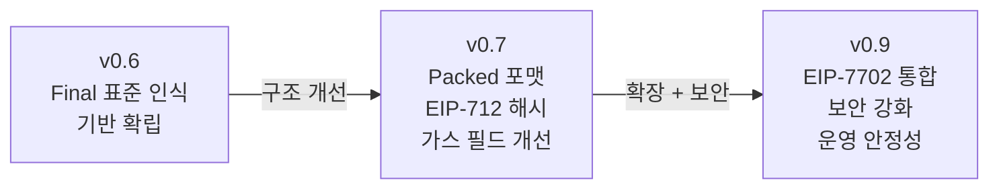
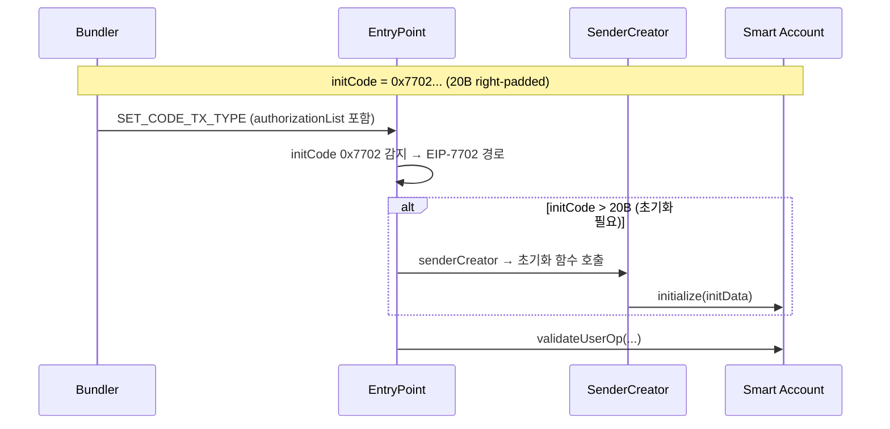

# 03. ERC-4337 EntryPoint 버전 변천: v0.6 → v0.7 → v0.9

개발 보조 자료. 프로젝트 기준 버전은 **v0.9**.

## 1. 왜 변천사를 반드시 이해해야 하는가

현업 개발자는 스펙 문서만 보지 않는다. 오픈소스 구현체, SDK, 인프라가 서로 다른 시점의 버전을 반영한다. "왜 바뀌었는지"를 이해하지 못하면, 필드/해시/검증 로직에서 쉽게 불일치가 발생한다.

## 2. 버전별 핵심 변화 요약



## 3. v0.6 — 기반 확립

v0.6은 ERC-4337이 "Final" 표준으로 인식되던 시기의 버전이다.

### UserOperation 구조

```solidity
// v0.6: 필드가 분리된 형태
struct UserOperation {
    address sender;
    uint256 nonce;
    bytes initCode;
    bytes callData;
    uint256 callGasLimit;           // 개별 필드
    uint256 verificationGasLimit;   // 개별 필드
    uint256 preVerificationGas;
    uint256 maxFeePerGas;           // 개별 필드
    uint256 maxPriorityFeePerGas;   // 개별 필드
    bytes paymasterAndData;
    bytes signature;
}
```

### Hash 계산

- **자체(custom) 해싱**: EIP-712를 사용하지 않음
- `keccak256(abi.encode(userOp fields..., entryPoint, chainId))`
- 지갑 UI에서 raw bytes 해시만 표시 → 사용자가 서명 내용 확인 불가

### 주요 특성

| 항목 | v0.6 |
|------|------|
| UserOp 구조 | 필드 분리(flat) |
| Hash 방식 | 자체 해싱 (non-EIP-712) |
| Gas 필드 | `callGasLimit`, `verificationGasLimit` 개별 uint256 |
| Fee 필드 | `maxFeePerGas`, `maxPriorityFeePerGas` 개별 uint256 |
| Paymaster | `paymasterAndData` bytes 필드 (포맷 규약 느슨) |
| 7702 지원 | 없음 |
| postOp 인터페이스 | `postOp(PostOpMode, bytes context, uint256 actualGasCost)` |
| 시뮬레이션 | `simulateValidation()` 전용 함수 |

### v0.6의 운영 이슈

- 가스 필드가 개별 uint256 → calldata 비용 증가
- 자체 해싱 → 하드웨어 월렛 typed data signing 미지원, 피싱 취약
- paymaster 가스 제한이 세분화되지 않음
- initCode 처리가 단순 → 7702 같은 확장 경로 부재

## 4. v0.7 — 구조 개선

v0.7은 v0.6의 운영 이슈를 구조적으로 개선한 버전이다.

### PackedUserOperation 도입

```solidity
// v0.7: 필드를 패킹하여 calldata 최적화
struct PackedUserOperation {
    address sender;
    uint256 nonce;
    bytes initCode;                  // factory(20B) + factoryData
    bytes callData;
    bytes32 accountGasLimits;        // verificationGasLimit(16) || callGasLimit(16)
    uint256 preVerificationGas;
    bytes32 gasFees;                 // maxPriorityFeePerGas(16) || maxFeePerGas(16)
    bytes paymasterAndData;          // paymaster(20) + pmVerifGas(16) + pmPostOpGas(16) + pmData
    bytes signature;
}
```

### Off-chain → Packed 매핑

| Off-chain 필드 | Packed 대응 |
|----------------|-------------|
| `factory` + `factoryData` | → `initCode` (factory(20B) + factoryData) |
| `verificationGasLimit` + `callGasLimit` | → `accountGasLimits` (각 uint128 패킹) |
| `maxPriorityFeePerGas` + `maxFeePerGas` | → `gasFees` (각 uint128 패킹) |
| `paymaster` + `paymasterVerificationGasLimit` + `paymasterPostOpGasLimit` + `paymasterData` | → `paymasterAndData` |

### EIP-712 기반 해시

```solidity
// v0.7+: EIP-712 typed data hashing
bytes32 constant TYPE_HASH = keccak256(
    "EIP712Domain(string name,string version,uint256 chainId,address verifyingContract)"
);

bytes32 constant PACKED_USEROP_TYPEHASH = keccak256(
    "PackedUserOperation(address sender,uint256 nonce,bytes initCode,bytes callData,"
    "bytes32 accountGasLimits,uint256 preVerificationGas,bytes32 gasFees,"
    "bytes paymasterAndData)"
);

// userOpHash = keccak256(0x19\x01 || domainSeparator || structHash)
// domain: name="ERC4337", version="1", chainId, verifyingContract=EntryPoint
```

**EIP-712 도입 이유:**
- `eth_signTypedData_v4`로 필드별 구조화 표시 가능
- 하드웨어 월렛 typed data signing 지원
- MetaMask/ethers.js 등 생태계 표준 호환
- 피싱 방지 강화

### v0.6 → v0.7 변화 요약

| 항목 | v0.6 | v0.7 |
|------|------|------|
| UserOp 구조 | 필드 분리(flat) | **PackedUserOperation** |
| Hash 방식 | 자체 해싱 | **EIP-712 typed data** |
| Gas 패킹 | 없음 | `accountGasLimits` (bytes32) |
| Fee 패킹 | 없음 | `gasFees` (bytes32) |
| Paymaster 가스 | 단일 한도 | **pmVerifGas + pmPostOpGas 분리** |
| 시뮬레이션 | `simulateValidation()` 전용 함수 | `handleOps()` view/trace call |
| Calldata 비용 | 높음 (개별 uint256) | **최적화** (패킹) |

## 5. v0.9 — 확장 + 보안 강화

v0.9는 v0.7/v0.8과 **ABI 호환**을 유지하면서 7702 통합과 보안을 강화한 버전이다.
기존 Account/Paymaster 코드 변경 없이 사용 가능.

### 5.1 EIP-7702 통합

`initCode`가 `0x7702`(20B right-padded)로 시작하면 EIP-7702 경로로 진입.



핵심 규칙:
- authorization tuple은 UserOperation 외부에서 별도 제공
- Bundler가 `authorizationList`를 포함한 `SET_CODE_TX_TYPE` 트랜잭션으로 제출
- `initCode` > 20B 시 나머지 부분으로 계정 초기화 함수 호출
- 초기화는 `entryPoint.senderCreator()`에서만 허용, 1회만 가능
- authorization cost(25,000 gas)는 `preVerificationGas`에 포함

코드: `poc-contract/src/erc4337-entrypoint/Eip7702Support.sol`

### 5.2 Block Number Mode

`validUntil`과 `validAfter`의 최상위 비트(bit 47)를 1로 설정하면 timestamp 대신 **block number** 기준으로 동작.

```solidity
uint48 VALIDITY_BLOCK_RANGE_FLAG = 0x800_000_000_000;  // bit 47 플래그
uint48 VALIDITY_BLOCK_RANGE_MASK = 0x7ff_fff_fff_fff;  // 하위 47비트 마스크
```

- 판별: `validAfter >= FLAG` AND `validUntil >= FLAG` → block range 모드
- 동일 UserOperation 내에서 timestamp과 block number 혼용 불가
- 에러: account `"AA27 outside valid block range"`, paymaster `"AA37 paymaster inval block range"`
- 사용 시나리오: L2에서 block number가 timestamp보다 신뢰성이 높은 경우, MEV 보호

### 5.3 10% 미사용 가스 페널티

Bundler griefing 방지:
- 미사용 `callGasLimit` + `paymasterPostOpGasLimit`이 **40,000 gas 이상**이면
- 미사용분의 **10%**를 페널티로 부과
- 가스 예약만으로 Bundler 비용을 소모하는 공격 차단

### 5.4 순수 EOA 번들러 요구

```solidity
// v0.9 handleOps 진입 조건
require(tx.origin == msg.sender && msg.sender.code.length == 0);
```

- 스마트 컨트랙트 중계 호출 차단
- EIP-7702 delegation이 설정된 EOA도 차단 (`0xef0100 || address` → code.length=23)
- 번들러는 **순수 EOA**(code.length == 0)로 운용해야 함

### 5.5 postOp 인터페이스 확장

```solidity
// v0.6
function postOp(PostOpMode mode, bytes calldata context, uint256 actualGasCost) external;

// v0.9
function postOp(
    PostOpMode mode,
    bytes calldata context,
    uint256 actualGasCost,
    uint256 actualUserOpFeePerGas    // 추가됨
) external;
```

`actualUserOpFeePerGas` 추가로 Paymaster가 실제 수수료 단가를 기반으로 정밀 정산 가능.

### 5.6 새로운 함수

| 함수 | 설명 |
|------|------|
| `getCurrentUserOpHash()` | 실행 중인 UserOp의 hash 조회. 계정/paymaster 내부에서 현재 처리 중인 op 식별 |
| `delegateAndRevert(target, data)` | state override 미지원 네트워크에서 검증용 delegatecall 수행 |

### 5.7 새로운 이벤트 (v0.9 전용)

| 이벤트 | 설명 |
|--------|------|
| `IgnoredInitCode` | 이미 배포된 계정에 initCode 제공 시 revert 대신 무시하고 이벤트 발행 |
| `EIP7702AccountInitialized` | EIP-7702 delegate 초기화 완료 시 발행 |

### 5.8 EIP-7623 Calldata Floor

EIP-7623이 적용된 네트워크에서는 calldata floor price 조정이 `preVerificationGas` 산정에 영향.
번들러가 메모리 확장과 번들 내 UserOp 위치에 따른 슬랙을 추가해야 함.

### 5.9 preVerificationGas 산정 (v0.9 기준)

```
preVerificationGas 구성요소:
  = 21,000 ÷ bundle size              (기본 번들 비용 분담)
  + Calldata 가스 (EIP-2028 기준)
  + EntryPoint 고정 실행 비용
  + 고정 필드 메모리 로딩
  + Paymaster context 메모리 확장
  + innerHandleOp() 실행
  + [7702 해당 시] 25,000 gas          (authorization cost)
  + [7623 해당 시] calldata floor 조정
  + 슬랙
```

## 6. 전체 변화 비교표

| 항목 | v0.6 | v0.7 | v0.9 |
|------|------|------|------|
| UserOp 구조 | flat (분리) | **Packed** | Packed (호환) |
| Hash 방식 | 자체 해싱 | **EIP-712** | EIP-712 (호환) |
| Gas 패킹 | 없음 | bytes32 패킹 | bytes32 패킹 (호환) |
| Paymaster 가스 | 단일 | 분리(verif+postOp) | 분리 (호환) |
| 시뮬레이션 | 전용 함수 | view/trace call | view/trace call (호환) |
| EIP-7702 | 미지원 | 미지원 | **지원 (0x7702 marker)** |
| Block Number Mode | 없음 | 없음 | **bit 47 플래그** |
| 미사용 가스 페널티 | 없음 | 없음 | **10% (>40K)** |
| postOp | 3인자 | 3인자 | **4인자 (+actualUserOpFeePerGas)** |
| 번들러 요구 | 제한 없음 | 제한 없음 | **순수 EOA (code.length==0)** |
| initCode 무시 | revert | revert | **IgnoredInitCode 이벤트** |
| getCurrentUserOpHash | 없음 | 없음 | **추가** |
| delegateAndRevert | 없음 | 없음 | **추가** |

## 7. 프로젝트 코드에서 확인되는 v0.9 정렬 포인트

### UserOp Hash (EIP-712)

- TS SDK: `stable-platform/packages/sdk-ts/core/src/utils/userOperation.ts`
- Go SDK: `stable-platform/packages/sdk-go/core/userop/hash.go`
- EntryPoint: `poc-contract/src/erc4337-entrypoint/EntryPoint.sol`

공통: domain = `{name: "ERC4337", version: "1", chainId, verifyingContract: EntryPoint}`

### 7702 initCode 경로

- EntryPoint: `poc-contract/src/erc4337-entrypoint/Eip7702Support.sol`

### 주의: Go SDK 정렬 상태

- `stable-platform/packages/sdk-go/transaction/strategies/smart_account.go`는 기본 EntryPoint 주석/상수에 과거 버전 표기가 남아 있고, `Nonce: 0` placeholder 경로가 존재
- **TS 구현이 기준, Go는 보강 필요**

## 8. 버전 혼용 시 발생하는 대표 문제

| 문제 | 원인 | 증상 |
|------|------|------|
| 해시 불일치 | v0.6 custom hash vs v0.7+ EIP-712 | 서명 검증 실패 |
| paymaster 필드 파싱 오류 | paymasterAndData 포맷 차이 | Paymaster 검증 실패 |
| gas 추정 오해 | preVerificationGas/verificationGasLimit 기준 혼동 | Bundler 거부 |
| 이벤트 기반 추적 불일치 | 이벤트 시그니처 차이 | receipt 조회 실패 |
| 번들러 진입 거부 | v0.9 순수 EOA 요구 미충족 | handleOps revert |
| postOp 인자 불일치 | 3인자 vs 4인자 | Paymaster 정산 실패 |

## 9. 마이그레이션 체크리스트

- [ ] EntryPoint 주소/ABI/해시 계산 로직 v0.9 기준 통일
- [ ] SDK TS/Go의 pack/unpack 로직 동일성 확인
- [ ] Wallet/DApp이 보내는 RPC payload 포맷 고정
- [ ] Bundler/Paymaster가 기대하는 chainId, hex 포맷 고정
- [ ] 통합 테스트에 `eth_getUserOperationReceipt` 경로 포함
- [ ] Bundler EOA가 7702 delegation 없는 순수 EOA인지 확인
- [ ] Paymaster postOp이 4인자 인터페이스에 맞는지 확인
- [ ] preVerificationGas에 7702 authorization cost(25K) 포함 여부 확인

## 10. 발표 문장

- "4337은 하나의 고정 스냅샷이 아니라, 운영 이슈와 확장 요구를 반영해 진화해왔다."
- "지금 중요한 건 v0.9 기준으로 전 레이어를 정렬해 재현 가능한 개발 체계를 만드는 것이다."

## 참조

- `docs/claude/spec/EIP-4337_스펙표준_정리.md` — v0.9 전체 스펙
- `docs/claude/01-eip-7702-erc-4337-background.md` — v0.6 시기 설명 포함
- `poc-contract/src/erc4337-entrypoint/EntryPoint.sol` — v0.9 구현체
- `poc-contract/src/erc4337-entrypoint/Eip7702Support.sol` — 7702 통합 코드
