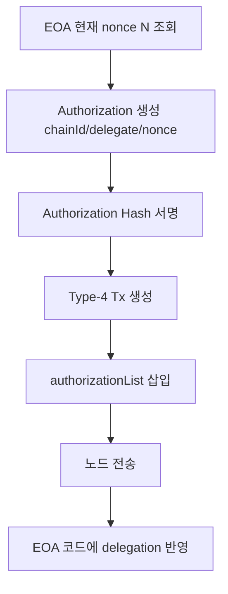

# 03. EIP-7702: ERC-4337의 잔여 문제를 보완하는 해결책

## 배경

ERC-4337은 프로토콜 변경 없이 Account Abstraction 실행 파이프라인을 제공한다.
즉, `UserOperation -> Bundler -> EntryPoint` 경로를 표준화해 가스 대납/배치/자동화 문제를 해결한다.

하지만 4337만으로는 "기존 EOA 사용자의 전환 비용" 문제를 직접 해결하지 않는다.

## 문제 (4337 이후에도 남는 문제)

1. 주소 전환 비용

- 많은 사용자 자산/승인/이력/화이트리스트는 기존 EOA 주소 기준으로 누적되어 있다.
- 새 컨트랙트 계정 주소로 이동하면 마이그레이션 비용이 크다.

2. 생태계 호환 비용

- 백엔드, 분석, 파트너 연동이 EOA 주소를 키로 사용하는 경우가 많다.
- 주소 변경은 운영 시스템 전체의 수정 비용으로 이어진다.

3. 온보딩 마찰

- 기능은 좋아도 "주소를 바꿔야 한다"는 제약은 사용자 전환율을 낮춘다.

## 해결 (EIP-7702)

EIP-7702는 EOA 주소를 유지한 채 delegation code를 설정할 수 있게 한다.

핵심:

- 새 트랜잭션 타입: `0x04` (Set Code Tx)
- `authorization_list`로 위임 대상 코드 승인
- EOA code를 `0xef0100 || address` 형태로 설정

결과:

- 주소는 유지
- 실행 로직은 위임 코드로 확장
- 4337 파이프라인과 결합 가능

## 4337과 7702의 역할 분리

- ERC-4337: 실행/검증/정산 파이프라인
- EIP-7702: 기존 EOA 주소 유지 전환 메커니즘

즉,

- 4337은 "어떻게 실행할지"를 해결하고,
- 7702는 "어떤 주소로 계속 쓸지" 문제를 해결한다.

## 왜 이 조합이 실무적으로 유리한가

1. 기능 확보 + 주소 유지를 동시에 달성

- 4337의 운영 기능(가스 대납/자동화)
- 7702의 사용자 자산/이력 연속성

2. 단계적 전환 가능

- 기존 사용자 기반을 깨지 않고 스마트 기능을 점진 도입 가능

3. 7579 모듈 구조와의 결합 용이

- 7702로 EOA를 위임 가능 상태로 만들고,
- 7579 모듈을 통해 정책/실행 기능 확장,
- 4337로 실제 운영 파이프라인 연결

## 개발자 포인트

- 7702는 4337 대체가 아니라 보완이다.
- delegation 대상 코드 신뢰성 검증이 최우선이다.
- authorization의 nonce/chainId 처리 오류는 replay 리스크로 직결된다.
- 위임 직후 초기화 트랜잭션 설계(프런트런 방지)가 필요하다.

참조:

- `docs/claude/spec/EIP-7702_스펙표준_정리.md`
- `docs/claude/spec/EIP-4337_스펙표준_정리.md`

---

# 04. EIP-7702: Delegation과 Type-4 트랜잭션 (상세판)

## 1) EIP-7702의 역할

EIP-7702는 EOA를 폐기하지 않고, EOA 주소에 "위임 코드 실행" 경로를 부여한다. 즉 기존 EOA UX를 유지한 채 Smart Account 기능으로 진입하는 온보딩 수단이다.

## 2) 핵심 개념

- Authorization tuple
- `(chainId, delegateAddress, nonce)`

- Authorization hash
- `keccak256(0x05 || rlp([chainId, address, nonce]))`

- Type-4 Transaction
- `authorizationList`를 포함한 전송 트랜잭션

## 3) 이 프로젝트의 두 가지 위임 패턴

### 3.1 한 번에 처리: `wallet_delegateAccount`

코드: `stable-platform/apps/wallet-extension/src/background/rpc/handler.ts`

- 지갑이 Authorization 생성/서명 + Type-4 Tx 전송을 내부에서 원샷 처리
- `txNonce = N`, `authNonce = N+1` 규칙 적용
- 이유: authority와 tx sender가 동일한 self-executor 패턴

### 3.2 분리 처리: `wallet_signAuthorization` + relayer 전송

- 지갑은 Authorization만 서명
- relayer가 Type-4 Tx를 전송
- 이 경우 authority nonce 증분 시점이 다르므로 nonce 설계가 self 패턴과 다름

## 4) nonce 주의사항 (중요)

- EOA nonce
- 네이티브 Tx nonce

- Authorization nonce
- 7702 권한 검증용 nonce

- UserOp nonce
- EntryPoint 계정 nonce

세미나에서 반드시 분리 설명한다. 이 3개를 혼동하면 재현 불가능한 버그가 반복된다.

## 5) 메시지 포맷 다이어그램



## 6) 실무용 JSON-RPC 예시

### 6.1 Authorization 서명

```json
{
  "jsonrpc": "2.0",
  "id": 1,
  "method": "wallet_signAuthorization",
  "params": [
    {
      "account": "0xYourEOA",
      "contractAddress": "0xKernelImpl",
      "chainId": 8283
    }
  ]
}
```

### 6.2 위임 원샷

```json
{
  "jsonrpc": "2.0",
  "id": 2,
  "method": "wallet_delegateAccount",
  "params": [
    {
      "account": "0xYourEOA",
      "contractAddress": "0xKernelImpl",
      "chainId": 8283
    }
  ]
}
```

## 7) 4337과의 연결 포인트

- EntryPoint v0.9는 7702 initCode marker(`0x7702`) 경로를 인지한다.
- 코드: `poc-contract/src/erc4337-entrypoint/Eip7702Support.sol`
- 즉 7702는 "계정 온보딩", 4337은 "UserOp 실행 파이프라인"으로 역할 분리가 명확하다.

## 8) 실패 포인트

- authorization nonce 계산 오류
- `v/r/s` 정규화 오류(0/1 vs 27/28)
- relayer 체인/가스 설정 불일치
- 위임 후 코드 확인(`eth_getCode`) 생략

## 9) 구현 체크리스트

- 위임 전/후 `eth_getCode`를 비교 확인한다.
- 위임 대상(delegate)가 실제 Kernel 구현인지 검증한다.
- authority nonce 규칙을 self/relayer 패턴별로 분리 테스트한다.
- 위임 성공 후 Smart Account 정보(`rootValidator`, `accountId`)를 읽어 정합성 검증한다.

## 10) 코드 근거

- `stable-platform/apps/wallet-extension/src/background/rpc/handler.ts`
- `stable-platform/apps/web/hooks/useSmartAccount.ts`
- `stable-platform/packages/sdk-ts/core/src/eip7702/authorization.ts`
- `poc-contract/src/erc4337-entrypoint/Eip7702Support.sol`

---
