# 04. ERC-7579: 배경, 문제, 해결

## 배경

Smart Account 구현이 늘면서 계정 구조/모듈 인터페이스가 프로젝트마다 달라졌다.
결과적으로 모듈 재사용성과 생태계 호환성이 낮아졌다.

## 문제

- 검증기/실행기/훅 모듈이 구현체 종속적
- 계정 교체 시 모듈 재사용이 어렵고 통합 비용이 큼
- SDK/툴링이 계정별 분기 코드로 복잡해짐

## 해결

ERC-7579는 모듈형 스마트 계정 표준 인터페이스를 정의한다.

핵심:

- 모듈 타입 분리: Validator / Executor / Hook / Fallback
- 공통 라이프사이클: `installModule`, `uninstallModule`, `isModuleInstalled`
- 실행 모드 명시: `supportsExecutionMode`

## 왜 이렇게 쓰는가

- 7579의 목적은 "계정 내부 확장 구조 표준화"다.
- 4337이 실행 파이프라인이면, 7579는 계정 내부 구성 규약이다.
- 팀 단위 개발에서 모듈 단위 병렬 개발/리뷰/배포가 쉬워진다.

## 개발자 포인트

- 모듈 설치 권한을 강하게 제한해야 한다.
- execute 경로에서 hook 우회가 생기지 않도록 단일 진입 경로를 유지해야 한다.
- uninstall 시 스토리지 정리/권한 회수를 명시적으로 수행해야 한다.

참조:

- `docs/claude/spec/EIP-7579_스펙표준_정리.md`

---

# 05. ERC-7579: 모듈형 계정과 Lifecycle (상세판)

## 1) ERC-7579가 필요한 이유

4337은 UserOp 파이프라인을 제공하지만, Account 내부를 어떻게 확장/정책화할지까지 표준화하지는 않는다. 7579는 이 공백을 메우는 모듈형 Account 인터페이스다.

## 2) Kernel 기반 계정 구조

본 프로젝트의 Account는 Kernel(`kernel.advanced.0.3.3`)이다.

코드:

- `poc-contract/src/erc7579-smartaccount/Kernel.sol`

핵심 책임:

- `validateUserOp` (4337 검증 엔트리)
- `executeUserOp` (4337 bridge)
- `execute(ExecMode, executionCalldata)` (7579 실행 엔트리)
- 모듈 lifecycle 관리

## 3) 모듈 타입

- Validator (1)
- Executor (2)
- Fallback (3)
- Hook (4)

모듈 타입별 호출 타이밍을 반드시 분리 설명한다.

## 4) Execution Mode

- SINGLE / BATCH / DELEGATECALL 중심
- Kernel은 STATIC mode를 지원하지 않도록 명시되어 있음
- 코드: `supportsExecutionMode` 구현 참고

## 5) 4337-7579 브리지 포인트

### 5.1 `validateUserOp`

- 4337 validationData 포맷을 만족해야 함
- 내부적으로 7579 validator 라우팅 수행
- nonce key space를 validator 식별과 결합해 사용

### 5.2 `executeUserOp`

- EntryPoint only
- `userOp.callData[4:]`를 self-delegatecall해 `execute` 경로로 브리지
- hook pre/post 패턴을 강제

## 6) 모듈 Lifecycle (핵심)

### 6.1 Install

- `installModule(type, module, initData)`
- Wallet Extension은 `buildKernelInstallData`로 Kernel v3 포맷 래핑 후 UserOp로 실행

### 6.2 Uninstall

- `uninstallModule`은 모듈 `onUninstall` 실패 시 revert
- 안정성은 높지만, 악성/고장 모듈 제거가 막힐 수 있음

### 6.3 Force Uninstall

- `forceUninstallModule`은 상태를 먼저 정리 후 safe-call
- 모듈 언인스톨 훅 실패를 무시하고 제거 지속

### 6.4 Replace (Atomic)

- `replaceModule`은 old 제거 + new 설치를 원자적으로 처리
- new 설치 실패 시 전체 revert

## 7) Fallback sender-context 이슈와 해결

Kernel fallback은 EntryPoint 호출 컨텍스트에서 `msg.sender` 왜곡 문제가 있다. 이를 보완하기 위해 CALLTYPE_SINGLE fallback에서 ERC-2771 스타일 sender append 방식을 사용한다.

코드 주석 근거:

- `poc-contract/src/erc7579-smartaccount/Kernel.sol` fallback 섹션

## 8) 보안/운영 제어 포인트

- Hook gas limit
- Delegatecall whitelist + enforce 플래그
- module operation reentrancy lock

## 9) Wallet/SDK에서 실제 사용하는 모듈 RPC

- `stablenet_installModule`
- `stablenet_uninstallModule`
- `stablenet_forceUninstallModule`
- `stablenet_replaceModule`

관련 코드:

- `stable-platform/apps/wallet-extension/src/background/rpc/handler.ts`
- `stable-platform/packages/sdk-ts/core/src/modules/operationClient.ts`

## 10) 실무 실패 포인트

- fallback 타입일 때 `additionalContext`에 selector 누락
- validator/hook install initData 포맷 혼동
- uninstall 실패를 단순 재시도로 해결하려고 시도
- forceUninstall이 필요한 상황 판단 실패

## 11) 세미나 전달 문장

- "7579는 기능 확장 스펙이 아니라, 운영 가능한 계정 아키텍처 스펙이다."
- "모듈 lifecycle을 이해하지 못하면 제품 운영 중 장애를 복구할 수 없다."

---

# 2. EIP-7702 + ERC-7579 Kernel Delegate 설정의 장점 및 단점

## 2.1 아키텍처 개요

EIP-7702를 통해 EOA에 Kernel 컨트랙트를 delegate로 설정하면, EOA가 ERC-7579 호환 Smart Account로 동작합니다.

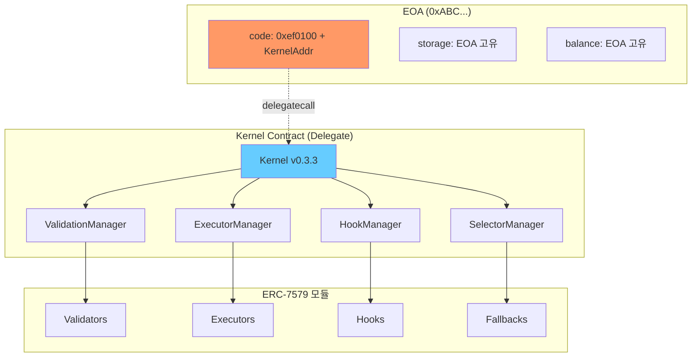

## 2.2 장점

### 1) 기존 EOA 주소 완전 유지

- 자산(ETH, ERC-20, NFT) 이관 불필요
- 기존 approve/allowance 유지
- 에어드롭, 화이트리스트, ENS 등 그대로 사용
- 거래소 출금 주소 변경 불필요

### 2) 모듈형 확장 (ERC-7579)

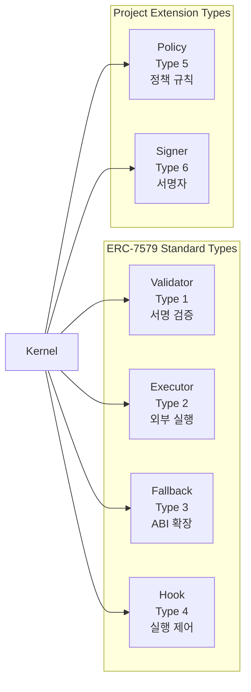

- **Validator**: ECDSA, MultiSig, WebAuthn 등 다양한 서명 검증
- **Executor**: Session Key, 정기결제 등 위임 실행
- **Hook**: 지출 한도, 감사 로그 등 pre/post 제어
- **Fallback**: Flash Loan 콜백 등 ABI 확장
- **Policy (프로젝트 확장 Type 5)**: 세분화된 접근 제어 규칙
- **Signer (프로젝트 확장 Type 6)**: Permission 기반 서명 검증

### 3) 비용 효율성

- Proxy 없이 직접 delegate → hop 1회 절감
- 신규 CA 배포 비용 불필요 (7702 authorization만 필요)
- 모듈을 필요할 때만 설치/제거 → 초기 비용 최소화

### 4) 점진적 전환

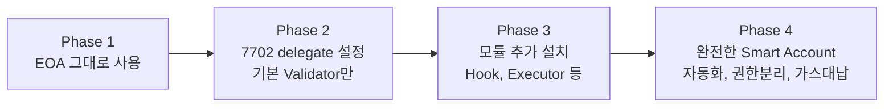

### 5) Cross-chain 일관성

- `chain_id = 0` 으로 authorization 시 모든 체인에서 동일 delegate 적용 가능
- Kernel의 `_buildChainAgnosticDomainSeparator()` 로 chain-agnostic 서명 지원

## 2.3 단점 및 주의점

### 1) 체인 지원 의존성

| 리스크        | 설명                                                 | 대응방안                                             |
| ------------- | ---------------------------------------------------- | ---------------------------------------------------- |
| 하드포크 필요 | 7702는 프로토콜 변경이므로 모든 체인이 지원하진 않음 | 지원 체인 목록 관리, 미지원 체인은 기존 CA 방식 사용 |
| 호환성 불일치 | 체인별 EVM 구현 차이로 동작 불일치 가능              | 체인별 테스트 필수                                   |

### 2) Delegate 변경/해제 리스크

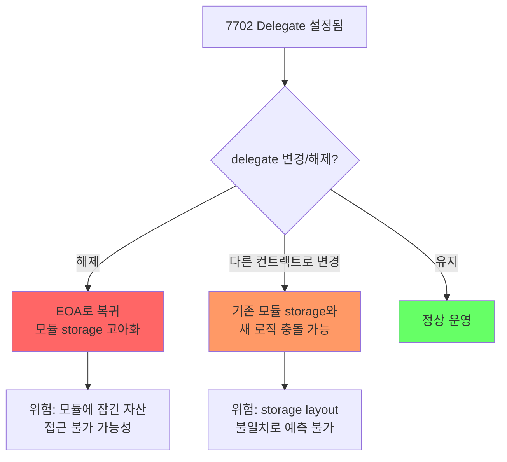

**핵심 주의사항:**

- delegate를 해제하면 Kernel storage에 기록된 모듈 설정이 고아(orphan)가 됨
- 다른 컨트랙트로 delegate를 변경하면 storage slot 충돌 위험
- **권장**: delegate 변경/해제 전 모든 모듈 uninstall 및 자산 회수

### 3) 초기화/재초기화 제어

Kernel 코드에서:

```solidity
function initialize(...) external {
    if (ValidationId.unwrap(vs.rootValidator) != bytes21(0)
        || bytes3(address(this).code) == EIP7702_PREFIX) {
        revert AlreadyInitialized();
    }
}
```

- 7702로 설정된 EOA는 `initialize()` 호출 불가 (`EIP7702_PREFIX` 체크)
- 대신 `VALIDATION_TYPE_7702`를 통해 EOA 소유자 서명으로 직접 검증
- **위험**: rootValidator 설정 없이 사용 시 모듈 설치 권한 제어 불가

### 4) 모듈 설치 권한 오남용

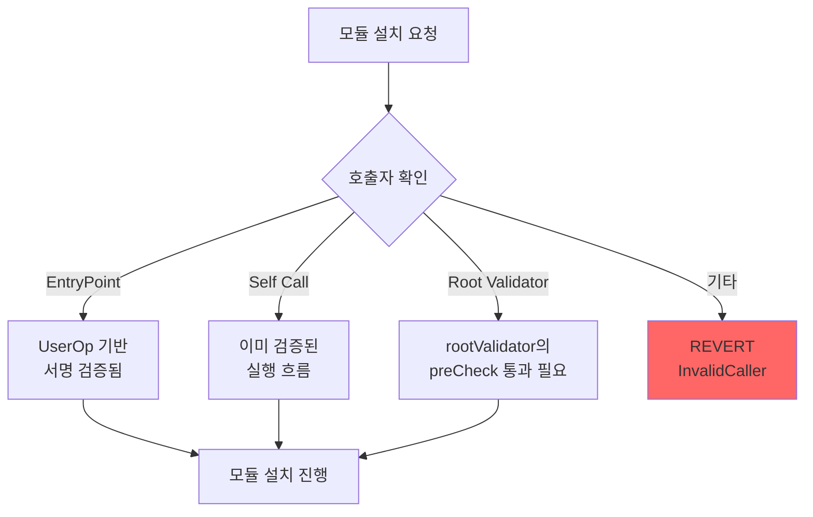

**주의사항:**

- `installModule()`은 `onlyEntryPointOrSelfOrRoot` modifier로 보호
- 하지만 rootValidator가 단순 ECDSA이고 키가 유출되면 모든 모듈 설치/제거 가능
- **권장**: rootValidator에 MultiSig나 시간지연(delay) 적용

### 5) Storage 관리 복잡성

- Kernel은 고정 storage slot(keccak256 기반)을 사용
- 모듈별로 독립 storage(`mapping(address => ...)`)를 사용하므로 slot 충돌은 낮음
- 하지만 delegate 변경 시 잔존 storage가 문제될 수 있음

## 2.4 필수/옵션 설정 매트릭스

| 설정 항목         | 필수 여부     | 이유                                    | POC 참조             |
| ----------------- | ------------- | --------------------------------------- | -------------------- |
| Root Validator    | **필수**      | 기본 서명 검증 경로, 없으면 계정 무방비 | `ECDSAValidator`     |
| Nonce 정책        | **필수**      | Replay 공격 방지, 취소 제어             | `invalidateNonce()`  |
| Module Allowlist  | **강력 권장** | 악성 모듈 설치 차단                     | `KernelFactory`      |
| Hook 설정         | 권장          | 실행 제어/감사, 없으면 무제한 실행      | `SpendingLimitHook`  |
| Paymaster Policy  | 상용 필수     | 가스 비용 통제                          | `SponsorPaymaster`   |
| Executor 제한     | 권장          | 자동화 오남용 방지                      | `SessionKeyExecutor` |
| Selector 접근제어 | 권장          | 특정 함수만 허용                        | `grantAccess()`      |

## 2.5 의사결정 가이드

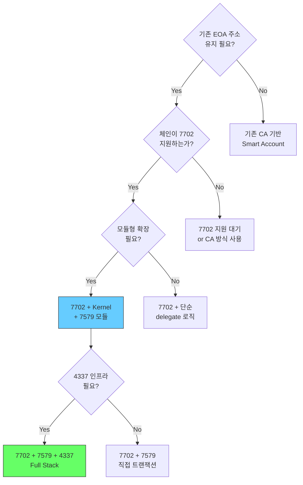

## 2.6 비즈니스 리스크/기회 분석

### 기회/리스크 매트릭스

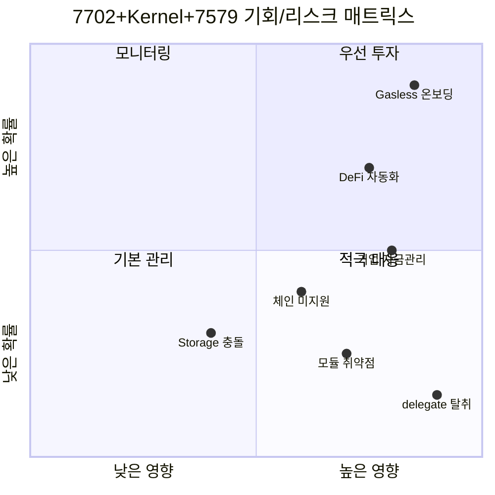

| 구분       | 항목           | 영향도   | 확률 | 대응                       |
| ---------- | -------------- | -------- | ---- | -------------------------- |
| **기회**   | Gasless 온보딩 | 높음     | 높음 | Paymaster 캠페인 즉시 구축 |
| **기회**   | DeFi 자동화    | 높음     | 중간 | SessionKey 서비스 파일럿   |
| **기회**   | 기업 자금관리  | 높음     | 중간 | Enterprise 패키지 설계     |
| **리스크** | Delegate 탈취  | 매우높음 | 낮음 | Root Validator 보안 강화   |
| **리스크** | 체인 미지원    | 중간     | 중간 | 멀티체인 준비, CA 폴백     |
| **리스크** | 모듈 취약점    | 높음     | 낮음 | 감사/허용목록 정책         |
| **리스크** | Storage 충돌   | 중간     | 낮음 | 표준 슬롯 설계 검증        |

---

## 2.7 비용 분석

### Gas 비용 비교표

> 📁 `stable-platform/packages/sdk-ts/core/src/config/gas.ts` 기반

| 작업                     | EOA (전통) | 7702 직접 | 7702 + 4337 (UserOp) |
| ------------------------ | ---------- | --------- | -------------------- |
| **단순 ETH 전송**        | 21,000     | 21,000    | ~120,000             |
| **ERC-20 전송**          | ~65,000    | ~65,000   | ~165,000             |
| **7702 Delegation 설정** | -          | ~58,500\* | ~58,500\*            |
| **모듈 설치 (1개)**      | -          | ~200,000  | ~350,000             |
| **배치 설치 (3개)**      | -          | ~450,000  | ~550,000             |
| **세션키 실행**          | -          | -         | ~150,000             |

\*`SETCODE_BASE_GAS(21K) + EIP7702_AUTH_GAS(25K) + GAS_PER_AUTHORIZATION(12.5K)`

### 비용 분석: 4337 오버헤드 vs 비즈니스 가치

```
4337 추가 가스 비용 (단순 전송 기준):
  UserOp 오버헤드 = ~100,000 gas
  가스 가격 10 gwei 기준 = 0.001 ETH ≈ $2.5 (ETH @$2,500)

비즈니스 가치:
  가스 대납 → 신규 사용자 0-ETH 진입 → CAC 절감 효과 >>$2.5
  배치 실행 → 3건 개별 전송(63K * 3) > 배치 1건(~200K) → 가스 절약
  자동화 → 수동 실행 불필요 → 운영 인건비 절감
```

| 관점       | 추가 비용      | 절감/수익                 | ROI 판단    |
| ---------- | -------------- | ------------------------- | ----------- |
| **사용자** | +100K gas/tx   | 가스 대납 (0원)           | 매우 긍정적 |
| **서비스** | Paymaster 비용 | CAC 절감, LTV 증가        | 2~5x ROI    |
| **기업**   | 인프라 운영비  | 인건비 절감, 컴플라이언스 | 6개월 BEP   |

---

> **핵심 메시지**: 7702+Kernel+7579 조합은 EOA 주소를 유지하면서 강력한 모듈형 확장을 제공하지만, delegate 변경/해제 리스크, 초기화 제어, 모듈 권한 관리에 대한 운영 정책이 반드시 수반되어야 합니다.

---

# 6. ERC-7579 모듈 컨트랙트 카탈로그

## 6.1 모듈 타입 개요

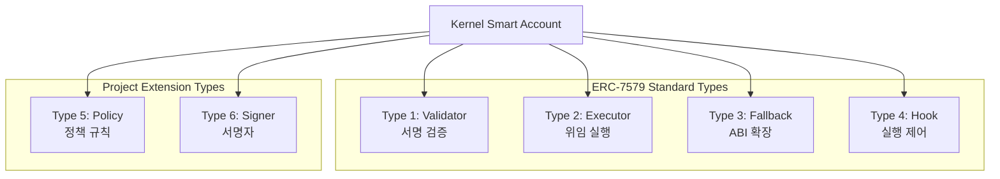

- **표준(ERC-7579)**: Type 1~4 (Validator / Executor / Fallback / Hook)
- **프로젝트 확장(StableNet Kernel)**: Type 5~6 (Policy / Signer)

### 모듈 기본 인터페이스

```solidity
interface IModule {
    function onInstall(bytes calldata data) external payable;
    function onUninstall(bytes calldata data) external payable;
    function isModuleType(uint256 moduleTypeId) external view returns (bool);
    function isInitialized(address smartAccount) external view returns (bool);
}
```

## 6.2 Validator 모듈 (Type 1)

### 인터페이스

```solidity
interface IValidator is IModule {
    function validateUserOp(
        PackedUserOperation calldata userOp,
        bytes32 userOpHash
    ) external payable returns (ValidationData);

    function isValidSignatureWithSender(
        address sender,
        bytes32 hash,
        bytes calldata sig
    ) external view returns (bytes4);
}
```

---

### ECDSAValidator

| 항목                 | 내용                                                     |
| -------------------- | -------------------------------------------------------- |
| **파일**             | `poc-contract/src/erc7579-validators/ECDSAValidator.sol` |
| **용도**             | 단일 ECDSA 키 기반 서명 검증                             |
| **모듈 타입**        | Validator (1) + Hook (4)                                 |
| **onInstall 데이터** | `bytes20(ownerAddress)`                                  |

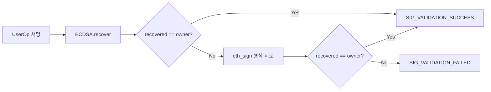

**주요 기능:**

- 단일 소유자 ECDSA 서명 검증
- EIP-191 (eth_sign) 폴백 지원
- IHook 구현: `preCheck()`로 `msgSender == owner` 검증

**사용 사례:** 기본 rootValidator, 개인 계정

---

### WeightedECDSAValidator

| 항목                 | 내용                                                             |
| -------------------- | ---------------------------------------------------------------- |
| **파일**             | `poc-contract/src/erc7579-validators/WeightedECDSAValidator.sol` |
| **용도**             | 가중 다중서명 (Weighted Multi-Sig)                               |
| **모듈 타입**        | Validator (1)                                                    |
| **onInstall 데이터** | `guardians[], weights[], threshold, delay`                       |

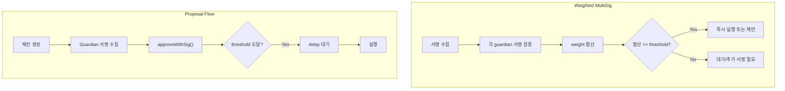

**주요 기능:**

- Guardian 링크드 리스트 관리
- 가중치 기반 임계값 (예: guardian A=3, B=2, C=1, threshold=4)
- 제안/승인/거부(veto) 흐름
- 설정 가능한 시간 지연
- 배치 서명 승인 (`approveWithSig`)

**사용 사례:** 팀 계정, 기업 금고, DAO 금고

---

### WebAuthnValidator

| 항목          | 내용                                                        |
| ------------- | ----------------------------------------------------------- |
| **파일**      | `poc-contract/src/erc7579-validators/WebAuthnValidator.sol` |
| **용도**      | WebAuthn/Passkey 기반 인증                                  |
| **모듈 타입** | Validator (1)                                               |

**주요 기능:**

- P-256 (secp256r1) 타원곡선 서명 검증
- 브라우저/디바이스 네이티브 지원
- 백업 코드 기능
- 다중 패스키 등록

**사용 사례:** 모바일 앱, 생체인증, 하드웨어 키

---

### MultiSigValidator

| 항목          | 내용                                                        |
| ------------- | ----------------------------------------------------------- |
| **파일**      | `poc-contract/src/erc7579-validators/MultiSigValidator.sol` |
| **용도**      | M-of-N 다중서명                                             |
| **모듈 타입** | Validator (1)                                               |

**주요 기능:**

- 설정 가능한 임계값 (M of N)
- 정렬된 서명 검증
- 관리자/복구 키 지원

**사용 사례:** 공동 계정, 프로젝트 금고

---

### MultiChainValidator

| 항목          | 내용                                                          |
| ------------- | ------------------------------------------------------------- |
| **파일**      | `poc-contract/src/erc7579-validators/MultiChainValidator.sol` |
| **용도**      | 크로스체인 트랜잭션 검증                                      |
| **모듈 타입** | Validator (1)                                                 |

**주요 기능:**

- 체인 ID 검증
- 크로스체인 위임
- 오라클 통합 지원

**사용 사례:** 멀티체인 계정, 브릿지 트랜잭션

## 6.3 Executor 모듈 (Type 2)

### 인터페이스

```solidity
interface IExecutor is IModule {
    // Executor는 Kernel.executeFromExecutor()를 호출하여
    // Smart Account 대신 트랜잭션을 실행
}
```

---

### SessionKeyExecutor

| 항목                 | 내용                                                        |
| -------------------- | ----------------------------------------------------------- |
| **파일**             | `poc-contract/src/erc7579-executors/SessionKeyExecutor.sol` |
| **용도**             | 시간 제한 위임 실행                                         |
| **onInstall 데이터** | `sessionKey, validAfter, validUntil, spendingLimit`         |

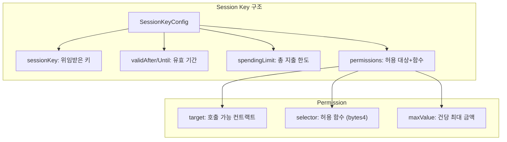

**실행 방법:**

1. `executeOnBehalf()`: 세션키 서명으로 실행 (외부 호출)
2. `executeAsSessionKey()`: 세션키 직접 호출 (msg.sender 확인)

**사용 사례:** 게임 자동실행, DeFi 봇, dApp UX 개선

---

### RecurringPaymentExecutor

| 항목     | 내용                                                              |
| -------- | ----------------------------------------------------------------- |
| **파일** | `poc-contract/src/erc7579-executors/RecurringPaymentExecutor.sol` |
| **용도** | 자동 정기결제                                                     |

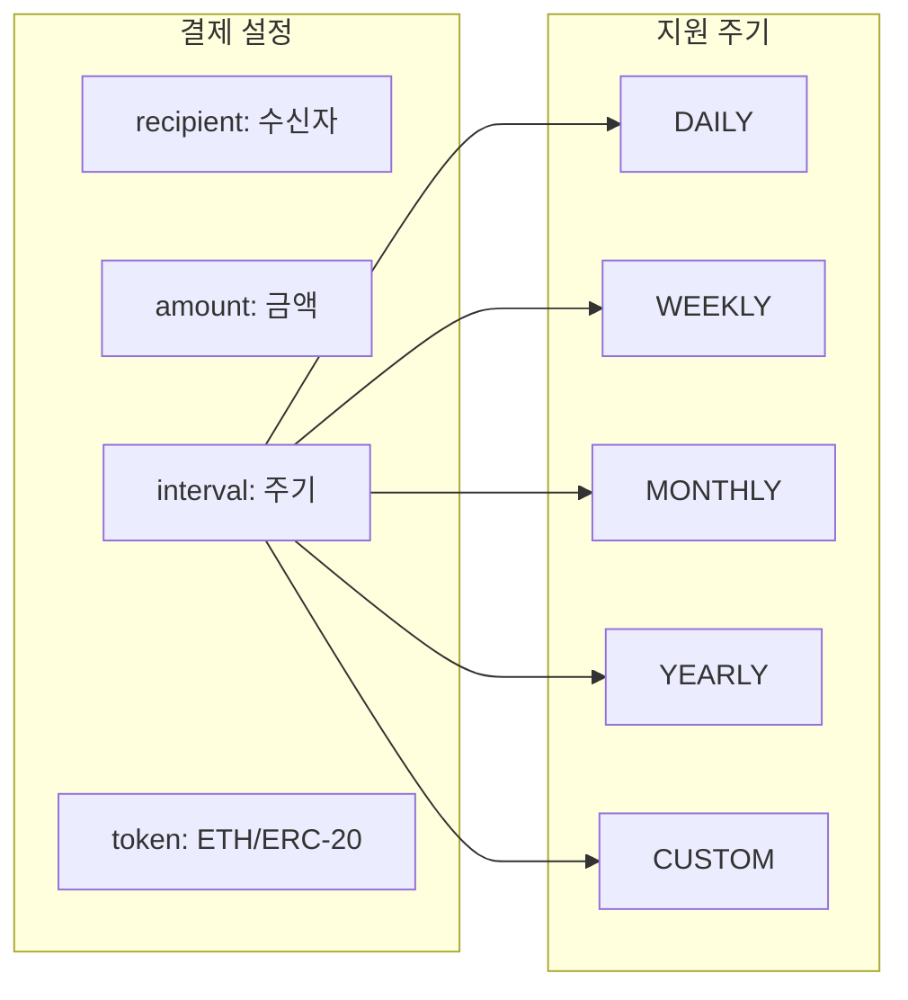

**주요 기능:**

- ETH 및 ERC-20 결제 지원
- 설정 가능한 결제 간격
- 누구나 결제 시점에 트리거 가능
- 배치 실행 지원

**사용 사례:** 구독 서비스, 급여 지급, 정기 기부

---

### 기타 Executor

| Executor        | 파일                                    | 용도          |
| --------------- | --------------------------------------- | ------------- |
| StakingExecutor | `erc7579-executors/StakingExecutor.sol` | 스테이킹 관리 |
| SwapExecutor    | `erc7579-executors/SwapExecutor.sol`    | 토큰 스왑     |
| LendingExecutor | `erc7579-executors/LendingExecutor.sol` | 대출 프로토콜 |

## 6.4 Fallback 모듈 (Type 3)

### 인터페이스

```solidity
interface IFallback is IModule {
    // Kernel의 fallback()에서 selector 라우팅으로 호출됨
}
```

---

### FlashLoanFallback

| 항목     | 내용                                                       |
| -------- | ---------------------------------------------------------- |
| **파일** | `poc-contract/src/erc7579-fallbacks/FlashLoanFallback.sol` |
| **용도** | 플래시론 콜백 처리                                         |

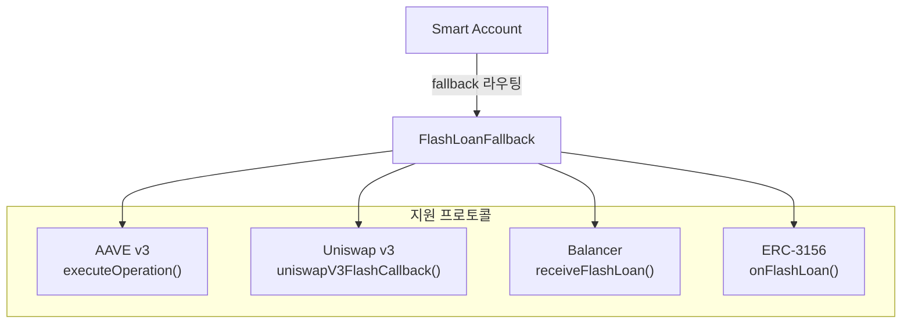

**주요 기능:**

- 프로토콜별 콜백 함수 구현
- 프로토콜 화이트리스트
- 플래시론 로깅
- ERC-2771 컨텍스트 추출

**사용 사례:** DeFi 청산, 차익 거래, 포지션 리밸런싱

---

### TokenReceiverFallback

| 항목     | 내용                                                           |
| -------- | -------------------------------------------------------------- |
| **파일** | `poc-contract/src/erc7579-fallbacks/TokenReceiverFallback.sol` |
| **용도** | 토큰 수신 콜백 처리                                            |

**지원 표준:**

| 표준     | 콜백 함수                                         |
| -------- | ------------------------------------------------- |
| ERC-721  | `onERC721Received()`                              |
| ERC-1155 | `onERC1155Received()`, `onERC1155BatchReceived()` |
| ERC-777  | `tokensReceived()`                                |

**사용 사례:** NFT 수신, 게임 아이템, 멀티토큰 관리

## 6.5 Hook 모듈 (Type 4)

### 인터페이스

```solidity
interface IHook is IModule {
    function preCheck(
        address msgSender,
        uint256 value,
        bytes calldata msgData
    ) external payable returns (bytes memory hookData);

    function postCheck(
        bytes calldata hookData
    ) external payable;
}
```

---

### SpendingLimitHook

(상세는 05-policy-control-contracts.md 참조)

| 항목                 | 내용                                                   |
| -------------------- | ------------------------------------------------------ |
| **파일**             | `poc-contract/src/erc7579-hooks/SpendingLimitHook.sol` |
| **용도**             | 토큰별 지출 한도 적용                                  |
| **onInstall 데이터** | `tokens[], limits[], periods[]`                        |

---

### AuditHook

| 항목                 | 내용                                           |
| -------------------- | ---------------------------------------------- |
| **파일**             | `poc-contract/src/erc7579-hooks/AuditHook.sol` |
| **용도**             | 온체인 감사 추적                               |
| **onInstall 데이터** | `highValueThreshold, delayPeriod`              |

**주요 기능:**

- 모든 트랜잭션 로깅
- 고위험 트랜잭션 플래그
- 선택적 시간 지연 (time-lock)
- 차단 목록 관리
- 통계 추적

---

### PolicyHook

| 항목     | 내용                                            |
| -------- | ----------------------------------------------- |
| **파일** | `poc-contract/src/erc7579-hooks/PolicyHook.sol` |
| **용도** | 접근 제어 정책 적용                             |

**두 가지 모드:**

- **ALLOWLIST**: 기본 거부, 명시적 허용만 통과
- **BLOCKLIST**: 기본 허용, 차단 목록만 거부

---

### HealthFactorHook

| 항목     | 내용                                                  |
| -------- | ----------------------------------------------------- |
| **파일** | `poc-contract/src/erc7579-hooks/HealthFactorHook.sol` |
| **용도** | DeFi 건전성 지표 모니터링                             |

**사용 사례:** 대출 포지션 청산 방지, 담보 비율 유지

## 6.6 프로젝트 확장: Policy 모듈 (Type 5)

### 인터페이스

```solidity
interface IPolicy is IModule {
    function checkUserOpPolicy(
        address account,
        PermissionId permissionId,
        PackedUserOperation calldata userOp,
        bytes calldata policyProof
    ) external payable returns (ValidationData);

    function checkSignaturePolicy(
        address account,
        PermissionId permissionId,
        address caller,
        bytes32 hash,
        bytes calldata proof
    ) external view returns (ValidationData);
}
```

**용도:** Permission 시스템에서 세분화된 규칙 적용

## 6.7 프로젝트 확장: Signer 모듈 (Type 6)

### 인터페이스

```solidity
interface ISigner is IModule {
    function checkUserOpSignature(
        address account,
        PermissionId permissionId,
        bytes32 userOpHash,
        bytes calldata signature
    ) external payable returns (ValidationData);

    function checkSignature(
        address account,
        PermissionId permissionId,
        address caller,
        bytes32 hash,
        bytes calldata signature
    ) external view returns (ValidationData);
}
```

**용도:** Permission 내 서명 검증 담당

## 6.8 Plugin (확장 모듈)

### AutoSwapPlugin

| 항목     | 내용                                                  |
| -------- | ----------------------------------------------------- |
| **파일** | `poc-contract/src/erc7579-plugins/AutoSwapPlugin.sol` |
| **용도** | 자동 토큰 스왑                                        |

### MicroLoanPlugin

| 항목     | 내용                                                   |
| -------- | ------------------------------------------------------ |
| **파일** | `poc-contract/src/erc7579-plugins/MicroLoanPlugin.sol` |
| **용도** | 소액 대출                                              |

### OnRampPlugin

| 항목     | 내용                                                |
| -------- | --------------------------------------------------- |
| **파일** | `poc-contract/src/erc7579-plugins/OnRampPlugin.sol` |
| **용도** | 법정화폐 온램프                                     |

## 6.9 모듈 카탈로그 요약표

| 모듈                     | 타입 | 용도            | 복잡도 | 권장 용도             |
| ------------------------ | ---- | --------------- | ------ | --------------------- |
| ECDSAValidator           | 1    | ECDSA 서명 검증 | 낮음   | 기본 rootValidator    |
| WeightedECDSAValidator   | 1    | 가중 다중서명   | 높음   | 팀/기업 rootValidator |
| WebAuthnValidator        | 1    | 패스키 인증     | 중간   | 모바일/웹             |
| MultiSigValidator        | 1    | M-of-N 다중서명 | 중간   | 공동 계정             |
| MultiChainValidator      | 1    | 크로스체인 검증 | 높음   | 멀티체인              |
| SessionKeyExecutor       | 2    | 세션키 실행     | 중간   | dApp 자동화           |
| RecurringPaymentExecutor | 2    | 정기결제        | 중간   | 구독 서비스           |
| FlashLoanFallback        | 3    | 플래시론 콜백   | 높음   | DeFi                  |
| TokenReceiverFallback    | 3    | 토큰 수신       | 낮음   | NFT/토큰 수신         |
| SpendingLimitHook        | 4    | 지출 한도       | 중간   | 보안 필수             |
| AuditHook                | 4    | 감사 추적       | 중간   | 컴플라이언스          |
| PolicyHook               | 4    | 접근 제어       | 중간   | 기업 정책             |

## 6.10 모듈별 비즈니스 서비스 매핑

각 모듈이 어떤 비즈니스 서비스를 가능하게 하는지, 그리고 수익화 방법을 정리합니다.

| 모듈                         | 서비스 유형      | 수익 모델          | 대상 고객           |
| ---------------------------- | ---------------- | ------------------ | ------------------- |
| **ECDSAValidator**           | 기본 지갑 서비스 | Freemium 기반 확장 | 모든 사용자         |
| **WeightedECDSAValidator**   | 기업 자금관리    | SaaS 월정액        | 기업, DAO           |
| **WebAuthnValidator**        | 생체인증 지갑    | 프리미엄 구독      | 모바일 사용자       |
| **MultiSigValidator**        | 공동 계정 관리   | per-account 수수료 | 팀, 커플, 가족      |
| **SessionKeyExecutor**       | dApp 자동화      | per-tx 수수료      | DeFi 사용자, 게이머 |
| **RecurringPaymentExecutor** | 구독/급여 자동화 | 건당 수수료        | SaaS, 기업          |
| **FlashLoanFallback**        | DeFi 차익거래    | 성과 보수          | 트레이더, 프로토콜  |
| **SpendingLimitHook**        | 보안 서비스      | 보안 패키지 번들   | 고액 자산가         |
| **AuditHook**                | 컴플라이언스     | 감사 서비스 구독   | 규제 대상 기업      |
| **PolicyHook**               | 접근 제어        | 엔터프라이즈 번들  | 금융기관            |
| **AutoSwapPlugin**           | 자동 환전        | 스프레드 수수료    | 소매 사용자         |

### 모듈 조합 서비스 패키지

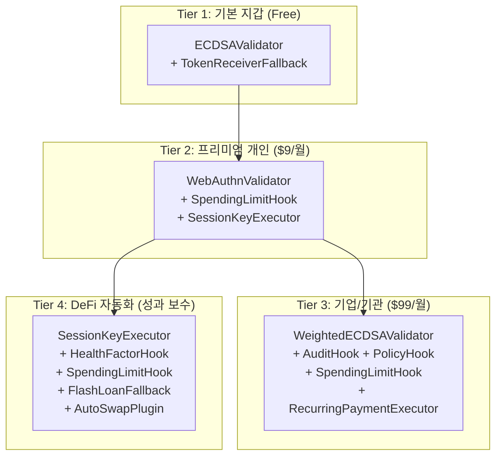

| 패키지            | 모듈 구성                                        | 가격 모델                 | 예상 ARPU     |
| ----------------- | ------------------------------------------------ | ------------------------- | ------------- |
| **기본 지갑**     | ECDSA + TokenReceiver                            | Free (가스 대납으로 유입) | $0 (CAC 투자) |
| **프리미엄 개인** | WebAuthn + SpendingLimit + SessionKey            | 월 $9 또는 연 $89         | $9/월         |
| **기업/기관**     | Weighted + Audit + Policy + Spending + Recurring | 월 $99 + 인원당 $10       | $200+/월      |
| **DeFi 자동화**   | SessionKey + HealthFactor + Spending + FlashLoan | 수익의 5~20%              | 가변          |

---

> **핵심 메시지**: ERC-7579 표준 타입은 4가지(Validator/Executor/Fallback/Hook)이며, 본 코드베이스는 프로젝트 확장으로 Policy(5), Signer(6)을 추가해 사용합니다. 각 모듈은 `onInstall()/onUninstall()`로 라이프사이클이 관리되며 필요에 따라 조합됩니다.

---
