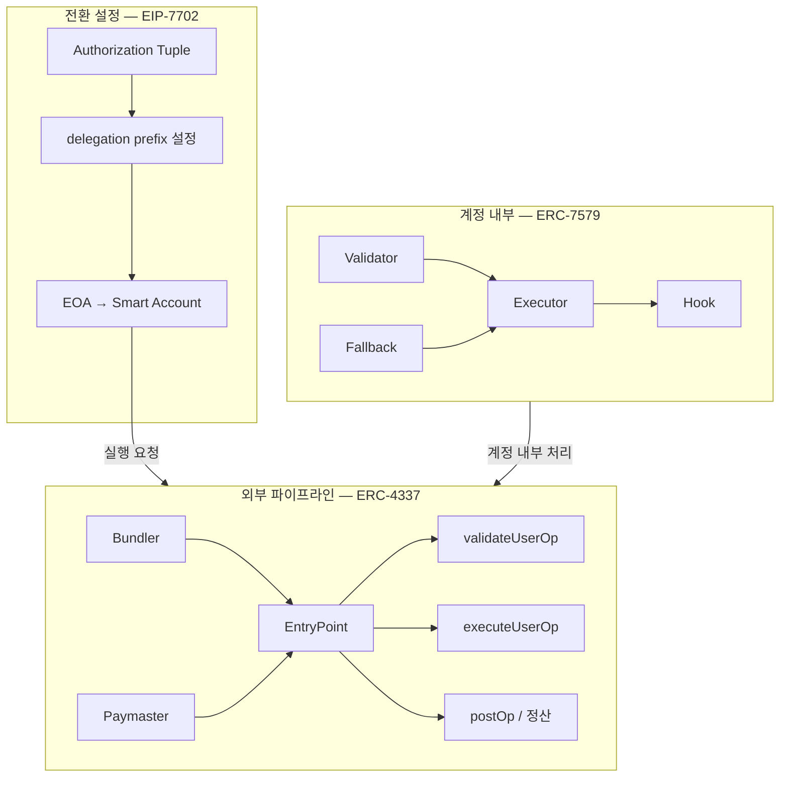
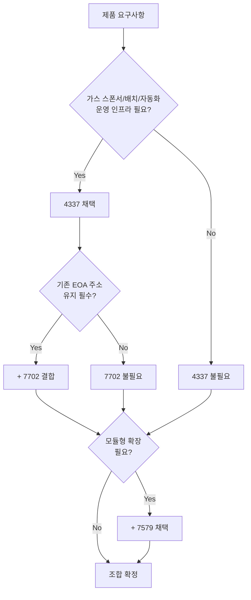
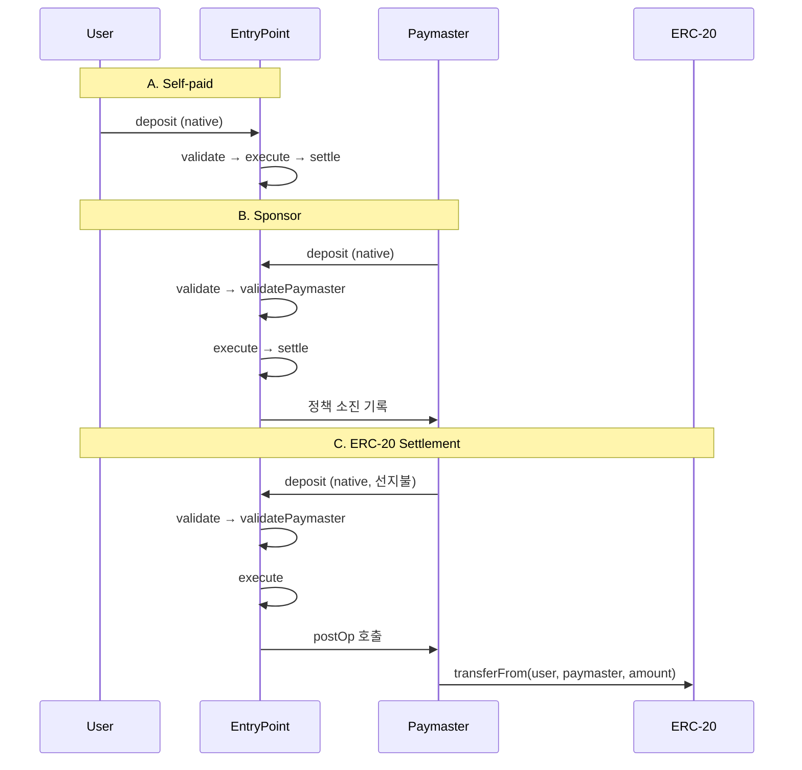
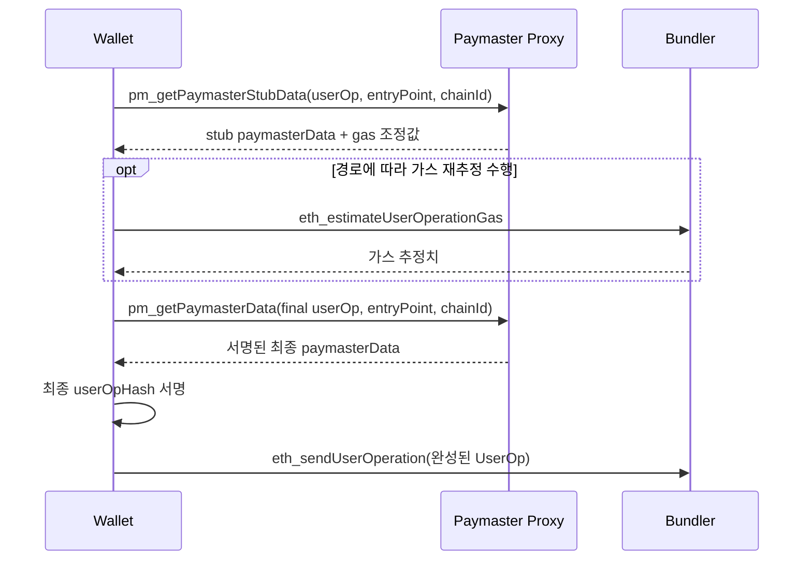
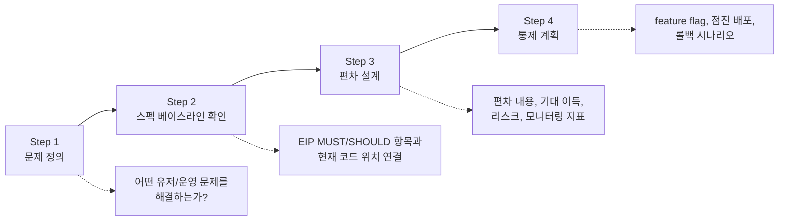

# 06 — 4337 + 7702 + 7579 조합 구조와 수수료 모델

## 배경

앞선 문서(02~05)에서 ERC-4337, EIP-7702, ERC-7579 각각의 **등장 배경-문제-해결**을 다루었다. 그러나 실서비스는 단일 표준으로 완결되지 않는다. "가스 없는 유저 온보딩", "기존 EOA 주소 유지", "자동화 모듈 실행"처럼 실제 제품 요구사항은 세 표준이 동시에 관여하는 지점에서 발생한다.

> **세미나 전달**: "세 표준은 대안이 아니라 보완재다. 4337은 실행 파이프라인, 7702는 주소 전환 경로, 7579는 계정 내부 모듈 구조를 담당한다."

---

## 문제

### 책임 경계 혼동

세 표준을 동시에 적용할 때 가장 흔한 실수는 **어디서 끝나고 어디서 시작하는지** 구분하지 못하는 것이다.

| 혼동 패턴 | 실제 문제 |
|-----------|-----------|
| "4337이 계정 내부 로직도 정의한다" | 4337은 파이프라인만 정의하고, 계정 내부는 7579 영역이다 |
| "7702로 전환하면 4337이 필요 없다" | 7702는 코드 위임 설정이지 실행/정산 인프라가 아니다 |
| "7579 모듈을 설치하면 자동으로 UserOp가 된다" | 모듈 설치 자체가 UserOp를 통해 실행되어야 한다 |

이 혼동은 파라미터 누락, 검증 실패, 정산 오류로 직결된다.

### 수수료 모델 복잡성

같은 기능 호출이라도 **누가 가스를 선지불하고, 최종 비용을 누가 부담하는지**에 따라 파라미터, 검증 로직, 정산 흐름, 운영 리스크가 완전히 달라진다. Smart Account 도입의 최대 실패 포인트는 기능이 아니라 수수료 모델이다.

---

## 해결: 레이어별 책임 분리

### 표준별 역할 정의



| 표준 | 역할 | 핵심 질문 | 코드 진입점 |
|------|------|-----------|-------------|
| **ERC-4337** | 실행/검증/정산 파이프라인 | "가스 스폰서/배치/자동화를 운영 인프라로 다룰 것인가?" | `poc-contract/src/erc4337-entrypoint/EntryPoint.sol` |
| **EIP-7702** | EOA → Smart Account 전환 경로 | "기존 EOA 주소를 유지하면서 전환해야 하는가?" | `apps/wallet-extension/src/background/rpc/handler.ts:804` |
| **ERC-7579** | 계정 내부 모듈 구조 | "기능을 독립 모듈로 배포/교체할 수 있어야 하는가?" | `poc-contract/src/erc7579-smartaccount/Kernel.sol` |

### 표준별 질문 프레임

세 표준을 조합할 때는 다음 질문 순서로 판단한다:

1. **4337 질문**: 가스 스폰서/배치 처리/자동화가 운영 인프라로 필요한가?
2. **7702 질문**: 기존 EOA 주소와 자산/히스토리를 반드시 유지해야 하는가?
3. **7579 질문**: 계정 기능을 독립 모듈로 배포/교체/감사할 수 있어야 하는가?

---

## 조합 패턴 의사결정 가이드

### 문제 기준 선택표



### 권장 패턴 3종

| 우선순위 | 패턴 | 구성 | 대표 시나리오 |
|----------|------|------|---------------|
| 운영 UX 우선 | `4337` + (선택) `7702` | 가스 스폰서/자동화 핵심 | 가스 없는 유저 온보딩 |
| 주소 연속성 우선 | `4337 + 7702` + (선택) `7579` | EOA 자산/히스토리 유지 | 기존 지갑 마이그레이션 |
| 확장성 우선 | `4337 + 7579` + (선택) `7702` | 모듈 배포/교체 | DeFi 자동화, AI Agent |

> **핵심 원칙**: 세 표준은 **보완재**다. 채택 순서는 현재 제품의 최우선 문제가 무엇인지에 따라 결정한다.

---

## 수수료 모델 3종

Smart Account의 수수료 모델은 Paymaster 사용 여부와 정산 방식에 따라 세 가지로 나뉜다.

### 모델 비교

| 항목 | A. Self-paid | B. Sponsor | C. ERC-20 Settlement |
|------|-------------|-----------|----------------------|
| **가스 선지불** | 유저 deposit | Paymaster deposit | Paymaster deposit |
| **최종 비용 부담** | 유저 | 서비스/정책 | 유저 (ERC-20) |
| **Paymaster 필요** | 아니오 | 예 | 예 |
| **postOp 처리** | 없음 | 최소/없음 | ERC-20 회수 |
| **운영 리스크** | 낮음 | 정책/예산 관리 | 오라클/allowance/잔액 |
| **UX 적합** | 숙련 유저 | 신규 온보딩 | 토큰 보유 유저 |

### 자금 흐름 비교



### 코드 분기점

Wallet Extension의 수수료 분기는 **RPC 경로별로 다르게** 동작한다.

```
A) eth_sendUserOperation 경로

gasPayment.type === 'native'
  → Paymaster 요청 생략 (self-pay)

gasPayment.type === 'sponsor' OR (!gasPayment && paymasterUrl 존재)
  → Sponsor 기준 2-Phase 요청(stub → final)

참고: 이 경로는 현재 erc20 tokenAddress context를 전달하지 않는다.

B) stablenet_* 모듈 lifecycle 경로

gasPaymentMode === 'native' | 'sponsor' | 'erc20'
  → erc20인 경우 tokenAddress를 context에 넣어 2-Phase 요청
```

- 코드: `stable-platform/apps/wallet-extension/src/background/rpc/handler.ts`
- 코드: `stable-platform/apps/wallet-extension/src/background/rpc/paymaster.ts`

### Paymaster 데이터 포맷

Paymaster가 사용하는 envelope 헤더는 **25바이트 고정 구조**다.

| Offset | Size | 필드 | 설명 |
|--------|------|------|------|
| 0 | 1 | version | 프로토콜 버전 |
| 1 | 1 | paymasterType | 0=verifying, 1=sponsor, 2=erc20, 3=permit2 |
| 2 | 1 | flags | 확장 플래그 |
| 3-8 | 6 | validUntil | 유효 만료 시간 |
| 9-14 | 6 | validAfter | 유효 시작 시간 |
| 15-22 | 8 | nonce | 재사용 방지 |
| 23-24 | 2 | payloadLen | payload 바이트 수 |
| 25+ | N | payload | 정산 세부 데이터 |

- 코드: `poc-contract/src/erc4337-paymaster/PaymasterDataLib.sol`
- SDK 인코더: `packages/sdk-ts/core/src/paymaster/paymasterDataCodec.ts`

### 2-Phase 호출 패턴

현재 paymaster-proxy 구현은 stub 응답에서 `isFinal: false`를 반환하므로 기본 경로는 **stub → final** 2단계다.



**파라미터 규칙:**
- 순서: `[userOp, entryPoint, chainId(hex), context?]`
- `chainId`는 반드시 **hex string** 형식 (예: `"0x205b"`, 숫자 `8283` 아님)
- context: `{ paymasterType, tokenAddress?, policyId? }`

- Wallet: `stable-platform/apps/wallet-extension/src/background/rpc/paymaster.ts:82-113`
- Proxy: `stable-platform/services/paymaster-proxy/src/app.ts:415-439`

### ERC-20 정산의 운영 리스크

ERC-20 Settlement은 가장 복잡한 수수료 모델이다. postOp 단계에서 토큰 회수가 실패하면 **Paymaster가 손실**을 부담한다.

| 리스크 | 원인 | 영향 | 대응 |
|--------|------|------|------|
| 가격 오라클 stale | 오라클 업데이트 지연 | 환율 오류로 과소/과다 정산 | TTL + freshness 검증 |
| Allowance 부족 | 유저 approve 미실행 | postOp transferFrom 실패 | 사전 allowance 검증 |
| 잔액 부족 | 실행 중 토큰 소진 | postOp 회수 불가 | 사전 잔액 + 마진 확인 |
| Paymaster deposit 고갈 | 선지불 자금 소진 | 새 UserOp 거절 | deposit 모니터링 + 자동 보충 |

**운영 메트릭 권장:**
- Paymaster 유형별 승인/거절률
- UserOp당 평균 스폰서 비용
- 토큰 회수 성공률
- postOp 실패율
- Deposit 잔액 저수위 알림 빈도

> **세미나 전달**: "가스 없는 UX를 제공하려면, 먼저 정산 실패 복구 설계가 되어 있어야 한다."

---

## 제품화 의사결정 프레임워크

### 스펙 준수 vs 의도적 편차

PoC의 목표는 **가능성 검증**이고, 제품의 목표는 **운영 지속**이다. 따라서 스펙 준수 여부보다 **어떤 항목을 유지/편차하고 왜 그런지 추적**하는 것이 더 중요하다.

**의사결정 원칙:**
1. **기본값은 스펙 준수**
2. **편차는 반드시 문서화**
3. **편차는 롤백 가능해야 함**
4. **보안/운영 비용은 수치로 평가**

### 4단계 의사결정 프로세스



### 편차 기록 템플릿

| 항목 | 내용 |
|------|------|
| **항목명** | (예: Paymaster 정책 분리) |
| **기준 스펙** | ERC-4337 §X, MUST/SHOULD |
| **현재 구현** | 코드 경로 + 동작 설명 |
| **편차 여부** | Yes / No |
| **편차 사유** | 제품/성능/운영 근거 |
| **보안 영향** | 위험도 + 영향 범위 |
| **호환성 영향** | 다른 bundler/paymaster와의 호환 |
| **운영 메트릭** | 측정할 지표 |
| **롤백 방법** | 복귀 절차 |
| **담당/리뷰 일자** | 책임자 + 주기적 검토 |

### 위험 분류

| 등급 | 정의 | 예시 |
|------|------|------|
| **P0** | 보안/자금 손실 위험 | 서명 검증 누락, replay 공격 |
| **P1** | 호환성/실행 실패 위험 | EntryPoint 버전 불일치, hash 경로 차이 |
| **P2** | UX/운영 비용 증가 | 가스 추정 오차, receipt 지연 |
| **P3** | 문서/가이드 불일치 | SDK 네이밍 불일치, 문서 미갱신 |

### 현 코드베이스 적용 대상

| 의사결정 항목 | 현재 상태 | 검토 포인트 |
|---------------|-----------|-------------|
| Paymaster 정책 | Trusted 환경 최적화 | Public mempool 호환 필요 시 정책 분리 |
| 모듈 강제 해제 | forceUninstall 구현 | 운영 정책으로 사용 조건 정의 필요 |
| SDK 정렬 전략 | TS 기준, Go 후행 | 버전 정책(semver + migration) 확립 |
| Wallet API 범위 | `stablenet_*` 커스텀 RPC | 공개 범위와 호환 계층 결정 |

> **세미나 전달**: "스펙을 정확히 이해한 팀만이 의도적으로 편차할 수 있다. 편차는 기술이 아니라 책임이다. 문서화와 복구 계획 없는 편차는 편차가 아니라 장애다."

---

## 제품화 준비 체크리스트

- [ ] 스펙-코드 트레이스 매트릭스 최신 상태 유지
- [ ] 에러 코드 + 운영 런북 문서화
- [ ] SDK 버전 정책(semver + 마이그레이션 노트) 확립
- [ ] 관측성 메트릭(성공률, 실패 코드, 정산 격차) 대시보드 구축
- [ ] 보안 리뷰(권한, nonce, replay, delegatecall 정책) 완료
- [ ] Paymaster deposit 모니터링 + 자동 보충 정책 수립
- [ ] ERC-20 정산 실패 대응 플로우 문서화
- [ ] 수수료 모델별 부담 주체 문서화

---

## 왜 이렇게 쓰는가

세 표준의 조합 순서는 "기술 레이어 계층"이 아니라 **"현재 제품이 직면한 문제"**가 결정한다. 4337이 가장 먼저 등장했다고 해서 반드시 먼저 적용해야 하는 것이 아니다.

수수료 모델은 기능(functionality)이 아니라 **재무 정책(financial policy)**이다. Paymaster의 `validatePaymasterUserOp`는 기술 검증이지만, 스폰서 한도/토큰 환율/정산 주기는 사업 의사결정이다. 이 경계를 혼동하면 코드에 사업 로직이 침투하거나, 사업 정책이 스펙 위반을 유발한다.

---

## 개발자 포인트

1. **조합 결정 전 세 가지 질문을 반드시 거쳐라**: 4337(운영), 7702(주소), 7579(확장)
2. **수수료 모델은 `gasPayment.type`에서 분기한다**: 이 필드가 전체 파이프라인 경로를 결정
3. **현재 구현은 2-Phase를 생략하지 않음**: 모든 stub 응답이 `isFinal: false`라 final 호출이 뒤따른다
4. **`chainId`는 hex string**: Paymaster RPC에서 가장 흔한 실패 원인
5. **ERC-20 정산 실패는 Paymaster의 손실**: postOp 코드는 가능한 단순해야 한다
6. **편차는 기록하라**: 스펙 편차 자체가 문제가 아니라, 추적 불가능한 편차가 문제다

---

## 세미나 전달 문장

> "4337의 역할은 실행 인프라, 7702의 역할은 주소 연속성, 7579의 역할은 기능 확장이다. 제품에 필요한 것은 이 중 무엇인지가 아니라, 어떤 순서로 조합하는지다."

> "스폰서십은 기능이 아니라 재무 정책이다. 가스 없는 UX를 주려면, 먼저 정산 실패 시 누가 손실을 보는지부터 설계해야 한다."

> "스펙을 정확히 이해한 팀만이 의도적으로 편차할 수 있다. 편차 기록과 복구 계획이 없으면, 그것은 편차가 아니라 장애 예약이다."

---

## 참조

- [02 — ERC-4337 배경-문제-해결](./02-erc-4337-background-problem-solution.md)
- [03 — ERC-4337 버전 진화](./03-erc-4337-version-evolution.md)
- [04 — EIP-7702 배경-문제-해결](./04-eip-7702-background-problem-solution.md)
- [05 — ERC-7579 배경-문제-해결](./05-erc-7579-background-problem-solution.md)
- `poc-contract/src/erc4337-entrypoint/EntryPoint.sol`
- `poc-contract/src/erc4337-paymaster/PaymasterDataLib.sol`
- `poc-contract/src/erc7579-smartaccount/Kernel.sol`
- `stable-platform/apps/wallet-extension/src/background/rpc/handler.ts`
- `stable-platform/apps/wallet-extension/src/background/rpc/paymaster.ts`
- `stable-platform/services/paymaster-proxy/src/app.ts`
- `stable-platform/packages/sdk-ts/core/src/paymaster/paymasterDataCodec.ts`
- `docs/claude/spec/EIP-4337_7579_통합_스펙준수_보고서.md`
