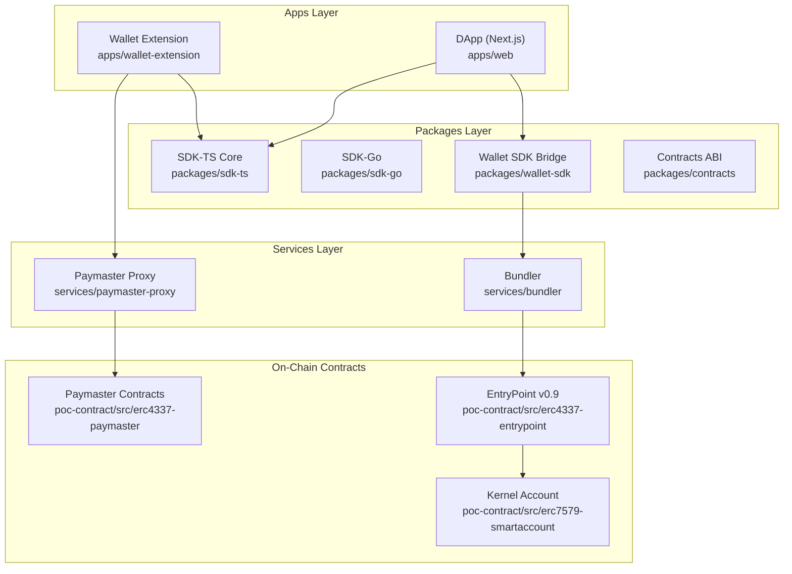
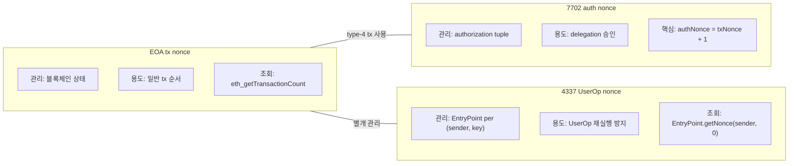

# 07 — 구현 플레이북

## 배경

문서 02~06에서 세 표준의 개념, 버전 진화, 조합 구조, 수수료 모델을 다루었다. 이론을 이해한 개발자가 다음으로 직면하는 문제는 **"그래서 어디서부터 어떤 파라미터를 어떻게 채우는가?"**다.

구현 간극(implementation gap)의 80%는 기능 오해가 아니라 **파라미터 위치, 인코딩 규칙, 검증 순서, 운영 포인트 누락**에서 발생한다.

> **세미나 전달**: "기억하라: `sender/nonce/callData`는 실행 의미, `gas/paymaster`는 실행 가능성, `signature`는 실행 권한이다."

---

## 문제

1. **파라미터 포맷 혼동**: packed vs unpacked, hex vs decimal, 16바이트 패킹 순서 오류
2. **Nonce 3종 혼합**: EOA tx nonce, 7702 authorization nonce, 4337 UserOp nonce를 구분하지 못함
3. **검증 단계 누락**: validation → execution → postOp 각 단계의 실패가 다른 증상을 보이는데, 디버깅 순서를 모름
4. **코드베이스 레이어 미파악**: 같은 로직이 Wallet/SDK/Service/Contract 어디에 있는지 모름

---

## 코드베이스 레이어별 책임 매핑

### 아키텍처 다이어그램



### 레이어별 경로 맵

| 레이어 | 경로 | 핵심 책임 |
|--------|------|-----------|
| **Wallet Extension** | `apps/wallet-extension/src/background/rpc/` | RPC 처리, UserOp 조립, 서명, paymaster 2-phase |
| **DApp** | `apps/web/hooks/` | useSmartAccount, useUserOp, useModuleInstall |
| **SDK-TS** | `packages/sdk-ts/core/src/` | hash, pack, authorization, paymaster codec, modules |
| **SDK-Go** | `packages/sdk-go/` | hash, pack, authorization (TS 기준 후행) |
| **Wallet SDK** | `packages/wallet-sdk/src/` | DApp↔Wallet 브릿지, receipt hooks |
| **Contracts ABI** | `packages/contracts/` | ABI + 주소 생성 (v0.9 canonical) |
| **Bundler** | `services/bundler/src/` | RPC server, gas estimation, validation, reputation |
| **Paymaster Proxy** | `services/paymaster-proxy/src/` | stub/final 라우팅, 서명, 정산 추적 |
| **EntryPoint** | `poc-contract/src/erc4337-entrypoint/` | handleOps, validate/execute/postOp |
| **Kernel** | `poc-contract/src/erc7579-smartaccount/` | 모듈 레지스트리, execute dispatch |
| **Paymaster** | `poc-contract/src/erc4337-paymaster/` | validatePaymasterUserOp, postOp |

### 개념별 코드 매핑

| 개념 | TS | Go | Contract | Bundler |
|------|----|----|----------|---------|
| UserOp Hash (EIP-712) | `sdk-ts/.../userOperation.ts` | `sdk-go/core/userop/hash.go` | `EntryPoint.sol` | `bundler/src/rpc/utils.ts:178-247` |
| PackedUserOp | `sdk-ts/.../userOperation.ts` | `sdk-go/core/userop/packing.go` | — | `bundler/src/rpc/utils.ts:123-171` |
| Authorization Hash | `sdk-ts/core/eip7702/authorization.ts` | `sdk-go/eip7702/authorization.go` | — | — |
| Paymaster Envelope | `sdk-ts/.../paymasterDataCodec.ts` | `sdk-go/core/paymaster/codec.go` | `PaymasterDataLib.sol` | `paymaster-proxy/.../paymasterSigner.ts` |
| Module Lifecycle | `sdk-ts/core/modules/*` | `sdk-go/modules/*` | `Kernel.sol:476,616,653,692` | — |

---

## Nonce 3종 분리 모델

Smart Account 구현에서 가장 위험한 혼동 지점이다. 세 nonce는 **완전히 다른 목적과 관리 주체**를 가진다.



| nonce 종류 | 관리 주체 | 조회 방법 | 사용 맥락 |
|-----------|-----------|-----------|-----------|
| **EOA tx nonce** | 블록체인 상태 | `eth_getTransactionCount(address)` | 일반 tx, 7702 type-4 tx |
| **7702 auth nonce** | Authorization tuple | 현재 EOA nonce + 1 | delegation 승인 해시 |
| **4337 UserOp nonce** | EntryPoint | `EntryPoint.getNonce(sender, key)` | UserOp 제출 |

**핵심 규칙:**
- 7702 authorization 생성 시: `authNonce = currentTxNonce + 1` (같은 tx에서 tx nonce가 먼저 소비되므로)
- 4337 UserOp nonce는 EOA nonce와 **완전히 독립적**
- nonce key 기본값: `0` (multi-path 병렬 실행 시 key 분리 가능)

- 7702 N+1 처리: `apps/wallet-extension/src/background/rpc/handler.ts:1020-1029`
- UserOp nonce 보정: `handler.ts:1192-1215`

> **세미나 전달**: "nonce가 세 종류라는 것만 기억해도 디버깅 시간의 절반을 줄일 수 있다."

---

## 트랜잭션 구성 쿡북

### Cookbook A: EIP-7702 위임

EOA를 Kernel Smart Account로 전환하는 delegation 설정.

**메시지 포맷:**
```
authHash = keccak256(0x05 || rlp([chainId, address, nonce]))
```

**방법 1: Two-step (분리)**
```json
// Step 1: 서명 생성
{
  "method": "wallet_signAuthorization",
  "params": [{
    "account": "0xYourEOA",
    "contractAddress": "0xKernelImplementation",
    "chainId": 8283
  }]
}

// Step 2: 서명을 포함한 type-4 tx 전송
{
  "method": "eth_sendTransaction",
  "params": [{
    "from": "0xYourEOA",
    "to": "0xYourEOA",
    "data": "0x",
    "authorizationList": [signedAuthResult]
  }]
}
```

**방법 2: One-shot**
```json
{
  "method": "wallet_delegateAccount",
  "params": [{
    "account": "0xYourEOA",
    "contractAddress": "0xKernelImplementation",
    "chainId": 8283
  }]
}
```

**성공 검증:** `eth_getCode(EOA)` → `0xef0100` + delegate address prefix 확인

**실패 패턴:**

| 실패 | 원인 | 대응 |
|------|------|------|
| nonce mismatch | authNonce ≠ txNonce + 1 | EOA nonce 재조회 |
| chain mismatch | wallet 네트워크 ≠ 요청 chainId | 네트워크 확인 |
| invalid signature | authHash 계산 불일치 | signer/hash 경로 검증 |

### Cookbook B: ERC-4337 UserOp (Self-paid)

Paymaster 없이 EntryPoint deposit 기반 실행.

**구성 흐름:**
```
DApp: target, value, data 제공
  ↓
Wallet: callData = Kernel.execute(mode, abi.encodePacked(target, value, callData))
  ↓
Wallet: nonce, gas limits 조회/구성
  ↓
Wallet: userOpHash (EIP-712) 서명
  ↓
Bundler: 검증 + EntryPoint 제출
  ↓
EntryPoint: validateUserOp → executeUserOp → settle
```

**UserOp 필드 책임:**

| 필드 | 크기 | 책임 | 비고 |
|------|------|------|------|
| `sender` | address | Wallet | Smart Account 주소 |
| `nonce` | uint256 | Wallet | EntryPoint.getNonce(sender, 0) |
| `factory` | address | SDK | 최초 배포 시만 |
| `factoryData` | bytes | SDK | 계정 init bytecode |
| `callData` | bytes | Wallet/SDK | Kernel.execute(...) 인코딩 |
| `callGasLimit` | uint128 | Bundler+정책 | 실행 가스 한도 |
| `verificationGasLimit` | uint128 | Bundler+정책 | 검증 가스 한도 |
| `preVerificationGas` | uint256 | Bundler/SDK | calldata 오버헤드 |
| `maxFeePerGas` | uint128 | Wallet | EIP-1559 최대 |
| `maxPriorityFeePerGas` | uint128 | Wallet | 팁 |
| `signature` | bytes | Wallet | 계정 서명 결과 |

**PackedUserOperation 포맷 (v0.9):**
```
accountGasLimits = verificationGasLimit(16B) || callGasLimit(16B)
gasFees          = maxPriorityFeePerGas(16B) || maxFeePerGas(16B)
paymasterAndData = paymaster(20B) || valGas(16B) || postOpGas(16B) || paymasterData
```

**userOpHash 계산 (EIP-712):**
```
domainSeparator = keccak256(abi.encode(
  EIP712_DOMAIN_TYPEHASH,
  keccak256('ERC4337'),  // name
  keccak256('1'),        // version
  chainId,
  entryPoint
))
structHash = keccak256(abi.encode(TYPEHASH, ...packedFields))
userOpHash = keccak256(0x1901 || domainSeparator || structHash)
```

- Pack/Unpack: `services/bundler/src/rpc/utils.ts:27-171`
- Auto-encode: `apps/wallet-extension/src/background/rpc/handler.ts:1132-1140`

**주의**: `callData` 없이 `target`만 제공하면 Wallet Extension이 자동으로 `Kernel.execute` 형식으로 인코딩한다.

### Cookbook C: Paymaster 2-Phase (Sponsor / ERC-20)

> 06 문서의 2-Phase 호출 패턴 참조

**Stub Phase 요청:**
```json
{
  "method": "pm_getPaymasterStubData",
  "params": [
    {
      "sender": "0x...",
      "nonce": "0x...",
      "callData": "0x...",
      "callGasLimit": "0x0",
      "verificationGasLimit": "0x0",
      "preVerificationGas": "0x0",
      "maxFeePerGas": "0x0",
      "maxPriorityFeePerGas": "0x0",
      "signature": "0x"
    },
    "0xEntryPoint",
    "0x205b",
    { "paymasterType": "sponsor" }
  ]
}
```

**Final Phase 요청:**
```json
{
  "method": "pm_getPaymasterData",
  "params": [
    { /* gas 필드가 채워진 userOp */ },
    "0xEntryPoint",
    "0x205b",
    { "paymasterType": "erc20", "tokenAddress": "0xToken" }
  ]
}
```

- Schema: `services/paymaster-proxy/src/schemas/index.ts:79-99`
- Handler: `services/paymaster-proxy/src/handlers/`

### Cookbook D: ERC-7579 모듈 설치/해제/교체

**모듈 타입:**

| 타입 | 값 | 목적 | 예시 |
|------|-----|------|------|
| Validator | 1 | 서명 검증 | ECDSA, MultiSig, WebAuthn |
| Executor | 2 | 실행 로직 | Limit order, 자동 스왑 |
| Fallback | 3 | Selector 라우팅 | TokenReceiver |
| Hook | 4 | Pre/Post 로직 | Rate limit, 보안 검증 |

**설치:**
```json
{
  "method": "stablenet_installModule",
  "params": [{
    "account": "0xYourAccount",
    "moduleAddress": "0xModuleAddr",
    "moduleType": "2",
    "initData": "0x...",
    "initDataEncoded": true,
    "chainId": 31337,
    "gasPaymentMode": "sponsor"
  }]
}
```

**해제:**
```json
{
  "method": "stablenet_uninstallModule",
  "params": [{
    "account": "0xYourAccount",
    "moduleAddress": "0xModuleAddr",
    "moduleType": "2",
    "deInitData": "0x",
    "chainId": 31337,
    "gasPaymentMode": "sponsor"
  }]
}
```

**강제 해제** (일반 uninstall revert 시):
```json
{
  "method": "stablenet_forceUninstallModule",
  "params": [{
    "account": "0xYourAccount",
    "moduleAddress": "0xModuleAddr",
    "moduleType": "2",
    "deInitData": "0x",
    "chainId": 31337,
    "gasPaymentMode": "sponsor"
  }]
}
```

**교체** (원자적 old 해제 + new 설치):
```json
{
  "method": "stablenet_replaceModule",
  "params": [{
    "account": "0xYourAccount",
    "oldModuleAddress": "0xOld",
    "newModuleAddress": "0xNew",
    "moduleType": "2",
    "initData": "0x...",
    "deInitData": "0x...",
    "chainId": 31337,
    "gasPaymentMode": "sponsor"
  }]
}
```

**검증:** `isModuleInstalled(type, module)` 상태 변화 + `ModuleInstalled`/`ModuleUninstalled` 이벤트

- Kernel: `poc-contract/src/erc7579-smartaccount/Kernel.sol:476,616,653,692`
- Wallet RPC: `apps/wallet-extension/src/background/rpc/handler.ts:1968,2190,2417,2615`

---

## RPC 엔드포인트 정리

| 엔드포인트 | 파라미터 순서 | 비고 |
|-----------|--------------|------|
| `wallet_signAuthorization` | `[{account, contractAddress, chainId}]` | chainId: number |
| `wallet_delegateAccount` | `[{account, contractAddress, chainId}]` | One-shot |
| `eth_sendUserOperation` (wallet) | `[{sender, target, value, data, gasPayment?}, entryPoint]` | gasPayment 선택 |
| `eth_estimateUserOperationGas` | `[userOp, entryPoint]` | Bundler 추정 |
| `eth_sendUserOperation` (bundler) | `[userOp, entryPoint]` | Packed 포맷 |
| `eth_getUserOperationReceipt` | `[userOpHash]` | Receipt 조회 |
| `pm_getPaymasterStubData` | `[userOp, entryPoint, chainId(hex), context?]` | Stub phase |
| `pm_getPaymasterData` | `[userOp, entryPoint, chainId(hex), context?]` | Final phase |
| `stablenet_installModule` | `[{account, moduleAddress, moduleType, initData, ...}]` | 모듈 설치 |
| `stablenet_uninstallModule` | `[{account, moduleAddress, moduleType, ...}]` | 모듈 해제 |
| `stablenet_forceUninstallModule` | `[{account, moduleAddress, moduleType, ...}]` | 강제 해제 |
| `stablenet_replaceModule` | `[{account, old/newModuleAddress, moduleType, ...}]` | 모듈 교체 |

---

## 단계별 구현 체크리스트

### 계정/전환 계층 (7702)

- [ ] 7702 authorization 생성 및 검증 테스트
- [ ] Delegation target 코드 hash/버전 확인
- [ ] 위임 후 초기화 tx 원자성 확인
- [ ] `eth_getCode` 결과의 `0xef0100` prefix 검증

### 모듈 계층 (7579)

- [ ] Validator/Executor/Hook/Fallback 호출 순서 테스트
- [ ] install/uninstall 권한 분리 (Owner, Guardian, Session)
- [ ] 모듈 제거 후 잔여 권한/스토리지 정리 테스트
- [ ] selector/fallback 충돌 사전 확인

### 실행 파이프라인 (4337)

- [ ] `accountGasLimits`, `gasFees` 패킹 단위 테스트
- [ ] `simulateValidation` 에러 코드 매핑
- [ ] Paymaster on/off 경로 E2E 검증
- [ ] userOpHash (EIP-712) 도메인 분리 검증

### 운영 계층

- [ ] Bundler 장애/지연 시 재시도 정책 정의
- [ ] 실패율, revert 원인, gas 편차 모니터링
- [ ] 체인별 EntryPoint/정책 설정 분리
- [ ] Receipt 추적 + 폴링 타임아웃 정의

### 통합 테스트

- [ ] 7702 delegation 성공/복구 시나리오
- [ ] 4337 UserOp 제출/실행/정산 E2E
- [ ] 최소 1회 모듈 install/uninstall/reinstall 사이클
- [ ] 실패 케이스 회귀 테스트 (서명 오류, gas 부족, 정책 위반)

---

## 에러 코드와 디버깅 순서

### 에러 코드 계층

```
AA2x → Account 검증 단계
  ├─ AA21: prefund 미납 (가스 부족)
  ├─ AA22: 만료 또는 미유효
  └─ AA25: account nonce 불일치

AA3x → Account/Factory 실행 후
  └─ AA34: 서명 검증 실패

AA4x → Paymaster 검증
  ├─ AA40: paymaster 검증 실패
  ├─ AA41: paymaster nonce 불일치
  └─ AA42: 가스 부족 (paymaster 단계)

AA5x → 실행 후
  └─ AA50: postOp 실패

일반 → Bundler/RPC 계층
  ├─ EntryPoint ... not supported → allowlist 불일치
  ├─ Invalid parameters → chainId/포맷 오류
  └─ EE* → EntryPoint 버전 불일치
```

### 6단계 디버깅 프로토콜

1. **Wallet 로그에서 최종 UserOp payload 확인**
   - sender, nonce, callData, gas 필드, signature 캡처

2. **Bundler 가스 추정 성공 여부**
   - `eth_estimateUserOperationGas` 호출
   - 실패 시: nonce, callData 인코딩, 계정 존재 여부 확인

3. **Bundler 제출 응답 코드**
   - `eth_sendUserOperation` 호출
   - 거절 시: AA 코드 확인 (AA25, AA21, AA34, AA40 등)

4. **EntryPoint 이벤트 존재 여부**
   - `eth_getLogs(EntryPoint, UserOperationEvent filter)` 조회
   - 부재 시: 블록 높이, 온체인 실행 상태 확인

5. **Paymaster deposit 및 allowance 확인**
   - `eth_getBalance(paymaster)` > 예상 gas cost
   - ERC-20 경로: allowance 확인

6. **모듈 상태 확인 (install/uninstall 관련)**
   - `Kernel.isModuleInstalled(type, module)` → 의도와 일치 여부
   - `ModuleInstalled`/`ModuleUninstalled` 이벤트 확인

> **현장 디버깅 원칙**: "실패하면 chainId → entryPoint → nonce 순서로 확인하라. 70%의 문제가 이 세 가지 중 하나다."

---

## 실패 패턴과 대응표

### 파라미터 인코딩 오류

| 실패 | 잘못된 방식 | 올바른 방식 |
|------|------------|------------|
| callData 불일치 | target의 calldata를 직접 UserOp.callData에 삽입 | `Kernel.execute(mode, abi.encodePacked(target, value, callData))` |
| paymasterData 구조 | 25바이트 envelope 없이 raw payload | envelope(25B) + payload |
| nonce key 혼동 | 의도 없이 임의 key 사용 | 기본 key=0, multi-path 시 key 분리 명시 |
| gas 패킹 순서 | `callGasLimit \|\| verificationGasLimit` | `verificationGasLimit(16B) \|\| callGasLimit(16B)` |

### 서명/도메인 오류

| 실패 | 원인 | 대응 |
|------|------|------|
| userOpHash 불일치 | EIP-712 domain 파라미터 오류 | name='ERC4337', version='1', chainId, entryPoint 검증 |
| Validator 접두사 기대 불일치 | 서명 포맷(with/without 6492 wrapper) | validator 온체인 기대 포맷 확인 |

### 가스 추정 오류

| 실패 | 원인 | 대응 |
|------|------|------|
| simulateValidation 통과 → 제출 실패 | preVerificationGas 부족 | 5-10% 버퍼 추가, 7702 authorizationList 오버헤드(+25k) 반영 |
| verification vs call gas 뒤바뀜 | 패킹 순서 오류 | `accountGasLimits = verificationGasLimit \|\| callGasLimit` 확인 |

### Paymaster 오류

| 실패 | 원인 | 대응 |
|------|------|------|
| "Invalid parameters" | chainId를 decimal로 전송 | hex string 변환 (8283 → "0x205b") |
| "deposit low" | 스폰서 잔액 부족 | paymaster 충전 후 재시도 |
| "exceeded policy quota" | 정책 한도 초과 | 정책 재설정 또는 다른 paymaster |
| postOp revert | ERC-20 회수 실패 | allowance/잔액/오라클 검증 |

### Bundler 오류

| 실패 | 원인 | 대응 |
|------|------|------|
| "EntryPoint not supported" | allowlist 불일치 | `services/bundler/src/cli/config.ts:124-139` 확인 |
| receipt null (1분 이상) | mempool 지연 또는 온체인 이슈 | 폴링 타임아웃 증가, EntryPoint 이벤트 로그 수동 확인 |

---

## Spec → Code Trace Matrix (핵심 항목)

> 전체 매트릭스는 `seminar/SEMINAR_SPEC_CODE_TRACE_MATRIX_KO_2026-03-02.md` 참조

| 도메인 | 스펙 요구 | 코드 경로 | 상태 | 세미나 포인트 |
|--------|-----------|-----------|------|---------------|
| 4337-Hash | v0.9 EIP-712 userOpHash | `sdk-ts/.../userOperation.ts`, `sdk-go/.../hash.go`, `EntryPoint.sol` | PASS | "문서-TS-Go-컨트랙트가 동일 hash 공식 사용" |
| 4337-Pack | PackedUserOperation 필드/순서 | `sdk-ts/.../userOperation.ts`, `sdk-go/.../packing.go` | PASS | "gas/fee 16바이트 패킹 순서 오류 = 실패" |
| 4337-RPC | sendUserOperation, receipt/byHash | `services/bundler/src/rpc/server.ts` | PARTIAL | "Receipt fallback/운영 정책 중요" |
| 4337-Gas | preVerification/verification/call | `services/bundler/src/gas/gasEstimator.ts` | PARTIAL | "7702 +25k/페널티 포함 검증 필요" |
| PM-Format | paymasterAndData 파싱 | `PaymasterDataLib.sol`, `BasePaymaster.sol` | PASS | "Offset(0/20/36/52) 파싱 이해 = 핵심" |
| PM-RPC | stub/final 2-phase | `services/paymaster-proxy/src/app.ts` | PASS | "stub → final 2단계 (경로별로 가스 재추정)" |
| 7702-Auth | authHash 계산 | `sdk-ts/.../authorization.ts`, `sdk-go/.../authorization.go` | PASS | "auth nonce ≠ tx nonce (별도 설명)" |
| 7579-Module | install/uninstall/isInstalled | `Kernel.sol`, `sdk-ts/.../modules/*`, `sdk-go/.../modules/*` | PASS | "모듈 lifecycle = 계정 운영 핵심" |
| 7579-Fallback | Fallback sender context/selector 충돌 | `Kernel.sol`, `TokenReceiverFallback.sol` | PARTIAL | "투명한 충돌 논의 = 신뢰 구축" |

**PARTIAL 항목 우선 대응:**

| 우선순위 | 항목 | 조치 |
|----------|------|------|
| P0 | Bundler hash/receipt 정합 | `eth_getUserOperationReceipt` 온체인 fallback + 회귀 테스트 |
| P1 | EntryPoint 기본값 통일 | SDK/서비스/앱 기본 정책(v0.9 우선) 문서 + 코드 동기화 |
| P1 | 7702 preVerificationGas 검증 | bundler/paymaster 추정기 공통 검증 벡터 |
| P1 | 7579 fallback selector 충돌 | Kernel 내장 receiver vs fallback 모듈 우선순위 문서화 |
| P2 | Settlement 실패 복구 | Reservation TTL/retry 런북 표준화 |

---

## 왜 이렇게 쓰는가

구현 플레이북은 "무엇을 만드는가"가 아니라 **"어떤 순서로, 어떤 파라미터를, 어디서 채우는가"**에 집중한다. 이론 문서(02~06)가 "왜"를 설명한다면, 이 문서는 "어떻게"를 설명한다.

Nonce가 세 종류라는 것, callData가 자동 인코딩된다는 것, chainId가 hex여야 한다는 것 — 이런 디테일 하나하나가 실제 구현에서 수 시간의 디버깅을 결정한다. SDK가 있어도 RPC 패킷 구조를 이해해야 디버깅이 가능한 이유다.

---

## 개발자 포인트

1. **Nonce 세 종류를 절대 혼동하지 마라**: EOA tx, 7702 auth, 4337 UserOp
2. **callData는 Kernel.execute 형식으로 인코딩해야 한다**: target/value/data를 직접 넣지 않는다
3. **패킹 순서가 중요하다**: `verificationGasLimit || callGasLimit` 순서를 뒤집으면 즉시 실패
4. **chainId hex 변환을 잊지 마라**: Paymaster RPC의 #1 실패 원인
5. **Receipt가 null이면 바로 EntryPoint 이벤트 로그를 확인하라**
6. **모듈 uninstall 실패 시 forceUninstall을 대비하라**: 정상 경로와 비상 경로 모두 테스트

---

## 세미나 전달 문장

> "구현 난이도의 80%는 기능 이해가 아니라, 파라미터 위치와 인코딩 규칙에서 나온다."

> "sender/nonce/callData는 실행 의미, gas/paymaster는 실행 가능성, signature는 실행 권한이다. 이 구분을 잊으면 디버깅이 불가능해진다."

> "SDK가 있어도 RPC 패킷 구조를 이해해야 한다. 디버깅은 항상 raw 수준에서 시작된다."

---

## 참조

- [06 — 4337+7702+7579 조합 구조와 수수료 모델](./06-how-they-fit-together.md)
- `poc-contract/src/erc4337-entrypoint/EntryPoint.sol`
- `poc-contract/src/erc7579-smartaccount/Kernel.sol`
- `poc-contract/src/erc4337-paymaster/PaymasterDataLib.sol`
- `stable-platform/apps/wallet-extension/src/background/rpc/handler.ts`
- `stable-platform/apps/wallet-extension/src/background/rpc/paymaster.ts`
- `stable-platform/services/bundler/src/rpc/server.ts`
- `stable-platform/services/bundler/src/rpc/utils.ts`
- `stable-platform/services/paymaster-proxy/src/app.ts`
- `stable-platform/packages/sdk-ts/core/src/utils/userOperation.ts`
- `stable-platform/packages/sdk-ts/core/src/eip7702/authorization.ts`
- `stable-platform/packages/sdk-ts/core/src/paymaster/paymasterDataCodec.ts`
- `seminar/SEMINAR_SPEC_CODE_TRACE_MATRIX_KO_2026-03-02.md`
- `seminar/SEMINAR_TRANSACTION_COOKBOOK_KO_2026-03-02.md`
