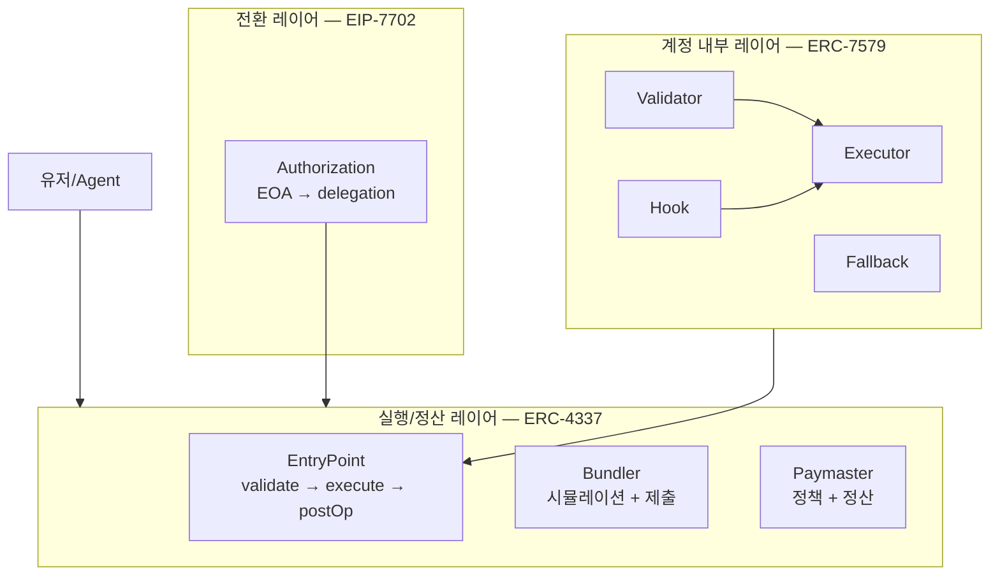
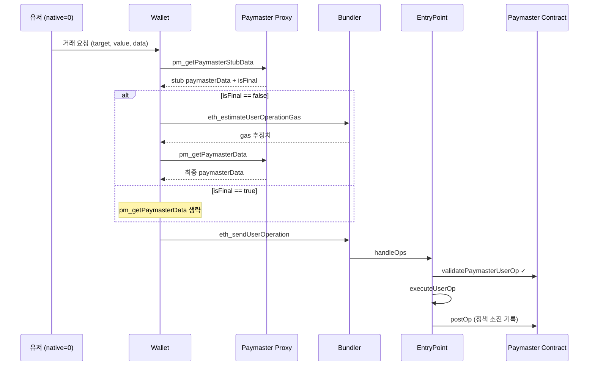
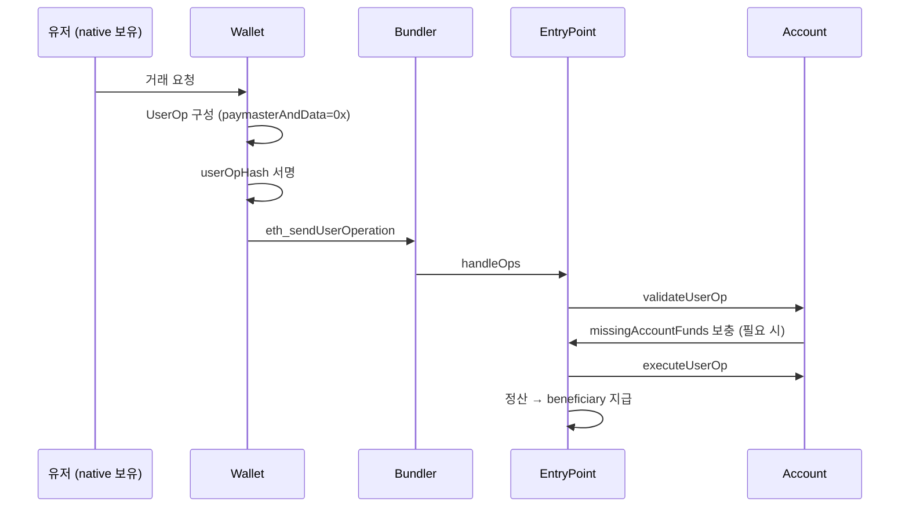
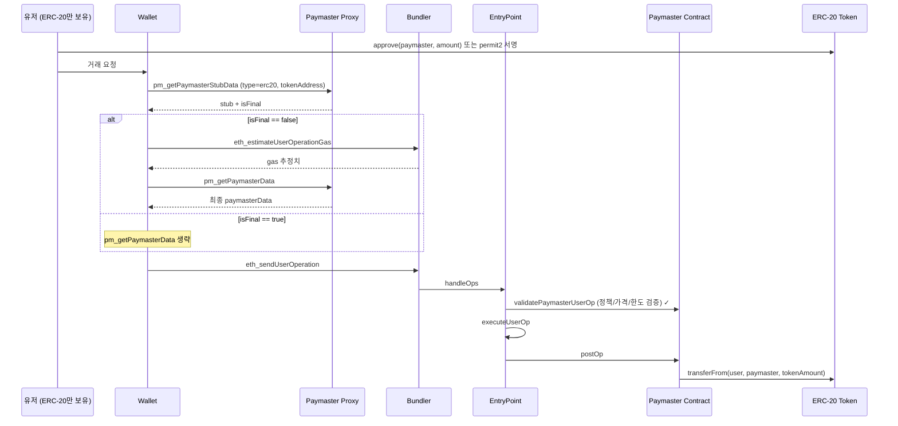
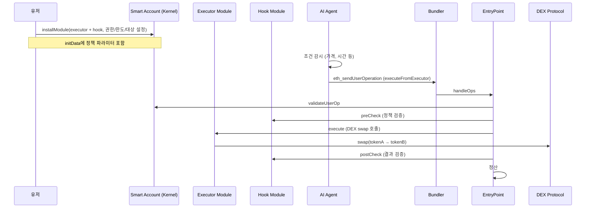

# 08 — 실전 유즈케이스와 아키텍처 매핑

## 배경

문서 02~07에서 세 표준의 개념, 버전 진화, 조합 구조, 수수료 모델, 구현 플레이북을 다루었다. 이론과 구현 지식이 갖추어진 상태에서 남은 질문은 **"실제 제품에서 왜 이 조합을 쓰는가?"**다.

스펙 이해와 실제 서비스 요구 사이에는 간극이 있다. "왜 이 조합을 선택했는가"가 흐려지면 구현 우선순위가 흔들리고, 팀 내 의사소통 비용이 급격히 증가한다.

> **세미나 전달**: "유즈케이스가 조합을 결정한다. 스펙을 먼저 고르고 유즈케이스를 끼워 맞추면, 불필요한 복잡성만 늘어난다."

---

## 문제

1. **조합 근거 부재**: "4337+7702+7579를 왜 쓰는가?"에 대한 답이 "다 좋으니까"로 끝남
2. **유즈케이스별 책임 불명확**: 같은 기능을 다른 레이어에서 중복 구현하거나, 필수 레이어를 누락
3. **실습/검증 기준 부재**: 유즈케이스별 성공/실패 판정 기준이 없어 PoC 품질 측정 불가

---

## 공통 아키텍처 맵

모든 유즈케이스에 공통으로 적용되는 레이어별 책임 구조다.

| 레이어 | 책임 | 핵심 컴포넌트 |
|--------|------|---------------|
| **실행/정산** (ERC-4337) | UserOp 검증, 실행, 비용 정산 | EntryPoint, Bundler, Paymaster |
| **전환/주소 유지** (EIP-7702) | EOA 주소 보존 + 코드 위임 | Authorization Tuple, type-4 tx |
| **계정 내부 확장** (ERC-7579) | 검증/실행/정책 모듈화 | Validator, Executor, Hook, Fallback |

---

## Use Case A: Native Coin 없는 유저, Paymaster 스폰서 가스

### 문제

신규 유저는 native coin이 없어 **첫 트랜잭션 자체가 불가능**하다. 온보딩 장벽을 제거해야 서비스 채택이 가능하다.

### 해결 패턴

Paymaster가 native gas를 선지불하고, 정책 기반으로 스폰서십을 제공한다.

### 실행 흐름

### 핵심 파라미터

- `userOp.paymasterAndData`: Paymaster 정책 + 서명 데이터
- `paymasterVerificationGasLimit`: 검증 단계 가스
- `paymasterPostOpGasLimit`: postOp 단계 가스
- `isFinal`: stub 응답만으로 제출 가능한지 여부
- 정책 데이터: 만료시간, 서명, quota

### 실패 포인트

| 실패 | 원인 | 영향 |
|------|------|------|
| PM deposit 부족 | 스폰서 자금 고갈 | 새 UserOp 거절 |
| 정책 거절 | 서명 오류, 만료, 한도 초과 | AA40 에러 |
| postOp 실패 | 내부 회계 처리 오류 | AA50, 정산 불일치 |

### 책임 매핑

| 표준 | 필수/선택 | 이유 |
|------|-----------|------|
| 4337 | **필수** | 실행/정산 파이프라인 |
| 7579 | 선택 | 계정 내부 정책 확장 시 |
| 7702 | 선택 | EOA 주소 유지 요구 시 |

---

## Use Case B: Native Coin 있는 유저, 직접 비용 지불

### 문제

Paymaster 없이도 4337 파이프라인을 사용하여 Smart Account 기능(배치, 자동화)을 활용하고 싶다.

### 해결 패턴

Account가 직접 EntryPoint deposit 기반으로 비용을 부담한다.

### 실행 흐름

### 핵심 파라미터

- `preVerificationGas`: 오프체인 가스 비용
- `accountGasLimits`: verificationGasLimit(16B) || callGasLimit(16B)
- `gasFees`: maxPriorityFeePerGas(16B) || maxFeePerGas(16B)
- `signature`: Account가 서명한 userOpHash
- `nonce`: EntryPoint.getNonce(sender, 0)

### 실패 포인트

| 실패 | 원인 | 영향 |
|------|------|------|
| missingAccountFunds 미보충 | deposit 부족 | AA21 |
| nonce 충돌 | 중복 제출 | AA25 |
| 서명 오류 | hash 불일치 | AA34 |
| gas 부족 | 한도 과소 설정 | 실행 중 revert |

### 책임 매핑

| 표준 | 필수/선택 | 이유 |
|------|-----------|------|
| 4337 | **필수** | 실행/정산 파이프라인 |
| 7579 | 선택 | 모듈형 계정이면 내부 검증/실행 위임 |
| 7702 | 선택 | EOA 전환 필요 시 |

---

## Use Case C: Native Coin 없음 + ERC-20 보유, 사후 정산

### 문제

유저는 ERC-20 토큰은 보유하지만 native coin이 없다. 토큰 기반 가스 결제 UX가 필요하다.

### 해결 패턴

Paymaster가 우선 native gas를 지불하고, 실행 후 **postOp에서 ERC-20으로 회수**한다.

### 실행 흐름

### 핵심 파라미터

- `paymasterAndData` 내부: paymaster(20B) + 타임스탬프 + 토큰 주소 + 정산 파라미터 + 서명
- Permit2 서명 데이터 또는 allowance 상태
- 가격 오라클 참조값 (환율 + 마크업)
- context: `{ paymasterType: "erc20", tokenAddress: "0x..." }`

### 실패 포인트

| 실패 | 원인 | 영향 |
|------|------|------|
| allowance 부족 | approve 미실행 | postOp transferFrom 실패 → **PM 손실** |
| 가격 오라클 stale | 업데이트 지연 | 과소/과다 정산 |
| 토큰 잔액 부족 | 실행 중 잔액 소진 | postOp 회수 불가 |
| permit2 만료 | 서명 유효기간 초과 | 검증 단계 실패 |

### 책임 매핑

| 표준 | 필수/선택 | 이유 |
|------|-----------|------|
| 4337 | **필수** | 실행/정산 + Paymaster 파이프라인 |
| 7579 | 선택 | 토큰 approve 자동화 시 executor 활용 |
| 7702 | 선택 | EOA 주소 유지 필요 시 |

> **세미나 전달**: "ERC-20 정산에서 postOp 실패는 유저가 아닌 Paymaster의 손실이다. 따라서 postOp 코드는 극히 단순해야 한다."

---

## Use Case D: 7579 DeFi Swap 모듈 + AI Agent 자동 실행

### 문제

반복 주문(DCA), 조건 주문(limit order)은 유저가 매번 수동으로 트랜잭션을 보내야 한다. 자동화가 필요하지만, **권한 경계와 정책 제약 없이 자동화하면 자금 위험**이 생긴다.

### 해결 패턴

Smart Account에 **Executor 모듈**(7579)을 설치하고, Hook 모듈로 정책을 강제한다. 유저가 사전 승인한 범위 내에서 AI Agent가 UserOp를 생성/제출한다.

### 실행 흐름

### 핵심 파라미터

**모듈 설치:**
- `installModule` callData
- 모듈 타입: Executor(2), Hook(4)
- initData: 권한 설정, 한도, 허용 대상

**정책 파라미터:**
- slippage tolerance (최대 허용 슬리피지)
- 최대 스왑 금액
- 허용 토큰 목록
- 허용 프로토콜/DEX
- 만료 시간

**실행 조건:**
- 목표 가격 (limit order)
- 시간 주기 (DCA: 매시간, 매일)
- 실행 만료 시간

### 실패 포인트

| 실패 | 원인 | 영향 |
|------|------|------|
| Hook revert | agent 권한 초과 요청 | 실행 거부 |
| 정책 위반 | 가격/금액/한도 초과 | Hook에서 revert |
| slippage 위반 | 시장 변동 | 스왑 실패 |
| selector 충돌 | 모듈 간 fallback 충돌 | 예상치 못한 라우팅 |
| initData 불일치 | 설치 파라미터 오류 | 모듈 동작 이상 |

### 책임 매핑

| 표준 | 필수/선택 | 이유 |
|------|-----------|------|
| 4337 | **필수** | 실행 전달/정산 |
| 7579 | **필수** | 모듈형 자동화 |
| 7702 | 선택 | EOA 기반 전환 필요 시 |

---

## 유즈케이스 선택 가이드

| 요구사항 | 권장 유즈케이스 | 권장 조합 | 핵심 포인트 |
|----------|----------------|-----------|-------------|
| 신규 유저 온보딩 (가스 없음) | A | 4337 + Paymaster | 스폰서 정책/deposit 관리 |
| 기본 Smart Account 전환 | B | 4337 | deposit 기반 자가 정산 |
| 토큰 기반 가스 결제 | C | 4337 + ERC-20 Paymaster | postOp 정산 + 오라클 |
| 자동화/Agent 실행 | D | 4337 + 7579 | Executor/Hook 권한 정책 |
| 기존 EOA 주소 유지 필수 | A~D + 7702 | 위 조합 + 7702 | 주소 호환성 전환 |

---

## 실습 가이드 (Lab A~D)

### 공통 환경 전제

- **StableNet 로컬**: Chain ID 8283, RPC `http://localhost:8501`
- **EntryPoint**: `0xEf6817fe73741A8F10088f9511c64b666a338A14`
- **Bundler**: `http://localhost:4337`
- **Paymaster Proxy**: `http://localhost:4338`
- 테스트 토큰(ERC-20) 배포 완료
- Smart Account 배포/초기화 스크립트 준비

### Lab A: Paymaster Sponsor

**목표**: 가스 없는 신규 유저가 첫 거래를 성공한다.

**절차:**
1. native coin 0인 테스트 계정 준비
2. paymasterData 포함 UserOperation 생성 (type=sponsor)
3. `pm_getPaymasterStubData` 호출 후 `isFinal` 확인 (`false`면 `eth_estimateUserOperationGas` → `pm_getPaymasterData`, `true`면 final 생략)
4. `eth_sendUserOperation` 제출
5. `eth_getUserOperationReceipt`에서 Paymaster 경유 실행 확인

**체크 포인트:**
- [ ] `validatePaymasterUserOp` 통과
- [ ] Paymaster deposit 감소 확인
- [ ] postOp 후 내부 회계 값 변화

**실패 실습:**
- Paymaster 서명을 고의로 변조 → AA40 거절 코드 확인
- Paymaster deposit을 부족 상태로 설정 → 실패 확인 및 에러 메시지 분석

**성공 판정**: receipt.success=true + Paymaster 이벤트 존재

### Lab B: Self-paid UserOp

**목표**: Paymaster 없이 4337 실행/정산을 완료한다.

**절차:**
1. native coin 보유 계정으로 UserOperation 생성 (`paymasterAndData=0x`)
2. `eth_estimateUserOperationGas` → `eth_sendUserOperation`
3. `eth_getUserOperationReceipt` 확인

**체크 포인트:**
- [ ] `validateUserOp` 통과
- [ ] nonce 증가 확인
- [ ] beneficiary 수수료 지급 확인

**실패 실습:**
- signature 변조 → AA34 검증 실패 확인
- nonce를 의도적으로 틀리게 → AA25 오류 확인
- gas limit 과소 설정 → 실행 부족 에러

**성공 판정**: receipt.success=true + EntryPoint UserOperationEvent 존재

### Lab C: ERC-20 가스 정산

**목표**: Paymaster 선지불 후 ERC-20으로 사후 회수 흐름을 재현한다.

**절차:**
1. 유저에게 ERC-20 지급, native coin은 0 유지
2. `approve(paymaster, amount)` 또는 permit2 권한 설정
3. ERC-20 결제 payload로 UserOperation 제출 (type=erc20, tokenAddress)
4. postOp 이후 토큰 회수/정산 확인

**체크 포인트:**
- [ ] 권한(allowance/permit) 검증 통과
- [ ] 실제 gas cost 대비 토큰 차감량 검증
- [ ] 오라클/마크업 파라미터 반영 여부
- [ ] 토큰 주소 정합성

**실패 실습:**
- allowance 부족 → postOp 회수 실패 확인 (PM 손실)
- permit 만료 → 검증 단계 실패
- 오라클 stale 데이터 → 가격 오류

**성공 판정**: receipt.success=true + ERC-20 transferFrom 이벤트 존재

### Lab D: 7579 모듈 + 자동화

**목표**: Executor/Hook 모듈 조합으로 자동화 거래를 실행한다.

**절차:**
1. 계정에 swap executor + 정책 hook 설치 (`stablenet_installModule`)
2. 정책 설정 (한도/slippage/허용 대상)
3. Agent가 조건 충족 시 UserOperation 생성/제출
4. 모듈 실행 및 hook pre/post 검증 로그 확인
5. 모듈 lifecycle: install → uninstall → forceUninstall → replace

**체크 포인트:**
- [ ] `executeFromExecutor` 권한 검증
- [ ] hook 정책 위반 시 정확히 revert
- [ ] 조건 충족 시 자동 주문 성공
- [ ] 모듈 상태 일관성 (`isModuleInstalled`)

**실패 실습:**
- Agent가 허용 범위 초과 요청 → hook revert
- slippage 조건 위반 → 스왑 실패
- 만료된 정책으로 실행 시도 → 검증 실패
- 모듈 uninstall 실패 → forceUninstall 대체

**성공 판정**: 모듈 상태 변화 + 트랜잭션 결과 일치 + Hook 이벤트 로그

### 공통 로그 수집 포인트

- `eth_sendUserOperation` 응답 userOpHash
- `eth_getUserOperationByHash` (추적 상태)
- `eth_getUserOperationReceipt` (최종 결과)
- EntryPoint 이벤트: `UserOperationEvent`, revert reason

### 실습 완료 기준

- [ ] A~D 각 유즈케이스 최소 **1회 성공** 로그 확보
- [ ] A~D 각 유즈케이스 최소 **1회 실패** 로그 확보
- [ ] 실패 원인을 **validation/execute/postOp** 단계로 분류 가능
- [ ] 문서화 산출물: 입력 파라미터, 성공/실패 tx hash, 재현 절차, 개선 액션

---

## PoC 데모 스크립트 (90분 기준)

### 타임라인

| 시간 | 세그먼트 | 핵심 산출물 |
|------|----------|-------------|
| 0~10분 | 문제 정의: EOA 한계 | Smart Account 필요성 공감 |
| 10~25분 | ERC-4337 철학/Actor | UserOp 모델, EntryPoint/Bundler/Paymaster 역할 |
| 25~35분 | EntryPoint v0.6→v0.9 진화 | 변경 근거와 설계 선택 |
| 35~45분 | EIP-7702 핵심 | EOA 주소 + delegation 모델 |
| 45~58분 | ERC-7579 핵심 | 모듈형 계정/lifecycle/권한 |
| 58~72분 | 트랜잭션 구성 Hands-on | 파라미터 위치, 책임 경계 |
| 72~85분 | PoC 데모 A~D | End-to-end 검증 |
| 85~90분 | 결론/Q&A | 제품 의사결정 프레임 전달 |

### Demo A: EOA → 7702 Delegation

- **시작**: Plain EOA 상태 확인 (`eth_getCode` → `0x`)
- **액션**: `wallet_delegateAccount` 호출
- **결과**: type-4 tx 생성 → delegation 반영
- **성공**: `eth_getCode(EOA)` → `0xef0100` + delegate prefix

### Demo B: Self-paid UserOp

- **입력**: target/value/data (paymaster 없음)
- **실행**: EntryPoint deposit 기반 정산
- **성공**: `eth_sendUserOperation` → hash 반환, receipt success=true

### Demo C: Sponsor → ERC-20 전환

- **포인트**: 같은 유저 액션, 수수료 정책만 변경
- **Sponsor**: `pm_getPaymasterStubData` (type=sponsor)
- **ERC-20**: context에 `tokenAddress` 추가
- **전환**: context 파라미터 변경만으로 모델 전환 시연

### Demo D: 7579 모듈 Lifecycle

- **시퀀스**: install → `isModuleInstalled` 확인 → uninstall → forceUninstall → replace
- **포인트**: 일반 uninstall 실패 → 비상 forceUninstall로 전환하는 운영 시나리오

### 데모 실패 시 대응

| 상황 | 백업 플랜 |
|------|-----------|
| 라이브 실패 | 사전 생성된 userOpHash/txHash로 receipt/event 조회 중심 전환 |
| Paymaster 장애 | Self-paid 경로로 전환 시연 |
| 모듈 uninstall 실패 | forceUninstall을 **교육 포인트**로 활용 |
| 네트워크 지연 | 로컬 환경 사전 점검 결과 표시 |

### D-Day 사전 점검

- [ ] `make health` → 모든 서비스 200 응답
- [ ] EntryPoint 주소 app/bundler/paymaster 통일 확인
- [ ] 데모 계정 잔액(ETH balance, token allowance) 확인
- [ ] 브라우저 extension 연결 → 테스트 dApp 확인
- [ ] 대표 실패 시나리오 해시/스크린샷 준비

---

## 장애 대응 매트릭스

### 공통 디버깅 프레임

질문 기반으로 접근한다:
1. "이 문제는 4337/7579/7702 중 **어느 레이어**인가?"
2. "실패는 **validation/execute/postOp** 중 어디서 발생했는가?"
3. "**정책 실패**인가, **포맷 실패**인가, **자금/권한 실패**인가?"
4. "**온체인** 수정이 필요한가, **SDK/서버** 인코딩 수정이 필요한가?"

### 대표 실패 시나리오

| 실패 유형 | 원인 | 복구 절차 |
|-----------|------|-----------|
| Paymaster deposit 부족 | 스폰서 자금 고갈 | native coin 추가 충전 → 재시도 |
| Paymaster 서명 오류 | paymasterAndData 인코딩 불일치 | SDK 파서 ↔ 컨트랙트 검증 로직 동기화 |
| Allowance 부족 | ERC-20 권한 미설정 | approve/permit2 재실행 |
| UserOp nonce 충돌 | 중복 제출/실패 재시도 | nonce 강제 재조회 |
| Gas limit 과소 | 가스 추정 오류 | `eth_estimateUserOperationGas` 재호출 |
| Module 충돌 | selector/fallback 충돌 | uninstall → forceUninstall → replace |
| Receipt 미조회 | Bundler mempool 지연 | 폴링 타임아웃 증가 + EntryPoint 이벤트 직접 조회 |

### 재시도 규칙

1. 재시도는 **nonce/fee/policy를 분리**해 한 항목씩 조정
2. 동시에 두 항목 이상 변경 금지 — 원인 추적 불가
3. 3회 재시도 후 실패 시 **레이어를 바꿔** 진단 (예: RPC → 온체인 이벤트)

---

## Q&A 핵심 30문항

### 개념 (1~10)

**Q1.** Smart Account를 한 문장으로 정의하면?
> "트랜잭션 승인/실행/수수료 정책을 계정 코드로 프로그래밍 가능한 계정"이다.

**Q2.** 왜 EOA만으로는 한계가 있나?
> EOA는 코드 실행 로직을 직접 가질 수 없어, 조건부 승인/자동 실행/모듈 확장이 불가능하다.

**Q3.** ERC-4337의 철학은?
> UserOp를 분리하고, 트랜잭션 제출/검증/정산을 EntryPoint 중심의 계약 경계로 재구성하는 것이다.

**Q4.** ERC-4337에서 새로 등장한 핵심 actor는?
> Bundler, EntryPoint, Smart Account(Account contract), Paymaster다.

**Q5.** UserOp와 L1 트랜잭션의 차이는?
> UserOp는 실행 요청 메시지이고, 실제 체인 tx는 Bundler가 제출한다.

**Q6.** EIP-7702의 핵심 가치는?
> EOA를 delegation 기반으로 확장해, 계정 전환 UX를 유연하게 만든다.

**Q7.** ERC-7579의 핵심 가치는?
> Smart Account를 validator/executor/fallback/hook 모듈로 분리해 확장성과 유지보수성을 높인다.

**Q8.** 왜 4337 + 7702 + 7579를 조합하나?
> 4337은 실행 파이프라인, 7702는 EOA 전환/호환, 7579는 모듈 확장 책임을 분리해 운영성을 확보하기 위해서다.

**Q9.** 세미나에서 가장 먼저 이해시켜야 할 것은?
> "어떤 상황에서 어떤 파라미터를 누가 채우는지"다.

**Q10.** 세 표준은 대안인가?
> 아니다. **보완재**다. 각각 다른 문제를 해결한다.

### 버전/스펙 (11~15)

**Q11.** 왜 v0.6 이후 버전 진화가 필요했나?
> 정합성, 보안 규칙, 상호운용성, 가스/추적 문제의 운영 현실 때문이다.

**Q12.** v0.9에서 특히 강조할 포인트는?
> EIP-712 기반 `userOpHash` 정합성, EIP-7702 경로 고려, off-chain 동기화 중요성이다.

**Q13.** "스펙 준수"와 "구현 선택"은 어떻게 구분하나?
> MUST/SHOULD 위반 여부와 무관하게, 운영 선택은 별도 Decision Log로 관리한다.

**Q14.** 스펙 충돌이 있으면 어떻게 대응하나?
> 충돌 지점(요구사항/현재 코드/리스크/완화책/되돌릴 조건)을 문서화하고, 현상과 이유를 함께 설명한다.

**Q15.** 학습은 어떤 버전부터 시작해야 하나?
> 프로젝트가 핀한 기준(EntryPoint v0.9 + Kernel 기반 7579 + 7702)을 canonical로 고정하고 거기서 확장한다.

### 구현/파라미터 (16~24)

**Q16.** 7702 authorization nonce와 tx nonce는 같은가?
> 다르다. authorization nonce는 delegation 승인 문맥이고, tx nonce는 네트워크 트랜잭션 문맥이다.

**Q17.** type-4 전송에서 가장 흔한 실수는?
> `authorizationList` 누락, chainId 불일치, delegate address 오설정이다.

**Q18.** UserOp 서명 실패의 1순위 원인은?
> `userOpHash` 계산 경로 불일치(패킹/도메인/entryPoint/chainId mismatch)다.

**Q19.** `callData`는 누가 만들고 무엇을 인코딩하나?
> DApp/SDK가 `Kernel.execute` 규칙에 맞게 인코딩한다. target/value/callData를 `abi.encodePacked`로 패킹한다.

**Q20.** Paymaster 연동은 왜 2단계(stub → final)인가?
> ERC-7677 기준으로는 stub 단계에서 `isFinal`을 확인하고, `isFinal=false`일 때만 `estimate → final` 2단계를 수행한다. `isFinal=true`면 final 호출을 생략해 1단계로 최적화할 수 있다.

**Q21.** PaymasterData에서 반드시 지켜야 할 포맷은?
> envelope 헤더(25 bytes) + payload 구조, 시간 필드(validUntil/validAfter), nonce, signature 결합 규칙이다.

**Q22.** `paymasterVerificationGasLimit`과 `paymasterPostOpGasLimit`을 왜 분리하나?
> 검증 단계와 정산(postOp) 단계의 가스 특성이 다르기 때문이다.

**Q23.** 7579 install/uninstall에서 실패가 자주 나는 이유는?
> 권한 경계 미설정, init/deInitData 불일치, 기존 selector/fallback 충돌 때문이다.

**Q24.** Wallet과 DApp에서 같은 로직을 복붙하지 말아야 하는 이유는?
> 해시/패킹/가스 규칙 중복은 정합성 분산이다. SDK 중심 단일 구현이 유지보수 비용을 줄인다.

### 운영/리스크 (25~30)

**Q25.** Trusted bundler와 Public mempool 운영의 차이는?
> Public에서는 시뮬레이션-온체인 사이 상태 변화 리스크가 커져 opcode/storage/reputation 정책이 훨씬 엄격해야 한다.

**Q26.** Receipt 추적이 왜 중요한가?
> 정산/회계/사용자 상태 업데이트가 receipt를 기준으로 이어지기 때문이다.

**Q27.** "스펙 일부 미준수" 결정을 해도 되나?
> 가능하다. 단, 스펙을 정확히 이해한 뒤 리스크/완화/복귀 조건까지 문서화한 경우에만 허용한다.

**Q28.** 세미나 데모가 실패했을 때 발표자는 무엇을 보여줘야 하나?
> 실패를 숨기지 않고, hash/nonce/gas/entryPoint/이벤트 대조 순서로 **디버깅 프레임**을 보여준다.

**Q29.** 제품화 시 가장 먼저 고정해야 할 기술 정책은?
> EntryPoint 버전 정책, hash canonical 경로, 네트워크/주소 레지스트리, 운영 모드(trusted/public) 분리다.

**Q30.** PoC를 실서비스로 옮길 때 한 줄 원칙은?
> "계정 실행 규칙은 컨트랙트에, 조립 규칙은 SDK에, 운영 정책은 오프체인 서비스에" 고정한다.

### 발표자 답변 프레임

질문을 받으면 4단계로 일관성 있게 답한다:
1. **개념**: 어떤 레이어의 질문인가? (4337/7702/7579/운영)
2. **스펙**: MUST/SHOULD/선택 사항인가?
3. **코드**: 구현 경로는? (컨트랙트/SDK/앱/서비스)
4. **결정**: 현재 상태(PASS/PARTIAL/DECISION)와 다음 조치는?

---

## 왜 이렇게 쓰는가

유즈케이스가 조합을 결정해야 한다. 스펙을 먼저 결정하고 유즈케이스를 끼워 맞추면, 불필요한 레이어가 추가되고 복잡성이 증가한다. 반대로, 실제 유저 문제에서 출발하면 필요한 레이어만 선택적으로 적용할 수 있다.

Lab 실습은 성공뿐 아니라 **의도적 실패**를 포함한다. 실패를 재현하고 원인을 분류하는 능력이 실서비스 운영에서 가장 중요한 역량이다.

---

## 개발자 포인트

1. **유즈케이스가 조합을 결정한다**: 스펙 먼저가 아니라 문제 먼저
2. **ERC-20 정산 실패는 Paymaster 손실이다**: postOp는 가능한 단순하게
3. **AI Agent 자동화는 반드시 Hook 정책과 함께**: 권한 상한/만료/취소 필수
4. **실습은 성공 1회 + 실패 1회가 최소 기준**: 실패 재현 능력 = 운영 역량
5. **데모 실패 시 디버깅 프레임을 보여줘라**: 실패를 숨기면 신뢰를 잃는다
6. **답변은 개념→스펙→코드→결정 4단계로**: 일관성이 전문성을 보여준다

---

## 세미나 전달 문장

> "유즈케이스가 조합을 결정한다. 스펙을 먼저 고르고 유즈케이스를 끼워 맞추면, 불필요한 복잡성만 늘어난다."

> "4337은 실행 인프라, 7702는 주소 연속성, 7579는 기능 확장이다. 제품에서 이 세 가지를 모두 이해해야 일관된 트랜잭션 모델을 설계할 수 있다."

> "계정 실행 규칙은 컨트랙트에, 조립 규칙은 SDK에, 운영 정책은 오프체인 서비스에 고정하라. 이것이 PoC에서 제품으로 넘어가는 한 줄 원칙이다."

---

## 참조

- [02 — ERC-4337 배경-문제-해결](./02-erc-4337-background-problem-solution.md)
- [04 — EIP-7702 배경-문제-해결](./04-eip-7702-background-problem-solution.md)
- [05 — ERC-7579 배경-문제-해결](./05-erc-7579-background-problem-solution.md)
- [06 — 4337+7702+7579 조합 구조와 수수료 모델](./06-how-they-fit-together.md)
- [07 — 구현 플레이북](./07-implementation-playbook.md)
- `poc-contract/src/erc4337-entrypoint/EntryPoint.sol`
- `poc-contract/src/erc7579-smartaccount/Kernel.sol`
- `poc-contract/src/erc4337-paymaster/`
- `stable-platform/apps/wallet-extension/src/background/rpc/handler.ts`
- `stable-platform/services/bundler/src/rpc/server.ts`
- `stable-platform/services/paymaster-proxy/src/app.ts`
- `seminar/SEMINAR_QA_30_KO_2026-03-02.md`
- `seminar/SEMINAR_SPEC_CODE_TRACE_MATRIX_KO_2026-03-02.md`
