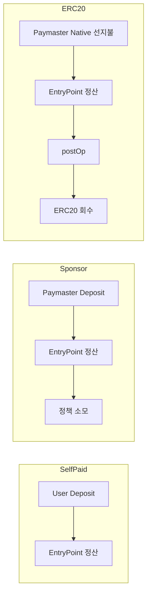

# 06. 수수료 모델: Self-paid / Sponsor / ERC-20 Settlement (상세판)

## 1) 왜 이 세션이 중요한가

Smart Account 도입에서 가장 많이 실패하는 부분은 기능이 아니라 수수료 모델이다. 같은 기능 호출이라도 "누가 선지불하고 누가 최종 부담하는지"에 따라 파라미터, 검증, 정산, 운영 리스크가 완전히 달라진다.

## 2) 세 가지 기본 모델

### A. Self-paid (사용자 직접 부담)

- UserOp에 paymaster 필드 없음
- EntryPoint에서 sender deposit으로 정산
- 단순하지만, 사용자에게 native token이 필요

### B. Sponsor-paid (서비스/정책 기반 후원)

- Verifying/Sponsor Paymaster가 validate 단계에서 후원 승인
- postOp은 없거나 최소화 가능
- 온보딩 UX에 유리하나 후원 정책/예산 관리 필요

### C. ERC-20 Settlement (선지불 후 토큰 정산)

- Paymaster가 native gas를 선지불
- postOp에서 ERC-20 토큰으로 회수
- 사용자 native token 의존성 제거, 하지만 정산 실패/가격 리스크 존재

## 3) 자금 흐름 비교

## 4) Paymaster 데이터 포맷 핵심

코드: `poc-contract/src/erc4337-paymaster/PaymasterDataLib.sol`

Envelope 헤더(25 bytes):

- version (1)
- paymasterType (1)
- flags (1)
- validUntil (6)
- validAfter (6)
- nonce (8)
- payloadLen (2)
- payload (variable)

즉, `paymasterData`는 "타입별 payload + (필요 시)서명" 구조로 확장된다.

## 5) Paymaster Proxy 2-Phase 호출 (실무 핵심)

코드:

- Wallet: `stable-platform/apps/wallet-extension/src/background/rpc/paymaster.ts`
- Proxy: `stable-platform/services/paymaster-proxy/src/app.ts`
- Schema: `stable-platform/services/paymaster-proxy/src/schemas/index.ts`

호출 순서:

1. `pm_getPaymasterStubData`
2. stub 값을 userOp에 반영
3. `pm_getPaymasterData`
4. 최종 서명/데이터 반영

중요 파라미터 규칙:

- params 순서: `[userOp, entryPoint, chainId(hex), context?]`
- `chainId`는 hex string (`"0x..."`) 기준
- context에 `paymasterType`, `tokenAddress`, `policyId` 등 전달 가능

## 6) Wallet Extension에서의 실제 분기

코드: `stable-platform/apps/wallet-extension/src/background/rpc/handler.ts`

- `gasPayment.type === 'native'`
- paymaster 요청 생략

- `gasPayment.type === 'sponsor'` 또는 paymasterUrl 존재
- paymaster 2-phase 요청 수행

- `gasPayment.type === 'erc20'`
- context에 tokenAddress 포함하여 paymaster 요청

## 7) ERC-20 정산 모델의 운영 리스크

- price oracle stale/invalid
- allowance/balance 부족
- postOp 토큰 전송 실패
- paymaster deposit 부족

운영 지표 추천:

- paymaster type별 승인율/거절율
- UserOp당 평균 후원 비용
- 토큰 회수 성공률
- `postOp` 실패율
- deposit low-watermark 경보 횟수

## 8) 스펙 준수 vs 운영 정책

스펙 준수:

- 4337 paymaster 인터페이스 및 validate/postOp 계약 준수

운영 정책:

- 누구를 후원할지, 얼마까지 후원할지, 토큰 마크업/환율 정책
- 이는 스펙 외부이며 서비스 책임

## 9) 세미나 전달 문장

- "후원은 기능이 아니라 재무정책이다."
- "가스 대납 UX를 제공하려면 정산 실패를 먼저 설계해야 한다."

## 10) 체크리스트

- 모델별로 실패시 부담 주체를 문서화했는가?
- paymaster data 포맷/chainId 형식을 통일했는가?
- deposit 모니터링/자동보충 정책이 있는가?
- ERC-20 정산 실패시 대응 플로우가 있는가?
