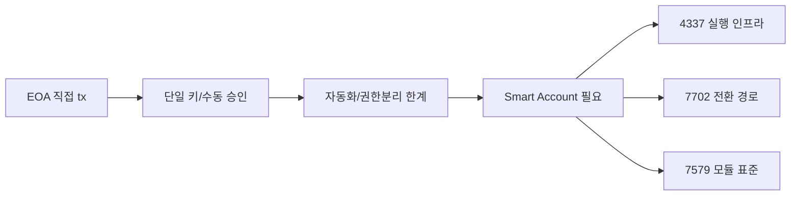
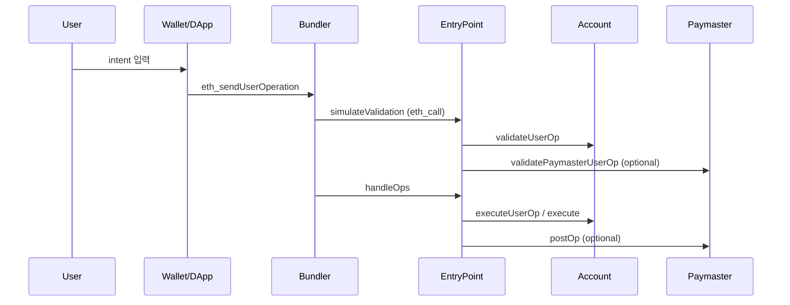
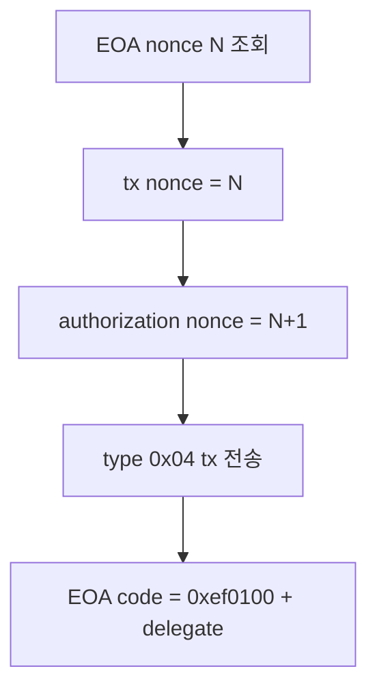
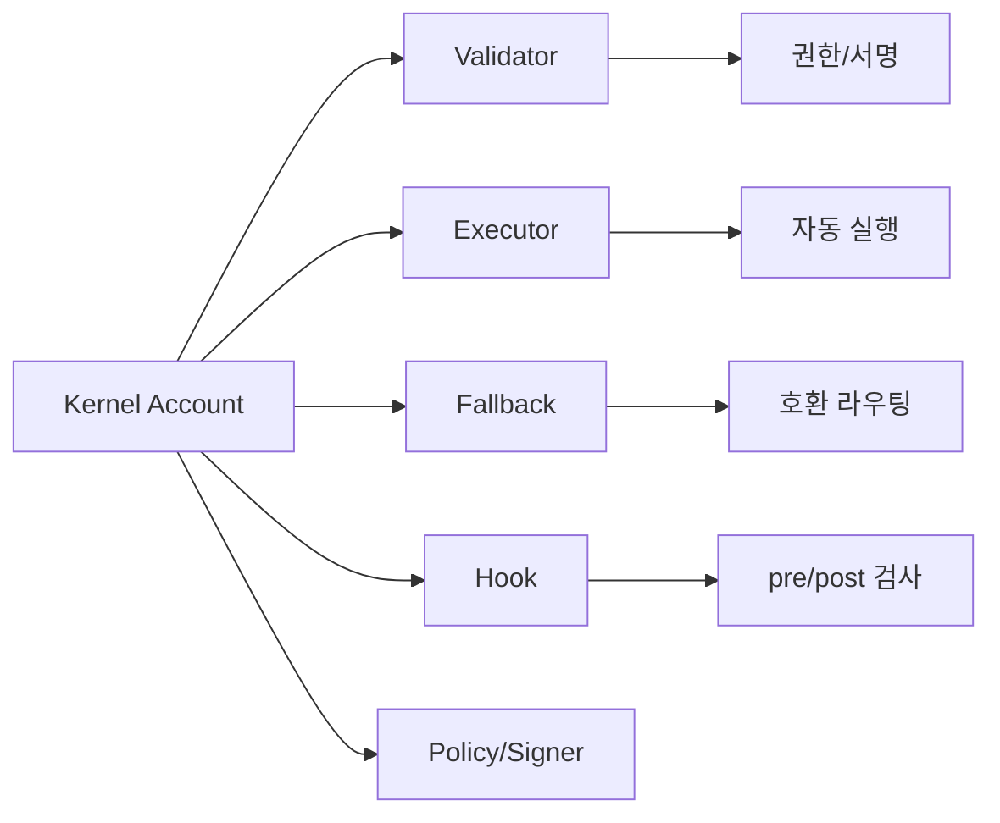

# 12. 90분 세미나 발표 대본 (최종 상세본)

작성일: 2026-03-02  
대상: Smart Account를 처음/중급 수준으로 접하는 개발자  
기준 코드/문서:
- `docs/claude/spec/EIP-4337_스펙표준_정리.md`
- `docs/claude/spec/EIP-7579_스펙표준_정리.md`
- `docs/claude/spec/EIP-4337_Paymaster_개발자_구현가이드.md`
- `docs/claude/spec/EIP-4337_7579_통합_스펙준수_보고서.md`
- `docs/claude/spec/ERC4337_EIP7702_COMPLETE_FLOW.md`
- `docs/claude/spec/ERC4337_EIP7702_SEQUENCE_DIAGRAM.md`

---

## 0. 이 대본의 사용법

- 이 문서는 "읽는 스크립트"가 아니라 "설명 + 데모 + 질의응답" 운영 대본이다.
- 각 구간은 `핵심 메시지 -> 발표 멘트 -> 코드 근거 -> 청중 질문` 순서로 구성되어 있다.
- 실제 슬라이드는 `docs/seminar-deck`를 사용하되, 멘트는 이 문서를 기준으로 통일한다.

---

## 1. 90분 시간 배분

| 시간 | 구간 | 핵심 산출 |
|---|---|---|
| 0~10분 | 문제 정의: EOA 한계 | 왜 Smart Account가 필요한지 공감대 형성 |
| 10~25분 | ERC-4337 철학/Actor | UserOp 모델, EntryPoint/Bundler/Paymaster 역할 이해 |
| 25~35분 | EntryPoint v0.6 -> v0.9 변천 | 변화 배경과 설계 선택 이유 이해 |
| 35~45분 | EIP-7702 핵심 | EOA 주소 유지 + delegation 모델 이해 |
| 45~58분 | ERC-7579 핵심 | 모듈형 계정/수명주기/권한 모델 이해 |
| 58~72분 | 트랜잭션 구성 실전 | 파라미터를 어디에 넣는지 실무 감각 확보 |
| 72~85분 | PoC 데모 A~D | 코드 기준 end-to-end 동작 확인 |
| 85~90분 | 결론/Q&A | 제품 의사결정 프레임 전달 |

---

## 2. 오프닝(0~10분)

### 2.1 핵심 메시지

1. EVM에서 트랜잭션 발신 주체는 기본적으로 EOA다.
2. EOA는 코드/정책/복구/자동화에 구조적 한계가 있다.
3. Smart Account는 "계정 자체를 프로그래밍 가능"하게 만든다.

### 2.2 발표 멘트(권장 원문)

"오늘 핵심은 하나입니다. 기존 EOA 주소를 버리지 않으면서도, 계정을 프로그래밍 가능하게 만들어 제품 UX를 개선할 수 있는가입니다. 이 질문에 대해 4337, 7702, 7579가 각자 다른 레이어에서 답을 제공합니다."

"4337은 실행 인프라, 7702는 EOA 전환 경로, 7579는 계정 내부 모듈 표준입니다. 이 3개를 결합하면, 사용자 경험과 운영 모델을 동시에 개선할 수 있습니다."

### 2.3 시각 자료(설명용)

### 2.4 코드 근거

- 4337 실행 진입점: `poc-contract/src/erc4337-entrypoint/EntryPoint.sol:89`
- 7702 delegate prefix: `poc-contract/src/erc4337-entrypoint/Eip7702Support.sol:14`
- 7579 모듈 설치 함수: `poc-contract/src/erc7579-smartaccount/Kernel.sol:476`

---

## 3. ERC-4337 철학과 Actor(10~25분)

### 3.1 핵심 메시지

1. UserOperation은 "사용자 의도 메시지"이고, L1/L2 tx는 Bundler가 제출한다.
2. 검증/실행/정산을 EntryPoint가 계약 레벨에서 표준화한다.
3. Paymaster는 수수료 책임 주체를 사용자 밖으로 확장한다.

### 3.2 발표 멘트

"4337의 핵심은 합의 레이어를 건드리지 않고, 트랜잭션 처리 규칙을 컨트랙트 레벨로 올려온 것입니다. 사용자는 UserOp를 만들고, Bundler가 이를 tx로 묶어 체인에 제출합니다."

"즉, 4337은 단순한 지갑 표준이 아니라, 실행 파이프라인 표준입니다. 그래서 Bundler, EntryPoint, Paymaster라는 새 Actor가 등장합니다."

### 3.3 Actor별 설명 포인트

- **EntryPoint**: `handleOps`에서 배치 실행, 검증/정산 담당
- **Bundler**: mempool + 시뮬레이션 + on-chain 제출
- **Paymaster**: sponsorship/erc20 등 비용 정책 처리
- **Account**: `validateUserOp`/`executeUserOp`로 계정 정책 집행

### 3.4 다이어그램

### 3.5 코드 근거

- RPC dispatch: `stable-platform/services/bundler/src/rpc/server.ts:320`
- `eth_sendUserOperation`: `stable-platform/services/bundler/src/rpc/server.ts:365`
- `eth_estimateUserOperationGas`: `stable-platform/services/bundler/src/rpc/server.ts:409`
- `eth_getUserOperationReceipt`: `stable-platform/services/bundler/src/rpc/server.ts:523`

### 3.6 청중 질문 예상

Q. "사용자는 결국 tx를 보내는 게 아닌가요?"

A. "사용자는 UserOp를 서명/제출하고, 체인 tx 발신자는 Bundler입니다. 그래서 tx.origin 관점과 user intent 관점이 분리됩니다."

---

## 4. EntryPoint v0.6 -> v0.9 변천(25~35분)

### 4.1 핵심 메시지

1. v0.6 이후 실무에서 드러난 문제(서명 UX, 호환성, 시뮬레이션 안정성)를 반영해 개선되었다.
2. v0.7부터 EIP-712 기반 UserOpHash가 표준화되어 지갑 UX/보안이 개선되었다.
3. v0.9는 EIP-7702 통합 경로, helper 함수, block-number validity 등 실무 기능이 강화되었다.

### 4.2 발표 멘트

"Final 스펙을 단순 문서 버전으로만 보면 안 됩니다. 오픈소스 구현과 생태계 운영에서 발견된 이슈들이 반영되면서 v0.9까지 발전했습니다."

"중요한 건 숫자가 아니라 이유입니다. 왜 바뀌었는지 이해하면, 제품에서 어떤 편차를 허용할지 근거 있는 결정을 할 수 있습니다."

### 4.3 변천 핵심 요약

| 항목 | v0.6 관점 | v0.7~v0.9 관점 |
|---|---|---|
| 서명 UX | raw hash 중심 | EIP-712 typed data 기반 강화 |
| UserOp 포맷 | 분리 필드 중심 | packed 필드(`accountGasLimits`, `gasFees`, `paymasterAndData`) 정착 |
| 7702 연계 | 없음 | 7702 marker/init 경로 반영 |
| validity | timestamp 중심 | block-number mode 지원(최상위 비트 플래그) |
| 운영 보조 | 제한적 | helper/시뮬레이션 보조 함수 강화 |

### 4.4 코드 근거

- EIP-712 도메인/해시: `stable-platform/services/bundler/src/rpc/utils.ts:9-23`, `:208-247`
- 7702 initCode 처리: `poc-contract/src/erc4337-entrypoint/EntryPoint.sol:481-496`
- block/timestamp validity 처리: `poc-contract/src/erc4337-entrypoint/EntryPoint.sol:744-755`

---

## 5. EIP-7702 핵심(35~45분)

### 5.1 핵심 메시지

1. 7702는 기존 EOA 주소를 유지하면서 delegate code를 부여한다.
2. 7702 authorization nonce와 4337 UserOp nonce는 목적/계층이 다르다.
3. EOA가 직접 authorization 서명 + tx 전송할 때 nonce 오프셋(특히 `N+1`)을 주의해야 한다.

### 5.2 발표 멘트

"7702는 계정을 바꾸는 게 아니라, 계정에 코드 해석 규칙을 추가하는 것입니다. 그래서 주소 연속성이 핵심 장점입니다."

"단, nonce를 하나로 생각하면 바로 실패합니다. EOA tx nonce, authorization nonce, EntryPoint nonce를 분리해서 봐야 합니다."

### 5.3 다이어그램

### 5.4 코드 근거

- `wallet_signAuthorization`: `stable-platform/apps/wallet-extension/src/background/rpc/handler.ts:804`
- `wallet_delegateAccount` nonce 처리: `.../handler.ts:1020-1029`
- `authorizationList` 생성: `.../handler.ts:1053-1063`
- `eth_sendTransaction` type-4 처리: `.../handler.ts:1653-1679`
- EIP-7702 prefix/marker: `poc-contract/src/erc4337-entrypoint/Eip7702Support.sol:14-17`

### 5.5 반드시 강조할 주의사항

- authorization nonce를 tx nonce와 동일하게 두면 실패할 수 있다.
- 체인 전환 직후 chainId mismatch가 잦다.
- 7702 활성화 전/후 `eth_getCode` 결과를 반드시 비교해 검증한다.

---

## 6. ERC-7579 핵심(45~58분)

### 6.1 핵심 메시지

1. 7579는 계정 내부 확장을 모듈 인터페이스로 표준화한다.
2. Validator/Executor/Fallback/Hook + 확장 타입(policy/signer)을 계정에 조합한다.
3. 설치/해제/강제해제/교체 lifecycle을 운영 정책으로 관리해야 한다.

### 6.2 발표 멘트

"7579는 기능을 하나의 거대한 계정 코드에 몰아넣지 않고, 모듈로 분리합니다. 그래서 계정이 제품 기능에 맞춰 진화할 수 있습니다."

"하지만 모듈 시스템은 자유도가 높은 만큼, uninstall 거부, selector 충돌, delegatecall 통제 같은 운영 이슈를 반드시 동반합니다."

### 6.3 다이어그램

### 6.4 코드 근거

- `validateUserOp` 브릿지: `poc-contract/src/erc7579-smartaccount/Kernel.sol:328`
- `executeUserOp` 브릿지: `.../Kernel.sol:409`
- 모듈 설치: `.../Kernel.sol:476`
- 모듈 해제: `.../Kernel.sol:616`
- 강제 해제: `.../Kernel.sol:653`
- 교체: `.../Kernel.sol:692`

### 6.5 청중 질문 예상

Q. "강제 해제는 위험하지 않나요?"

A. "위험합니다. 그래서 일반 해제 실패 시 emergency path로만 사용하고, 이벤트/감사로그를 반드시 남겨야 합니다."

---

## 7. 트랜잭션 구성 실전(58~72분)

### 7.1 핵심 메시지

1. 구현 난이도의 80%는 파라미터 위치/인코딩 규칙에서 발생한다.
2. `callData`, `nonce`, `gas`, `paymaster`를 누가 채우는지 책임 경계를 분리해야 한다.
3. SDK를 쓰더라도 RPC packet 원형을 이해해야 디버깅 가능하다.

### 7.2 발표 멘트

"실무에서 가장 많이 깨지는 건 암호학이 아니라 메시지 포맷입니다. 어떤 값을 어느 레이어가 채우는지 책임을 분리해야 합니다."

"오늘은 이 문장을 기억하세요. `sender/nonce/callData`는 실행 의미, `gas/paymaster`는 실행 가능성, `signature`는 실행 권한입니다."

### 7.3 반드시 전달할 파라미터 포인트

- `eth_sendUserOperation`에서 `callData`가 없고 `target`이 있으면 wallet-extension이 `Kernel.execute`로 인코딩한다.
  - 코드: `stable-platform/apps/wallet-extension/src/background/rpc/handler.ts:1132-1140`
- `gasPayment`는 UserOp schema 외 필드이므로 파싱 전에 추출/삭제한다.
  - 코드: `.../handler.ts:1142-1144`
- nonce 0이면 EntryPoint `getNonce(sender,0)`를 재조회한다.
  - 코드: `.../handler.ts:1192-1215`
- paymaster는 2단계(stub -> final) 호출로 채워진다.
  - 코드: `stable-platform/apps/wallet-extension/src/background/rpc/paymaster.ts:82-113`

### 7.4 packed/unpacked 포맷 강조

- pack/unpack 구현 근거:
  - `stable-platform/services/bundler/src/rpc/utils.ts:27-117` (unpack)
  - `stable-platform/services/bundler/src/rpc/utils.ts:123-171` (pack)

---

## 8. 라이브 데모 스크립트(72~85분)

### 8.1 Demo A: EOA -> 7702 위임

발표 멘트:
- "지금은 일반 EOA 상태입니다."
- "wallet_signAuthorization으로 권한 서명을 만들겠습니다."
- "authorizationList를 포함한 type-4 tx로 delegation을 반영하겠습니다."

성공 판정:
- tx success
- `eth_getCode`가 `0xef0100 + delegate` 패턴

### 8.2 Demo B: Self-paid UserOp

발표 멘트:
- "target/value/data만 주고 UserOp를 만들어 보내겠습니다."
- "paymaster 없이도 EntryPoint deposit 기반으로 실행되는 경로를 보겠습니다."

성공 판정:
- `eth_sendUserOperation` hash 반환
- `eth_getUserOperationReceipt`에서 success=true

### 8.3 Demo C: Sponsor/ERC20 Paymaster

발표 멘트:
- "같은 실행을 sponsor, erc20로 바꿔 비용 책임만 변경해보겠습니다."
- "핵심은 user action은 동일하고 fee policy만 바뀐다는 점입니다."

성공 판정:
- `pm_getPaymasterStubData`, `pm_getPaymasterData` 정상 응답
- receipt 생성

### 8.4 Demo D: 7579 module lifecycle

발표 멘트:
- "install -> uninstall -> forceUninstall -> replace 순서로 lifecycle을 보겠습니다."
- "실패 시 force path를 emergency model로 설명하겠습니다."

성공 판정:
- `isModuleInstalled` 상태 전환 일치

---

## 9. 마무리/Q&A(85~90분)

### 9.1 결론 멘트

"정리하면, 4337은 실행 인프라, 7702는 주소 연속성, 7579는 기능 확장성입니다. 세 가지를 같이 이해해야 제품에서 일관된 트랜잭션 모델을 설계할 수 있습니다."

"그리고 스펙 준수는 목적이 아니라 출발점입니다. 준수를 기준선으로 확보한 뒤, 제품 목적에 맞는 편차를 의도적으로 선택해야 합니다."

### 9.2 제품화 의사결정 질문

1. 우리는 어떤 UserOp 실패를 UX에서 자동 복구할 것인가?
2. Paymaster 비용 정책을 누가 승인하고 어떻게 회계할 것인가?
3. 모듈 설치/교체 권한을 어떤 거버넌스로 통제할 것인가?

---

## 10. 발표 중 반드시 고지할 리스크(현재 코드 기준)

### 10.1 EntryPoint 상수 점검 포인트 (웹 훅)

- `apps/web/hooks/useSmartAccount.ts:23`의 `ENTRY_POINT`는 로컬 주소 상수이며,
  contracts 패키지 canonical v0.9와 다를 수 있다.
- 세미나에서는 "데모 네트워크 기준 상수"와 "프로덕션 canonical 주소"를 분리해 설명한다.

### 10.2 wallet-sdk vs wallet-extension RPC 네이밍 정렬 이슈

- wallet-sdk는 `wallet_sendUserOperation`, `wallet_getInstalledModules`를 사용한다.
  - `packages/wallet-sdk/src/provider/StableNetProvider.ts:601, 722`
- wallet-extension 실제 구현은 `eth_sendUserOperation`, `stablenet_getInstalledModules` 중심이다.
  - `apps/wallet-extension/src/background/rpc/handler.ts:1115, 2951`
- 세미나에서는 이를 "호환 레이어 백로그"로 명시한다.

---

## 11. 발표자 최종 체크리스트

- 데모 환경 헬스체크 완료 (`bundler:4337`, `paymaster:4338`)
- 7702 nonce 설명 문구 암기 (`txNonce N`, `authNonce N+1`)
- UserOp packed 필드 설명 슬라이드 준비
- 실패 시 전환 시나리오 준비
  - sponsor 실패 -> self-paid 전환
  - uninstall 실패 -> forceUninstall 전환

