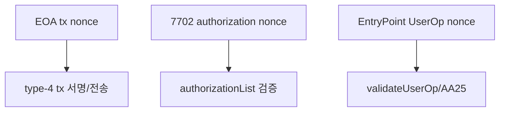
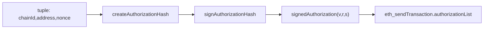
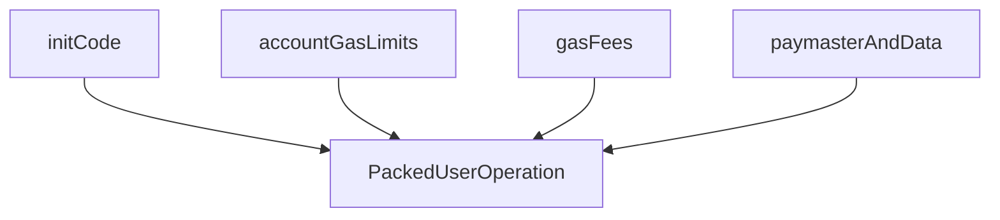

# 14. 개발자 실습 핸드북 (RPC + 코드 템플릿)

작성일: 2026-03-02  
대상: DApp/Wallet/Backend 개발자  
목표: "어떤 파라미터를 어디에 넣어야 동작하는지"를 실습 단위로 고정한다.

---

## 0. 핵심 원칙

1. **EOA nonce, 7702 auth nonce, 4337 UserOp nonce를 절대 혼동하지 않는다.**
2. **`chainId` 표현 형식(숫자 vs hex string)을 엔드포인트별로 구분한다.**
3. **`entryPoint` 주소는 앱/지갑/bundler/paymaster 전 레이어에서 동일해야 한다.**
4. **`callData` 인코딩과 `paymasterData` 인코딩을 분리해서 검증한다.**

---

## 1. 레이어 책임 분리

| 레이어           | 주 책임                               | 대표 코드                                                                      |
| ---------------- | ------------------------------------- | ------------------------------------------------------------------------------ |
| Wallet Extension | 서명/승인/RPC 브릿지                  | `apps/wallet-extension/src/background/rpc/handler.ts`                          |
| Web DApp         | 사용자 입력, 흐름 오케스트레이션      | `apps/web/hooks/useSmartAccount.ts`                                            |
| Bundler          | UserOp 검증/추정/receipt              | `services/bundler/src/rpc/server.ts`                                           |
| Paymaster Proxy  | sponsorship 정책 + paymasterData 발급 | `services/paymaster-proxy/src/app.ts`                                          |
| Contracts        | 최종 검증/실행/정산                   | `poc-contract/src/erc4337-entrypoint`, `poc-contract/src/erc7579-smartaccount` |

---

## 2. Nonce 분리 모델



- EOA tx nonce: 일반 tx/7702 type-4 tx에서 사용
- 7702 auth nonce: authorization tuple 검증에 사용
- UserOp nonce: EntryPoint `getNonce(sender,key)` 기반

코드 근거:

- 7702 `N+1` 처리: `apps/wallet-extension/src/background/rpc/handler.ts:1020-1029`
- UserOp nonce 보정: `.../handler.ts:1192-1215`

---

## 3. 메시지 포맷

## 3.1 EIP-7702 Authorization



요청 메서드:

- `wallet_signAuthorization`
- `wallet_delegateAccount`
- `eth_sendTransaction` + `authorizationList`

핵심 필드:

- `authorizationList[].chainId`: number
- `authorizationList[].address`: delegate contract
- `authorizationList[].nonce`: authorization nonce
- `authorizationList[].v,r,s`

코드 근거:

- `wallet_signAuthorization`: `handler.ts:804`
- `wallet_delegateAccount`: `handler.ts:946`
- `eth_sendTransaction` 7702 분기: `handler.ts:1653-1679`

---

## 3.2 ERC-4337 UserOperation

### 3.2.1 요청 포맷(지갑 측 입력)

`eth_sendUserOperation`에 전달할 때 wallet-extension은 다음을 허용한다.

- 완전한 UserOp (`callData` 포함)
- 또는 `target/value/data` 제공 (callData는 내부 인코딩)

코드 근거: `handler.ts:1132-1140`

### 3.2.2 Packed 포맷(bundler RPC)



packed 구성 규칙:

- `accountGasLimits = verificationGasLimit(16B) || callGasLimit(16B)`
- `gasFees = maxPriorityFeePerGas(16B) || maxFeePerGas(16B)`
- `paymasterAndData = paymaster(20B) || paymasterVerificationGasLimit(16B) || paymasterPostOpGasLimit(16B) || paymasterData`

코드 근거:

- pack: `services/bundler/src/rpc/utils.ts:123-171`
- unpack: `services/bundler/src/rpc/utils.ts:27-117`

### 3.2.3 서명 해시

- EIP-712 domain name/version: `ERC4337` / `1`
- `chainId`, `entryPoint`가 domain에 포함

코드 근거: `services/bundler/src/rpc/utils.ts:15-23`, `178-247`

---

## 3.3 Paymaster RPC 포맷

### 3.3.1 공통 파라미터 순서

`[userOp, entryPoint, chainId(hex), context?]`

- `chainId`는 **hex string** 이어야 한다 (`0x...`).
- context의 `paymasterType`으로 라우팅된다.

코드 근거:

- schema: `services/paymaster-proxy/src/schemas/index.ts:79-99`
- router: `services/paymaster-proxy/src/app.ts:415-439`

### 3.3.2 2단계 호출

1. `pm_getPaymasterStubData`
2. `pm_getPaymasterData`

코드 근거:

- wallet-extension helper: `apps/wallet-extension/src/background/rpc/paymaster.ts:82-113`

---

## 4. 실습 API 레시피

## 4.1 레시피 A: 7702 위임

1. `wallet_signAuthorization` 호출
2. `eth_sendTransaction`에 `authorizationList` 포함
3. `eth_getCode`로 결과 확인

브라우저 예시:

```js
const signed = await window.ethereum.request({
  method: 'wallet_signAuthorization',
  params: [
    {
      account: '<EOA>',
      contractAddress: '<KERNEL_IMPL>',
      chainId: 31337,
    },
  ],
});

await window.ethereum.request({
  method: 'eth_sendTransaction',
  params: [
    {
      from: '<EOA>',
      to: '<EOA>',
      data: '0x',
      authorizationList: [signed.signedAuthorization],
    },
  ],
});
```

---

## 4.2 레시피 B: 4337 self-paid UserOp

브라우저 예시:

```js
const userOpHash = await window.ethereum.request({
  method: 'eth_sendUserOperation',
  params: [
    {
      sender: '<ACCOUNT>',
      target: '<TARGET>',
      value: '0x0',
      data: '0x',
      gasPayment: { type: 'native' },
    },
    '<ENTRY_POINT>',
  ],
});

const receipt = await window.ethereum.request({
  method: 'eth_getUserOperationReceipt',
  params: [userOpHash],
});
```

핵심:

- `gasPayment`는 UserOp schema 필드가 아니므로 wallet-extension 내부에서 분리 처리된다.
  - 근거: `handler.ts:1142-1144`

---

## 4.3 레시피 C: sponsor/erc20 전환

- sponsor:

```js
await window.ethereum.request({
  method: 'eth_sendUserOperation',
  params: [
    {
      sender: '<ACCOUNT>',
      target: '<TARGET>',
      value: '0x0',
      data: '0x',
      gasPayment: { type: 'sponsor' },
    },
    '<ENTRY_POINT>',
  ],
});
```

- erc20:

```js
await window.ethereum.request({
  method: 'eth_sendUserOperation',
  params: [
    {
      sender: '<ACCOUNT>',
      target: '<TARGET>',
      value: '0x0',
      data: '0x',
      gasPayment: { type: 'erc20', tokenAddress: '<TOKEN>' },
    },
    '<ENTRY_POINT>',
  ],
});
```

주의:

- paymaster URL이 없으면 sponsor/erc20이 동작하지 않고 self-pay로만 진행된다.
- 근거: `handler.ts:1276-1290`

---

## 4.4 레시피 D: 7579 모듈 lifecycle

- 설치: `stablenet_installModule`
- 제거: `stablenet_uninstallModule`
- 강제 제거: `stablenet_forceUninstallModule`
- 교체: `stablenet_replaceModule`

설치 예시:

```js
await window.ethereum.request({
  method: 'stablenet_installModule',
  params: [
    {
      account: '<ACCOUNT>',
      moduleAddress: '<MODULE>',
      moduleType: '2',
      initData: '0x',
      initDataEncoded: true,
      chainId: 31337,
      gasPaymentMode: 'sponsor',
    },
  ],
});
```

---

## 5. TS 템플릿

## 5.1 EIP-1193 직접 호출 템플릿

```ts
type Hex = `0x${string}`;

export async function sendUserOpViaWallet(
  entryPoint: Hex,
  sender: Hex,
  target: Hex,
  data: Hex,
  gasMode: 'native' | 'sponsor' | 'erc20' = 'native',
  tokenAddress?: Hex,
): Promise<Hex> {
  const op = {
    sender,
    target,
    value: '0x0',
    data,
    ...(gasMode === 'erc20'
      ? { gasPayment: { type: 'erc20', tokenAddress } }
      : gasMode === 'sponsor'
        ? { gasPayment: { type: 'sponsor' } }
        : { gasPayment: { type: 'native' } }),
  };

  return await window.ethereum.request({
    method: 'eth_sendUserOperation',
    params: [op, entryPoint],
  });
}
```

## 5.2 bundler/paymaster HTTP 템플릿

```ts
export async function rpc<T>(url: string, method: string, params: unknown[]): Promise<T> {
  const res = await fetch(url, {
    method: 'POST',
    headers: { 'content-type': 'application/json' },
    body: JSON.stringify({ jsonrpc: '2.0', id: 1, method, params }),
  });
  const body = await res.json();
  if (body.error) throw new Error(body.error.message);
  return body.result as T;
}
```

---

## 6. Go 템플릿

## 6.1 JSON-RPC 공통 호출

```go
package main

import (
  "bytes"
  "encoding/json"
  "fmt"
  "net/http"
)

type rpcReq struct {
  Jsonrpc string        `json:"jsonrpc"`
  ID      int           `json:"id"`
  Method  string        `json:"method"`
  Params  []interface{} `json:"params"`
}

type rpcResp struct {
  Result json.RawMessage `json:"result"`
  Error  *struct {
    Code    int    `json:"code"`
    Message string `json:"message"`
  } `json:"error"`
}

func callRPC(url, method string, params []interface{}) (json.RawMessage, error) {
  reqBody, _ := json.Marshal(rpcReq{Jsonrpc: "2.0", ID: 1, Method: method, Params: params})
  resp, err := http.Post(url, "application/json", bytes.NewReader(reqBody))
  if err != nil {
    return nil, err
  }
  defer resp.Body.Close()

  var out rpcResp
  if err := json.NewDecoder(resp.Body).Decode(&out); err != nil {
    return nil, err
  }
  if out.Error != nil {
    return nil, fmt.Errorf("rpc error %d: %s", out.Error.Code, out.Error.Message)
  }
  return out.Result, nil
}
```

## 6.2 Paymaster stub/final 호출

```go
func requestPaymaster(paymasterURL string, userOp map[string]interface{}, entryPoint, chainIDHex string) error {
  // 1) stub
  _, err := callRPC(paymasterURL, "pm_getPaymasterStubData", []interface{}{userOp, entryPoint, chainIDHex})
  if err != nil {
    return err
  }

  // 2) final
  _, err = callRPC(paymasterURL, "pm_getPaymasterData", []interface{}{userOp, entryPoint, chainIDHex})
  if err != nil {
    return err
  }
  return nil
}
```

---

## 7. 자주 발생하는 오류와 즉시 조치

| 오류/증상                      | 원인                      | 즉시 조치                              |
| ------------------------------ | ------------------------- | -------------------------------------- |
| `EntryPoint ... not supported` | bundler allowlist 불일치  | bundler/paymaster/app entryPoint 통일  |
| `AA25 invalid account nonce`   | UserOp nonce stale        | EntryPoint `getNonce(sender,0)` 재조회 |
| paymaster `Invalid parameters` | chainId 형식 오류         | paymaster에는 `0x...` hex string 전달  |
| 모듈 uninstall 실패            | module onUninstall revert | forceUninstall 경로 사용               |

---

## 8. 더블체크 체크리스트

1. chainId 형식

- wallet RPC(예: `wallet_signAuthorization`)는 숫자 체인 ID를 받는다.
- paymaster RPC는 hex string 체인 ID를 받는다.

2. EntryPoint 주소

- canonical v0.9: `packages/contracts/src/addresses.ts:69`
- 데모 체인 배포 주소와 동일한지 확인

3. RPC 네이밍 정렬

- wallet-extension: `eth_sendUserOperation`, `stablenet_getInstalledModules`
- wallet-sdk: `wallet_sendUserOperation`, `wallet_getInstalledModules`
- 실제 연동 시 alias 레이어 또는 SDK 업데이트 필요

---

## 9. 현재 백로그(세미나에서 명시 권장)

- `apps/web/hooks/useSmartAccount.ts:23`의 EntryPoint 상수는 데모용 로컬 값이다.
  - canonical v0.9 주소와 분리 관리 필요.
- wallet-sdk와 wallet-extension의 custom RPC 메서드 네이밍 정렬 필요.
  - SDK 기준 호출명이 extension에 alias로 매핑되도록 보강 필요.
