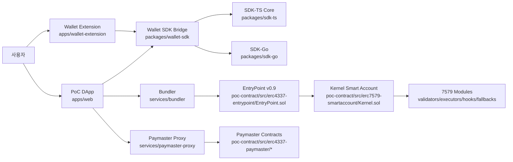

# 세미나 산출물 1: Spec -> Code Trace Matrix (KO)

작성일: 2026-03-02  
대상: Smart Account 개발자 세미나(구현 중심)  
언어: 한국어

---

## 1) 목적

이 문서는 아래 6개 기준 문서를 실제 코드 경로와 1:1로 매핑해,
"무엇이 어디에 구현되어 있는지"를 세미나에서 즉시 설명할 수 있게 만드는 참조표다.

기준 문서:

1. `docs/claude/spec/EIP-4337_스펙표준_정리.md`
2. `docs/claude/spec/EIP-7579_스펙표준_정리.md`
3. `docs/claude/spec/EIP-4337_Paymaster_개발자_구현가이드.md`
4. `docs/claude/spec/EIP-4337_7579_통합_스펙준수_보고서.md`
5. `docs/claude/spec/ERC4337_EIP7702_COMPLETE_FLOW.md`
6. `docs/claude/spec/ERC4337_EIP7702_SEQUENCE_DIAGRAM.md`

---

## 2) 아키텍처 매핑 다이어그램



---

## 3) Trace Matrix

상태 기준:

- `PASS`: 코드/문서 정합성 확인
- `PARTIAL`: 핵심은 맞지만 오프체인/운영 경로 보완 필요
- `DECISION`: 스펙 위반이 아니라 의도적 설계 선택(문서화 필요)

> 주의: `poc-contract/src`는 `stable-platform` 저장소의 sibling 경로(워크스페이스 루트 기준)다.

| 영역 | 스펙/요구사항 | 기준 문서 | 코드 경로 | 상태 | 세미나 전달 포인트 |
|---|---|---|---|---|---|
| 4337-Hash | v0.9 EIP-712 `userOpHash` | 4337 스펙 정리 §12 | `packages/sdk-ts/core/src/utils/userOperation.ts`, `packages/sdk-go/core/userop/hash.go`, `poc-contract/src/erc4337-entrypoint/EntryPoint.sol` | PASS | "문서-TS-Go-컨트랙트가 같은 해시 공식을 써야 한다" |
| 4337-Pack | PackedUserOperation 필드/순서 | 4337 스펙 정리 §19.1 | `packages/sdk-ts/core/src/utils/userOperation.ts`, `packages/sdk-go/core/userop/packing.go` | PASS | "가스/수수료 필드 16바이트 패킹 순서가 틀리면 실패" |
| 4337-Entry | `handleOps` 검증/실행 분리 | 4337 스펙 정리 §4, COMPLETE_FLOW | `poc-contract/src/erc4337-entrypoint/EntryPoint.sol` | PASS | "검증 단계와 실행 단계를 분리해서 설명" |
| 4337-Account | `validateUserOp` onlyEntryPoint | 4337 스펙 정리 §5 | `poc-contract/src/erc7579-smartaccount/Kernel.sol` | PASS | "Account가 직접 tx를 받는 게 아니라 EntryPoint 경유" |
| 4337-RPC | `eth_sendUserOperation`, receipt/byHash | 4337 스펙 정리 §7 | `services/bundler/src/rpc/server.ts` | PARTIAL | "Receipt fallback/운영 모드 정책은 실무에서 중요" |
| 4337-Gas | preVerification/verification/call gas 산정 | 4337 스펙 정리 §13 | `services/bundler/src/gas/gasEstimator.ts`, `services/paymaster-proxy/src/utils/gasEstimator.ts` | PARTIAL | "7702 +25k/페널티 포함 여부를 반드시 점검" |
| 4337-Reputation | entity reputation, opcode/storage 검증 | 4337 스펙 정리 §7.2~7.5 | `services/bundler/src/validation/*` | PASS | "Public mempool 전환 시 필수 안전장치" |
| Paymaster-Format | `paymasterAndData` 파싱 규칙 | Paymaster 가이드 §3.1 | `poc-contract/src/erc4337-paymaster/PaymasterDataLib.sol`, `poc-contract/src/erc4337-paymaster/BasePaymaster.sol` | PASS | "offset(0/20/36/52) 이해가 핵심" |
| Paymaster-Envelope | 25바이트 헤더 + payload | Paymaster 가이드 §5, COMPLETE_FLOW | `packages/sdk-ts/core/src/paymaster/paymasterDataCodec.ts`, `packages/sdk-go/core/paymaster/codec.go` | PASS | "메시지 포맷을 도식으로 보여주면 이해가 빠름" |
| Paymaster-Hash | domain + coreHash + envelopeHash | Paymaster 가이드 §6 | `packages/sdk-ts/core/src/paymaster/paymasterHasher.ts`, `services/paymaster-proxy/src/signer/paymasterSigner.ts` | PASS | "서명 입력값이 바뀌면 온체인 검증 실패" |
| Paymaster-RPC | `pm_getPaymasterStubData`, `pm_getPaymasterData` | Paymaster 가이드 §6 | `services/paymaster-proxy/src/app.ts`, `services/paymaster-proxy/src/handlers/getPaymasterStubData.ts`, `services/paymaster-proxy/src/handlers/getPaymasterData.ts` | PASS | "ERC-7677 메서드/파라미터는 준수" |
| Paymaster-Flow | ERC-7677 흐름: `stub -> estimate -> final` + `isFinal` 최적화 | ERC7677 분석 §1, §2 | `apps/wallet-extension/src/background/rpc/handler.ts`, `apps/wallet-extension/src/background/rpc/paymaster.ts`, `services/paymaster-proxy/src/handlers/getPaymasterStubData.ts` | PARTIAL | "현재는 기본 `stub -> final`이며 stub `isFinal`은 항상 false. 목표는 경로별 estimate 반영 + `isFinal=true` 최적화" |
| Paymaster-Settlement | 선처리 후 정산/취소 | 통합 보고서 §11 | `services/paymaster-proxy/src/settlement/*` | PARTIAL | "receipt 회수 실패 시 정산 지연 시나리오 설명 필요" |
| 7702-AuthHash | `keccak256(0x05 || rlp([chainId,address,nonce]))` | 7702 스펙 정리 §4, COMPLETE_FLOW | `packages/sdk-ts/core/src/eip7702/authorization.ts`, `packages/sdk-go/eip7702/authorization.go` | PASS | "authorization nonce는 tx nonce와 분리해 설명" |
| 7702-Detect | delegation code prefix 판별 | 7702 스펙 정리 §4 | `packages/sdk-ts/core/src/eip7702/authorization.ts`, `apps/web/hooks/useSmartAccount.ts` | PASS | "EOA/delegated/smart 분류 규칙" |
| 7702-Tx | type-4 authorizationList 전송 | 7702 스펙 정리 §3, §11 | `apps/wallet-extension/src/ui/pages/Send/hooks/useSendTransaction.ts`, `apps/web/hooks/useSmartAccount.ts` | PASS | "type 필드/authorizationList 누락 시 실패" |
| 7579-Execute | `execute`/`executeFromExecutor`/mode 규칙 | 7579 스펙 정리 §3.2~3.4 | `poc-contract/src/erc7579-smartaccount/Kernel.sol`, `poc-contract/src/erc7579-smartaccount/utils/ExecLib.sol` | PASS | "executionCalldata 인코딩 규칙을 반드시 시각화" |
| 7579-Module | install/uninstall/isInstalled/supportsModule | 7579 스펙 정리 §3.6, §4 | `poc-contract/src/erc7579-smartaccount/Kernel.sol`, `packages/sdk-ts/core/src/modules/*`, `packages/sdk-go/modules/*` | PASS | "모듈 lifecycle은 account 운영체계의 핵심" |
| 7579-Validator | validator 타입/1271 forwarding | 7579 스펙 정리 §4.3, §3.8 | `poc-contract/src/erc7579-validators/*`, `poc-contract/src/erc7579-smartaccount/core/ValidationManager.sol` | PASS | "서명 유효성 판단 경로를 분리해 설명" |
| 7579-Fallback | fallback sender 문맥/selector 충돌 | 통합 보고서 §6.3 | `poc-contract/src/erc7579-smartaccount/Kernel.sol`, `poc-contract/src/erc7579-fallbacks/TokenReceiverFallback.sol` | PARTIAL | "남은 충돌 이슈를 투명하게 설명해야 신뢰 확보" |
| Wallet-Event | account/chain 변경 이벤트 동기화 | 통합 보고서(오프체인 정합) | `apps/wallet-extension/src/background/utils/eventBroadcaster.ts`, `packages/wallet-sdk/src/provider/StableNetProvider.ts` | PASS | "지갑-DApp 일관성은 제품 안정성 핵심" |
| DApp-POC | EOA/7702/4337/7579 체험 경로 | COMPLETE_FLOW, SEQUENCE | `apps/web/app/smart-account/page.tsx`, `apps/web/hooks/useUserOp.ts`, `apps/web/hooks/useSmartAccount.ts` | PASS | "실습에서 바로 따라할 수 있어야 함" |

---

## 4) PARTIAL 항목 우선 보완(세미나 전)

| 우선순위 | 항목 | 배경 | 조치 제안 |
|---|---|---|---|
| P0 | Bundler hash/receipt 정합 | 오프체인 추적 신뢰성 | `eth_getUserOperationReceipt` 온체인 fallback 경로 고정 및 회귀테스트 |
| P1 | EntryPoint 기본값 통일 | 환경 오설정 리스크 | SDK/서비스/앱 기본값 정책(v0.9 우선) 문서+코드 동시 고정 |
| P1 | 7702 preVerificationGas 반영 점검 | 비용 추정 오차 | bundler/paymaster 추정기 공통 검증 벡터 작성 |
| P1 | ERC-7677 Paymaster 호출 흐름 정렬 | 지갑/프록시/문서 흐름 불일치 | `stub -> estimate -> final` 표준 경로 + `isFinal=true` 단축 경로를 코드/문서/테스트로 동시 정렬 |
| P1 | 7579 fallback selector 충돌 | 모듈 동작 불일치 | Kernel 내장 receiver와 fallback module 우선순위 정책 명문화 |
| P2 | Settlement 실패 복구 시나리오 | 운영 대응 공백 | reservation TTL/재시도 runbook 표준화 |
| P2 | Public mempool 모드 분리 | 운영 정책 불명확 | trusted/public config profile 분리 문서화 |

---

## 5) 세미나에서 이 매트릭스를 쓰는 방법

1. 질문이 나오면 "개념 -> 스펙 문서 -> 코드 경로" 순서로 답한다.
2. PARTIAL 항목은 숨기지 말고, "현상/원인/완화" 3단계로 답한다.
3. 데모 중 실패가 발생하면 해당 행의 코드 경로로 즉시 이동해 원인을 보여준다.

---

## 6) 스펙 편차 의사결정 템플릿 (세미나용)

아래 템플릿으로 편차를 기록하면, 제품 의사결정과 교육 자료가 동시에 정리된다.

```text
[편차 ID]
- 스펙 항목:
- 현재 구현:
- 편차 이유(제품/성능/운영):
- 리스크:
- 완화책:
- 되돌릴 조건:
- 소유 팀/완료 목표일:
```
