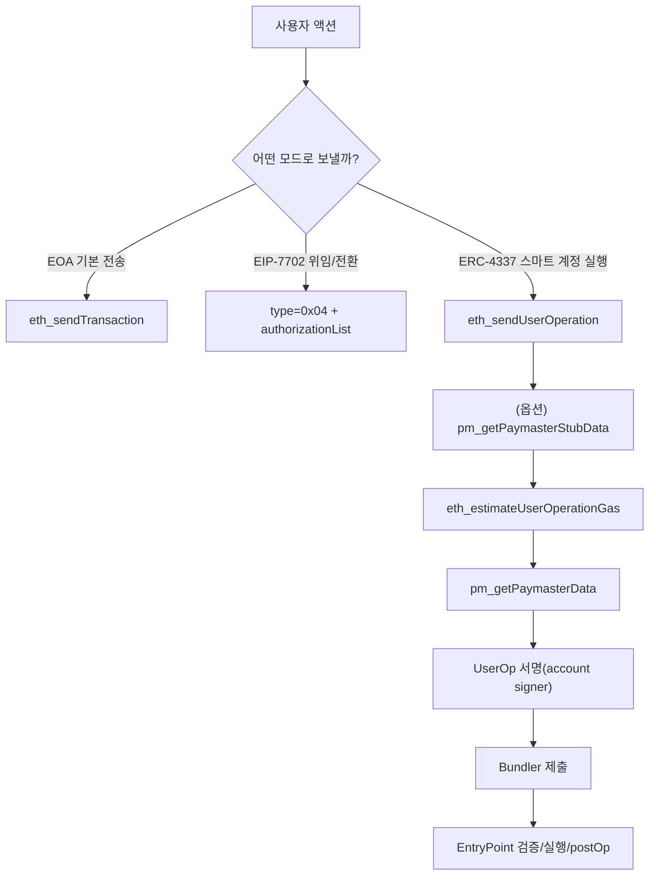
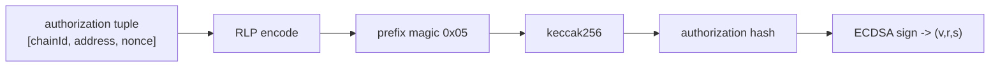
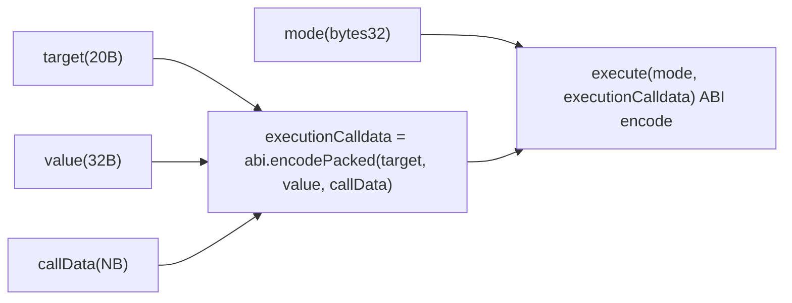
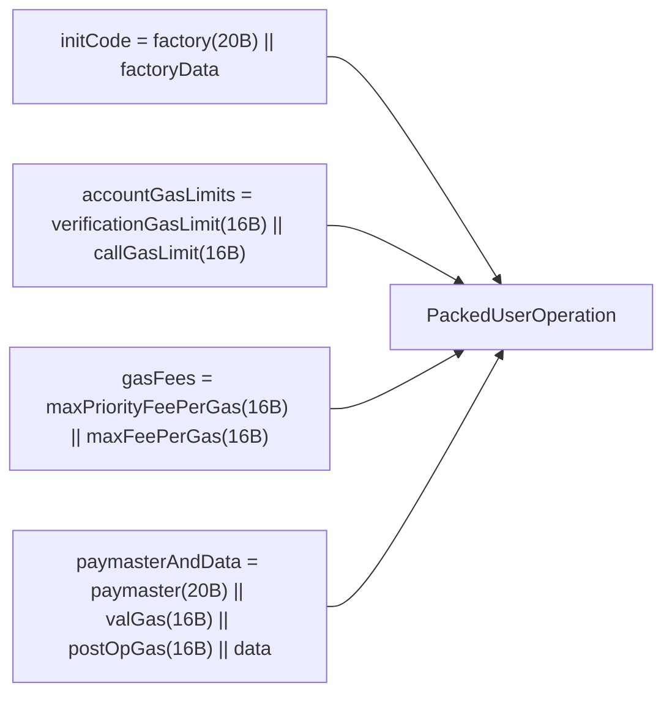
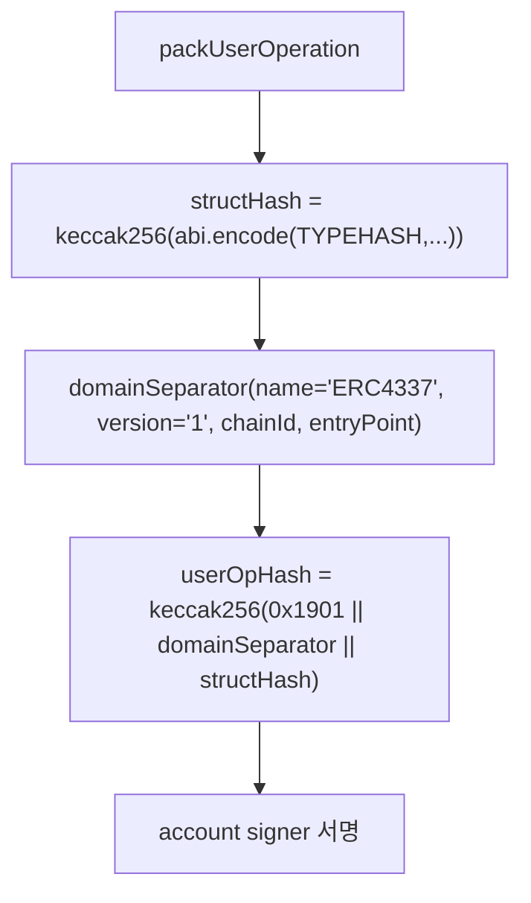
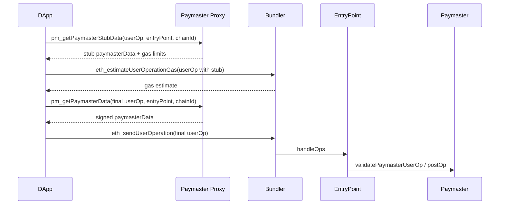
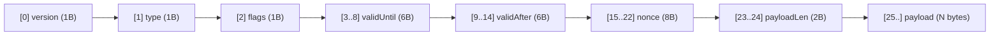
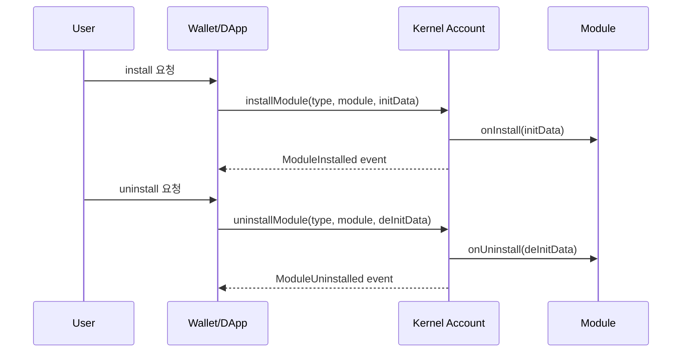

# 세미나 산출물 2: Transaction Cookbook (KO)

작성일: 2026-03-02  
대상: DApp/Wallet/Backend 개발자 실습

---

## 0) 이 문서의 사용법

이 문서는 "트랜잭션을 실제로 어떻게 만들어 보내는지"를 구현 관점으로 정리한 실습 가이드다.

핵심 원칙:

1. 파라미터는 **누가 채우는지(지갑/앱/SDK/서버)**를 먼저 구분한다.
2. UserOp, Authorization, PaymasterData는 각각 **서명 경계**가 다르다.
3. 실패 시 해시/nonce/가스/entryPoint를 먼저 확인한다.

---

## 1) 전체 분기 다이어그램



---

## 2) Recipe A: EIP-7702 Delegation 트랜잭션 (type-4)

기준 코드:

- `packages/sdk-ts/core/src/eip7702/authorization.ts`
- `packages/sdk-go/eip7702/authorization.go`
- `apps/web/hooks/useSmartAccount.ts`
- `apps/wallet-extension/src/ui/pages/Send/hooks/useSendTransaction.ts`

### 2.1 필수 입력 파라미터

| 파라미터 | 타입 | 설정 주체 | 설명 |
|---|---|---|---|
| `chainId` | uint | Wallet/DApp | authorization 서명 도메인 |
| `address` | address | DApp | 위임 대상(delegate) 컨트랙트 주소 |
| `nonce` | uint | Wallet | EIP-7702 authorization nonce |
| `v,r,s` | sig | Wallet | authorization 서명 결과 |
| `type` | `0x04` | Wallet | set-code tx 타입 |
| `authorizationList` | array | Wallet | signed authorization list |
| `to`,`data`,`value` | tx fields | DApp | 실제 실행할 tx payload |

### 2.2 authorization 해시 메시지 포맷



요약 공식:

```text
authHash = keccak256(0x05 || rlp([chainId, address, nonce]))
```

### 2.3 전송 예시 (TS 개념 코드)

```ts
import { createAuthorization, createAuthorizationHash, createSignedAuthorization } from '@stablenet/core'

const auth = createAuthorization(chainId, delegateAddress, authNonce)
const authHash = createAuthorizationHash(auth)
const signature = await wallet.signMessage({ raw: authHash })
const signedAuth = createSignedAuthorization(auth, signature)

await walletClient.sendTransaction({
  to: eoaAddress,
  data: '0x',
  authorizationList: [signedAuth],
  // viem 내부적으로 type-4 처리
})
```

### 2.4 자주 실패하는 포인트

1. authorization nonce를 tx nonce와 혼동
2. chainId mismatch(서명 체인과 전송 체인 불일치)
3. delegate address 오설정
4. `authorizationList` 누락

---

## 3) Recipe B: ERC-4337 UserOperation (Self-paid)

기준 코드:

- `apps/web/hooks/useUserOp.ts`
- `packages/sdk-ts/core/src/utils/userOperation.ts`
- `packages/sdk-go/core/userop/packing.go`
- `services/bundler/src/rpc/server.ts`
- `poc-contract/src/erc4337-entrypoint/EntryPoint.sol`

### 3.1 callData(ERC-7579 execute) 메시지 포맷

`Kernel.execute(mode, executionCalldata)` 기준:



### 3.2 UserOperation 필수 필드

| 필드 | 설명 | 누가 결정? |
|---|---|---|
| `sender` | Smart Account 주소 | Wallet/SDK |
| `nonce` | EntryPoint nonce | Wallet/SDK |
| `factory/factoryData` | 첫 배포 시 사용 | SDK |
| `callData` | account 실행 payload | DApp/SDK |
| `callGasLimit` | 실행 가스 | Bundler 추정 + 정책 |
| `verificationGasLimit` | 검증 가스 | Bundler 추정 + 정책 |
| `preVerificationGas` | calldata/오버헤드 | Bundler/SDK |
| `maxFeePerGas` | EIP-1559 max fee | Wallet |
| `maxPriorityFeePerGas` | tip | Wallet |
| `signature` | account 서명 | Wallet signer |

### 3.3 PackedUserOperation 포맷 다이어그램



### 3.4 userOpHash 계산 경로 (v0.9)



### 3.5 제출 예시 (TS 개념 코드)

```ts
import { getUserOperationHash, packUserOperation } from '@stablenet/core'
import { createBundlerClient } from '@stablenet/wallet-sdk'

const packed = packUserOperation(userOp)
const userOpHash = getUserOperationHash(userOp, entryPoint, BigInt(chainId))
const signature = await wallet.signMessage({ raw: userOpHash })

const bundler = createBundlerClient({ url: bundlerUrl, entryPoint })
const hash = await bundler.sendUserOperation({ ...packed, signature })
const receipt = await bundler.waitForUserOperationReceipt(hash)
```

### 3.6 제출 예시 (Go 개념 코드)

```go
packed := userop.Pack(userOp)
hash, _ := userop.GetUserOperationHash(userOp, entryPoint, chainID)
// signer로 hash 서명 후 userOp.Signature 설정
// bundler client로 eth_sendUserOperation 호출
_ = packed
_ = hash
```

### 3.7 자주 실패하는 포인트

1. `maxPriorityFeePerGas > maxFeePerGas`
2. nonce key/sequence 혼용
3. `callData` 인코딩 방식 오류(encode vs encodePacked)
4. entryPoint 주소/버전 mismatch

---

## 4) Recipe C: Sponsored / ERC-20 Settlement (Paymaster)

기준 코드:

- `services/paymaster-proxy/src/app.ts`
- `services/paymaster-proxy/src/handlers/getPaymasterStubData.ts`
- `services/paymaster-proxy/src/handlers/getPaymasterData.ts`
- `services/paymaster-proxy/src/signer/paymasterSigner.ts`
- `services/paymaster-proxy/src/settlement/*`
- `poc-contract/src/erc4337-paymaster/*`

### 4.1 RPC 시퀀스



### 4.2 Paymaster Envelope 포맷(25-byte header)



### 4.3 파라미터 책임 분리

| 항목 | 소유 주체 | 설명 |
|---|---|---|
| `paymasterType`, `payload` | DApp 정책 | sponsor/erc20/permit2 결정 |
| `validUntil`, `validAfter` | Paymaster Proxy | 서명 유효 시간 |
| `envelope.nonce` | Paymaster/Proxy | 재사용 방지 nonce |
| `paymasterVerificationGasLimit` | Proxy + 추정기 | 검증 단계 가스 |
| `paymasterPostOpGasLimit` | Proxy + 추정기 | postOp 단계 가스 |
| `paymasterData` 서명 | Proxy signer | on-chain 검증 입력 |

### 4.4 자주 실패하는 포인트

1. `entryPoint` allowlist 불일치
2. `chainId` 불일치
3. envelope nonce/시간 범위 오류
4. stub data와 final data를 혼동해 제출

---

## 5) Recipe D: ERC-7579 Module 설치/제거/교체

기준 코드:

- `poc-contract/src/erc7579-smartaccount/Kernel.sol`
- `packages/sdk-ts/core/src/modules/*`
- `packages/sdk-go/modules/*`
- `apps/wallet-extension/src/background/controllers/ModuleController.ts`

### 5.1 Lifecycle 시퀀스



### 5.2 모듈 타입별 질문

1. Validator: 누가 서명 검증하는가?
2. Executor: 어떤 실행을 캡슐화하는가?
3. Fallback: 어떤 selector를 라우팅하는가?
4. Hook: pre/post 어느 단계에서 비용/리스크가 생기는가?

---

## 6) 디버깅 순서(현장용)

1. chainId/entryPoint 주소 확인
2. sender/account code 상태(EOA/delegated/smart) 확인
3. nonce 소스 확인(authorization nonce vs userOp nonce)
4. hash 계산 경로 확인(authHash/userOpHash/paymasterHash)
5. gas 필드 단위 확인(특히 paymaster gas)
6. paymasterData 포맷/길이 확인
7. bundler RPC 응답 에러 코드(AAxx) 확인
8. EntryPoint 이벤트와 RPC 결과 해시 대조
9. postOp 실패 여부 및 정산 상태 확인
10. fallback/module 충돌 여부 확인

---

## 7) 세미나 실습 체크리스트

1. EIP-7702 위임 성공/해제 각 1회
2. self-paid UserOp 성공 1회
3. sponsor-paid UserOp 성공 1회
4. ERC-20 정산 케이스 성공 1회
5. 모듈 install/uninstall 각 1회
6. 실패 케이스(의도적으로 nonce mismatch) 재현 1회

