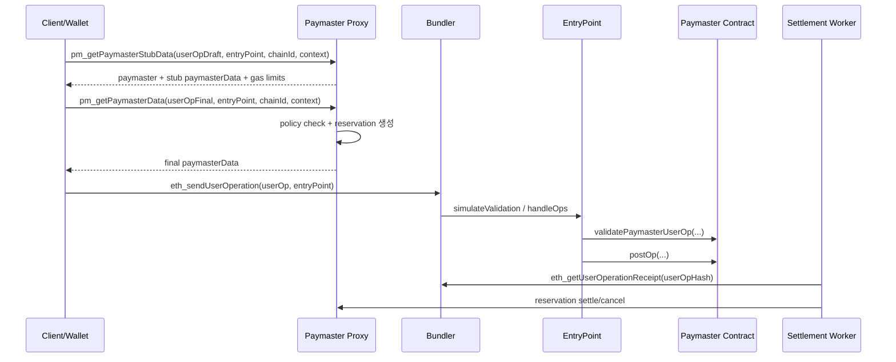

# [00] Paymaster 최종 구현 가이드 (개발자용)

작성일: 2026-02-24  
대상 독자: Paymaster를 실제 구현/운영하는 개발자

## 1. 문서 목적

이 문서는 EIP-4337 Paymaster 구현에 필요한 핵심을 한 문서에서 제공한다.

- 스펙이 정의하는 영역 vs 서비스 확장 영역 분리
- Contract/Proxy/SDK에서 어떤 함수를 언제 호출하는지 정리
- 입력/출력 파라미터와 타입 정리
- 운영/검증 기준 정리

## 2. EIP-4337 스펙 범위와 스펙 예외

### 2.1 스펙이 정의하는 부분
- EntryPoint가 `validatePaymasterUserOp` / `postOp`를 호출하는 실행 프레임
- `paymasterAndData`의 위치와 기본 파싱 규약
- deposit/stake 및 validationData(시간 범위) 처리

### 2.2 스펙 예외(서비스 구현)
- `paymasterData` 내부 ABI 포맷
- 정책 엔진(allowlist, quota, risk)
- 오프체인 서명 발급/검증 인프라
- userOpHash 기반 후정산(settle/cancel)
- 운영 지표/알람

## 3. 최소 동작 흐름

## 4. Contract 구현 기준

### 4.1 필수 인터페이스
- `validatePaymasterUserOp(PackedUserOperation userOp, bytes32 userOpHash, uint256 maxCost)`
- `postOp(PostOpMode mode, bytes context, uint256 actualGasCost, uint256 actualUserOpFeePerGas)`

### 4.2 공통 입력/출력

| 함수 | 입력 | 출력 | 사용 시점 |
|---|---|---|---|
| `validatePaymasterUserOp` | `userOp`, `userOpHash`, `maxCost` | `context`, `validationData` | 검증 단계 |
| `postOp` | `mode`, `context`, `actualGasCost`, `actualUserOpFeePerGas` | 없음 | 실행 후 정산 |

`validationData`:
- 성공/실패 + `validUntil/validAfter`를 포함해 EntryPoint가 최종 해석

### 4.3 현재 구현 타입
- Verifying
- Sponsor
- ERC20
- Permit2

공통 전략:
- envelope decode -> paymasterType check -> payload decode -> 검증/정산

## 5. Proxy API 구현 기준

### 5.1 `pm_getPaymasterStubData`

입력:
- `userOp: UserOperationRpc | PackedUserOperationRpc`
- `entryPoint: Address`
- `chainId: Hex`
- `context?: PaymasterContext`

출력(`PaymasterStubDataResponse`):
- `paymaster: Address`
- `paymasterData: Hex`
- `paymasterVerificationGasLimit: Hex`
- `paymasterPostOpGasLimit: Hex`
- `isFinal?: boolean`

용도:
- 가스 추정 단계에서 임시(stub) 데이터 제공

### 5.2 `pm_getPaymasterData`

입력:
- `userOp: UserOperationRpc | PackedUserOperationRpc`
- `entryPoint: Address`
- `chainId: Hex`
- `context?: PaymasterContext`

출력(`PaymasterDataResponse`):
- `paymaster: Address`
- `paymasterData: Hex`
- `reservationId?: string` (후정산 추적)

용도:
- 실제 제출 전 최종 데이터 생성

### 5.3 `PaymasterContext` 주요 필드

| paymasterType | 필수/주요 context |
|---|---|
| `verifying` | `policyId?` |
| `sponsor` | `policyId?`, `campaignId?`, `perUserLimit?`, `targetContract?`, `targetSelector?` |
| `erc20` | `tokenAddress` (+ `maxTokenCost?`, `quoteId?`) |
| `permit2` | `tokenAddress` (+ permit 관련 필드) |

검증 필수:
- supported chain
- supported EntryPoint allowlist

## 6. SDK 구현 기준

SDK 역할:
- envelope/payload 인코딩 유틸 제공
- paymaster hash/domain 계산 유틸 제공
- Contract/Proxy와 동일 해시 규칙 유지

핵심 함수(개념):
- `encodePaymasterData(...)`
- `encode*Payload(...)`
- `computePaymasterDomainSeparator(...)`
- `computeUserOpCoreHash(...)`
- `computePaymasterHash(...)`

## 7. 스펙 예외 기능 매트릭스

| 항목 | 구현 여부 | 분류 |
|---|---|---|
| 공통 envelope + payload ABI | 구현됨 | 스펙 예외 |
| 정책 엔진 | 구현됨 | 스펙 예외 |
| EntryPoint allowlist 강제 | 구현됨 | 스펙 예외 |
| reservation + receipt 후정산 | 구현됨 | 스펙 예외 |
| 운영 지표/알람 | 구현됨 | 스펙 예외 |

## 8. 운영 체크리스트

1. 배포 전
- EntryPoint/Paymaster 주소 매핑 확인
- signer 설정 확인
- deposit/stake 잔고 확인

2. 런타임
- 승인율/거절율
- 평균 sponsor 비용
- reservation pending/expiry
- settlement 성공률

3. 장애 대응
- proxy feature flag 복귀 경로
- 후정산 데이터 정합 우선 점검

## 9. 검증 상태(최신)

- proxy tests: pass
- sdk-ts paymaster tests: pass
- paymaster contract tests: pass

최종 기준:
- 본 문서를 Paymaster 구현/운영의 기준 문서로 사용한다.
