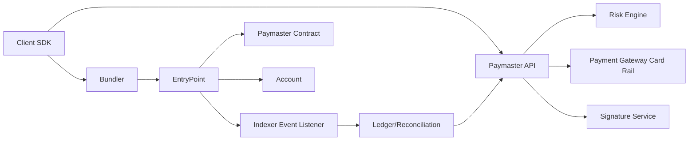

# [02] Visa 참고 Paymaster 아키텍처 (StableNet용)

작성일: 2026-02-23

## 1. 배경

Visa는 Account Abstraction 맥락에서 "카드 결제 레일 + 온체인 가스 대납"을 연결하는 접근을 공개했다. 핵심은 다음과 같다.
- 사용자는 블록체인 native token이 없어도 결제 UX를 유지
- 오프체인 결제 승인(카드/리스크/한도)과 온체인 UserOp 실행을 분리
- Paymaster는 최종적으로 온체인 가스비 지불 역할

참고:
- Visa product page: https://usa.visa.com/solutions/crypto/account-abstraction.html
- Visa dev article: https://developer.visa.com/pages/visa-account-abstraction
- Visa announcement: https://usa.visa.com/about-visa/newsroom/press-releases.releaseId.19881.html

## 2. 제안 원칙

1. `스펙 준수 경로`와 `비즈니스 정책 경로`를 분리한다.
- 온체인: EntryPoint + Paymaster(validate/postOp)
- 오프체인: 정책, 결제 승인, 리스크, 사용량 정산

2. Paymaster 타입별 서명/데이터 형식을 분리한다.
- `verifying`, `sponsor`, `erc20`, `permit2`를 단일 signer로 합치지 않는다.

3. 운영 회계는 "승인 시점"이 아니라 "체인 결과 시점"으로 맞춘다.
- userOpHash 기반 receipt/event를 source of truth로 사용

## 3. 권장 시스템 구성

## 4. 권장 오프체인 API 계약

### 4.1 `pm_getPaymasterStubData`
- 용도: 가스 추정용
- 반환: type별 `paymaster`, `paymasterData(stub)`, `paymasterVerificationGasLimit`, `paymasterPostOpGasLimit`

### 4.2 `pm_getPaymasterData`
- 용도: 최종 제출용
- 사전조건:
  - 리스크 엔진 승인
  - 결제 레일 사전 승인(카드 hold 또는 내부 credit 승인)
- 반환:
  - 온체인 컨트랙트가 실제 검증 가능한 paymasterData

### 4.3 `pm_finalizeUserOperation(userOpHash)` (신규 제안)
- 역할:
  - on-chain 결과(성공/실패, gasCost) 반영
  - 카드 capture/void, 내부 정산 반영
- 입력: `userOpHash`, 체인ID, 확인 depth

## 5. 권장 온체인 컨트랙트 책임

### 5.1 VerifyingPaymaster
- 검증 책임:
  - 서명 검증
  - validAfter/validUntil
  - replay 방지 nonce
- 최소 postOp:
  - 실제 gasCost 이벤트 기록

### 5.2 SponsorPaymaster
- 검증 책임:
  - campaign/policy ID 및 온체인 최소 조건
- 세부 정책(고급 리스크)은 오프체인으로 이동

### 5.3 ERC20 / Permit2 Paymaster
- 검증 책임:
  - 토큰/permit 유효성
  - 허용 토큰/가격 오라클 신선도
- postOp 책임:
  - 실제 비용만큼 토큰 징수

## 6. 제안 플로우 (Visa 스타일 변형)

1. 클라이언트가 StubData 요청
2. Bundler 가스 추정
3. 클라이언트가 FinalData 요청
4. Paymaster API:
- 정책/리스크 검사
- 카드/결제 승인(hold)
- 최종 paymasterData 서명
5. UserOp 제출 -> EntryPoint 실행
6. Indexer가 `UserOperationEvent` 수신
7. 백엔드가 실제 가스비로 capture/void 및 내부 원장 반영

## 7. 현재 코드 기준 개선 제안

### P0 (즉시)
- paymaster type별 `paymasterData` ABI 명세를 문서화하고 코드에서 강제
- proxy signer를 계약별로 분리 (`VerifyingSigner`, `SponsorSigner`)
- 오프체인 서명 해시를 컨트랙트 `getHash`와 완전 일치

### P1
- `recordSpending` 시점을 `pm_getPaymasterData`가 아니라 on-chain 성공 이벤트 후로 변경
- `pm_getPaymasterData` 응답에 `formatVersion` 및 `paymasterType` 명시

### P2
- 결제 레일 연계(카드 hold/capture/void) 서비스 도입
- 리스크 엔진 점수 기반 동적 한도 및 실시간 차단

## 8. 기대 효과

- 스펙 준수 경로와 비즈니스 정책 경로 분리로 장애 반경 축소
- type별 서명/포맷 분리로 통합 오류 감소
- userOpHash 기반 후정산으로 회계 일관성 개선
- 카드/법정화폐 결제 연계 시 사용자 UX 개선(무가스 진입)

## 9. 주의

- 위 Visa 연계 제안은 공개 자료 기반의 아키텍처적 참조이며, 실제 상용 통합은 카드 네트워크/규제/컴플라이언스 설계가 추가로 필요하다.
- 이 문서의 Visa 방식 설명은 공개 문헌에서 유추한 설계 원칙(추론)이다.
