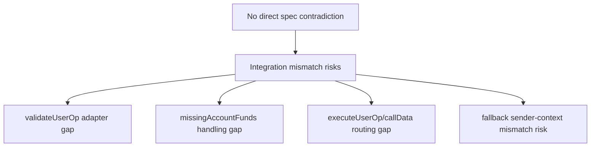
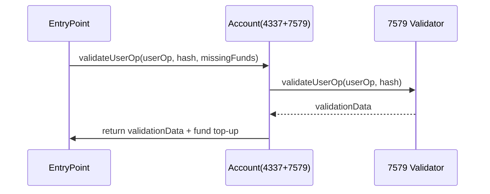

# EIP-4337 + ERC-7579 통합 스펙 준수 보고서

최종 갱신일: 2026-03-02 (더블체크 + 코드정합성 병합 반영 + P0-4 DESIGN CHOICE + 오프체인 전수 해결)

---

## 1. 개요

### 1.1 문서 목적

EIP-4337(Account Abstraction)과 ERC-7579(Modular Smart Account)를 병행 사용하는 Smart Account 구현에 대해:

1. 두 스펙 간 **정합성 분석** — 직접적 규격 충돌 여부 판별
2. 통합 구현 시 **충돌 위험 지점**(C1-C12) 정의 및 **충돌방지 설계 규칙**(R1-R10) 수립
3. 현재 코드의 **스펙 준수 현황** 전수 점검
4. **미해결 이슈** 상세 분석 및 **실행 체크리스트** 제공

### 1.2 기준 스펙 버전

| 스펙 | 버전 | 참조 문서 |
|------|------|-----------|
| EIP-4337 | EntryPoint **v0.9** (`0x433709009B8330FDa32311DF1C2AFA402eD8D009`) | `EIP-4337_스펙표준_정리.md` (1071 lines) |
| ERC-7579 | Final | `EIP-7579_스펙표준_정리.md` (561 lines) |

> v0.9는 v0.7/v0.8과 ABI 호환. 기존 Account/Paymaster 코드 변경 없이 사용 가능.

### 1.3 검토 대상 코드

- `poc-contract/src/erc7579-smartaccount/*` (Kernel, ValidationManager, HookManager 등)
- `poc-contract/src/erc7579-validators/*` (ECDSA, MultiChain, MultiSig, WebAuthn, WeightedECDSA)
- `poc-contract/src/erc7579-hooks/*`
- `poc-contract/src/erc7579-fallbacks/*` (FlashLoanFallback, TokenReceiverFallback)
- `poc-contract/src/erc4337-entrypoint/*` (EntryPoint, SenderCreator, NonceManager 등)
- `poc-contract/src/erc4337-paymaster/*` (VerifyingPaymaster, SponsorPaymaster, ERC20Paymaster, Permit2Paymaster, BasePaymaster)

### 1.4 이슈 분류 체계

| 분류 | 의미 | 조치 수준 |
|------|------|-----------|
| **SPEC VIOLATION** | EIP-4337 또는 ERC-7579의 MUST/MUST NOT 요구사항 위반 | 즉시 수정 필수 |
| **IMPLEMENTATION BUG** | 스펙 MUST 위반은 아니나, 모듈 시스템의 기본 계약이 깨지는 기능적 버그 | 즉시 수정 필요 |
| **BUNDLER COMPAT** | 컨트랙트 스펙 자체는 위반하지 않으나, 번들러 시뮬레이션 규칙에 의해 거부될 수 있는 항목 | Public mempool 대응 시 |
| **DESIGN CHOICE** | 의도적인 설계 결정으로, 코드 내 문서화가 완료된 항목 | 조치 불필요 |
| **NOT AN ISSUE** | 이전 검토에서 지적되었으나 실제로는 문제가 아닌 항목 | 조치 불필요 |

---

## 2. 스펙 간 정합성 분석

### 2.1 결론

**명시적 규격 충돌(서로 모순되는 MUST)은 없음.**

4337은 외부 계약(EntryPoint/Bundler/Paymaster) 호환성이 우선하고, 7579는 계정 내부 확장성(validator/executor/hook/fallback)의 구현 방식을 정의한다. 두 스펙은 **레이어가 다르며 상호 보완적**이다.

다만, 4337 Account 스펙에 7579 모듈 구조를 붙일 때 **구현 어댑터가 없으면 오류가 나는 지점**이 존재한다.

### 2.2 통합 구현 시 불일치 위험 영역

| 주제 | ERC-7579 | EIP-4337 | 판정 | 구현 리스크 |
|------|----------|----------|------|------------|
| EntryPoint 의존성 | `requires: 4337`, EntryPoint trusted singleton | 단일 진입점 모델 (`스펙정리:106`) | 정합 | 낮음 |
| Account 검증 함수 | validator 선택/forwarding 규칙, validation SHOULD return validator value | `IAccount.validateUserOp(userOp, userOpHash, missingAccountFunds)` MUST (`스펙정리:191-210`) | **부분 정합** | **중간** |
| Validator 함수 시그니처 | `IERC7579Validator.validateUserOp(userOp, userOpHash)` — 2개 인자 | account는 `missingAccountFunds` 처리 책임 (`스펙정리:198, :209`) | **인터페이스 레벨 불일치** | **높음** |
| 실행 인터페이스 | `execute(mode, executionCalldata)` / `executeFromExecutor` | 4337 실행은 `userOp.callData` 기반, `executeUserOp` MAY (`스펙정리:230-241`) | 정합 가능 | 중간 |
| executeUserOp 처리 | `userOp.callData[4:]` 실행 SHOULD, delegatecall RECOMMENDED | `IAccountExecute.executeUserOp` MAY (`스펙정리:230-239`) | 정합 | 중간 |
| validationData 포맷 | 포맷 직접 규정 없음 (validator uint256 반환만 명시) | authorizer/validUntil/validAfter 패킹 명시 (`스펙정리:211-217`) | 충돌 아님 (보완 관계) | 중간 |
| fallback sender 전달 | ERC-2771로 원본 sender append MUST | 계정 실행 문맥에서 `msg.sender=EntryPoint` (`스펙정리:204, :352` — EntryPoint 호출자 MUST 검증) | 정합 가능 | **높음** |

### 2.3 핵심 어댑터 포인트

#### 2.3.1 validateUserOp 어댑터

7579 validator는 `missingAccountFunds` 인자가 없다. 4337 account는 이를 받아 EntryPoint에 보충해야 한다.

오류 패턴:
- account가 validator 호출만 하고 `missingAccountFunds` 보충을 누락
- 서명 검증은 통과하지만 4337 규칙 위반으로 실패

#### 2.3.2 실행 경로 매핑

필수 설계:
- `userOp.callData`가 account의 `execute(...)` 또는 `executeUserOp(...)` 경로로 일관되게 디코딩되어야 함
- `supportsExecutionMode(mode)`와 실제 실행 분기가 반드시 일치해야 함

#### 2.3.3 Fallback sender-context

7579는 fallback에 ERC-2771 sender 전달을 강제한다. 4337 문맥에서는 account의 직접 caller가 EntryPoint이므로, "누구를 원본 sender로 간주할지"를 계정 구현에서 명확히 정의해야 한다.

오류 패턴:
- kernel/account는 20바이트 append, fallback 모듈은 다른 포맷(예: 40바이트)을 기대
- 설치 시점 key와 실행 시점 key가 달라져 모듈 조회 실패

---

## 3. 충돌 위험 지점 (C1-C12)

| ID | 충돌 지점 | 관련 규칙 | 위험도 | 영향 |
|----|-----------|-----------|--------|------|
| C1 | `callData` 실행 경로 vs `execute(mode, executionCalldata)` 경로 | R1 | 높음 | 시뮬레이션 통과 후 실제 실행 실패 |
| C2 | `executeUserOp` 의존성 | R2 | 중간 | 7579 계정 호환성 저하 |
| C3 | validationData 인코딩 해석 불일치 | R3 | 높음 | `AA24/AA22` 등 검증 실패 |
| C4 | Hook의 비결정성/고비용 로직 | R4 | 중간 | bundler 시뮬레이션 불안정 |
| C5 | fallback sender 문맥 처리 오류 | R5 | **높음** | 권한 우회/오탐 |
| C6 | nonce 계층(EntryPoint vs 모듈 내부) 혼선 | R6 | 중간 | replay/nonce mismatch |
| C7 | 7579 확장 모듈 타입(5+) 필수화 | R7 | 낮음 | 인프라 상호운용성 저하 |
| C8 | timestamp vs block-number mode 혼용 | R9 | 중간 | 유효성 판정 불일치 |
| C9 | delegatecall mode(0xff) 대상 신뢰 검증 부재 | R8 | 높음 | 계정 storage 오염, 임의 코드 실행 |
| C10 | Hook `postCheck` 실패 → Paymaster `postOp(opReverted)` 상호작용 (`context != empty` 조건). v0.9: postOp revert 시 재호출 없이 prefund 직접 정산 | R4 | 중간 | hook 실패가 paymaster 비용/정산에 영향 |
| C11 | v0.9 `IgnoredInitCode` 동작과 7579 초기 모듈 설치 | R1 | 중간 | 배포 완료 계정에 initCode 제공 시 무시되어 초기 모듈 미설치 |
| C12 | EIP-7702 초기화 경로와 7579 `installModule` 경로 불일치 | R10 | 중간 | 7702 authorization 기반 초기화가 7579 모듈 onInstall을 트리거하지 않을 수 있음 |

---

## 4. 충돌방지 설계 규칙 (R1-R10)

### R1. 실행 엔트리 정합성 (C1, C11)

- **MUST**: `userOp.callData`가 실제 계정 실행 함수 ABI와 1:1 대응되도록 고정
- **MUST**: 지원하는 실행 모드(`supportsExecutionMode`)와 실제 실행 가능 모드가 일치
- **SHOULD**: 실행 경로를 `executeUserOp -> execute(mode, executionCalldata)`로 단일화해 분기 최소화
- **SHOULD**: v0.9 `IgnoredInitCode` 동작에 대비하여, 7579 초기 모듈 설치를 `initCode` → factory 경로에만 의존하지 않도록 설계

> **스펙 근거**: ERC-7579 `supportsExecutionMode` MUST 정확한 지원 여부 반환 (`EIP-7579_스펙표준_정리.md:158-159`), EIP-4337 `executeUserOp` MAY (`EIP-4337_스펙표준_정리.md:230-241`)

### R2. `executeUserOp` 호환성 처리 (C2)

- **MUST**: `executeUserOp`를 사용하는 경우 onlyEntryPoint 강제
- **SHOULD**: `executeUserOp` 미구현 계정도 지원할 수 있도록 SDK/인코더에서 fallback ABI 전략 제공

> **스펙 근거**: ERC-7579 `executeUserOp` onlyEntryPoint MUST (`EIP-7579_스펙표준_정리.md:108`), EIP-4337 `IAccountExecute` MAY (`EIP-4337_스펙표준_정리.md:230-239`)

### R3. validationData 포맷 고정 (C3)

- **MUST**: validator 모듈 반환값은 ERC-4337 validationData 포맷(`authorizer|validUntil|validAfter`) 준수
- **SHOULD**: 서명 실패 시 `SIG_VALIDATION_FAILED(1)` 반환, revert 지양 (EIP-4337 §5 기준)
- **SHOULD**: 모든 validator 모듈이 동일 helper 라이브러리로 validationData를 pack/unpack
- **SHOULD**: v0.9 EIP-712 헬퍼(`getPackedUserOpTypeHash()`, `getDomainSeparatorV4()`)를 활용해 오프체인 hash 계산 일관성 보장

> **스펙 근거**: EIP-4337 validationData packing (`EIP-4337_스펙표준_정리.md:211-217`), ERC-7579 validator uint256 반환 (`EIP-7579_스펙표준_정리.md:416, :426-427`)

### R4. Hook 결정성/비용 제한 (C4, C10)

- **MUST**: 실행 구간(hook `preCheck`/`postCheck` 포함) 전체에서 비결정적 외부 상태 의존 최소화
- **MUST**: hook 실패 시 오류가 명확히 식별 가능해야 함
- **MUST**: `postCheck` 실패가 전체 execution을 revert시킬 수 있음을 인지하고 설계
- **MUST**: Paymaster `postOp(opReverted)` 경로는 `context != empty`일 때만 트리거됨을 전제로 정산 로직 설계
- **MUST**: v0.9에서 `postOp` revert 시 EntryPoint가 `PostOpReverted` 모드로 재호출하지 않고, 실행을 revert하고 prefund에서 직접 가스비를 정산하는 변경 사항을 인지. Paymaster는 `opSucceeded`/`opReverted` 2개 모드만 처리하도록 설계 (`Paymaster_구현가이드:82-84`)
- **SHOULD**: hook은 정책 검증 중심, 고비용 연산/외부 상호작용은 실행 로직 내부로 이동
- **SHOULD**: v0.9 `delegateAndRevert` 시뮬레이션 경로와 기존 view/trace call 시뮬레이션 경로에서 hook 동작이 동일한 결과를 산출하는지 검증

> **스펙 근거**: ERC-7579 Hook preCheck/postCheck MUST 호출 (`EIP-7579_스펙표준_정리.md:278-279`), EIP-4337 Paymaster postOp (`EIP-4337_스펙표준_정리.md:334-348`)

### R5. Fallback sender 문맥 일치 (C5)

- **MUST**: fallback handler에서 직접 `msg.sender` 권한 판정 금지 (ERC-2771 문맥 사용)
- **MUST**: EntryPoint 경유 호출과 direct 호출을 구분 가능한 방식으로 처리
- **SHOULD**: fallback 경로별 auth 모델을 문서화 (allowed caller matrix)

> **스펙 근거**: ERC-7579 fallback ERC-2771 MUST (`EIP-7579_스펙표준_정리.md:327`), fallback handler `msg.sender` 의존 금지 MUST (`EIP-7579_스펙표준_정리.md:438-439`)

### R6. nonce 계층 분리 (C6)

- **MUST**: EntryPoint nonce(4337)와 모듈/세션 nonce(7579 확장)를 논리적으로 분리
- **MUST**: replay 방지 키를 도메인 분리 (체인/EntryPoint/Account/모듈 컨텍스트)
- **SHOULD**: nonce 소모 타이밍을 validation/실행 중 어디서 하는지 표준화

> **스펙 근거**: EIP-4337 keyed nonce (`EIP-4337_스펙표준_정리.md:85, :124`)

### R7. 확장 모듈 타입 비필수화 (C7)

- **MUST**: 타입 1~4만으로도 계정이 동작하도록 설계
- **SHOULD**: 타입 5+ (policy/signer 등)는 optional capability로 제공

> **스펙 근거**: ERC-7579 module type 5+ 미정의 (`EIP-7579_스펙표준_정리.md:382`)

### R8. delegatecall mode 대상 신뢰 검증 (C9)

- **MUST**: `callType=0xff`(delegatecall) 실행 시 target이 신뢰할 수 있는 컨트랙트인지 검증
- **MUST**: delegatecall 대상을 화이트리스트 또는 레지스트리 기반으로 제한
- **SHOULD**: delegatecall mode 지원 여부를 `supportsExecutionMode`에서 정확히 반영

> **스펙 근거**: ERC-7579 Security Considerations delegatecall 검증 (`EIP-7579_스펙표준_정리.md:489`)

### R9. 시간 유효성 모드 일관성 (C8)

- **MUST**: 한 UserOp 내 validationData는 timestamp 모드 또는 block-number 모드 중 하나만 사용
- **MUST**: Account/Paymaster/Validator의 시간 기준이 일치
- **SHOULD**: 운영 환경별(rollup 포함) block-time 변동성 고려

> **스펙 근거**: EIP-4337 Block Number Mode (`EIP-4337_스펙표준_정리.md:219-228`)

### R10. EIP-7702 초기화 경로와 7579 모듈 초기화 정합성 (C12)

- **MUST**: EIP-7702 경로(`initCode = 0x7702` prefix)로 계정 초기화 시, 7579 모듈 설치(`installModule`/`onInstall`)가 누락되지 않도록 초기화 함수에서 필수 모듈 설치를 보장
- **MUST**: EIP-7702 초기화 함수 호출은 `entryPoint.senderCreator()`에서만 허용
- **SHOULD**: EIP-7702 경로 미지원 네트워크에서도 동일한 모듈 초기화 결과를 달성할 수 있는 factory 기반 fallback 제공

> **스펙 근거**: EIP-4337 EIP-7702 통합 (`EIP-4337_스펙표준_정리.md:614-647`)

---

## 5. 코드 준수 현황

### 5.1 R1-R10 규칙 적합성 점검

| 규칙 | 상태 | 요약 | 코드 위치 |
|------|------|------|-----------|
| R1 실행 엔트리 정합성 | **PASS** | STATIC 제외. BATCH, SINGLE, DELEGATECALL만 허용하여 ExecLib.execute()과 정합 | `Kernel.sol:879` |
| R2 `executeUserOp` 호환성 | **PASS** | `executeUserOp` onlyEntryPoint 강제 및 4337 경로 연결 확인 | `Kernel.sol:409-429`, `EntryPoint.sol:249-251` |
| R3 validationData 포맷 고정 | **PASS** | validator 경로가 4337 validationData(uint256)로 반환/합성 | `ValidationManager.sol:315-331` |
| R4 Hook 결정성/비용 제한 | **PARTIAL** | hook은 execution 단계에서만 호출 (EIP-4337 MUST 위반 아님). per-hook gas limit opt-in 구현 완료 (`HookGasLimitStorage` + `setHookGasLimit()`). 비결정성 제한은 코드 레벨 일괄 강제 불가 (설계상 한계) | `HookManager.sol:14-51`, `Kernel.sol:595-598` |
| R5 Fallback sender 문맥 일치 | **PASS** | ~~[구현 버그 2건]~~ → 전체 해결. (1) ~~Kernel 20바이트 append vs Fallback 모듈 40바이트 기대~~ → **DONE**: `_extractContext()` ERC-2771 표준(20바이트)으로 수정 완료. (2) ~~TokenReceiverFallback 셀렉터 충돌~~ → **DESIGN CHOICE**: Kernel 내장 pure 함수는 ZeroDev 업스트림 의도적 설계. TokenReceiverFallback을 ERC-777 전용으로 축소 (§6.3) | `Kernel.sol:242-256` |
| R6 nonce 계층 분리 | **BUNDLER COMPAT** | paymaster validation에서 `senderNonce++` 수행. 컨트랙트 인터페이스상 허용, sender-associated storage 규칙 준수 | `VerifyingPaymaster.sol:147`, `SponsorPaymaster.sol:139` |
| R7 확장 모듈 타입 비필수화 | **PASS** | 코어 타입(1~4) 동작 가능 + 확장 타입은 추가 기능 | — |
| R8 delegatecall mode 신뢰 검증 | **PASS** | Caller 수준 접근 제어 + `DelegatecallWhitelistStorage` 온체인 화이트리스트 opt-in 구현 완료. `_checkDelegatecallTarget()`이 `fallback()`, `execute()`, `executeFromExecutor()` 3개 경로에 적용 | `Kernel.sol:81-84, 124-137, 291, 438, 461, 601-611` |
| R9 시간 유효성 모드 일관성 | **PASS** | 모든 validator/paymaster가 timestamp 모드 사용. block.number 혼용 없음 | 전체 validator/paymaster |
| R10 EIP-7702 초기화 정합성 | **PASS** | `Eip7702Support.sol`, `SenderCreator.initEip7702Sender`, `VALIDATION_TYPE_7702` 구현 확인 | `EntryPoint.sol:481-518` |

**요약**: PASS 8, PARTIAL 1 (R4 — hook 비결정성 코드 레벨 일괄 강제 불가), BUNDLER COMPAT 1

### 5.2 C1-C12 충돌 해결 현황

| 충돌 지점 | 주제 | 해결 규칙 | 상태 | 코드 위치 |
|-----------|------|-----------|------|-----------|
| C1 | 실행 모드 일관성 | R1 | **PASS** | `Kernel.sol:868-901` — STATIC 제외, ExecLib과 일치 |
| C2 | `executeUserOp` 브릿지 | R2 | **PASS** | `Kernel.sol:387-429` — 4337↔7579 브릿지 주석 기술 |
| C3 | validationData 형식 | R3 | **PASS** | `ValidationManager.sol:315-331` — `_intersectValidationData` 사용 (`_validateUserOp` 경유) |
| C4 | Hook 비결정성 | R4 | **PASS** | `Kernel.sol:401-408` — Hook 비결정론 경고 주석 기술 |
| C5 | Fallback sender 컨텍스트 | R5 | **PASS** | ~~구현 버그 2건~~ → 전체 해결. (1) ~~20/40바이트 불일치~~ **DONE** (2) ~~셀렉터 충돌~~ → **DESIGN CHOICE**: 옵션 C 적용, TokenReceiverFallback ERC-777 전용 축소 (§6.3) |
| C6 | nonce 계층 분리 | R6 | **PASS** | `Kernel.sol:321-327` — nonce 키 분리 주석 기술 |
| C7 | 확장 모듈 타입 | R7 | **PASS** | 코어 타입 1-4 기반 구조 유지 |
| C8 | 시간 모드 일관성 | R9 | **PASS** | 전체 timestamp 모드 일관 |
| C9 | delegatecall 보안 | R8 | **PASS** | `ExecLib.sol:48-59` — 보안 경고 및 설계 결정 주석 |
| C10 | Hook + Paymaster 상호작용 | R4 | **PASS** | hook 실패 시 revert 인지 설계 + `context != empty` 조건에서 `postOp(opReverted)` 정산 경로 처리 |
| C11 | IgnoredInitCode | R1 | **PASS** | `EntryPoint.sol:503` — IgnoredInitCode 이벤트 처리 |
| C12 | EIP-7702 초기화 | R10 | **PASS** | `EntryPoint.sol:493` — EIP7702AccountInitialized 이벤트 |

**전체**: 12/12 PASS (C5 — P0-3 해결, P0-4 DESIGN CHOICE 재분류 + 옵션 C 적용)

### 5.3 EIP-4337 핵심 요구사항 체크 (MUST + SHOULD)

| # | 강도 | 요구사항 | 상태 | 근거 |
|---|------|----------|------|------|
| 1 | MUST | Account.validateUserOp은 EntryPoint만 호출 가능 | **PASS** | `Kernel.sol:328` onlyEntryPoint |
| 2 | SHOULD | validateUserOp은 서명 실패 시 SIG_VALIDATION_FAILED 반환 (revert 지양) | **PASS** | `ValidationManager.sol` 경로에서 처리 |
| 3 | MUST | missingAccountFunds를 EntryPoint에 전송 | **PASS** | `Kernel.sol:375-380` assembly call |
| 4 | MUST | validationData 형식: authorizer(20) \| validUntil(6) \| validAfter(6) | **PASS** | `_packValidationData` 사용 |
| 5 | MUST | Paymaster.validatePaymasterUserOp은 EntryPoint만 호출 가능 | **PASS** | `BasePaymaster.sol:64` onlyEntryPoint |
| 6 | MUST | Paymaster.postOp은 EntryPoint만 호출 가능 | **PASS** | `BasePaymaster.sol:81` onlyEntryPoint |
| 7 | MUST | postOp은 PostOpMode 처리 | **PASS** | 각 paymaster에서 mode 체크 |
| 8 | SPEC 동작 규칙 | `context`가 빈값이면 postOp이 호출되지 않는 규칙을 전제로 설계 | **PASS** | EntryPoint 호출 규칙 (스펙 기준). 테스트 매트릭스 `§8.1 #6`에 context 존재/부재 케이스 포함 |
| 9 | MUST | paymasterAndData 기본 파싱: [0:20] address, [20:36] valGas, [36:52] postOpGas | **PASS** | `BasePaymaster.sol:200` PAYMASTER_DATA_OFFSET |
| 10 | OPTIONAL(포맷) | paymasterSignature suffix (`sig + len + PAYMASTER_SIG_MAGIC`) 호환성 | **PARTIAL** | 현재 PoC는 기본 파싱 중심. suffix 사용 시 별도 호환성 테스트/문서화 필요 |
| 11 | MUST | `userOpHash`에 대한 서명 유효성 검증 | **PASS** | `ValidationManager.sol` — validator 경유 `userOpHash` 검증. EntryPoint 접근 제어(#1)와 별개의 MUST (`스펙정리:205`) |
| 12 | MUST | SIG_VALIDATION_FAILED 이외의 에러는 revert | **PASS** | validator 실패 시 `SIG_VALIDATION_FAILED(1)` 반환, 그 외 경로는 revert (`스펙정리:208`) |
| 13 | SHOULD | 서명 실패 시에도 조기 반환 없이 정상 흐름 완료 (가스 추정 정확도) | **PASS** | `ValidationManager.sol` — 서명 실패에도 `missingAccountFunds` 보충 로직까지 실행 (`스펙정리:207`) |
| 14 | MUST | Factory: 계정 생성 호출이 `entryPoint.senderCreator()`에서 오는지 확인 | **PASS** | `KernelFactory.sol` — `onlySenderCreator` modifier 적용 (`스펙정리:575`) |
| 15 | MUST | Factory: 결정론적 주소를 위해 `CREATE2` 사용 | **PASS** | `KernelFactory.sol` — CREATE2 기반 배포 확인 (`스펙정리:576`) |
| 16 | MUST | 업그레이드 가능 계정: storage layout 충돌 방지 | **PASS** | ERC-7201 namespaced storage 패턴 사용 (`Kernel.sol`, `ValidationManager.sol` 등) (`스펙정리:589`) |
| 17 | SPEC 동작 규칙 | v0.9 postOp revert 시 재호출 없이 prefund에서 직접 정산 (이중 호출 제거) | **PASS** | 각 paymaster의 `_postOp` 구현이 `opSucceeded`/`opReverted` 2개 모드만 처리. `postOpReverted` 분기는 방어적 코딩으로만 유지 (`Paymaster_구현가이드:82-84`) |
| 18 | SPEC 동작 규칙 | 10% 미사용 가스 페널티: `callGasLimit`과 `paymasterPostOpGasLimit` 각각에 개별 적용. 미사용분이 40,000 gas 초과 시 미사용분의 10% 부과 | **구현 완료** | Paymaster Proxy 가스 추정에 `calculateUnusedGasPenalty()` 유틸 추가 (`gasEstimator.ts`). 가스 추정에 `paymasterVerificationGasLimit`, `paymasterPostOpGasLimit` 합산 반영 완료 (2026-03-02) |

**요약**: EIP-4337 MUST 위반 0건, SHOULD 미준수 0건, SPEC 동작 규칙 3건 PASS, OPTIONAL 포맷 호환성 보강 항목 1건

### 5.4 ERC-7579 MUST 요구사항 체크

| # | 요구사항 | 상태 | 근거 |
|---|----------|------|------|
| 1 | `execute(ExecMode, bytes)` 구현 | **PASS** | `Kernel.sol:458` |
| 2 | `executeFromExecutor(ExecMode, bytes)` 구현 | **PASS** | `Kernel.sol:431` |
| 3 | `installModule` / `uninstallModule` 구현 | **PASS** | `Kernel.sol:476-548, 616-648` |
| 4 | `isModuleInstalled` 구현 (타입 1-4) | **PASS** | `Kernel.sol:834-862` |
| 5 | `supportsModule` 구현 | **PASS** | `Kernel.sol:818` |
| 6 | `supportsExecutionMode` 구현 | **PASS** | `Kernel.sol:879-901` |
| 7 | `accountId` 구현 | **PASS** | `Kernel.sol:864-866` |
| 8 | CALLTYPE_SINGLE, CALLTYPE_BATCH 지원 ^1 | **PASS** | `ExecLib.sol:27-47, 76-98` |
| 9 | EXECTYPE_DEFAULT / EXECTYPE_TRY ^1 | **PASS** | `ExecLib.sol:31-32, 40-47` |
| 10 | installModule 시 이미 설치된 모듈 guard | **PASS** | `Kernel.sol:492-493, 514-515, 525-526` |
| 11 | uninstallModule 시 미설치 모듈 guard | **PASS** | `Kernel.sol:740-741, 744-745, 750-751` |
| 12 | install/uninstall 시 `onInstall/onUninstall` 호출 + 이벤트(`ModuleInstalled/ModuleUninstalled`) | **PASS** | `Kernel.sol:476-548, 616-648` |
| 13 | ERC-1271 forwarding: `isValidSignatureWithSender(msg.sender, ...)` 경유 | **PASS** | `ValidationManager.sol:422-442` (`_verifySignature`에서 `msg.sender` 전달), `ValidationManager.sol:406` (enable flow) |
| 14 | fallback forwarding: selector 라우팅 + ERC-2771 sender append | **PASS** | sender append 불일치(P0-3) 해결 완료. TokenReceiverFallback 셀렉터 충돌(P0-4)은 DESIGN CHOICE로 재분류 — ERC-777 전용 축소 완료 |
| 15 | fallback handler auth에서 `msg.sender` 직접 의존 금지 (`_msgSender()` 사용) | **PASS** | `FlashLoanFallback.sol:452-459`, `TokenReceiverFallback.sol:382-389` `_extractContext()` 20-byte ERC-2771 정합 |
| 16 | Module interface `isModuleType(uint256)` 구현/타입 식별 | **PASS** | validators/executors/hooks/fallback 대표 구현 확인: `ECDSAValidator.sol:37`, `SessionKeyExecutor.sol:125`, `PolicyHook.sol:151`, `TokenReceiverFallback.sol:111` |
| 17 | Validator `isValidSignatureWithSender`는 `view` + ERC-1271 magic/invalid 반환 | **PASS** | `ECDSAValidator.sol:68-73`, `MultiSigValidator.sol:177-181`, `MultiChainValidator.sol:96-100`, `WebAuthnValidator.sol:185-189`, `WeightedECDSAValidator.sol:280` |
| 18 | `execute` 접근 제어: 적절한 권한 통제 MUST (onlyEntryPointOrSelfOrRoot) | **PASS** | `Kernel.sol:458` — `onlyEntryPointOrSelfOrRoot` modifier (`7579스펙:93`) |
| 19 | `executeFromExecutor` 접근 제어: Executor module 전용 권한 통제 MUST | **PASS** | `Kernel.sol:431` — `onlyExecutorModule` modifier (`7579스펙:97, :435`) |
| 20 | `execute`/`executeFromExecutor` 미지원 mode 요청 시 revert MUST | **PASS** | `Kernel.sol:879-901` — 미지원 callType은 revert, `supportsExecutionMode`과 정합 (`7579스펙:94, :98, :159`) |
| 21 | `executionCalldata` 인코딩 규칙 MUST: single=`encodePacked(target,value,callData)`, batch=`encode(Execution[])`, delegatecall=`encodePacked(target,callData)` | **PASS** | `ExecLib.sol:27-59, 76-98` — 각 callType별 디코딩 로직이 스펙 인코딩 규칙과 일치 (`7579스펙:161-164`) |
| 22 | `installModule`/`uninstallModule` 접근 제어 MUST | **PASS** | `Kernel.sol:480` — `onlyEntryPointOrSelfOrRoot` (`7579스펙:248, :253`) |
| 23 | module type 구분 가능한 저장/권한 모델 MUST | **PASS** | `ValidationManager.sol` — validator/hook 분리 저장, `Kernel.sol` — executor/fallback 분리 저장, `isModuleInstalled` 타입별 분기 (`7579스펙:246`) |
| 24 | `accountId()` non-empty string MUST | **PASS** | `Kernel.sol:864-866` — `"kernel.advanced.0.3.3"` 반환 (`7579스펙:198`) |
| 25 | Validator 선택 정보 sanitize MUST (signature 내 선택자 제거 후 validator 호출) | **PASS** | `ValidationManager.sol:287-295` — `userOp.signature`에서 validationId 추출 후 sanitize된 데이터로 validator 호출 (`7579스펙:60, :306`) |
| 26 | Fallback handler 호출 시 `call` 또는 `staticcall` 사용 MUST (`delegatecall` 금지) | **PASS** | `Kernel.sol:269-307` — fallback 경로에서 `call`/`staticcall` 사용, `delegatecall` 미사용 (`7579스펙:326`) |

**ERC-7579 MUST 위반(검증 범위 내): 0건**
> ^1 참고: ERC-7579 스펙은 "모든 모드를 구현할 필요는 없음 (NOT REQUIRED)" (`EIP-7579_스펙표준_정리.md:157`)으로 명시한다. #8, #9는 스펙 MUST가 아닌 **구현 선택 사항**이며, 실제 MUST는 (1) `supportsExecutionMode`으로 지원 여부를 정확히 반환 (`:158`), (2) 미지원 mode 요청 시 revert (`:159`)이다. 여기서는 "지원한다고 선언한 모드가 실제로 정상 동작하는가"를 검증한다.

> 참고: 모듈별 내부 비즈니스 로직의 "에러 시 revert" 의미론은 런타임 테스트(실패 케이스)로 지속 검증 필요

---

## 6. 주요 이슈 상세

### 6.1 해결 완료 (5건)

#### 6.1.1 P0-1: `supportsExecutionMode` STATIC 제외 [DONE]

- **이전 상태**: R1 FAIL — `supportsExecutionMode`이 CALLTYPE_STATIC(0xFE)을 true로 반환하나 ExecLib.execute()에 STATIC 분기 없음
- **수정 내용**: `Kernel.sol:879`에서 CALLTYPE_BATCH, CALLTYPE_SINGLE, CALLTYPE_DELEGATECALL만 허용하도록 수정. CALLTYPE_STATIC 올바르게 제외.
- **인라인 주석**: `[EIP-4337 / ERC-7579 Spec Conflict — Execution Mode Consistency]` 문서화 완료

#### 6.1.2 P0-2: `isModuleInstalled` Hook(type 4) 지원 [DONE]

- **이전 상태**: `isModuleInstalled`가 MODULE_TYPE_HOOK 분기 미지원
- **수정 내용**: `Kernel.sol:847-858`에서 MODULE_TYPE_HOOK 분기 추가. rootValidator의 hook을 기본 확인하고, additionalContext(21 bytes)로 특정 validator의 hook도 조회 가능.
- **인라인 주석**: `[EIP-4337 / ERC-7579 Spec Conflict — Hook Module Observability]` 문서화 완료

#### 6.1.3 Permit2Paymaster tokenPrice == 0 검증 추가 [DONE]

- **이전 상태**: `tokenPrice == 0`일 때 가스비 계산에서 division by zero 또는 무한 토큰 소모 가능
- **수정 내용**: `Permit2Paymaster.sol:163`에 `if (tokenPrice == 0) revert InvalidPrice();` 추가

#### 6.1.4 P2-1: MIN_DEPOSIT 운영 정책 정리 [DONE]

- **이전 상태**: `MIN_DEPOSIT = 0.01 ether` 선언만 되어 있고 `deposit()` 등에서 검증에 미사용. `InsufficientDeposit` error도 미사용 (dead code).
- **수정 내용**: `BasePaymaster.sol:121`에 `if (msg.value < MIN_DEPOSIT) revert InsufficientDeposit(MIN_DEPOSIT, msg.value);` 추가. `receive()` → `deposit()` 경로도 동일하게 보호됨.
- **비고**: EIP-4337 표준 요구사항이 아닌 운영 정책 수준의 개선

### ~~6.2~~ 해결 완료 — ~~IMPLEMENTATION BUG~~ (P0-3) [DONE]

#### ~~P0-3: Fallback sender context 20/40 byte 불일치~~

- **이전 상태**: Kernel이 20바이트 append, FlashLoanFallback/TokenReceiverFallback의 `_extractContext()`가 40바이트 기대 → 스토리지 키 불일치로 콜백 항상 revert
- **수정 내용**: 옵션 B 채택 — 두 Fallback 모듈의 `_extractContext()`를 ERC-2771 표준(20바이트)으로 수정. `smartAccount = msg.sender` (Kernel 주소)로 변경하여 스토리지 키 일관성 복원
- **수정 위치**: `FlashLoanFallback.sol:452-459`, `TokenReceiverFallback.sol:382-389`
- **검증**: `onInstall()` 시 `accountStorage[Kernel]`에 저장, 콜백 시 `accountStorage[msg.sender=Kernel]`에서 조회 → 동일 키 사용 확인

### ~~6.3~~ 해결 완료 — ~~IMPLEMENTATION BUG~~ → **DESIGN CHOICE** (P0-4) [DONE]

#### ~~P0-4: TokenReceiverFallback 셀렉터 충돌 (Kernel 내장 함수 우선)~~

| 항목 | 내용 |
|------|------|
| **이전 분류** | IMPLEMENTATION BUG |
| **현재 분류** | **DESIGN CHOICE** — 옵션 C 적용 완료 |
| **위치** | `Kernel.sol:242-256` (내장 pure 함수, 유지) / `TokenReceiverFallback.sol` (ERC-777 전용으로 축소) |

**재분류 근거**:

1. **ZeroDev 업스트림 동일 패턴**: ZeroDev Kernel v2.x~v3.x 전 버전에서 동일한 내장 pure 함수 구조를 유지. 의도적 설계로 판단.
2. **토큰 수신 안전성 보장**: pure 함수는 외부 호출/스토리지 접근 없이 항상 성공 → 모듈 미설치/버그 상태에서도 토큰 수신 보장.
3. **가스 효율**: pure 함수는 SLOAD/delegatecall 불필요. 빈번한 토큰 전송에서 최적.
4. **ERC-7579 스펙 준수**: fallback은 "unsupported function calls" 라우팅 목적. Kernel이 해당 셀렉터를 이미 지원하면 "unsupported"가 아님.
5. **업계 비교**: Biconomy Nexus와 Rhinestone 참조 구현은 fallback() 내부에서 처리하는 다른 접근을 취하지만, 이는 설계 선택의 차이이지 스펙 위반이 아님.

**적용 옵션**: **옵션 C** — TokenReceiverFallback에서 ERC-721/1155 핸들러 제거, ERC-777 전용으로 축소

**수정 내용**:

1. `TokenReceiverFallback.sol`: ERC-721/1155 핸들러 함수(`onERC721Received`, `onERC1155Received`, `onERC1155BatchReceived`) 제거. ERC-777 `tokensReceived` 전용으로 축소. NatSpec에 설계 근거 문서화.
2. SDK TS `fallbackUtils.ts`: `TokenReceiverCapability`의 `supportsERC721`/`supportsERC1155` deprecated 표시. `getTokenReceiverHandlers()`에서 ERC-721/1155 핸들러 등록 제거.
3. SDK TS `fallbacks.ts`: 모듈 이름 → "Token Receiver (ERC-777)", 설명/태그 업데이트.
4. SDK Go `fallbacks.go`: 동일 업데이트.

수정 파일:
- `poc-contract/src/erc7579-fallbacks/TokenReceiverFallback.sol`
- `packages/sdk-ts/core/src/modules/utils/fallbackUtils.ts`
- `packages/sdk-ts/core/src/modules/config/fallbacks.ts`
- `packages/sdk-go/modules/config/fallbacks.go`

### 6.4 번들러 호환성 이슈 — BUNDLER COMPAT (3건)

#### 6.4.1 senderNonce++ (VerifyingPaymaster, SponsorPaymaster)

| 항목 | 내용 |
|------|------|
| **위치** | `VerifyingPaymaster.sol:147`, `SponsorPaymaster.sol:139` |
| **코드** | `senderNonce[userOp.sender]++;` |
| **이전 분류** | CRITICAL |
| **현재 분류** | **BUNDLER COMPAT** |

**재분류 근거**:
1. `IPaymaster.validatePaymasterUserOp`는 `view`가 아닌 일반 함수로 정의 → 컨트랙트 인터페이스 수준에서 상태 변경 허용
2. `senderNonce[userOp.sender]`는 sender-associated storage → associated storage 규칙 준수
3. 코드 내 `[EIP-4337 Bundler Compatibility Warning — State Change in Validation]` 인라인 주석 문서화 완료
4. **EIP-4337 컨트랙트 인터페이스 MUST 위반 아님**

**완화 전략**: Public mempool 대응 시 nonce consume 타이밍을 `postOp`으로 이동 검토. Trusted bundler 환경에서는 현재 구현으로 문제 없음.

#### 6.4.2 balanceOf/allowance reads (ERC20Paymaster)

| 항목 | 내용 |
|------|------|
| **위치** | `ERC20Paymaster.sol:226-233` |
| **코드** | `IERC20(token).balanceOf(userOp.sender)`, `IERC20(token).allowance(userOp.sender, address(this))` |
| **이전 분류** | HIGH |
| **현재 분류** | **BUNDLER COMPAT** |

**재분류 근거**:
1. `balanceOf(sender)`: sender-associated storage로 스펙 준수
2. `allowance(sender, this)`: 중첩 매핑의 해석에 따라 달라지나, Pimlico/Stackup 등 주요 번들러의 ERC-20 Paymaster에서 동일 패턴 사용 — 업계 표준 관행
3. 읽기 전용, 상태 변경 없음
4. 코드 내 `[EIP-4337 Bundler Compatibility Warning — External Storage Read in Validation]` 문서화 완료

**완화 전략**: (A) 검증에서 제거 후 `_postOp`에서 실패 의존, 또는 (B) staked paymaster로 운영.

#### 6.4.3 PERMIT2.permit() (Permit2Paymaster)

| 항목 | 내용 |
|------|------|
| **위치** | `Permit2Paymaster.sol:239` |
| **코드** | `try PERMIT2.permit(userOp.sender, permitSingle, payload.permitSig) { ... } catch { ... }` |
| **이전 분류** | CRITICAL |
| **현재 분류** | **BUNDLER COMPAT** (3건 중 가장 심각) |

**재분류 근거**:
1. `PERMIT2.permit()`은 외부 컨트랙트(Permit2)의 스토리지를 직접 변경 — 제3자 컨트랙트의 스토리지 쓰기
2. 그러나 `IPaymaster.validatePaymasterUserOp`은 상태 변경을 인터페이스 수준에서 허용
3. try-catch fallback 경로가 있어 사전 approve된 사용자에 대해서는 외부 쓰기 미발생
4. 코드 내 `[EIP-4337 Bundler Compatibility Warning — External State Change in Validation]` 문서화 완료

**완화 전략**: (A) `postOp`으로 이동, (B) 사전 approve 요구, (C) trusted bundler 전용. 현재 구현은 trusted bundler 또는 사전 approve 시나리오에 적합.

### ~~6.5~~ 해결 완료 — ~~DESIGN CHOICE~~ → 보안 강화 구현 [DONE]

#### ~~delegatecall 대상 화이트리스트 부재~~

| 항목 | 내용 |
|------|------|
| **위치** | `Kernel.sol:81-84, 124-137, 601-611` |
| **이전 판정** | DESIGN CHOICE (화이트리스트 부재) |
| **현재 판정** | **PASS** — 화이트리스트 구현 완료 |

- **수정 내용**: `DelegatecallWhitelistStorage` + `_checkDelegatecallTarget()` 구현. `fallback()`, `execute()`, `executeFromExecutor()` 3개 실행 경로에 적용
- **설계**: opt-in 방식 (`enforceWhitelist` 기본값 false → backward compatible). `setDelegatecallWhitelist()`, `setEnforceDelegatecallWhitelist()`로 설정
- Caller 수준 접근 제어 + 온체인 화이트리스트 이중 방어 달성

### 6.6 이슈 아님 — NOT AN ISSUE (2건)

#### 6.6.1 Envelope nonce vs senderNonce

- **이전 판정**: MEDIUM — envelope nonce가 on-chain senderNonce와 대조되지 않아 리플레이 위험
- **판정**: **NOT AN ISSUE** — 두 메커니즘은 상호 보완적:
  - `envelope.nonce`: `hashForSignature()`에서 서명 해시에 포함 (`PaymasterDataLib.sol:206`) → **오프체인 서명 고유성** 보장
  - `senderNonce[userOp.sender]++`: **온체인 리플레이 방지** 제공
  - 두 nonce를 일치시킬 필요 없으며, 일치 강제 시 SDK가 매 요청마다 온체인 조회 필요 → UX 저하

#### 6.6.2 VerifyingPaymaster._postOp pure 선언

- **이전 판정**: LOW — postOp가 pure이면 상태 접근 불가
- **판정**: **NOT AN ISSUE** — Solidity에서 pure 함수는 non-pure 인터페이스의 유효한 구현. VerifyingPaymaster는 단순 서명 검증 paymaster로 post-op에서 할 작업이 없으며, pure 선언은 이를 명시적으로 표현.

### 6.7 ERC-7579 Security Considerations 보완 참고사항

> 아래 항목은 `EIP-7579_스펙표준_정리.md` §5 Security Considerations에 명시된 항목 중 C1-C12에 직접 반영되지 않은 것이다. 현재 코드에서의 대응 상태를 기록한다.

| # | 스펙 항목 | 스펙 라인 | 현재 코드 대응 | 비고 |
|---|----------|-----------|---------------|------|
| 1 | 악의적 onUninstall revert로 모듈 제거 방해 | `7579스펙:491` | 2단계 uninstall 구현: (1) `uninstallModule()` — 직접 call, 모듈이 거부 가능 (2) `forceUninstallModule()` — `ExcessivelySafeCall`로 onUninstall 실패 무시, 상태 선제 정리 후 호출 (`Kernel.sol:653-681`, `ModuleLib.sol:11-16`) | 모듈이 자신의 제거를 차단할 수 없음 |
| 2 | 단일 타입 모듈 교체 시 잔여 상태 | `7579스펙:494` | `replaceModule()` 원자적 교체 함수 구현 (`Kernel.sol:692-729`). VALIDATOR/EXECUTOR/FALLBACK 지원. old module onUninstall 실패 또는 new module onInstall 실패 시 전체 revert | 원자적 교체로 잔여 상태 방지 |
| 3 | self-call 배치를 통한 설정 함수 권한 우회 | `7579스펙:495` | `installModule`에 `onlyEntryPointOrSelfOrRoot` 적용(`Kernel.sol:480`). executor context에서의 self-call은 `ExecutorCannotCallSelf`(`Kernel.sol:159`)로 차단됨 | `initialize()` 등 정당한 self-call은 허용 |
| 4 | onInstall/onUninstall 재진입 공격 | `7579스펙:491` | `nonReentrantModuleOp` modifier — EIP-1153 transient storage 기반 (`Kernel.sol:110-122`). `installModule`, `uninstallModule`, `forceUninstallModule`, `installValidations`, `uninstallValidation`, `replaceModule` 6개 함수에 적용 | 모듈 lifecycle 재진입 완전 차단 |

---

## 7. 실행 체크리스트

### 7.1 현황 요약

| 우선순위 | 항목 | 분류 | 상태 |
|----------|------|------|------|
| ~~P0-1~~ | ~~`supportsExecutionMode` STATIC 정합성~~ | — | **DONE** |
| ~~P0-2~~ | ~~`isModuleInstalled` Hook(type 4) 지원~~ | — | **DONE** |
| ~~P0-3~~ | ~~Fallback sender context 20/40 byte 불일치~~ | — | **DONE** (§6.2) |
| ~~P0-4~~ | ~~TokenReceiverFallback 셀렉터 충돌~~ | **DESIGN CHOICE** | **DONE** — 옵션 C 적용, ERC-777 전용 축소 (§6.3) |
| P1-1 | Paymaster validation 상태변경 정책 | BUNDLER COMPAT | Public mempool 대응 시만 |
| ~~P1-2~~ | ~~Envelope nonce 정책 통일~~ | — | **NOT AN ISSUE** |
| ~~P2-1~~ | ~~`MIN_DEPOSIT` 운영 정책 정리~~ | — | **DONE** (§6.1.4) |

### 7.2 P0-3 처리 결과 (완료)

**적용 옵션**: 옵션 B (fallback 모듈 `_extractContext()`를 ERC-2771 표준 20-byte로 통일)

**수정 파일**:
- `poc-contract/src/erc7579-fallbacks/FlashLoanFallback.sol`
- `poc-contract/src/erc7579-fallbacks/TokenReceiverFallback.sol`

**회귀 테스트(유지)**:
- `test_FlashLoanFallback_ExecuteOperation_ContextExtraction()`
- `test_FlashLoanFallback_OnInstall_Then_Callback_StorageKeyConsistency()`
- `test_TokenReceiverFallback_OnERC721Received_ContextExtraction()`
- `test_FallbackModule_ExtractContext_MatchesOnInstallKey()`

### ~~7.3~~ P0-4 수정 완료 — DESIGN CHOICE + 옵션 C 적용 [DONE]

**적용 옵션**: 옵션 C — `TokenReceiverFallback`을 ERC-777 전용으로 축소

**근거**: Kernel의 내장 `onERC721Received`/`onERC1155Received`/`onERC1155BatchReceived` pure 함수는 ZeroDev 업스트림의 의도적 설계. Solidity dispatch가 explicit 함수를 fallback보다 우선 매칭하므로, 이 셀렉터들은 절대 fallback 모듈에 도달할 수 없음. 이는 모듈 설치 상태와 무관하게 토큰 수신 안전성을 보장하는 설계 결정임.

**수정 파일**:
- `poc-contract/src/erc7579-fallbacks/TokenReceiverFallback.sol` — ERC-721/1155 핸들러 제거, ERC-777 전용 NatSpec 갱신
- `packages/sdk-ts/core/src/modules/utils/fallbackUtils.ts` — ERC-721/1155 deprecated, 핸들러 등록 제거
- `packages/sdk-ts/core/src/modules/config/fallbacks.ts` — 이름/설명/태그 ERC-777 전용으로 갱신
- `packages/sdk-go/modules/config/fallbacks.go` — 동일 갱신

**회귀 테스트 (유지)**:
- `test_TokenReceiverFallback_ERC777_tokensReceived_ReachesFallback()`
- `test_Kernel_OnERC721Received_BuiltinPureFunctionPriority()`

### 7.4 P1-1 대응 계획

**대상**: `VerifyingPaymaster.sol`, `SponsorPaymaster.sol`

**현황**: `validatePaymasterUserOp` 경로에서 `senderNonce++` 상태변경 수행. 코드 내 인라인 문서화 완료.
또한 Public mempool 운영 시 Paymaster stake는 전역 필수가 아니라 **조건부 필수**:
- `context != empty`로 `postOp`가 호출되는 Paymaster
- sender-associated 외 자체 스토리지 접근 Paymaster

**대응 옵션**:
1. Trusted bundler 전제 유지 → 현재 구현 유지 (코드 문서화로 충분)
2. Public mempool 대응 → nonce 소모를 `postOp` 또는 별도 경로로 이동

**테스트 케이스**:
- `test_PaymasterValidation_ReSimulation_DoesNotMutateState()`
- `test_PaymasterNonce_ReplayRejected_WithoutValidationMutation()`

---

## 8. 테스트 매트릭스

### 8.1 충돌방지 테스트 시나리오

| # | 시나리오 | 관련 규칙 | 검증 대상 |
|---|----------|-----------|-----------|
| 1 | 실행 모드 정합성 | R1 | `supportsExecutionMode=true`인 mode 전수 실행 |
| 2 | validationData 일관성 | R3 | validator별 성공/실패/만료/미도래 케이스 |
| 3 | hook 영향 | R4 | hook on/off, revert, 고가스 상황에서 시뮬레이션/실행 동일성 |
| 4 | fallback 권한 | R5 | direct call vs EntryPoint 경유 call에서 sender 해석 검증 |
| 5 | nonce/replay | R6 | EntryPoint nonce 증가 + 모듈 nonce 증가 시나리오 교차 테스트 |
| 6 | paymaster 결합 | R6 | paymaster on/off, context 존재/부재, postOp 실패 케이스 |
| 7 | hook + paymaster 결합 | R4 | `postCheck` 실패 시 revert + (`context != empty`일 때) `postOp(opReverted)` 경로 정산 정확성 |
| 8 | delegatecall 보안 | R8 | `callType=0xff` 실행 시 target 검증, 비신뢰 target 차단, storage 무결성 |
| 9 | v0.9 IgnoredInitCode | R1 | 이미 배포된 계정에 initCode 포함 → `IgnoredInitCode` 이벤트 + 모듈 초기화 상태 |
| 10 | v0.9 delegateAndRevert | R4 | 시뮬레이션과 view/trace call에서 hook 동작 동일성 |
| 11 | EIP-7702 초기화 | R10 | `0x7702` prefix 초기화 → 7579 필수 모듈 설치 완료 + `isModuleInstalled` 정합성 |

### 8.2 회귀 테스트 (해결 완료 항목)

| # | 테스트 | 대상 |
|---|--------|------|
| 1 | `supportsExecutionMode(STATIC) == false` | P0-1 |
| 2 | `isModuleInstalled(type=4, hookAddr, ctx)` 정상 동작 | P0-2 |
| 3 | `Permit2Paymaster` tokenPrice==0 → `InvalidPrice()` revert | tokenPrice 검증 |
| 4 | `BasePaymaster.deposit()` MIN_DEPOSIT 미만 → `InsufficientDeposit()` revert | P2-1 |
| 5 | `TokenReceiverFallback` 설치 후 ERC-777 `tokensReceived` 콜백 정상 수신 확인. ERC-721/1155는 Kernel 내장 pure 함수 우선 매칭 검증 | P0-4 (DESIGN CHOICE) |

---

## 9. 운영 지침

### 9.1 운영 모드별 권장 구성

| 환경 | 권장 구성 |
|------|-----------|
| **Trusted bundler (자체 인프라)** | ~~P0-3 Fallback sender 수정~~ 완료 + ~~P0-4 셀렉터 충돌~~ DESIGN CHOICE 확정 + 옵션 C 적용 완료 → **사용 가능** |
| **Public mempool** | (1) ~~Fallback sender 수정~~ 완료, (2) ~~셀렉터 충돌~~ DESIGN CHOICE 적용 완료, (3) **조건부 스테이킹 적용**: `postOp(context!=empty)` 사용 또는 sender-associated 외 스토리지 접근 Paymaster는 stake 필수, (4) Permit2Paymaster는 사전 approve 경로 사용, (5) senderNonce를 postOp으로 이동 검토 |
| **하이브리드** | Staked paymaster + trusted bundler 조합으로 최대 호환성 확보 |

### 9.2 스펙 준수 / 스펙 외 확장 분류

#### 스펙 준수 범위

- EntryPoint v0.9 코어 흐름 (`handleOps`, `handleAggregatedOps`, `getUserOpHash`, prepayment, postOp)
- Account의 `validateUserOp` / `executeUserOp` bridge 구조
- Paymaster 기본 인터페이스 (`validatePaymasterUserOp`, `postOp`, onlyEntryPoint)

#### 스펙 외 확장 (서비스 확장, 운영정책 필요)

- Envelope 기반 paymasterData 포맷 및 type별 payload ABI
- 캠페인/nonce/오라클/마크업 등 비즈니스 정책
- Permit2 연동 방식

#### 스펙 외 확장 중 퍼블릭 bundler 호환성 저해 가능 항목

| 항목 | 위치 | 심각도 |
|------|------|--------|
| Permit2 validation 중 `permit()` 실행 | `Permit2Paymaster.sol:239` | 높음 |
| Verifying/Sponsor validation 중 `senderNonce++` | `VerifyingPaymaster.sol:147`, `SponsorPaymaster.sol:139` | 중간 |
| ERC20 validation 중 외부 token storage 조회 | `ERC20Paymaster.sol:226-233` | 낮음-중간 |

### 9.3 운영 공통 규칙

- EntryPoint 주소/버전 핀닝 필수 (v0.9: `0x433709009B8330FDa32311DF1C2AFA402eD8D009`)
- 계정 구현 버전(`accountId`)과 SDK encoder 버전 동기화
- 모듈 설치 상태/권한 맵을 인덱싱해 관측 가능성 확보
- 시뮬레이션 실패 사유를 AA 코드 + 모듈 코드로 이중 로깅
- 오프체인 SDK가 paymaster envelope의 `validUntil`/`validAfter`를 Unix timestamp로 설정해야 함 (SDK 문서에 명시 필요)
- **10% 미사용 가스 페널티 — 구현 완료**: `callGasLimit`과 `paymasterPostOpGasLimit` **각각에 개별 적용**. 각 가스 한도에서 미사용분이 40,000 gas 초과 시 해당 미사용분의 10%가 페널티로 부과됨 (`EIP-4337_스펙표준_정리.md:578-581`, `EntryPoint.sol:842,866`). Paymaster Proxy의 `calculateUnusedGasPenalty()` 유틸 및 가스 추정식에 `paymasterVerificationGasLimit`/`paymasterPostOpGasLimit` 합산 반영 완료 (2026-03-02)

---

## 10. 결론

### 10.1 전체 판정 요약

| 항목 | 결과 |
|------|------|
| EIP-4337 컨트랙트 수준 MUST 위반 | **0건** (§5.3 — 18항목 점검) |
| EIP-4337 SHOULD 미준수 | **0건** |
| EIP-4337 OPTIONAL 포맷 호환성 보강 | **1건** (`paymasterSignature` suffix) |
| EIP-4337 SPEC 동작 규칙 | v0.9 postOp 정산 변경 인지, 10% 미사용 가스 페널티 인지 |
| ERC-7579 컨트랙트 수준 MUST 위반 | **0건** (§5.4 — 26항목 점검, 검증 범위 내) |
| 스펙 간 직접 충돌 | **0건** |
| 구현 버그 | **0건**. ~~TokenReceiverFallback 셀렉터 충돌~~ → DESIGN CHOICE 재분류 + 옵션 C 적용 완료. ~~Fallback sender context 20/40 byte 불일치~~ 해결 완료 |
| 번들러 호환성 사항 | **3건** (senderNonce++, balanceOf/allowance, PERMIT2.permit()) |
| 설계 결정 (문서화 완료) | **1건** (Kernel 내장 토큰 수신 pure 함수 — ZeroDev 업스트림 설계). ~~delegatecall 화이트리스트 부재~~ → 화이트리스트 구현 완료 |
| 이슈 아님 | **2건** (Envelope nonce, _postOp pure) |
| C1-C12 충돌 해결 | **12/12 PASS** |
| R1-R10 규칙 적합성 | **8 PASS**, 1 PARTIAL (R4), 1 BUNDLER COMPAT |
| 오프체인 정합성 (Bundler/SDK/Proxy) | **PASS** — 코드 정합성 병합 점검 결과 전체 해결 완료 (2026-03-02) |

### 10.2 수정 우선순위

| 우선순위 | 항목 | 분류 |
|----------|------|------|
| ~~P0~~ | ~~Fallback sender context 불일치 (§6.2)~~ | ~~IMPLEMENTATION BUG~~ — **DONE** |
| ~~P0~~ | ~~TokenReceiverFallback 셀렉터 충돌 (§6.3)~~ | ~~IMPLEMENTATION BUG~~ → **DESIGN CHOICE** — 옵션 C 적용 **DONE** |
| P1 | Paymaster validation 상태변경 (§6.4.1, §6.4.3) | BUNDLER COMPAT — public mempool 대응 시 |

### 10.3 DoD (Definition of Done)

- [x] P0-3 Fallback sender context 수정 완료 (2026-03-01)
- [x] P0-4 TokenReceiverFallback → DESIGN CHOICE 재분류 + 옵션 C 적용 완료 (2026-03-02)
- [x] P2-1 MIN_DEPOSIT deposit() 검증 추가 완료
- [x] 감사표의 미준수 항목 0건 (SPEC VIOLATION / IMPLEMENTATION BUG 전수 해결)
- [ ] 회귀 테스트 추가 및 전체 통과
- [x] SDK/문서/컨트랙트 동작 규칙 일치 확인 — 오프체인 정합성 보완 완료 (2026-03-02)
  - [x] Bundler userOpHash v0.9 EIP-712 교체
  - [x] `eth_getUserOperationReceipt` 온체인 fallback 추가
  - [x] EntryPoint 기본값 정책/기본값 통일 (v0.9 only)
  - [x] 가스 추정: paymasterVerificationGasLimit/paymasterPostOpGasLimit 및 10% 미사용 페널티 반영
  - [x] Bundler preVerificationGas: EIP-7702 +25k gas 가산 정책 반영

---

## 11. 오프체인 코드 정합성 검증

> 온체인 컨트랙트와 오프체인 코드(SDK, Paymaster Proxy, Bundler) 간의 데이터 포맷, 해시 계산, 인코딩 일관성을 검증한 결과이다.

### 11.1 검증 대상

| 구성요소 | 경로 | 역할 |
|----------|------|------|
| Paymaster Proxy | `stable-platform/services/paymaster-proxy/` | Paymaster envelope 생성, 서명, 타임스탬프 관리 |
| SDK (TypeScript) | `stable-platform/packages/sdk-ts/` | UserOp 인코딩, paymaster envelope 해시 계산, 모듈 레지스트리 |
| Bundler | `stable-platform/services/bundler/` | UserOp 검증 파이프라인, ERC-7562 opcode 규칙 |

### 11.2 검증 결과

#### 11.2.1 Paymaster Envelope 인코딩 — PASS

| 항목 | 온체인 (`PaymasterDataLib.sol`) | 오프체인 (SDK-TS / Paymaster Proxy) | 일치 여부 |
|------|------|------|------|
| Envelope 헤더 포맷 | `[version(1)\|type(1)\|flags(1)\|validUntil(6)\|validAfter(6)\|nonce(8)\|payloadLen(2)]` = 25 bytes | 동일 바이트 레이아웃으로 인코딩 | **PASS** |
| 시간 단위 | `block.timestamp` (Unix seconds) | `Math.floor(Date.now() / 1000)` (Unix seconds) | **PASS** |
| Clock skew 보정 | — | `validAfter = now - 60s` (paymaster-proxy) | 합리적 |

#### 11.2.2 Paymaster 해시 계산 — PASS

| 항목 | 온체인 (`PaymasterDataLib.sol:201-207`) | 오프체인 (SDK-TS) | 일치 여부 |
|------|------|------|------|
| 해시 구조 | `keccak256(domainSeparator \|\| userOpCoreHash \|\| keccak256(envelope))` | 동일 3-part 구조 | **PASS** |
| domainSeparator | `EIP-712 domain(name, version, chainId, verifyingContract)` | 동일 파라미터로 계산 | **PASS** |
| userOpCoreHash | PackedUserOperation 필드 해시 | 동일 필드 순서로 해시 | **PASS** |

#### 11.2.3 Envelope nonce 호환성 — NOT AN ISSUE

- SDK/Paymaster Proxy는 `envelope.nonce = 0n` (고정 placeholder)
- 온체인 `senderNonce[userOp.sender]++`가 리플레이 방지 제공
- `envelope.nonce`는 `hashForSignature()`에서 서명 해시에 포함되어 **오프체인 서명 고유성** 보장
- 두 nonce는 목적이 다르며, 일치 강제 불필요 → §6.6.1 참조

#### 11.2.4 Bundler 검증 파이프라인 — PASS (오프체인 정합성 보완 완료)

| 항목 | 상태 | 비고 |
|------|------|------|
| 6-phase 검증 파이프라인 | **PASS** | structure → signature → gas → simulation → storage → reputation |
| ERC-7562 opcode 규칙 | **PASS** | 금지 opcode 목록(CREATE, CREATE2, SELFDESTRUCT 등) 적용 |
| Associated storage 규칙 | **PASS** | sender 연관 스토리지만 허용 |
| Reputation 시스템 | **PASS** | entity(factory, paymaster, aggregator) 별 reputation 추적 |
| userOpHash 계산 | **PASS** | v0.9 EIP-712 해시로 교체 완료 (2026-03-02) |
| `eth_getUserOperationReceipt` | **PASS** | 온체인 fallback 추가 완료 (2026-03-02) |
| EntryPoint 기본값 | **PASS** | v0.9 기본값 통일 완료 (2026-03-02) |
| EIP-7702 preVerificationGas | **PASS** | +25k gas 가산 정책 반영 완료 (2026-03-02) |
| Trusted/Public 모드 분리 | **주의** | 명시적 모드 분리 없음, skip 플래그로 제어. 운영 시 모드 전환 정책 수립 필요 |
| 상태 변경 후 재시뮬레이션 | **주의** | 번들 내 상태 변경 후 자동 재시뮬레이션 미구현. Public mempool 운영 시 보완 필요 |

#### 11.2.5 SDK 모듈 레지스트리 — PASS (P0-4 해결 완료)

- SDK의 모듈 레지스트리에 `TokenReceiverFallback`이 ERC-777 전용으로 갱신 완료
- TS SDK: 이름 `'Token Receiver (ERC-777)'`, deprecated ERC-721/1155 플래그, 핸들러 등록 제거
- Go SDK: 동일 갱신 적용
- Kernel 내장 pure 함수가 ERC-721/1155를 처리하므로, fallback 모듈은 ERC-777만 담당하는 것이 정확한 설계

#### 11.2.6 Proxy EntryPoint/Chain allowlist 검증 — PASS

| 항목 | 상태 | 근거 |
|------|------|------|
| `pm_getPaymasterStubData`에서 chainId 검증 | **PASS** | `getPaymasterStubData.ts:135-138` → `validateChainId()` 호출 |
| `pm_getPaymasterStubData`에서 entryPoint allowlist 검증 | **PASS** | `getPaymasterStubData.ts:140-143` → `validateEntryPoint()` 호출 |
| `pm_getPaymasterData`에서 chainId 검증 | **PASS** | `getPaymasterData.ts:66-69` → `validateChainId()` 호출 |
| `pm_getPaymasterData`에서 entryPoint allowlist 검증 | **PASS** | `getPaymasterData.ts:71-74` → `validateEntryPoint()` 호출 |
| 공통 validator 동작 | **PASS** | `validation.ts:65-79`(chain), `validation.ts:85-106`(entryPoint) |

### 11.3 오프체인 정합성 요약

| 검증 영역 | 결과 | 비고 |
|-----------|------|------|
| Paymaster envelope 인코딩 | **PASS** | 온/오프체인 바이트 레이아웃 완전 일치 |
| 해시 계산 (서명 검증) | **PASS** | Paymaster 해시 정합. Bundler `userOpHash` v0.9 EIP-712 교체 완료 |
| 시간 단위 일관성 | **PASS** | 전체 Unix timestamp 사용 |
| Proxy EntryPoint/Chain allowlist | **PASS** | `pm_getPaymasterStubData`/`pm_getPaymasterData`에서 공통 검증 수행 |
| Bundler 검증 규칙 | **PASS** | 핵심 검증 파이프라인 동작. 해시/receipt/가스추정 경로 보완 완료 |
| EntryPoint 기본값 정책 | **PASS** | v0.9 기본값 통일 완료 |
| SDK 모듈 레지스트리 | **PASS** | TokenReceiverFallback ERC-777 전용 갱신 완료 (P0-4 DESIGN CHOICE) |

### 11.4 코드 정합성 병합 메모 (2026-03-02)

- 본 문서의 오프체인 섹션은 아래 독립 점검 문서를 병합 반영하여 갱신함.
- 참조: `EIP-4337_7579_코드정합성_검토결과_2026-03-02.md`
- 병합 반영 핵심:
  - Bundler `userOpHash` 계산 v0.9 미정합 (P0)
  - `eth_getUserOperationReceipt` 온체인 fallback 부재 (P1)
  - EntryPoint 기본값 체계 문서/코드 불일치 (P1)
  - 가스 추정(10% 미사용 페널티, EIP-7702 +25k) 반영 불완전 (P2)
