# EIP-4337 스펙 표준 정리

작성일: 2026-02-23
최종 검토일: 2026-02-25
기준 버전: **EntryPoint v0.9** (`0x433709009B8330FDa32311DF1C2AFA402eD8D009`)
SenderCreator v0.9: `0x0A630a99Df908A81115A3022927Be82f9299987e`

> v0.9는 v0.7/v0.8과 ABI 호환. 기존 Account/Paymaster 코드 변경 없이 사용 가능.
>
> 주소 출처:
>
> - ERC-4337 공식 문서: https://docs.erc4337.io/
> - Reference 구현체 저장소: https://github.com/eth-infinitism/account-abstraction

> **범위 안내**: 본 문서는 ERC-4337 스펙(Final)과 참조 구현(eth-infinitism)의 내용을 함께 정리한다. 스펙이 직접 정의하지 않는 내용(이벤트 시그니처, 추가 함수, opcode/storage 검증 규칙, reputation 시스템 등)은 **"참조 구현 기반"** 또는 **"스펙 범위 밖"**으로 명시한다. 스펙 원문은 `docs/ERCs/ERCS/erc-4337.md`를 참조.

## 1. 목적과 범위

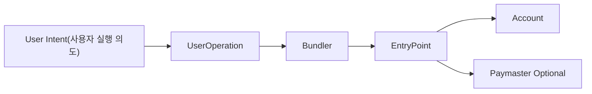

EIP-4337은 이더리움 프로토콜(합의 레이어) 변경 없이 Account Abstraction(계정 추상화)을 구현하기 위한 표준이다. 핵심은 기존 `EOA -> tx` 경로 대신 `UserOperation -> EntryPoint` 경로를 사용하는 것이다.

핵심 구성요소:

- `UserOperation`: 사용자의 의사 트랜잭션(off-chain 표현)
- `PackedUserOperation`: on-chain 패킹된 형태
- `EntryPoint`: 검증/실행/정산을 담당하는 싱글톤 컨트랙트
- `Bundler`: 오프체인에서 UserOperation을 수집해 on-chain으로 제출
- `Account`(Sender): 사용자 계정 로직(서명/권한/정책)
- `Factory`: 새 Account 배포를 담당하는 컨트랙트 (CREATE2 필수)
- `SenderCreator`: EntryPoint가 Factory를 호출하는 중간 래퍼 컨트랙트
- `Paymaster`(선택): 가스비 대납 정책
- `Aggregator`(선택): 서명 집계 검증

## 2. 처리 흐름(표준 동작)

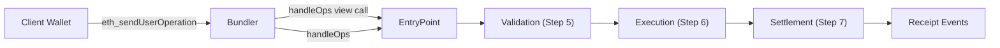

1. 사용자가 `UserOperation` 생성 및 서명
2. 지갑/SDK가 Bundler RPC(`eth_sendUserOperation`)로 제출
3. Bundler가 `handleOps()`를 view/trace call로 호출하여 시뮬레이션 검증
4. Bundler가 `EntryPoint.handleOps()` 호출
5. EntryPoint가 검증 단계 수행
   - 계정 미배포 시 `initCode`로 배포 (이미 배포된 경우 initCode 무시)
   - `account.validateUserOp()` 호출
   - Paymaster 사용 시 `paymaster.validatePaymasterUserOp()` 호출
6. 실행 단계 수행(`callData` 실행)
7. 가스 정산 후 `beneficiary`(번들러 수취 주소)로 수수료 지급

## 3. UserOperation 표준 필드

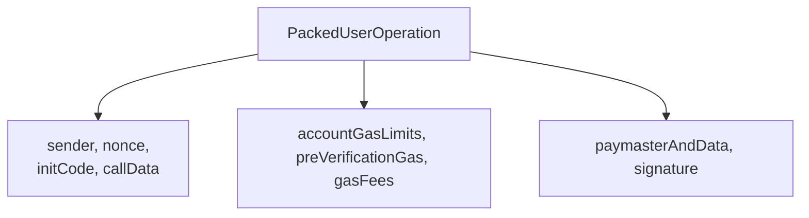

스펙은 두 가지 형태를 정의한다:

- **Off-chain UserOperation**: RPC 전송용. 필드가 분리된 형태 (factory/factoryData, callGasLimit/verificationGasLimit 등 개별 필드)
- **PackedUserOperation**: on-chain 처리용. 필드가 패킹된 형태 (initCode, accountGasLimits, gasFees, paymasterAndData로 압축)

Off-chain → Packed 매핑:

| Off-chain 필드                                                                              | Packed 대응                               |
| ------------------------------------------------------------------------------------------- | ----------------------------------------- |
| `factory` + `factoryData`                                                                   | → `initCode` (factory(20B) + factoryData) |
| `verificationGasLimit` + `callGasLimit`                                                     | → `accountGasLimits` (각 uint128 패킹)    |
| `maxPriorityFeePerGas` + `maxFeePerGas`                                                     | → `gasFees` (각 uint128 패킹)             |
| `paymaster` + `paymasterVerificationGasLimit` + `paymasterPostOpGasLimit` + `paymasterData` | → `paymasterAndData`                      |

on-chain에서는 `PackedUserOperation` 형태를 사용한다.

- `sender`: 계정 주소
- `nonce`: 재실행 방지(키 분리 nonce 전략 지원)
- `initCode`: 계정 미배포 시 팩토리 + calldata
- `callData`: 계정에서 실행할 호출 데이터
- `accountGasLimits`: 검증/실행 가스 한도 패킹
- `preVerificationGas`: 번들러 오버헤드 보상용
- `gasFees`: `maxPriorityFeePerGas`, `maxFeePerGas` 패킹
- `paymasterAndData`: 페이마스터 주소/가스 제한/정책 데이터
- `signature`: 계정 검증용 서명

## 4. EntryPoint 표준 책임

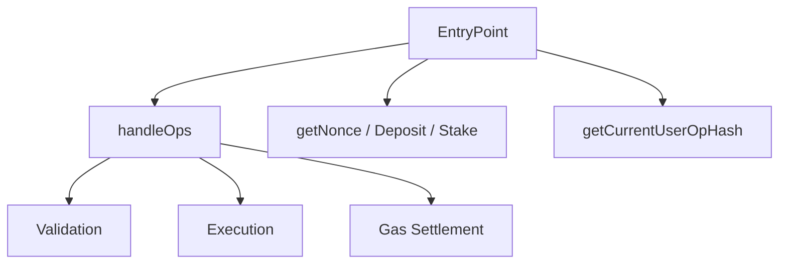

EntryPoint는 AA 실행의 기준점(single entry)이다.

### 4.1 스펙 정의 인터페이스

핵심 실행 함수:

- `handleOps(PackedUserOperation[] calldata ops, address payable beneficiary)`: 배치 실행

Reentrancy 보호 (v0.9 참조 구현):

- `handleOps`와 `handleAggregatedOps`에 `nonReentrant` modifier 적용
- 조건: `tx.origin == msg.sender && msg.sender.code.length == 0` — **순수 EOA만 호출 가능**
- `tx.origin == msg.sender`: 스마트 컨트랙트 중계 호출 차단, account/paymaster/factory 콜백에서의 재진입 방지
- `code.length == 0`: 스마트 컨트랙트 번들러 차단. EIP-7702 delegation이 설정된 EOA도 차단됨 (delegation designation `0xef0100 || address`로 code.length=23). 번들러는 순수 EOA로 운용해야 함

시뮬레이션:

- 스펙은 별도 시뮬레이션 함수를 정의하지 않음
- Bundler는 `handleOps()`를 **view/trace call**로 호출하여 시뮬레이션 수행

Nonce 관리:

- `getNonce(address sender, uint192 key) → uint256`: sender의 key별 현재 nonce 조회

Deposit 관리:

- `balanceOf(address account) → uint256`: 계정/Paymaster의 EntryPoint 내 잔액 조회
- `depositTo(address account) payable`: 계정/Paymaster에 deposit 충전
- `withdrawTo(address payable withdrawAddress, uint256 withdrawAmount)`: deposit 인출

Stake 관리 (Sybil 방지용, 슬래싱 없음):

- `addStake(uint32 _unstakeDelaySec) payable`: stake 추가 + 잠금 기간 설정
- `unlockStake()`: stake 잠금 해제 시작
- `withdrawStake(address payable withdrawAddress)`: 잠금 해제 후 stake 인출

ETH 수신:

- `receive() external payable`: EntryPoint로 직접 ETH 전송 시 수신

기타:

- `getCurrentUserOpHash() → bytes32`: 실행 중인 UserOp의 hash 조회

검증 단계에서 실패하면 해당 UserOperation은 제외되거나 revert 처리된다(번들러 정책/호출 맥락에 따라 다름).

### 4.2 참조 구현 추가 함수 (스펙 미정의, eth-infinitism 구현체 기반)

> 아래 함수들은 ERC-4337 스펙에 정식 인터페이스로 정의되지 않았으나, 참조 구현(eth-infinitism)에서 제공하며 실무에서 널리 사용된다.

- `handleAggregatedOps(UserOpsPerAggregator[] calldata opsPerAggregator, address payable beneficiary)`: Aggregate Signature 배치 실행 (Aggregator별 그룹 처리)
- `getUserOpHash(PackedUserOperation calldata userOp) → bytes32`: EIP-712 기반 서명 대상 해시 (스펙은 EIP-712 계산 규칙만 정의하며, 이 함수명을 인터페이스로 정의하지 않음)
- `getSenderAddress(bytes calldata initCode)`: counterfactual 주소 조회 (스펙에서 간접 언급만 존재)
- `delegateAndRevert(address target, bytes calldata data)`: state override 미지원 네트워크에서 검증용 delegatecall 수행
- `senderCreator() → ISenderCreator`: SenderCreator 인스턴스 조회 (스펙 Security Considerations에서 `entryPoint.senderCreator()` 언급)
- `getPackedUserOpTypeHash() → bytes32`: PackedUserOperation EIP-712 type hash 조회
- `getDomainSeparatorV4() → bytes32`: EIP-712 domain separator 조회

```solidity
// 참조 구현 기반 — 스펙 범위 밖
struct UserOpsPerAggregator {
    PackedUserOperation[] userOps;
    IAggregator aggregator;
    bytes signature;
}
```

#### handleOps vs handleAggregatedOps 비교 (참조 구현 기준)

| 항목           | `handleOps` (스펙 정의)                  | `handleAggregatedOps` (참조 구현)                                    |
| -------------- | ---------------------------------------- | -------------------------------------------------------------------- |
| 사용 시점      | 일반 케이스(계정별 개별 서명 검증)       | BLS 등 Signature Aggregator를 쓰는 케이스                            |
| 입력 구조      | `PackedUserOperation[] ops`              | `UserOpsPerAggregator[]`(Aggregator별 그룹)                          |
| 서명 검증 방식 | 각 계정의 `validateUserOp`에서 개별 검증 | 집계기(aggregator) 단위로 Aggregator Signature 검증 + 계정 검증 결합 |
| 번들링 관점    | 단순 배열 배치                           | aggregator별로 op를 묶어 제출                                        |
| 장점           | 구현/운영 단순                           | 대량 트래픽에서 검증/데이터 효율 개선 가능                           |
| 주의점         | 개별 서명 데이터가 커질 수 있음          | 집계기 신뢰/호환성/실패 처리 복잡도 증가                             |

실무 기준:

- Aggregator를 쓰지 않으면 `handleOps`를 사용한다.
- 집계 서명 인프라(aggregator 계약/검증)가 준비된 경우에만 `handleAggregatedOps`를 선택한다.

## 5. Account 최소 요구사항

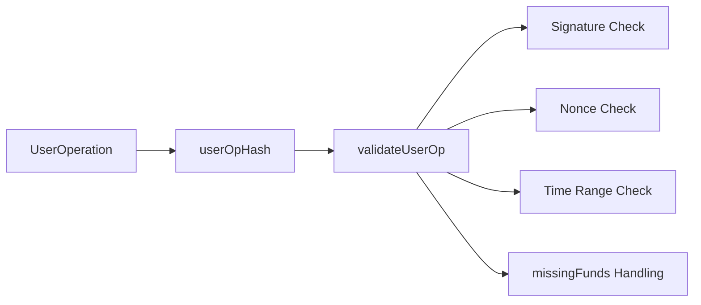

### IAccount 인터페이스 (MUST)

```solidity
interface IAccount {
    function validateUserOp(
        PackedUserOperation calldata userOp,
        bytes32 userOpHash,
        uint256 missingAccountFunds
    ) external returns (uint256 validationData);
}
```

MUST/SHOULD 요구사항:

- 호출자가 신뢰할 수 있는 EntryPoint인지 MUST 검증
- `userOpHash`에 대한 서명 유효성을 MUST 검증
- 서명 불일치 시 `SIG_VALIDATION_FAILED`(값: 1) 반환 **SHOULD** (revert 하지 않아야 함)
- 서명 실패 시에도 조기 반환 없이 정상 흐름을 완료 **SHOULD** (가스 추정 정확도를 위해)
- SIG_VALIDATION_FAILED 이외의 에러는 **MUST** revert
- EntryPoint에 최소 `missingAccountFunds`만큼 MUST 지불

반환값 `validationData` 패킹 형식 (`uint256`):

```
| authorizer (20 bytes) | validUntil (6 bytes) | validAfter (6 bytes) |
```

- `authorizer`: 0 = 유효, 1 = SIG_VALIDATION_FAILED, 기타 = aggregator 주소
- `validUntil`: 유효 만료 시간 (0 = 무한)
- `validAfter`: 유효 시작 시간

**Block Number Mode (v0.9)**: `validUntil`과 `validAfter`의 최상위 비트(bit 47)를 1로 설정하면 timestamp 대신 **block number** 기준으로 동작한다. 동일 UserOperation 내에서 timestamp과 block number를 혼용할 수 없다 (둘 다 같은 모드여야 함).

참조 구현 상수:

```solidity
uint48 VALIDITY_BLOCK_RANGE_FLAG = 0x800_000_000_000;  // bit 47 플래그
uint48 VALIDITY_BLOCK_RANGE_MASK = 0x7ff_fff_fff_fff;  // 하위 47비트 마스크
```

- 판별: `validAfter >= FLAG` AND `validUntil >= FLAG` → block range 모드
- block range 실패 시 에러: account `"AA27 outside valid block range"`, paymaster `"AA37 paymaster inval block range"`
- 사용 시나리오: L2 체인에서 block number가 timestamp보다 신뢰성이 높은 경우, MEV 보호 등

### IAccountExecute 인터페이스 (MAY)

```solidity
interface IAccountExecute {
    function executeUserOp(
        PackedUserOperation calldata userOp,
        bytes32 userOpHash
    ) external;
}
```

커스텀 실행 핸들링이 필요한 경우 선택적으로 구현. ERC-7579의 `executeUserOp`과 직접 연관된다.

### 실무적으로 검증해야 할 것:

- 서명 유효성
- nonce 유효성
- 유효 시간 범위(validAfter/validUntil)
- 필요한 예치금 보충 로직

`userOpHash` 이해를 위한 핵심 흐름:

1. 누가 `userOpHash`를 계산하나
   - 지갑/클라이언트(제출 전)가 먼저 계산한다.
   - 일반적으로 `EntryPoint.getUserOpHash(userOp)`와 동일 규칙을 오프체인에서 구현해 사용한다.
   - Bundler도 검증/시뮬레이션 단계에서 동일 값을 다시 계산/확인한다.

2. 언제 서명하나
   - 서명은 Bundler 제출 전에 수행한다.
   - 순서:
     1. 지갑이 `UserOperation` 구성
     2. `userOpHash` 계산
     3. 해당 해시에 서명해서 `userOp.signature` 채움
     4. 완성된 `UserOperation`을 Bundler에 제출

3. 어떤 주체가 서명하나
   - "계정이 서명"은 Account가 기대하는 승인 주체(Owner key / multisig / session key 등)가 서명한다는 의미다.
   - 온체인에서는 Account의 `validateUserOp`가 그 서명이 유효한지 검증한다.

4. Bundler 시뮬레이션과의 관계
   - Bundler는 `userOp.signature`를 포함한 전체 `UserOperation`으로 `handleOps()` view/trace call 시뮬레이션을 수행한다.
   - 이때 EntryPoint/Account는 동일한 `userOpHash` 문맥에서 검증한다.

5. 도메인 분리(domain separation)와 재사용 방지
   - `userOpHash`는 보통 `UserOperation 내용 + EntryPoint 주소 + chainId`를 함께 묶어 계산된다.
   - 따라서 같은 `UserOperation`이라도 네트워크/EntryPoint가 바뀌면 해시가 달라진다.

   예시:
   - A: `chainId=1`, `EntryPoint=0xEP1` -> `hashA`
   - B: `chainId=137`, `EntryPoint=0xEP1` -> `hashB` (다름)
   - C: `chainId=1`, `EntryPoint=0xEP2` -> `hashC` (다름)

   의미:
   - 메인넷에서 만든 서명을 다른 체인에서 재사용(replay)하기 어렵다.
   - EntryPoint가 다른 환경으로도 그대로 재사용하기 어렵다.

6. 추적 ID로서의 `userOpHash`
   - `eth_sendUserOperation`의 응답으로 보통 `userOpHash`를 받는다.
   - 이후 이 해시를 조회 키로 사용한다.
     - `eth_getUserOperationByHash(userOpHash)`
     - `eth_getUserOperationReceipt(userOpHash)`

`userOpHash` 서명/검증/조회 타임라인:

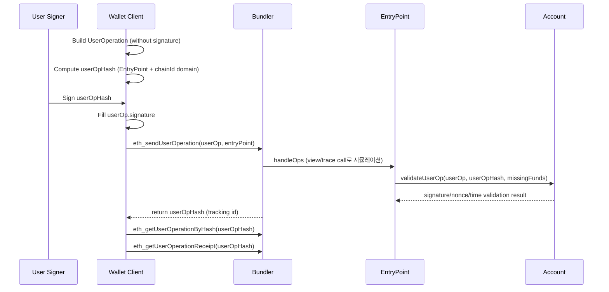

## 6. Paymaster 표준 포인트

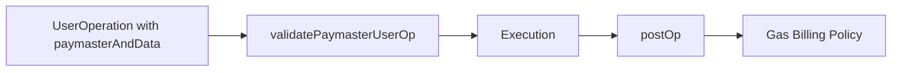

Paymaster는 사용자 대신 가스를 부담할 수 있다.

### IPaymaster 인터페이스 (MUST)

```solidity
interface IPaymaster {
    function validatePaymasterUserOp(
        PackedUserOperation calldata userOp,
        bytes32 userOpHash,
        uint256 maxCost
    ) external returns (bytes memory context, uint256 validationData);

    function postOp(
        PostOpMode mode,
        bytes calldata context,
        uint256 actualGasCost,
        uint256 actualUserOpFeePerGas
    ) external;
}

enum PostOpMode {
    opSucceeded,  // UserOp 실행 성공
    opReverted    // UserOp 실행 revert (Paymaster는 여전히 가스비 부담)
    // 참고: v0.9 참조 구현(eth-infinitism)은 3번째 값 `postOpReverted`를 enum에 포함하지만,
    // 이는 EntryPoint 내부 제어용이며 paymaster.postOp()에 전달되지 않음.
    // Paymaster 인터페이스 관점에서 유효한 값은 위 2개뿐임.
}
```

MUST 요구사항:

- `validatePaymasterUserOp`과 `postOp` 호출이 EntryPoint에서 오는지 MUST 검증
- EntryPoint에 UserOp 비용을 충당할 충분한 deposit MUST 보유

### 주요 포인트:

- 검증 단계: `validatePaymasterUserOp` → `context`와 `validationData` 반환
- 실행 후 정산 단계: `postOp` → `actualGasCost`와 `actualUserOpFeePerGas` 기반 정산
- `postOp`는 `context`가 비어있지 않은 경우에만 호출됨
- Paymaster는 악성/과금 리스크를 직접 방어해야 함(쿼터, allowlist, 서명 정책 등)

### 스펙 경계(무엇을 표준이 정의하고/정의하지 않는지):

| 구분        | EIP-4337 스펙에서 다루는 범위                                                     | EIP-4337 스펙 밖(구현체/서비스 책임)                                               |
| ----------- | --------------------------------------------------------------------------------- | ---------------------------------------------------------------------------------- |
| 필드/포맷   | `paymasterAndData` 존재, 기본 인코딩 골격(paymaster + gas limits + paymasterData) | `paymasterData` 내부 비즈니스 포맷(정책 ID, 토큰/카드 결제 정보, 커스텀 서명 규칙) |
| 검증 훅     | EntryPoint가 `validatePaymasterUserOp`를 호출하는 규칙                            | 어떤 정책으로 승인/거절할지(allowlist, quota, rate-limit, 리스크 점수)             |
| 정산 훅     | 실행 후 `postOp` 호출 규칙                                                        | 비용 분담 방식, 내부 회계 모델, 외부 결제 정산(카드/법정화폐 등)                   |
| 온체인 요구 | deposit/stake, validationData/유효시간 처리                                       | 오프체인 API 설계, 서명 서버, 운영 모니터링/알람/차단 정책                         |

### 온체인 자금(Deposit/Stake) 책임 분리 정리:

| 주체              | 스펙 기준 요구/역할                                                                        | 목적                                           | 실서비스에서의 일반 처리                                                                                    |
| ----------------- | ------------------------------------------------------------------------------------------ | ---------------------------------------------- | ----------------------------------------------------------------------------------------------------------- |
| `Account`         | EntryPoint에 deposit을 보유할 수 있음(특히 paymaster 미사용 시 prefund 부담)               | UserOp 가스비 지급 능력 보장                   | 신규 사용자는 잔액이 부족하므로 paymaster 경로를 우선 사용, 계정 deposit은 최소화하거나 fallback으로만 유지 |
| `Paymaster`       | EntryPoint deposit 필수(실제 가스비 차감 원천), stake는 운영 안정성/DoS 완화 맥락에서 사용 | 사용자 대신 가스비 대납, 번들 실행 가능성 확보 | 운영팀이 모니터링 기반 자동 충전(Top-up), 타입별 내부 회계(스폰서 잔고/토큰 징수)를 별도 관리               |
| `Bundler`         | 스펙상 deposit/stake 주체가 아니라 검증/선별 주체                                          | 실행 가능 UserOp만 번들링                      | paymaster deposit 부족, validationData 만료, 정책 실패를 시뮬레이션 단계에서 조기 차단                      |
| `EntryPoint`      | deposit/stake 원장 및 차감/정산 규칙의 온체인 권위                                         | 검증/실행/정산 일관성 보장                     | 실패 코드(`AA31`, `AA32` 등)와 이벤트 기반으로 운영 알람/후정산 시스템과 연동                               |
| `User(EOA/Owner)` | 직접 deposit/stake 의무 없음(계정/페이마스터 경로에 따라 간접 영향)                        | 최종적으로 요청 의도 승인                      | 실무에선 가스 추상화 UX를 위해 off-chain 승인 + paymaster 정책 통과를 우선 경험                             |

### 보충:

- `validationData/유효시간(validAfter/validUntil)`은 Account와 Paymaster 각각 독립적으로 반환 가능하며, EntryPoint가 둘 다 확인한다.
- 스펙은 \"누가 어떤 형식으로 오프체인 승인 데이터를 만들지\"를 강제하지 않으므로, 실제 서비스는 proxy/API/리스크 엔진으로 이를 구현한다.
- 정확히는 `paymasterAndData`를 별도 Solidity struct로 정의하진 않고, `bytes` 필드로 두고 바이트 레이아웃 규칙을 정의한다.
- 즉:
  - `PackedUserOperation` 안에서는 `bytes paymasterAndData`
  - 스펙/구현 규약으로는 보통
    - `paymaster(20)`
    - `paymasterVerificationGasLimit(16)`
    - `paymasterPostOpGasLimit(16)`
    - `paymasterData(variable)`
    - `(옵션) paymasterSignature + length + magic`
      형태로 해석한다.

### Paymaster 검증/정산 타임라인:

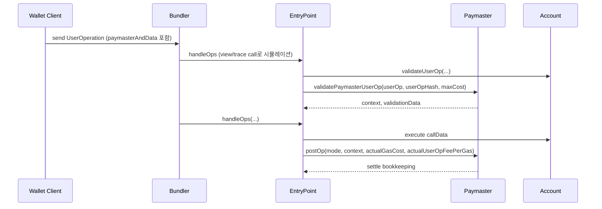

Paymaster 동작을 이해하기 위한 핵심 흐름:

1. 언제 Paymaster가 개입하나
   - `UserOperation.paymasterAndData`가 비어있지 않을 때 개입한다.
   - Bundler는 시뮬레이션(`handleOps` view/trace call)에서 Paymaster 검증 경로까지 함께 확인한다.

2. 검증 단계에서 무엇을 확인하나 (`validatePaymasterUserOp`)
   - 이 요청을 Paymaster가 스폰서할지 여부
   - 정책 조건(allowlist, 한도, 만료시간, 오프체인 승인서명 등)
   - 최대 비용(`maxCost`) 기준으로 스폰서 가능성
   - 필요 시 `context`와 `validationData`를 반환

3. 실행 후 정산에서 무엇을 하나 (`postOp`)
   - 실제 가스비(`actualGasCost`) 기준으로 최종 정산
   - 정책별 후처리(사용량 누적, 과금 기록, quota 차감)
   - 실패 모드별 처리(`postOp`는 성공/실패 컨텍스트를 받아 후처리 가능)

4. `paymasterAndData`와 검증 관계
   - `paymasterAndData`는 Paymaster 주소 + Paymaster 검증/후처리에 필요한 데이터 컨테이너다.
   - Paymaster 구현체는 이 데이터를 파싱해 정책 검증에 사용한다.
   - 데이터 포맷 불일치/서명 불일치 시 Paymaster 검증에서 실패한다.

5. 실패 지점과 영향
   - `validatePaymasterUserOp` 실패: 해당 UserOperation은 번들에서 제외되거나 실행 실패
   - `postOp` 실패: 정산/후처리 문제로 op 또는 번들 처리에 영향 가능(EntryPoint 동작 경로에 의존)
   - 따라서 Paymaster는 방어적 코딩(입력 검증, reentrancy 방지, 비용 상한)을 강하게 적용해야 한다.

6. 조회/운영 관점
   - UserOp 결과는 `eth_getUserOperationReceipt(userOpHash)`로 추적
   - Paymaster 운영 지표 예:
     - 승인율(검증 통과율)
     - 평균 스폰서 비용
     - 정책 거절 사유 분포(한도초과/서명오류/만료 등)

### 개발자 구현 가이드(연결)

- `docs/claude/seminar/paymaster/00-paymaster-final-spec-and-implementation.md`
  - Paymaster 구현 시 필요한 함수/입출력/타입/호출 시점을 개발자 관점으로 정리한 최종 문서

## 7. Bundler 표준 포인트

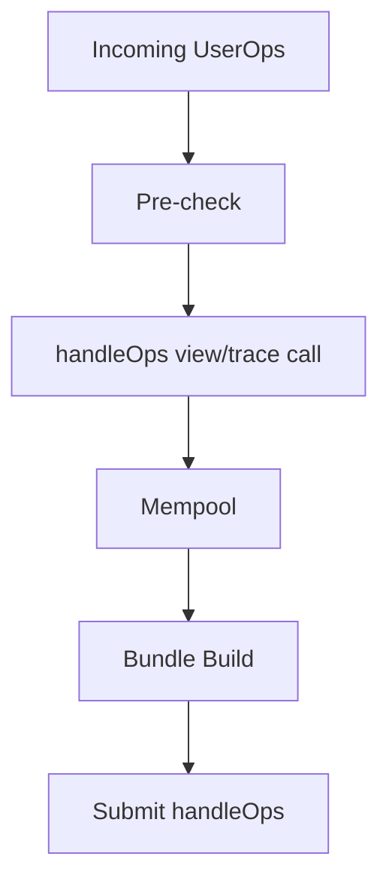

Bundler는 mempool 정책과 시뮬레이션 정확성이 핵심이다.

- RPC 호환성(`eth_sendUserOperation`, `eth_estimateUserOperationGas`, `eth_getUserOperationReceipt` 등)
- 시뮬레이션 실패/성공 판별 및 에러 코드 해석
- 번들 내 UserOperation 정렬/선별 정책

### 7.1 수신 시 사전 검증 규칙 (MUST)

| 규칙                               | 설명                                                                           |
| ---------------------------------- | ------------------------------------------------------------------------------ |
| sender 존재 확인                   | sender에 코드가 있거나 initCode가 제공되어야 함 (둘 다 또는 둘 다 아님은 거부) |
| verificationGasLimit 상한          | `verificationGasLimit` < 500,000 gas MUST                                      |
| paymasterVerificationGasLimit 상한 | `paymasterVerificationGasLimit` < 500,000 gas MUST                             |
| preVerificationGas 최소값          | calldata cost + 50,000 overhead 이상 MUST                                      |
| callGasLimit 최소값                | non-zero value CALL 비용 이상 MUST                                             |
| 수수료 최소값                      | `maxFeePerGas`, `maxPriorityFeePerGas` > 설정 가능한 최소값                    |
| Paymaster 검증                     | 지정된 경우: 코드 존재, 충분한 deposit, 미차단 상태 확인                       |
| sender 중복 금지                   | 번들 내 sender당 1개 UserOp만 허용 (staked sender 예외)                        |

### 7.2 검증 중 금지 opcode (Validation Rules)

> **스펙 범위 참고**: ERC-4337 스펙은 검증 코드에 대한 opcode/storage 제한의 필요성을 언급하지만, 구체적인 규칙은 **"The full design of such a shared set of rules, applied to the validation code, is outside the scope of this proposal"**로 명시한다. 아래 내용은 스펙의 방향성과 참조 구현/Bundler Spec에서 정의하는 규칙을 기반으로 정리한 것이다.

검증 코드(`validateUserOp`, `validatePaymasterUserOp`, factory 호출)에서 금지:

- 글로벌 상태 접근 opcode: `BLOCK_*` 계열 (staked entity 예외 가능)
- sender 자체 storage 외 접근 (unstaked entity의 경우)
- 다른 UserOp의 sender 주소 접근
- delegation call

### 7.3 스토리지 접근 규칙

> **스펙 범위 참고**: 7.2와 동일. 스펙은 방향성만 언급하고, 구체적 규칙은 스펙 범위 밖이다.

| 주체 상태       | 허용 범위                                         |
| --------------- | ------------------------------------------------- |
| Unstaked entity | sender 자체 storage만 접근 가능                   |
| Staked entity   | 제한적 확장 허용 (충돌 패턴 제외)                 |
| 모든 entity     | 같은 번들 내 다른 sender 주소 접근 금지           |
| 모든 entity     | 같은 번들 내 다른 factory가 생성한 주소 접근 금지 |

### 7.4 번들 검증 절차 (Phase 3)

스펙이 명시하는 번들링 MUST/SHOULD 규칙:

1. 같은 번들 내 다른 sender 주소를 접근하는 UserOp을 MUST 제외
2. 같은 번들 내 다른 factory가 생성한 주소를 접근하는 UserOp을 MUST 제외
3. 각 paymaster의 deposit이 번들 내 모든 해당 UserOp을 커버하는지 MUST 추적
4. 전체 `handleOps`에 대해 `debug_traceCall` 실행 SHOULD
5. revert 발생 시 trace로 원인 entity 식별 (마지막 CALL된 entity가 원인)
6. 문제 UserOp을 번들과 mempool에서 제거
7. factory/paymaster 원인 + sender unstaked → factory/paymaster 차단
8. factory/paymaster 원인 + sender staked → sender 차단
9. 성공하거나 유효 UserOp이 없을 때까지 반복

### 7.5 Reputation 시스템

> **스펙 범위 참고**: ERC-4337 스펙은 reputation 시스템의 필요성을 언급하지만, **"Full specification of a reputation system is outside the scope of this proposal"**로 명시한다. 아래는 스펙의 방향성과 참조 구현 기반 정리이다.

Paymaster와 Factory에 대한 평판 추적 SHOULD:

- 스팸 방지를 위한 throttling/banning 메커니즘
- Stake가 높을수록 완화된 검증 규칙 적용 가능
- 대체 mempool(Alternative Mempool)에서는 수동 감사된 Paymaster에 대해 완화된 규칙 적용 가능

## 8. 보안 및 구현 체크리스트

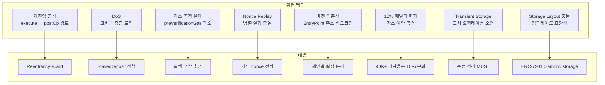

- 재진입 방지: 계정 실행 경로와 Paymaster `postOp` 경로 검토
- DoS 방지: 고비용 검증 로직 제한, 스테이크/디파짓 정책 사용
- 가스 추정 안정성: `preVerificationGas` 과소추정 방지
- nonce 설계: 병렬 실행을 고려한 키드 nonce 전략
- 업그레이드 전략: EntryPoint 버전/주소 의존성 명확화

### 8.1 스펙 명시 보안 고려사항

**EntryPoint 신뢰 모델**:

- EntryPoint는 ERC-4337 전체의 중앙 신뢰 지점 → 엄격한 감사 및 형식 검증 필수
- 계정은 `validateUserOp` 검증과 EntryPoint 접근 제어만 올바르면 보안 유지 가능

**Factory 보안**:

- 모든 계정 생성 호출이 `entryPoint.senderCreator()` 주소에서 오는지 MUST 확인
- 결정론적 주소를 위해 `CREATE2` MUST 사용 (`CREATE` 금지)

**10% 미사용 가스 페널티** (Bundler griefing 방지):

- 미사용 `callGasLimit` + `paymasterPostOpGasLimit`이 **40,000 gas 이상**이면
- 미사용분의 **10%**를 페널티로 부과
- Bundler가 가스 예약만으로 비용을 소모하는 공격 방지

**Transient Storage (EIP-1153) 보안**:

- 여러 sender의 UserOp이 같은 트랜잭션에서 실행될 수 있음
- 민감한 transient storage는 수동으로 정리 MUST
- 오퍼레이션 간 접근 제어에 transient storage 사용 불가

**Storage Layout 보안**:

- 업그레이드 가능한 계정은 storage layout 충돌 방지 MUST
- ERC-7201 diamond storage 패턴 권장
- 구현체 변경 시 layout 호환성 주의

**Aggregator 보안**:

- `validateSignatures` 호출이 EntryPoint에서 오는지 MUST 검증

**스펙 핵심 보안 주장 (Security Claims)**:

- **Claim 1 - No Arbitrary Hijacking**: EntryPoint는 `validateUserOp` 통과 후에만, 정확히 `userOp.calldata`로 sender를 호출한다 → 임의 계정 하이재킹 불가
- **Claim 2 - No Fee Draining**: `validateUserOp`이 성공하면, 정확히 `userOp.calldata`로 generic call이 실행된다 → 수수료만 빼앗기는 공격 불가

## 9. 관련 표준과의 관계

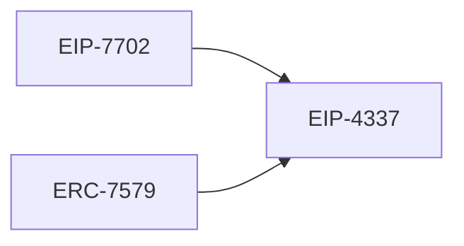

- EIP-4337: 프로토콜 변경 없는 AA 프레임워크
- EIP-7702(관련 확장 맥락): 권한 위임/트랜잭션 모델과 조합 시 계정 UX 개선 가능
- ERC-7579(모듈형 계정): 4337 계정 구현의 모듈 표준화에 활용 가능

## 10. EIP-7702 통합 (스펙 명시)

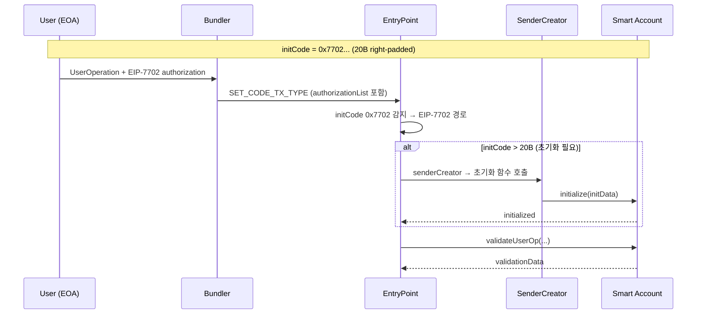

EIP-7702 지원 네트워크에서의 동작:

- `initCode`가 `0x7702`(20B right-padded)로 시작하면 EIP-7702 경로로 진입
- EntryPoint가 factory를 호출하지 않고, EIP-7702 authorization을 검증
- authorization tuple은 UserOperation 구조체 외부에서 별도 제공
- Bundler는 `authorizationList`에 필요한 모든 authorization을 포함해 `SET_CODE_TX_TYPE` 트랜잭션으로 제출
- `initCode`가 20B 초과 시, 나머지 부분으로 계정 초기화 함수 호출
- 초기화 함수 호출은 `entryPoint.senderCreator()`에서만 MUST 허용
- 초기화는 한 번만 허용 MUST
- authorization cost (25,000 gas)는 `preVerificationGas`에 포함

## 11. 에러 코드 체계 (스펙 명시)

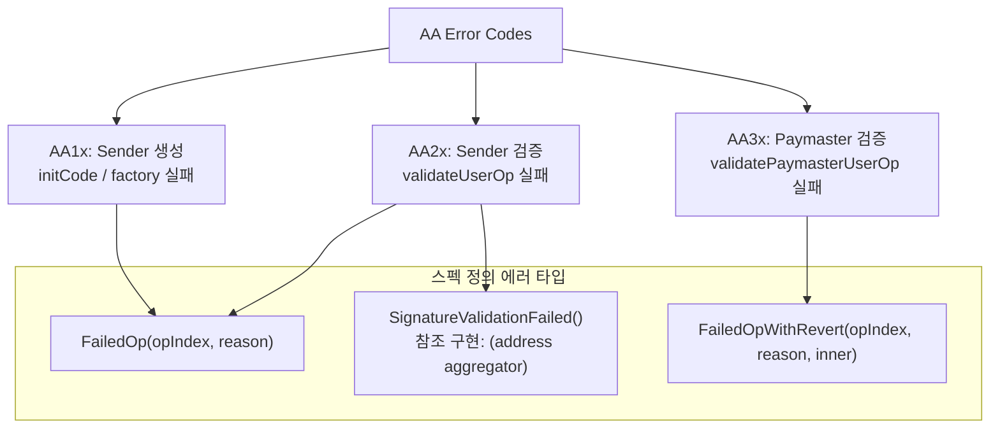

모든 에러는 진단을 위해 "AA" 접두사를 사용한다.

| 접두사 | 분류           | 설명                                |
| ------ | -------------- | ----------------------------------- |
| `AA1x` | Sender 생성    | initCode/factory 관련 실패          |
| `AA2x` | Sender 검증    | `validateUserOp` 관련 실패          |
| `AA3x` | Paymaster 검증 | `validatePaymasterUserOp` 관련 실패 |

스펙 정의 에러 타입:

```solidity
// ERC-4337 스펙이 명시적으로 정의하는 3개 에러 타입
error SignatureValidationFailed();
error FailedOp(uint256 opIndex, string reason);
error FailedOpWithRevert(uint256 opIndex, string reason, bytes inner);
```

> 스펙 원문: "the EntryPoint must only revert with explicit `SignatureValidationFailed()`, `FailedOp()` or `FailedOpWithRevert()` errors."

> **참조 구현 차이 (v0.9)**: `SignatureValidationFailed`는 스펙에서 파라미터 없이 정의되지만, eth-infinitism v0.9 참조 구현은 `SignatureValidationFailed(address aggregator)`로 정의하여 실패한 aggregator 주소를 포함합니다. `handleAggregatedOps`에서 aggregator 서명 검증 실패 시 사용됩니다.

참조 구현 추가 에러 (스펙 미정의):

```solidity
// eth-infinitism 참조 구현에서 추가로 정의하는 에러
error SignatureValidationFailed(address aggregator);  // 스펙: 파라미터 없음 → 참조 구현: aggregator 주소 포함
error PostOpReverted(bytes returnData);
```

## 12. EIP-712 UserOpHash 계산 (스펙 명시)

v0.7부터 EIP-712를 도입한 배경: v0.6의 자체 해싱 방식에서는 서명 시 지갑 UI에 raw bytes 해시만 표시되어 사용자가 서명 내용을 확인할 수 없었다. EIP-712를 적용하면 `eth_signTypedData_v4`를 통해 필드별 구조화 표시가 가능하여 피싱 방지, 하드웨어 월렛 typed data signing 지원, 생태계 표준 호환(MetaMask, ethers.js 등)이 가능해진다.

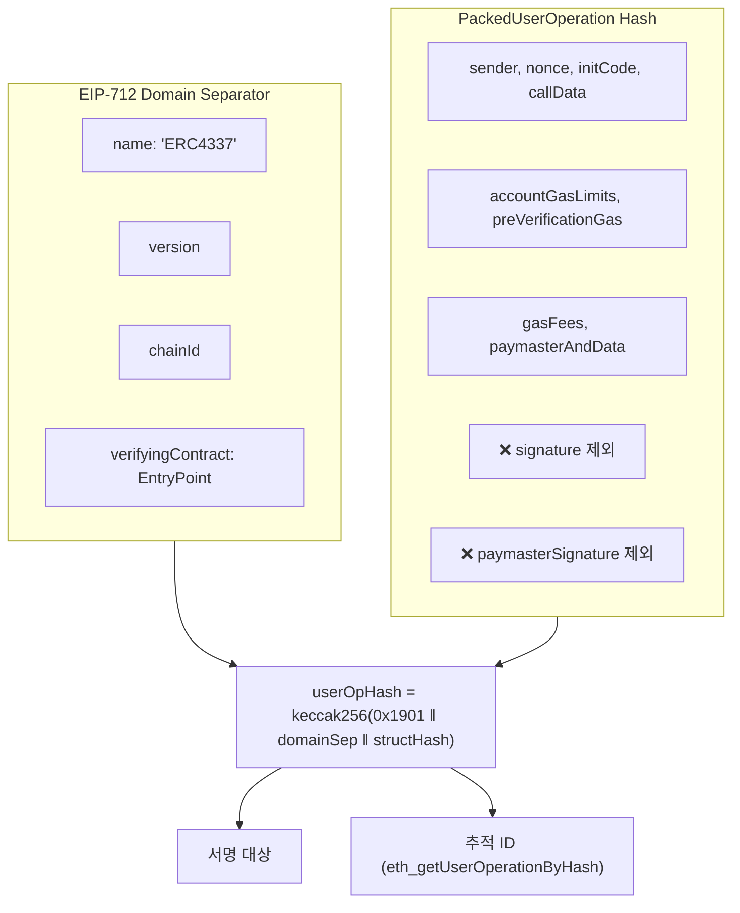

```solidity
bytes32 constant TYPE_HASH = keccak256(
    "EIP712Domain(string name,string version,uint256 chainId,address verifyingContract)"
);

bytes32 constant PACKED_USEROP_TYPEHASH = keccak256(
    "PackedUserOperation(address sender,uint256 nonce,bytes initCode,bytes callData,"
    "bytes32 accountGasLimits,uint256 preVerificationGas,bytes32 gasFees,"
    "bytes paymasterAndData)"
);
```

- `signature` 필드는 hash 대상에 포함되지 않음 (서명 전에 hash를 계산해야 하므로)
- `paymasterSignature` 옵션 필드도 hash에 포함되지 않음 → 병렬 서명 가능
- `chainId`와 `EntryPoint` 주소가 domain separator에 포함되어 replay 방지

## 13. preVerificationGas 산정 기준 (스펙 명시)

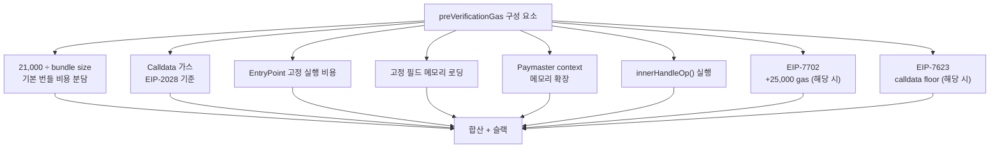

`preVerificationGas`는 다음을 커버해야 한다:

- 기본 번들 비용: 21,000 gas ÷ 번들 내 UserOp 수
- Calldata 가스: EIP-2028 기준
- EntryPoint 고정 실행 비용
- 고정 크기 필드 메모리 로딩
- Paymaster context용 메모리 확장
- 내부 `innerHandleOp()` 실행
- EIP-7702 authorization cost (해당 시 25,000 gas)
- EIP-7623 calldata floor price 조정 (해당 시)

Bundler는 메모리 확장과 번들 내 UserOp 위치에 따른 슬랙을 MUST 추가.

## 14. EntryPoint Events

> **스펙 범위 참고**: ERC-4337 스펙은 이벤트 시그니처(이름, 파라미터)를 **명시적으로 정의하지 않는다**. 스펙은 처리 흐름과 동작 규칙을 정의하며, 구체적인 이벤트 이름/시그니처는 참조 구현(eth-infinitism)에서 정의한다. 아래는 참조 구현 기반 이벤트 목록이다.

```mermaid
sequenceDiagram
    participant EP as EntryPoint
    participant SA as Account
    participant PM as Paymaster

    rect rgb(20, 20, 40)
        Note over EP: Validation Phase
        opt 계정 미배포
            EP->>SA: initCode → deploy
            EP->>EP: emit AccountDeployed
        end
    end

    EP->>EP: emit BeforeExecution

    rect rgb(20, 20, 40)
        Note over EP: Execution Phase
        EP->>SA: execute callData
        opt 실행 revert
            EP->>EP: emit UserOperationRevertReason
        end
        opt postOp revert
            EP->>EP: emit PostOpRevertReason
        end
    end

    rect rgb(30, 30, 30)
        Note over EP: Settlement Phase
        opt prefund 부족
            EP->>EP: emit UserOperationPrefundTooLow
        end
        EP->>EP: emit UserOperationEvent
    end
```

참조 구현 이벤트 목록:

| 이벤트                       | 설명                                                 | 출처                |
| ---------------------------- | ---------------------------------------------------- | ------------------- |
| `UserOperationEvent`         | UserOp 실행 결과 (성공/실패, 가스 사용량, 수수료 등) | 참조 구현           |
| `AccountDeployed`            | initCode를 통한 신규 계정 배포                       | 참조 구현           |
| `UserOperationRevertReason`  | 실행 단계에서 revert 발생 시 사유                    | 참조 구현           |
| `PostOpRevertReason`         | `postOp` 호출에서 revert 발생 시 사유                | 참조 구현           |
| `UserOperationPrefundTooLow` | prefund가 실제 가스비보다 부족한 경우                | 참조 구현           |
| `BeforeExecution`            | 검증 단계 완료 후 실행 단계 진입 시그널              | 참조 구현           |
| `IgnoredInitCode`            | 이미 배포된 계정에 initCode 제공 시 무시됨           | 참조 구현 v0.9 전용 |
| `EIP7702AccountInitialized`  | EIP-7702 delegate 초기화 완료 시 발행                | 참조 구현 v0.9 전용 |

- `UserOperationEvent`는 모든 UserOp 처리 후 발행되며 추적/영수증 조회의 기반
- `BeforeExecution`은 validation과 execution 사이의 경계를 표시 (시뮬레이션 시 활용)
- `IgnoredInitCode`는 v0.9에서 추가. 기존 계정에 initCode 제공 시 revert 대신 무시하고 이벤트 발행

## 15. Aggregator (스펙 정의 범위 + 참조 구현)

### 15.1 스펙이 정의하는 범위

ERC-4337 스펙은 Aggregator에 대해 **최소한의 정의만** 제공하며, 전체 설계는 명시적으로 스펙 범위 밖이다.

> "**Aggregator** - also known as "authorizer contract" - a contract that enables multiple `UserOperations` to share a single validation. **The full design of such contracts is outside the scope of this proposal.**"

스펙이 정의하는 것:

1. **개념**: 여러 UserOperation이 하나의 검증을 공유할 수 있게 하는 컨트랙트
2. **참조 경로**: `validateUserOp`의 반환값 `validationData`에서 `authorizer` 필드(상위 20바이트)가 0(유효)도 1(실패)도 아닌 주소이면, 해당 주소를 aggregator/authorizer 컨트랙트로 취급
3. **보안 요구사항 (MUST)**: aggregator 컨트랙트는 `validateSignatures()` 호출이 EntryPoint에서 오는지 MUST 검증

스펙이 정의하지 **않는** 것:

- `handleAggregatedOps` 함수
- `IAggregator` 인터페이스 전체 시그니처
- `aggregateSignatures()`, `validateUserOpSignature()` 함수
- `UserOpsPerAggregator` struct
- 번들러의 aggregated 처리 절차
- 서명 집계 알고리즘(BLS 등)

### 15.2 참조 구현 기반 IAggregator 인터페이스

> 아래는 eth-infinitism 참조 구현에서 정의하는 인터페이스이다. 스펙 범위 밖이며, 구현체에 따라 파라미터가 다를 수 있다.

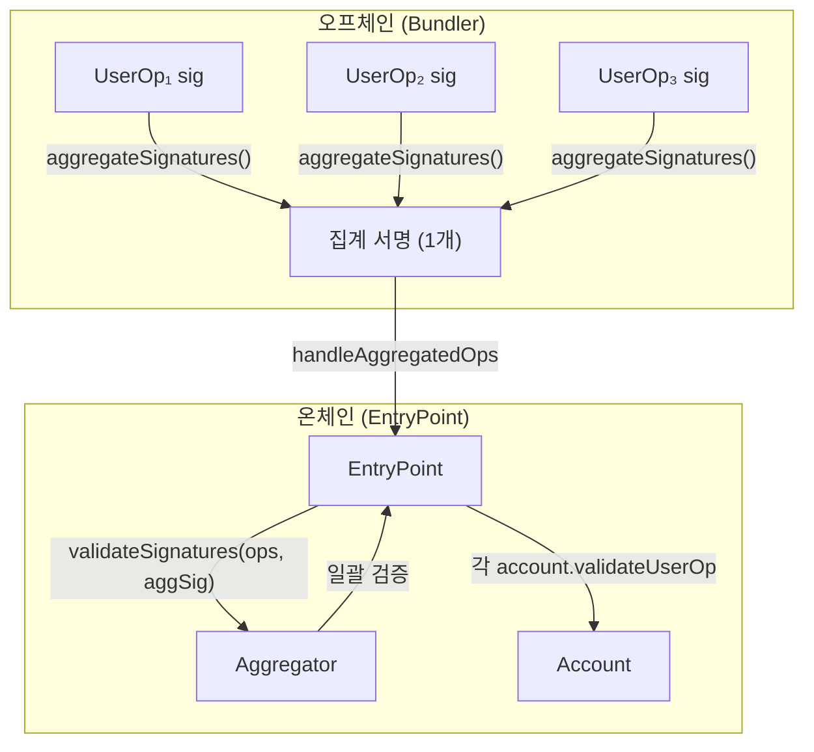

```solidity
// 참조 구현 기반 — 스펙 범위 밖
interface IAggregator {
    function validateSignatures(
        PackedUserOperation[] calldata userOps,
        bytes calldata signature
    ) external view;

    function validateUserOpSignature(
        PackedUserOperation calldata userOp
    ) external view returns (bytes memory sigForUserOp);

    function aggregateSignatures(
        PackedUserOperation[] calldata userOps
    ) external view returns (bytes memory aggregatesSignature);
}
```

- `validateSignatures`: 집계된 서명을 일괄 검증 (EntryPoint에서 호출) — 스펙이 함수명만 언급
- `validateUserOpSignature`: 개별 UserOp의 서명 유효성 검증 — 참조 구현 전용
- `aggregateSignatures`: 여러 UserOp의 서명을 하나로 집계 — 참조 구현 전용

## 16. Backwards Compatibility (스펙 명시)

```mermaid
flowchart LR
    OLD["기존 Smart Contract Account<br/>(validateUserOp 없음)"]
    OLD -->|"Wrapper Account 래핑"| WA["Wrapper Account<br/>IAccount 구현"]
    WA -->|"validateUserOp 위임"| TS["기존 계정의<br/>trusted submitter"]
    WA -->|"callData 래핑"| OLD
    WA -->|"호환"| EP["EntryPoint<br/>ERC-4337"]
```

ERC-4337 이전의 Smart Contract Account는 `validateUserOp` 함수가 없어 직접 호환되지 않는다.

**해결책**: Wrapper Account를 구현하여 원래 계정의 trusted submitter에게 검증을 위임.

- Wrapper Account가 `IAccount` 인터페이스를 구현
- `validateUserOp`에서 원래 계정의 승인 메커니즘을 호출
- 기존 계정의 실행 로직은 `callData`를 통해 래핑하여 전달

## 17. Canonical P2P Mempool (스펙 명시)

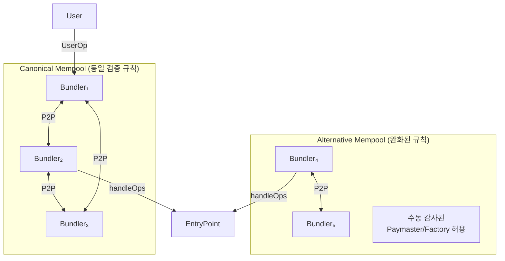

**Canonical Mempool**: Bundler들이 공유 유효성 규칙을 적용하여 UserOperation을 교환하는 분산형 무허가(permissionless) P2P 네트워크.

- 모든 bundler가 동일한 검증 규칙을 적용
- 유효한 UserOperation만 네트워크를 통해 전파
- 검증 규칙을 충족하는 한 어떤 bundler든 번들에 포함 가능

**Alternative Mempool**: 다른 유효성 규칙을 적용하는 별도의 P2P mempool. 수동 감사된 Paymaster/Factory에 대해 완화된 규칙을 적용할 수 있다. 전체 절차는 스펙 범위 밖.

## 18. 구현 시 주의사항(요약)

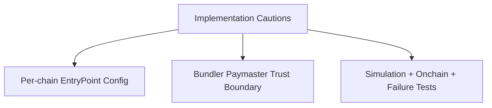

- 체인별 EntryPoint 주소/버전이 다를 수 있으므로 하드코딩 최소화
- Bundler/Paymaster는 신뢰 경계가 다르므로 모니터링과 제한 정책 필수
- 테스트는 반드시 시뮬레이션 + 실제 번들 제출 + 실패 케이스(revert/postOp 실패)까지 포함

## 19. 추가 상세: UserOperation 구조와 삽입 파라미터

```mermaid
flowchart TB
    BUILD[Build UserOperation]
    BUILD --> P1[Field Fill]
    BUILD --> P2[Packed Encoding]
    BUILD --> P3[Paymaster Data Encoding]
    BUILD --> P4[userOpHash Sign]
```

요청하신 보강 항목을 원본 문서에 추가한다.

### 19.1 PackedUserOperation 구조

```solidity
struct PackedUserOperation {
    address sender;
    uint256 nonce;
    bytes initCode;
    bytes callData;
    bytes32 accountGasLimits;
    uint256 preVerificationGas;
    bytes32 gasFees;
    bytes paymasterAndData;
    bytes signature;
}
```

### 19.2 필드별 삽입 가이드

| 필드                 | 필수   | 삽입 규칙                                                                                                                                                      |
| -------------------- | ------ | -------------------------------------------------------------------------------------------------------------------------------------------------------------- | --- | --------------------------- |
| `sender`             | 필수   | Account 주소. 미배포라면 `initCode`로 배포 가능한 counterfactual 주소와 일치해야 함                                                                            |
| `nonce`              | 필수   | 통상 `uint192(key)                                                                                                                                             |     | uint64(sequence)` 전략 사용 |
| `initCode`           | 조건부 | 배포된 계정이면 `0x`, 미배포면 `factory(20B)+factoryCalldata`. 이미 배포된 계정에 initCode 제공 시 무시됨 (참조 구현 v0.9에서는 `IgnoredInitCode` 이벤트 발행) |
| `callData`           | 필수   | 계정 ABI 기준 `execute`/`executeBatch` 등으로 인코딩                                                                                                           |
| `accountGasLimits`   | 필수   | `uint128(verificationGasLimit)                                                                                                                                 |     | uint128(callGasLimit)`      |
| `preVerificationGas` | 필수   | 번들러 오버헤드 포함. 과소추정 시 거부될 수 있음                                                                                                               |
| `gasFees`            | 필수   | `uint128(maxPriorityFeePerGas)                                                                                                                                 |     | uint128(maxFeePerGas)`      |
| `paymasterAndData`   | 선택   | 미사용 `0x`, 사용 시 포맷 준수                                                                                                                                 |
| `signature`          | 필수   | `entryPoint.getUserOpHash(userOp)`를 계정 규칙으로 서명                                                                                                        |

### 19.3 `paymasterAndData` 포맷

```text
paymasterAndData =
  paymaster(20)
  || paymasterVerificationGasLimit(16)
  || paymasterPostOpGasLimit(16)
  || paymasterData(variable)
  || [optional] paymasterSignature(variable)
  || [optional] uint16(paymasterSignature.length)
  || [optional] PAYMASTER_SIG_MAGIC (0x22e325a297439656)
```

### 19.4 서명 생성 시 유의점

1. `userOpHash = EntryPoint.getUserOpHash(userOp)`
2. 계정 검증 규칙으로 `userOpHash` 서명
3. `validateUserOp`가 해석 가능한 `signature` 형식으로 직렬화

주의:

- raw calldata가 아니라 `userOpHash`를 서명해야 함
- chainId/EntryPoint 변경 시 재서명 필요

## 20. 추가 상세: UserOperation 수신 후 Bundler/EntryPoint 처리

```mermaid
flowchart LR
    UO[UserOperation]
    UO --> B1[Bundler Pre-check]
    B1 --> B2[Bundler Simulation]
    B2 --> B3[Bundle Submission]
    B3 --> E1[EntryPoint Validation]
    E1 --> E2[EntryPoint Execution]
    E2 --> E3[EntryPoint Settlement]
```

### 20.1 Bundler 처리 절차

1. 수신: `eth_sendUserOperation(userOp, entryPoint)`
2. 사전검증:
   - EntryPoint 지원 여부
   - sender/initCode 일관성
   - nonce 충돌 여부
   - 최소 수수료/가스 정책 충족 여부
   - paymasterAndData 파싱 가능 여부
3. 시뮬레이션: `handleOps()` view/trace call
   - `account.validateUserOp` 성공 여부
   - Paymaster 사용 시 `validatePaymasterUserOp` 성공 여부
   - validAfter/validUntil 시간 조건
   - prefund/디파짓 충족 여부
4. mempool 적재/선별
   - 수수료, nonce, paymaster/aggregator 제약을 고려해 번들 구성
5. on-chain 제출
   - `handleOps(ops, beneficiary)` (Aggregator 사용 시 참조 구현의 `handleAggregatedOps`)

### 20.2 EntryPoint 처리 절차

1. Validation Phase
   - 필요 시 `initCode`로 계정 배포
   - `userOpHash` 계산
   - `account.validateUserOp(...)` 호출
   - 필요 시 `paymaster.validatePaymasterUserOp(...)` 호출
   - validationData/time-range/예치금 검증
2. Execution Phase
   - 계정 실행 경로(`execute`/`executeBatch`) 호출
   - Paymaster 사용 시 `postOp` 호출
3. Settlement Phase
   - 실제 가스 사용량 계산
   - 계정 또는 Paymaster 디파짓에서 차감
   - 누적 수수료를 `beneficiary`로 지급
   - 결과 이벤트 기록

### 20.3 역할 경계

- Bundler: 오프체인 후보 선별, 시뮬레이션, 번들링 전략
- EntryPoint: 온체인 최종 검증/실행/정산의 권위 계층

---

참고:

- EIP-4337: https://eips.ethereum.org/EIPS/eip-4337
- ERC-4337 문서(레포 내부): `docs/eip/ERC-4337.md`
