# EIP-7579 스펙 표준 정리

작성일: 2026-02-25  
기준 문서: https://eips.ethereum.org/EIPS/eip-7579

## 1. 문서 목적
이 문서는 EIP-7579 원문 스펙의 필수/권고 요구사항을 누락 없이 개발 관점에서 정리한다.
- 범위: EIP-7579 본문(Definitions, Account, Modules, Rationale 중 구현 영향 항목)
- 원칙: 스펙 요구사항(MUST/SHOULD/MAY)과 구현 선택사항을 구분
- 필수 참조 표준: EIP-165 (Interface Detection), EIP-1271 (Signature Validation), EIP-2771 (Meta Transactions), EIP-4337 (Account Abstraction)

## 2. 스펙 핵심 정의
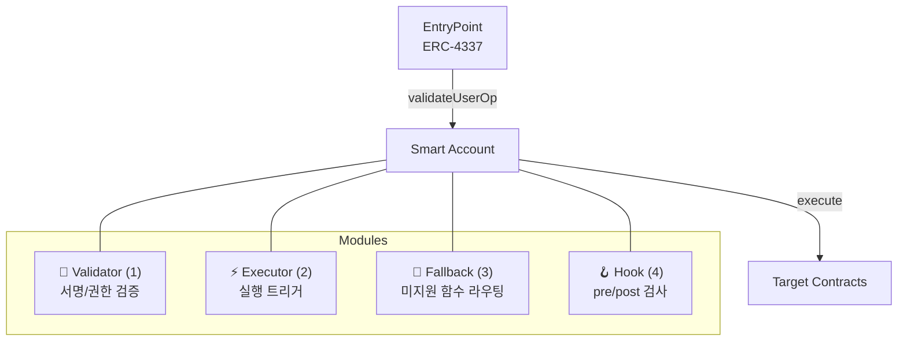

- Smart account: 모듈형 아키텍처를 가진 스마트 컨트랙트 계정
- Module: 계정 기능을 외부로 분리한 컨트랙트
- Module 세부 역할:
  - Validator
  - Executor
  - Fallback Handler
  - Hook
- EntryPoint: ERC-4337 trusted singleton
- Validation: 실행 가능 여부 검증(4337에선 `validateUserOp`)
- Execution: 계정 실행 동작(4337에선 `userOp.callData` 기반 호출)

## 3. Account 요구사항

### 3.1 Validation 관련
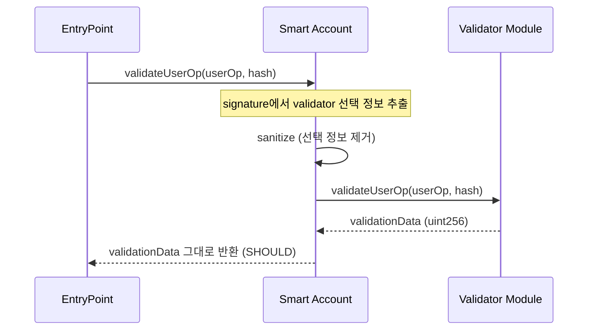

- 스펙은 validator 선택 메커니즘 자체는 강제하지 않음.
- 단, validator 선택 정보가 데이터 필드(예: `userOp.signature`)에 인코딩된다면 계정은 호출 전 sanitize MUST.
- 계정 validation 함수는 validator의 반환값을 그대로 반환 SHOULD.

### 3.2 Execution interface (MUST)
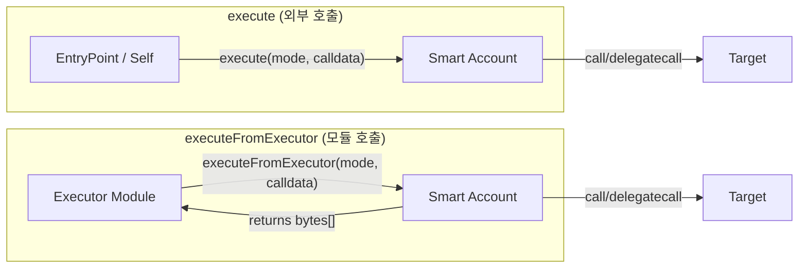

계정은 아래 실행 인터페이스를 구현 MUST.

```solidity
interface IERC7579Execution {
    function execute(bytes32 mode, bytes calldata executionCalldata) external;
    function executeFromExecutor(bytes32 mode, bytes calldata executionCalldata)
        external
        returns (bytes[] memory returnData);
}
```

실행 규칙:
- `execute`:
  - MAY be payable
  - 적절한 권한 통제 MUST (예: 4337 환경에서 onlyEntryPointOrSelf)
  - 지원하지 않는 mode 요청 시 revert MUST
- `executeFromExecutor`:
  - MAY be payable
  - Executor module 전용 권한 통제 MUST
  - 지원하지 않는 mode 요청 시 revert MUST

### 3.3 executeUserOp (MAY)
`IERC7579Execution` 인터페이스와는 별도로 정의된 함수이며, 구현은 MAY이다.

```solidity
function executeUserOp(PackedUserOperation calldata userOp, bytes32 userOpHash) external;
```

구현 시 권고:
- onlyEntryPoint 권한 통제 MUST
- `userOp.callData`의 상위 4바이트(`executeUserOp.selector`)를 제외한 `userOp.callData[4:]`를 실제 계정 호출 데이터로 처리 SHOULD
- 원본 `msg.sender` 보존을 위해 `delegatecall` 사용 RECOMMENDED

구현 예시:
```solidity
(bool success, bytes memory innerCallRet) = address(this).delegatecall(userOp.callData[4:]);
```

### 3.4 Execution mode 포맷 (핵심)
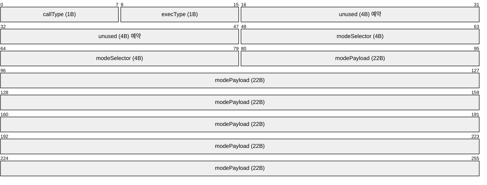

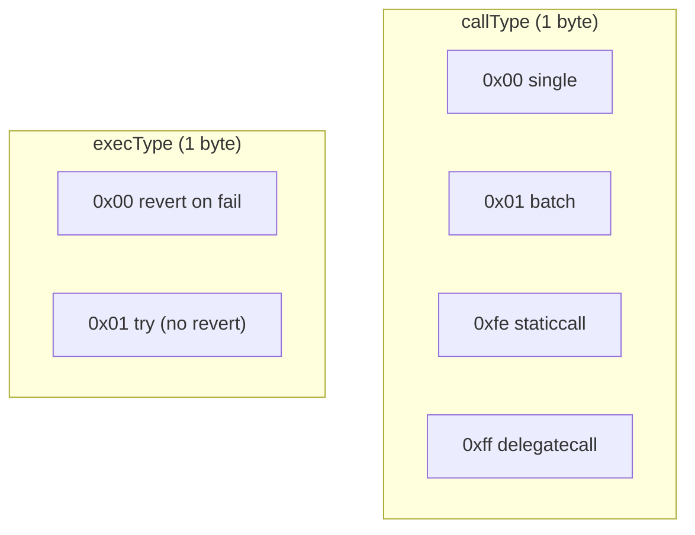

`mode: bytes32` 구조:
- `callType` (1 byte)
  - `0x00`: single call
  - `0x01`: batch call
  - `0xfe`: staticcall
  - `0xff`: delegatecall
- `execType` (1 byte)
  - `0x00`: 실패 시 revert
  - `0x01`: 실패 비-revert + 자체 에러 처리
- `unused` (4 bytes): 미래 표준 확장 예약
- `modeSelector` (4 bytes): vendor/custom mode selector. Solidity 함수 selector와 동일한 4바이트 길이로, 서로 다른 account vendor 간 충돌 저항성(collision resistance)을 보장
- `modePayload` (22 bytes): 추가 데이터. 예: 2바이트 플래그 + address, 또는 calldata 내 추가 데이터를 가리키는 포인터. hook 주소를 전달하여 실행 전후 hook을 지정하는 용도로도 사용 가능

mode 설계 배경(Rationale): 실행 유형별 개별 함수(`executeSingle`, `executeBatch` 등) 대신, 단일 `bytes32` mode 값으로 실행 유형을 구분하는 설계를 채택하여 확장성과 유연성을 확보했다. `unused` 4 bytes는 향후 표준 확장을 위해 예약된 필드이다.

지원 규칙:
- 모든 모드를 구현할 필요는 없음 (NOT REQUIRED)
- `supportsExecutionMode`로 지원 여부를 명시 MUST
- 미지원 mode 요청 시 revert MUST

executionCalldata 인코딩 규칙(MUST):
- single (`0x00`): `abi.encodePacked(target, value, callData)`
- batch (`0x01`): `abi.encode(Execution[])`
- delegatecall (`0xff`): `abi.encodePacked(target, callData)` (value 없음)
- staticcall (`0xfe`): 스펙에 명시적 인코딩 정의 없음 (callType 정의만 존재). 구현 시 별도 규약을 문서화하는 것이 바람직

`Execution` 구조:
```solidity
struct Execution {
    address target;
    uint256 value;
    bytes callData;
}
```

### 3.5 Account config interface (MUST)
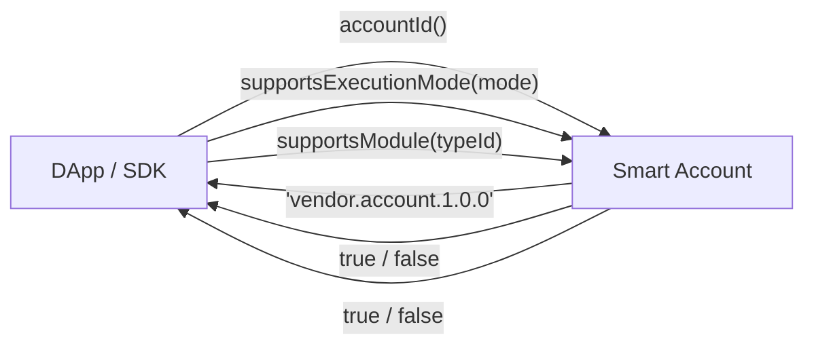

```solidity
interface IERC7579AccountConfig {
    function accountId() external view returns (string memory);
    function supportsExecutionMode(bytes32 encodedMode) external view returns (bool);
    function supportsModule(uint256 moduleTypeId) external view returns (bool);
}
```

요구사항:
- `accountId()`는 non-empty string MUST
- accountId 형식 `vendorname.accountname.semver` SHOULD
- accountId는 구현 간 고유 SHOULD
- `supportsExecutionMode`, `supportsModule`는 지원 여부를 bool로 정확히 반환 MUST

accountId 설계 배경(Rationale): 프론트엔드 라이브러리가 계정의 종류와 버전을 식별하는 데 사용된다. ERC-165 interfaceId나 keccak hash 대신 사람이 읽을 수 있는 문자열을 선택한 것은 유연성을 위한 결정이다.

### 3.6 Module config interface (MUST)
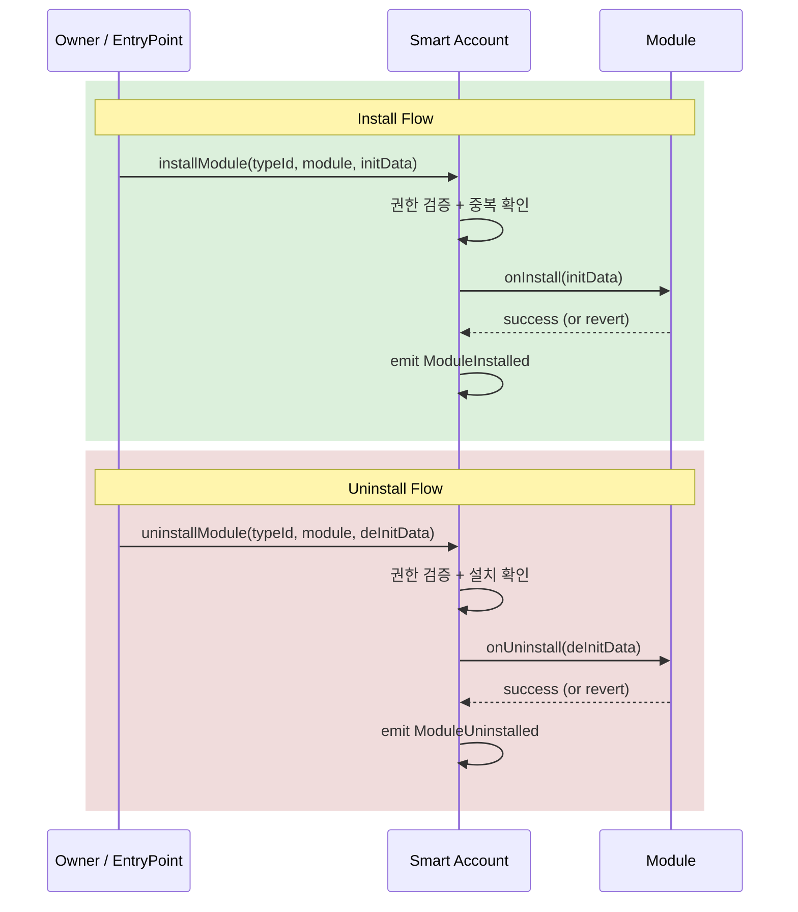

```solidity
interface IERC7579ModuleConfig {
    event ModuleInstalled(uint256 moduleTypeId, address module);
    event ModuleUninstalled(uint256 moduleTypeId, address module);

    function installModule(uint256 moduleTypeId, address module, bytes calldata initData) external;
    function uninstallModule(uint256 moduleTypeId, address module, bytes calldata deInitData) external;
    function isModuleInstalled(uint256 moduleTypeId, address module, bytes calldata additionalContext)
        external
        view
        returns (bool);
}
```

설치/제거/조회 규칙:
- module type 구분 가능한 저장/권한 모델 MUST
- `installModule`:
  - 권한 통제 MUST
  - `module.onInstall(initData)` 호출 MUST (initData가 전달된 경우 해당 값과 함께)
  - `ModuleInstalled` emit MUST
  - 이미 설치 or 초기화 실패 시 revert MUST
- `uninstallModule`:
  - 권한 통제 MUST
  - `module.onUninstall(deInitData)` 호출 MUST (deInitData가 전달된 경우 해당 값과 함께)
  - `ModuleUninstalled` emit MUST
  - 미설치 or deInit 실패 시 revert MUST
- `isModuleInstalled`: 정확한 설치 여부 반환 MUST

### 3.7 Hooks (OPTIONAL extension)
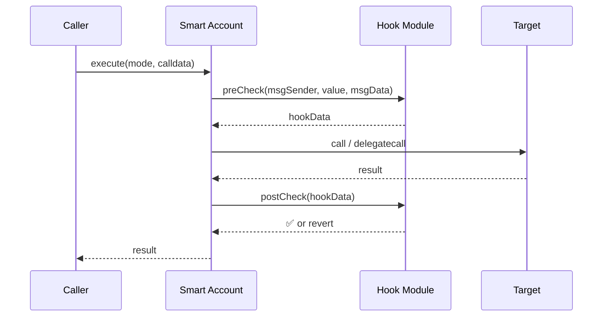

Hook는 옵션이다. 계정이 hook을 지원한다면:
- `execute`/`executeFromExecutor`를 통한 모든 실행 모드(single, batch, staticcall, delegatecall) 전 `preCheck` 호출 MUST
- 실행 후 `postCheck` 호출 MUST
- `installModule`/`uninstallModule` 및 기타 커스텀 실행 함수에도 pre/post 적용 RECOMMENDED

hookData 흐름:
- `preCheck`는 임의의 `hookData`를 반환 MAY
- 반환된 `hookData`는 `postCheck`의 입력으로 전달됨
- `postCheck`는 `hookData`를 활용하여 트랜잭션 전후 문맥을 검증 MAY
- 다중 hook 사용 시 각 hook의 hookData 관리(순서, 결합 방식)는 스펙에 명시되지 않음 → 구현 시 결정 필요

### 3.8 ERC-1271 Forwarding
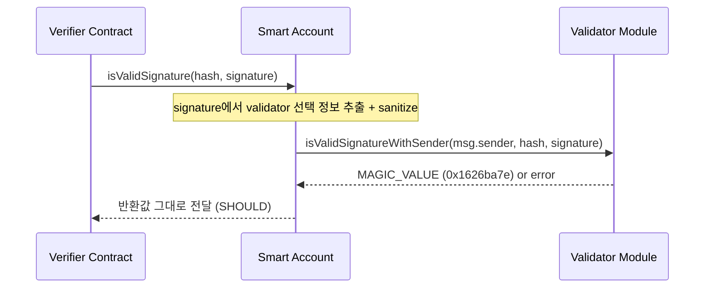

- 계정은 ERC-1271 구현 MUST
- forwarding 구현 시 validator를 아래 시그니처로 호출 MUST:
  - `isValidSignatureWithSender(address sender, bytes32 hash, bytes signature)`
- `sender`는 smart account를 호출한 `msg.sender`
- signature 내 validator 선택 인코딩을 사용하는 경우 sanitize MUST
- 계정의 `isValidSignature`가 validator 반환값을 그대로 반환 SHOULD

### 3.9 Fallback
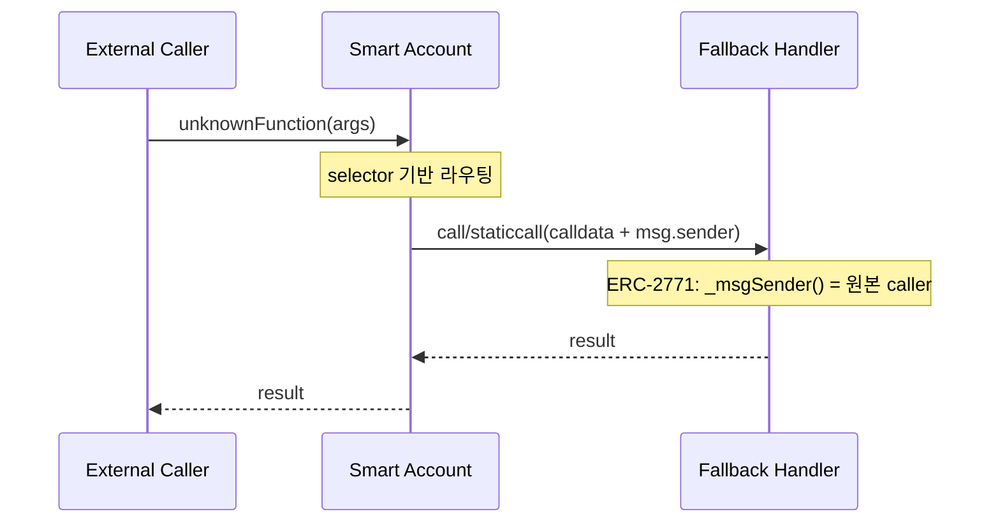

- fallback forwarding 자체는 MAY
- fallback handler 설치 상태에서 계정은:
  - handler 호출에 `call` 또는 `staticcall` 사용 MUST
  - ERC-2771 방식으로 원본 `msg.sender`를 calldata에 추가 MUST
  - calldata function selector 기반 라우팅 MUST
  - authorization control은 MAY (권장: hook 사용)
- fallback으로 기능을 제공하는 경우, 해당 기능은 계정이 네이티브로 구현한 것과 동일하게 취급
- 확장성 관점에서 view 함수를 fallback으로 구현하는 방식은 RECOMMENDED
- core account logic를 fallback에 두는 것은 NOT RECOMMENDED

### 3.10 ERC-165
- 계정은 ERC-165 구현 MAY
- 단, 실제 구현하지 않고 revert하는 인터페이스라면 해당 interfaceId에 `false` 반환 MUST

## 4. Module 요구사항
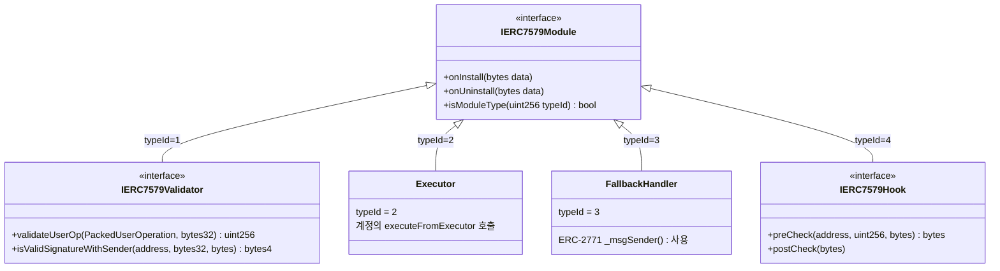

### 4.1 Module type ID (MUST)
- Validation: `1`
- Execution: `2`
- Fallback: `3`
- Hooks: `4`
- 하나의 module이 다중 type을 가질 수 있음
- type ID 5 이상의 확장 여부는 스펙에 정의되지 않음 (향후 별도 ERC로 제안 가능)

Module type 구분의 보안적 근거(Rationale): 모듈 타입을 구분하지 않으면, validator로 설치된 모듈이 executor 권한으로 임의 트랜잭션을 실행할 수 있는 보안 문제가 발생할 수 있다. 스펙은 설치 모듈 저장 시 타입 구분 가능성을 보장할 것을 요구하며, 실행 권한 설계도 이를 반영해야 한다.

### 4.2 Base module interface (MUST)
```solidity
interface IERC7579Module {
    function onInstall(bytes calldata data) external;
    function onUninstall(bytes calldata data) external;
    function isModuleType(uint256 moduleTypeId) external view returns (bool);
}
```

요구사항:
- `onInstall`/`onUninstall`는 에러 시 revert MUST
- `isModuleType`는 해당 type 여부를 정확히 반환 MUST
- 다중 타입 모듈의 경우, `onInstall(data)` 및 `onUninstall(data)`의 `data`에 moduleTypeId를 포함하여 타입별 초기화/해제 로직을 분기할 수 있음

다중 타입 모듈의 onInstall 분기 예시:
```solidity
// Module.sol
function onInstall(bytes calldata data) external {
    // ...
    (uint256 moduleTypeId, bytes memory otherData) = abi.decode(data, (uint256, bytes));
    // moduleTypeId에 따라 타입별 초기화 로직 분기
    // ...
}
```

### 4.3 Validator module (MUST)
Validator는 `IERC7579Module + IERC7579Validator` 구현 MUST, type id=1.

```solidity
interface IERC7579Validator is IERC7579Module {
    function validateUserOp(PackedUserOperation calldata userOp, bytes32 userOpHash) external returns (uint256);
    function isValidSignatureWithSender(address sender, bytes32 hash, bytes calldata signature)
        external
        view
        returns (bytes4);
}
```

요구사항:
- `validateUserOp`는 userOpHash 서명 유효성 검증 MUST
- 반환값 `uint256`의 구체적 인코딩은 본 EIP-7579 문서에서 직접 규정하지 않음. 구현 시 ERC-4337 기대 형식과의 정합성을 확인해야 함
- 서명 불일치 시 ERC-4337 `SIG_VALIDATION_FAILED` 반환(비-revert) SHOULD
- `isValidSignatureWithSender`:
  - 유효 시 ERC-1271 `MAGIC_VALUE` (`0x1626ba7e`) 반환 MUST
  - 상태 변경 금지 MUST (함수 시그니처에 `view` 명시)

### 4.4 Executor / Fallback / Hook module
- Executor: `IERC7579Module` 구현 MUST, type id=2
  - Executor는 계정의 `executeFromExecutor`를 호출하여 실행을 트리거함
  - 계정은 호출자가 설치된 executor module인지 검증 MUST (`onlyExecutorModule`)
  - executor 식별 메커니즘(주소 화이트리스트, 레지스트리 조회 등)은 스펙에 정의되지 않음 → 구현 시 결정
- Fallback Handler: `IERC7579Module` 구현 MUST, type id=3
  - 자체 auth control 구현 시 `msg.sender` 의존 금지 MUST
  - ERC-2771 `_msgSender()` 사용 MUST
- Hook: `IERC7579Module + IERC7579Hook` 구현 MUST, type id=4

```solidity
interface IERC7579Hook is IERC7579Module {
    function preCheck(address msgSender, uint256 value, bytes calldata msgData) external returns (bytes memory hookData);
    function postCheck(bytes calldata hookData) external;
}
```

### 4.5 Rationale 보충 (구현 영향)
- Extensions:
  - 코어 인터페이스 자체를 바꾸기보다, 새로운 기능은 별도 확장 ERC로 제안하는 접근을 권고
  - 예시 네이밍: `"[FEATURE] Extension for ERC-7579"`
- Dependence on ERC-4337:
  - 현재 표준은 validation 흐름에서 ERC-4337에 강하게 의존
  - 향후 비-4337 계정추상화 환경이 늘어나면, 4337 의존 요구를 별도 확장으로 이동하는 업그레이드 경로를 제시

## 5. Security Considerations (스펙 명시)
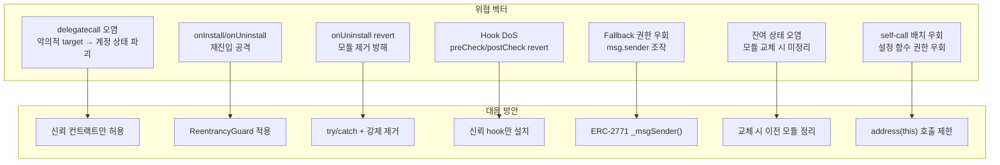

- **delegatecall 대상 검증**: delegatecall 실행 시 target이 신뢰할 수 있는 컨트랙트인지 반드시 검증해야 한다. 악의적 컨트랙트에 delegatecall하면 계정 상태가 오염될 수 있다.
- **onInstall/onUninstall 재진입**: 모듈의 onInstall/onUninstall 호출이 재진입(reentrancy) 공격 벡터가 될 수 있다. 적절한 재진입 방어를 구현해야 한다.
- **악의적 onUninstall revert**: 모듈이 의도적으로 onUninstall에서 revert하여 제거를 방해할 수 있다. 계정은 이에 대한 대응 메커니즘을 고려해야 한다.
- **비신뢰 Hook DoS**: 비신뢰 hook이 preCheck/postCheck에서 의도적으로 revert하여 계정을 DoS(서비스 거부)할 수 있다.
- **Fallback handler 권한**: fallback handler는 적절한 authorization을 강제해야 한다.
- **단일 타입 모듈 교체 시 잔여 상태**: 한 번에 하나의 모듈만 활성화되는 타입(예: fallback handler)에서 `installModule`로 새 모듈을 설치할 때, 이전 모듈의 `onUninstall`이 자동 호출되지 않을 수 있다. 이전 모듈이 잔여 상태(leftover state)를 갖게 되며, 나중에 다시 설치하면 예상치 못한 동작이 발생할 수 있다.
- **설정 함수 배치 호출 우회**: `installModule`/`uninstallModule` 등 설정 함수는 단일 호출 기준으로 설계되었다. 계정이 `address(this)`에서의 호출을 허용하면 배치 설정이 가능해지지만, 설정 함수에 적용된 강화된 권한 통제가 self-call 중첩을 통해 우회될 수 있다.

## 6. 구현 시 자주 놓치는 항목 체크리스트
- `executeFromExecutor` 권한이 executor type으로만 제한되는가
- mode 미지원 시 모든 실행 엔트리에서 일관되게 revert하는가
- single/delegate/batch 인코딩 규칙이 정확한가
- `installModule`/`uninstallModule`에서 onInstall/onUninstall, 이벤트, revert 조건이 모두 충족되는가
- ERC-1271 forwarding에서 `isValidSignatureWithSender(sender=msg.sender)`를 지키는가
- fallback forwarding 시 ERC-2771 문맥 전달을 보장하는가
- interface를 revert-only로 노출하면서 ERC-165 true를 반환하는 오류가 없는가
- delegatecall 대상이 신뢰할 수 있는 컨트랙트로 제한되는가
- onInstall/onUninstall 호출 경로에 재진입 방어가 적용되어 있는가
- 악의적 모듈의 onUninstall revert에 대한 대응이 있는가
- 단일 활성 모듈 타입에서 교체 시 이전 모듈의 잔여 상태가 정리되는가
- `address(this)` 호출을 통한 설정 함수 권한 우회가 방지되는가

## 7. Backwards Compatibility (스펙 명시)
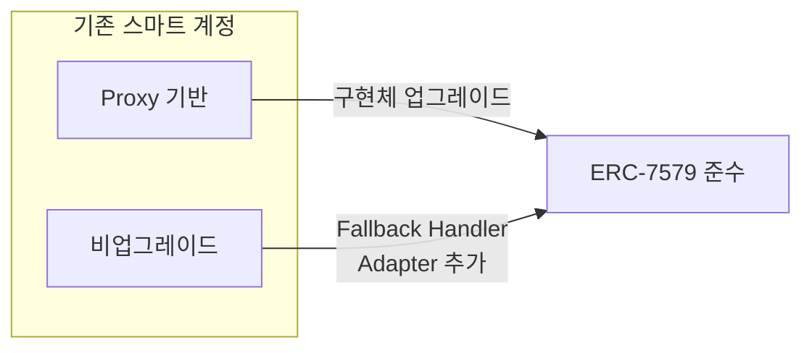

기존 배포된 스마트 계정의 ERC-7579 준수 방법:
- **Proxy 기반 계정**: 새로운 ERC-7579 준수 구현체로 업그레이드 가능
- **비업그레이드 계정**: fallback handler adapter를 추가하여 준수 가능 (fallback handler를 지원하는 경우)
- 두 경로 모두 스펙에서 구체적 마이그레이션 절차나 검증 방법은 정의하지 않음

## 8. 스펙 경계
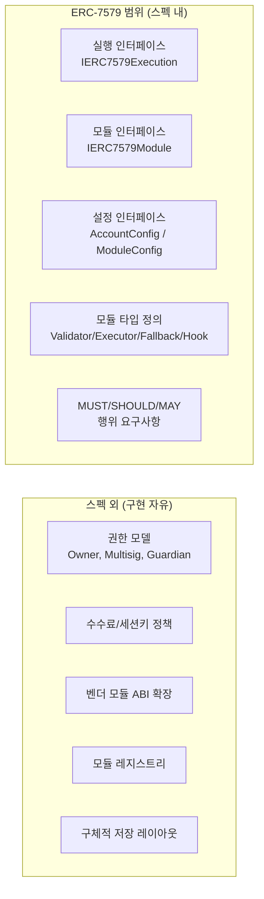

- 본 EIP-7579는 "최소 인터페이스 + 행위 요구사항" 표준이다.
- 구체적 권한 모델(Owner 구조, multisig 정책, guardian 모델), 수수료 정책, 세션키 정책, 특정 벤더 모듈 ABI 확장은 스펙 외 영역이다.
- 스펙 외 기능을 추가해도, 위 MUST 항목을 깨면 ERC-7579 준수로 보기 어렵다.

## 9. Reference Implementation
- 스펙 원문에서 스마트 계정의 전체 인터페이스 참조 구현체를 제공: [`IMSA.sol`](https://github.com/ethereum/ERCs/blob/master/assets/erc-7579/IMSA.sol)
- 구현 시 이 인터페이스를 기준으로 준수 여부를 검증하는 것을 권장

---
참고:
- EIP-7579: https://eips.ethereum.org/EIPS/eip-7579
