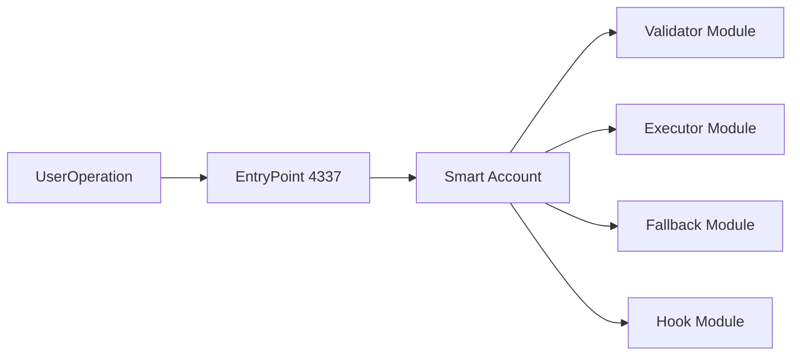
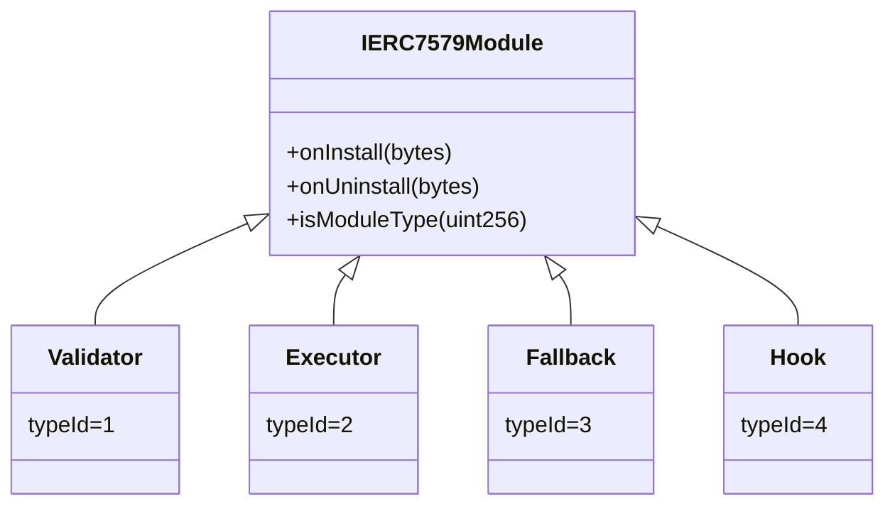
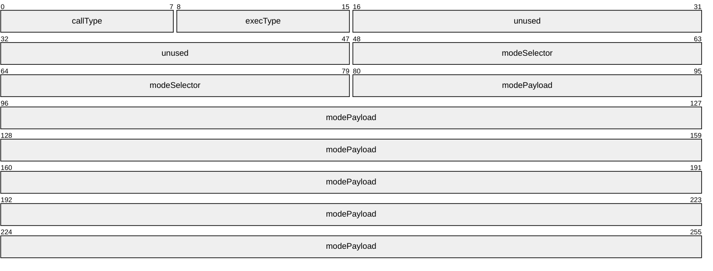
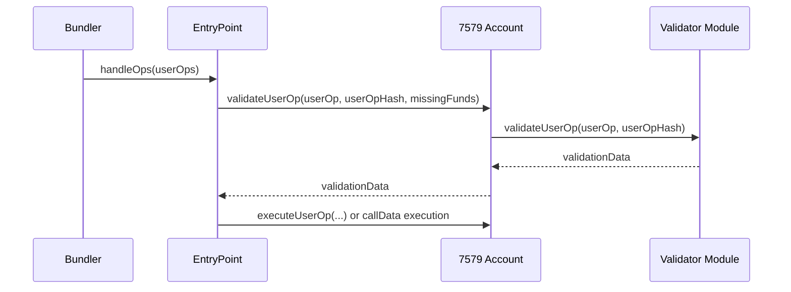

# ERC-7579 주니어 개발자 온보딩 가이드

작성일: 2026-02-26  
기준 스펙: `docs/ERCs/ERCS/erc-7579.md` (Draft)

## 1. ERC-7579가 무엇인가
ERC-7579는 "모듈형 Smart Account"의 최소 공통 인터페이스를 정한 표준이다.
핵심 목적은 **계정(Account) 구현이 달라도 모듈(Validator/Executor/Fallback/Hook)을 재사용**할 수 있게 하는 것이다.

## 2. 먼저 알아야 할 용어
- Smart account: 모듈형 아키텍처를 가진 계정 컨트랙트
- Module: 계정 기능을 외부화한 컨트랙트
- Module type id:
  - `1` Validator
  - `2` Executor
  - `3` Fallback
  - `4` Hook

## 3. Account 쪽 필수 구현

### 3.1 실행 인터페이스 (MUST)
계정은 아래 2개를 반드시 구현한다.
- `execute(bytes32 mode, bytes executionCalldata)`
- `executeFromExecutor(bytes32 mode, bytes executionCalldata) returns (bytes[] returnData)`

핵심 규칙:
- 권한 제어 MUST
- 미지원 mode면 revert MUST

### 3.2 mode 구조 이해
`mode`는 `bytes32`이고 아래처럼 구성된다.
- callType(1B), execType(1B), unused(4B), modeSelector(4B), modePayload(22B)

callType:
- `0x00`: single call
- `0x01`: batch call
- `0xfe`: staticcall
- `0xff`: delegatecall

### 3.3 Account config 인터페이스 (MUST)
- `accountId()`
- `supportsExecutionMode(bytes32)`
- `supportsModule(uint256)`

주의:
- `accountId()`는 빈 문자열이면 안 됨
- 계정이 지원하지 않는 mode/type은 정확히 `false` 반환 필요

### 3.4 Module config 인터페이스 (MUST)
- `installModule(typeId, module, initData)`
- `uninstallModule(typeId, module, deInitData)`
- `isModuleInstalled(typeId, module, additionalContext)`

핵심:
- 설치/해제 시 이벤트 발생 MUST
- 중복 설치, 미설치 해제는 revert MUST
- 모듈 저장 시 type 구분 가능해야 함 (권한 분리 목적)

## 4. ERC-4337과 붙을 때 중요한 포인트

실무 체크:
- 4337 Account 함수(`validateUserOp` with `missingAccountFunds`)와
  7579 Validator 함수(`validateUserOp` without `missingAccountFunds`)는 시그니처가 다르다.
- 따라서 계정 컨트랙트가 **어댑터 역할**을 해야 한다.

## 5. Hook/Fallback에서 자주 실수하는 부분
- Hook 지원 계정이면 `execute`/`executeFromExecutor` 전후로 `preCheck`/`postCheck` 호출 MUST
- Fallback forwarding 시 원본 sender를 ERC-2771 방식으로 calldata에 포함 MUST
- Fallback handler가 auth를 구현하면 `msg.sender` 대신 `_msgSender()` 사용 MUST

## 6. 최소 구현 체크리스트
- `execute`, `executeFromExecutor` 구현 완료
- 미지원 mode revert
- `supportsExecutionMode`, `supportsModule` 정확한 bool 반환
- `installModule`/`uninstallModule` 이벤트 + revert 조건 충족
- ERC-1271 `isValidSignature` 구현 + forwarding 시 sanitize
- module type별 권한 분리

## 7. 참고(라인)
- 실행 인터페이스: `erc-7579.md:53-81`
- mode 정의/인코딩: `erc-7579.md:106-127`
- account config: `erc-7579.md:130-160`
- module config: `erc-7579.md:165-211`
- hooks: `erc-7579.md:216-221`
- fallback/2771: `erc-7579.md:233-238`
- module type: `erc-7579.md:249-255`
