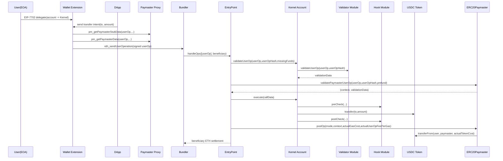

# EIP-7702 + ERC-4337 + ERC-7579 + ERC20Paymaster 메시지 플로우

작성일: 2026-02-27  
기준 코드:
- Account(Kernel): `poc-contract/src/erc7579-smartaccount/Kernel.sol`
- EntryPoint: `poc-contract/src/erc4337-entrypoint/EntryPoint.sol`
- Paymaster: `poc-contract/src/erc4337-paymaster/ERC20Paymaster.sol`
- DApp: `stable-platform/apps/web/`
- Wallet Extension: `stable-platform/apps/wallet-extension/`
- Bundler: `stable-platform/services/bundler/`
- Paymaster Proxy: `stable-platform/services/paymaster-proxy/`
- Token: `poc-contract/src/tokens/USDC.sol`

---

## 1. 시나리오 요약
- EOA가 EIP-7702로 Kernel(Account Contract)에 위임됨
- 사용자는 native coin 없이 USDC로 가스비를 지불하고, USDC를 다른 유저에게 전송
- UserOperation은 Bundler를 통해 EntryPoint에서 실행
- Paymaster는 `postOp`에서 실제 사용 가스에 대응하는 토큰 비용을 회수

---

## 2. 단계별 상세 플로우 (함수/파라미터/리턴)

## 2.1 EIP-7702 위임 단계
Wallet Extension RPC:
- `wallet_delegateAccount({ account, contractAddress })`

핵심 내부 처리:
1. `createAuthorization(chainId, contractAddress, authNonce)`
2. `createAuthorizationHash(authorization)`
3. `type: 'eip7702'` 트랜잭션 생성 (`authorizationList` 포함)
4. 브로드캐스트 후 계정 타입을 `delegated`로 업데이트

코드 참조:
- `stable-platform/apps/wallet-extension/src/background/rpc/handler.ts:945`
- `stable-platform/apps/wallet-extension/src/background/rpc/handler.ts:1020`
- `stable-platform/apps/wallet-extension/src/background/rpc/handler.ts:1041`

---

## 2.2 UserOperation 생성 단계
Wallet Extension가 `eth_sendUserOperation` 처리:
- 입력: `[userOpParam, entryPoint]`

핵심 내부 처리:
1. `target/value/data` 입력이면 `encodeKernelExecute(...)`로 Kernel `execute` callData 생성
2. nonce 미지정 시 EntryPoint `getNonce(sender,key)` 조회
3. gas/fee 산정 + bundler `estimateUserOperationGas` 반영
4. paymaster 필요 시 sponsorship 요청
5. `getUserOperationHash(userOp, entryPoint, chainId)` 계산 후 서명
6. bundler에 제출

코드 참조:
- `stable-platform/apps/wallet-extension/src/background/rpc/handler.ts:1114`
- `stable-platform/apps/wallet-extension/src/background/rpc/handler.ts:1134`
- `stable-platform/apps/wallet-extension/src/background/rpc/handler.ts:1191`
- `stable-platform/apps/wallet-extension/src/background/rpc/handler.ts:1275`
- `stable-platform/apps/wallet-extension/src/background/rpc/handler.ts:1296`
- `stable-platform/apps/wallet-extension/src/background/rpc/handler.ts:1309`

---

## 2.3 Paymaster Proxy 연동 단계
Wallet Extension 유틸:
- `requestPaymasterSponsorship(paymasterUrl, userOp, entryPoint, chainId, tokenAddress?)`

호출 순서:
1. `pm_getPaymasterStubData`
2. `pm_getPaymasterData`

리턴 반영 필드:
- `paymaster`
- `paymasterData`
- `paymasterVerificationGasLimit`
- `paymasterPostOpGasLimit`

코드 참조:
- `stable-platform/apps/wallet-extension/src/background/rpc/paymaster.ts:48`
- `stable-platform/apps/wallet-extension/src/background/rpc/paymaster.ts:83`
- `stable-platform/apps/wallet-extension/src/background/rpc/paymaster.ts:102`

Proxy 측 라우팅:
- `pm_getPaymasterData` -> context의 `paymasterType`에 따라 `verifying/sponsor/erc20/permit2`
- ERC20 타입은 envelope 기반 `paymasterData` 생성

코드 참조:
- `stable-platform/services/paymaster-proxy/src/app.ts:359`
- `stable-platform/services/paymaster-proxy/src/handlers/getPaymasterData.ts:106`
- `stable-platform/services/paymaster-proxy/src/handlers/getPaymasterData.ts:237`
- `stable-platform/services/paymaster-proxy/src/schemas/index.ts:59`

---

## 2.4 Bundler 검증/번들링 단계
RPC 수신:
- `eth_sendUserOperation`

처리:
1. unpack + userOpHash 계산
2. validator 파이프라인 실행(format/reputation/state/simulation/opcode)
3. mempool 적재
4. 배치 시 `EntryPoint.handleOps(...)` 트랜잭션 전송

코드 참조:
- `stable-platform/services/bundler/src/rpc/server.ts:365`
- `stable-platform/services/bundler/src/validation/validator.ts:135`
- `stable-platform/services/bundler/src/executor/bundleExecutor.ts:379`
- `stable-platform/services/bundler/src/executor/bundleExecutor.ts:448`

---

## 2.5 EntryPoint 검증 단계
검증 순서:
1. Account 검증: `IAccount.validateUserOp(op, userOpHash, missingAccountFunds)`
2. Paymaster 검증: `IPaymaster.validatePaymasterUserOp(op, userOpHash, prefund)`
3. validationData(서명/유효시간) 판정

코드 참조:
- `poc-contract/src/erc4337-entrypoint/EntryPoint.sol:576`
- `poc-contract/src/erc4337-entrypoint/EntryPoint.sol:636`
- `poc-contract/src/erc4337-entrypoint/EntryPoint.sol:696`

---

## 2.6 Kernel 검증 단계 (모듈 호출)
Kernel `validateUserOp(...)` 내부에서:
- `_validateUserOp(...)` 실행
- Validator 모듈 호출: `validator.validateUserOp(userOp, userOpHash)`
- 결과 `validationData`를 EntryPoint 규약에 맞게 활용

코드 참조:
- `poc-contract/src/erc7579-smartaccount/Kernel.sol:328`
- `poc-contract/src/erc7579-smartaccount/core/ValidationManager.sol:317`

리턴 활용:
- EntryPoint가 signature failure/validAfter/validUntil 판정

---

## 2.7 실행 단계 (ERC-20 transfer)
EntryPoint 실행 분기:
- `userOp.callData` selector가 `executeUserOp`인지 확인 후 경로 선택

Kernel 실행:
- 보통 `execute(mode, executionCalldata)` 경로
- preHook -> 실행 -> postHook

실제 토큰 호출:
1. `Kernel.execute(...)`
2. `ExecLib.execute(...)`가 single call decode
3. `call(target, value, callData)` 실행
4. target=USDC, callData=`transfer(to, amount)`이면 실제 토큰 전송

코드 참조:
- `poc-contract/src/erc4337-entrypoint/EntryPoint.sol:249`
- `poc-contract/src/erc7579-smartaccount/Kernel.sol:458`
- `poc-contract/src/erc7579-smartaccount/utils/ExecLib.sol:23`
- `poc-contract/src/erc7579-smartaccount/utils/ExecLib.sol:100`

---

## 2.8 Hook/Fallback는 언제 호출되는가
Validator:
- 항상 validation 단계에서 Kernel이 선택한 validator를 호출

Hook:
- `execute` / `executeFromExecutor` / fallback 경로에서 pre/post 가능
- 현재 Kernel은 `execute`에도 pre/post 적용

Fallback:
- Kernel에 없는 selector 호출 시에만 fallback 라우팅
- 일반 ERC20 transfer(userOp의 정상 execute 경로)에서는 보통 fallback 미사용

코드 참조:
- `poc-contract/src/erc7579-smartaccount/Kernel.sol:269`
- `poc-contract/src/erc7579-smartaccount/Kernel.sol:431`
- `poc-contract/src/erc7579-smartaccount/Kernel.sol:458`

---

## 2.9 postOp 정산 단계
EntryPoint:
- `_postExecution`에서 Paymaster `postOp(mode, context, actualGasCost, actualUserOpFeePerGas)` 호출

ERC20Paymaster:
1. 검증단계 `_validatePaymasterUserOp`에서 maxTokenCost 계산, context 반환
2. `postOp`에서 actualGasCost 기반 실제 토큰 비용 산정
3. `IERC20(token).safeTransferFrom(user, paymaster, actualTokenCost)` 실행

Bundler 정산:
- Bundler beneficiary는 EntryPoint에서 ETH로 정산
- Paymaster는 사용자 토큰 회수로 비용 상환

코드 참조:
- `poc-contract/src/erc4337-entrypoint/EntryPoint.sol:853`
- `poc-contract/src/erc4337-paymaster/ERC20Paymaster.sol:193`
- `poc-contract/src/erc4337-paymaster/ERC20Paymaster.sol:257`
- `poc-contract/src/erc4337-paymaster/ERC20Paymaster.sol:284`

---

## 3. 파라미터/리턴 요약표

| 구간 | 함수 | 주요 파라미터 | 주요 리턴/활용 |
|---|---|---|---|
| Account 검증 | `validateUserOp` | `(userOp, userOpHash, missingAccountFunds)` | `validationData` (서명/유효시간 판단) |
| Paymaster 검증 | `validatePaymasterUserOp` | `(userOp, userOpHash, maxCost/prefund)` | `(context, validationData)` |
| Account 실행 | `execute` | `(mode, executionCalldata)` | 내부 call 수행(토큰 전송 포함) |
| Paymaster 정산 | `postOp` | `(mode, context, actualGasCost, actualUserOpFeePerGas)` | 토큰 회수/환불/회계 처리 |

---

## 4. 현 구현 기준 주의사항
1. Fallback sender-context 불일치 이슈
- Kernel/ExecLib는 ERC-2771 20바이트 append
- 일부 fallback 모듈은 40바이트 context 기대
- 해당 이슈는 별도 감사표에서 추적 중

2. Paymaster context 필드 정합성
- ~~Wallet Extension의 `requestPaymasterSponsorship`는 context에 `{ token: tokenAddress }`를 사용~~ → `{ tokenAddress }`로 수정 완료
- Proxy 스키마는 `tokenAddress`, `paymasterType`를 공식 필드로 사용
- 양측 필드명 `tokenAddress`로 통일 완료

코드 참조:
- `stable-platform/apps/wallet-extension/src/background/rpc/paymaster.ts:80`
- `stable-platform/services/paymaster-proxy/src/schemas/index.ts:59`

---

## 5. 결론
이 시나리오의 본질은 다음 3단계다.
1. EIP-7702로 EOA를 Kernel 실행 문맥에 위임
2. ERC-4337 UserOp를 Bundler/EntryPoint 경로로 실행
3. Paymaster가 가스를 선부담하고 `postOp`에서 사용자 ERC-20을 회수

즉, 토큰 전송(`USDC.transfer`)과 가스 정산(`postOp`)은 같은 UserOp 실행 사이클 안에서 연결되어 동작한다.
