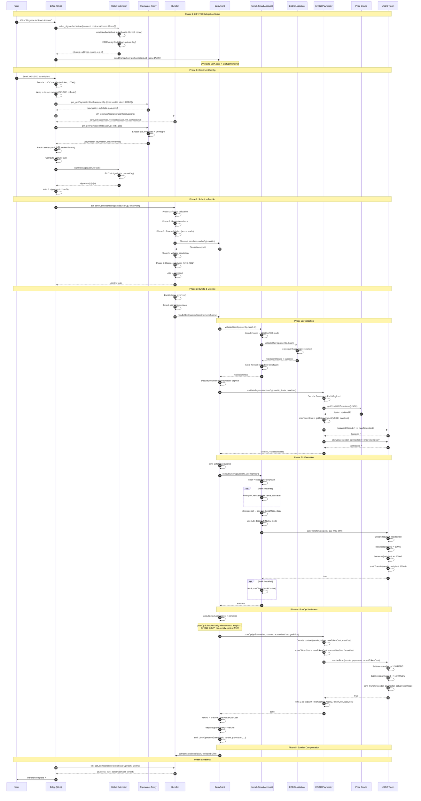
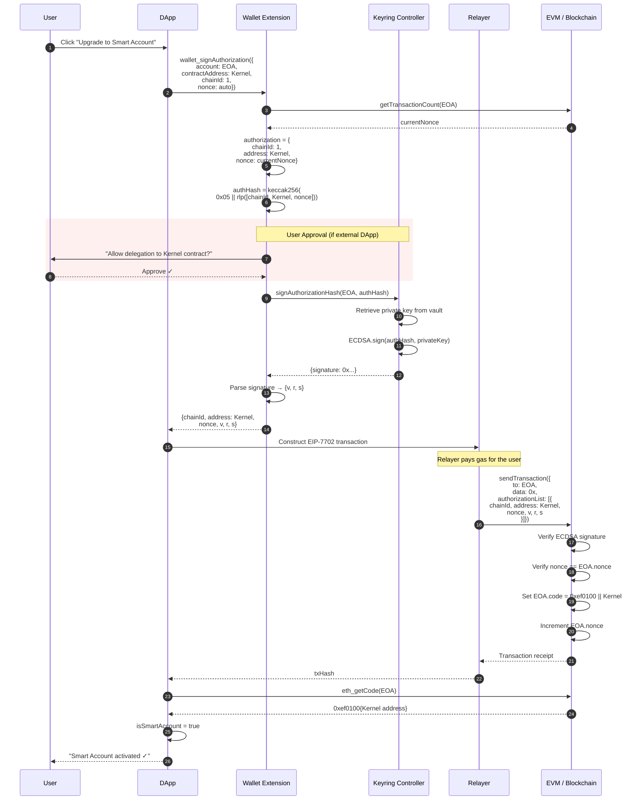
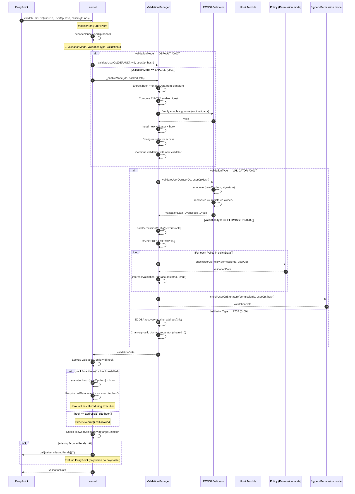
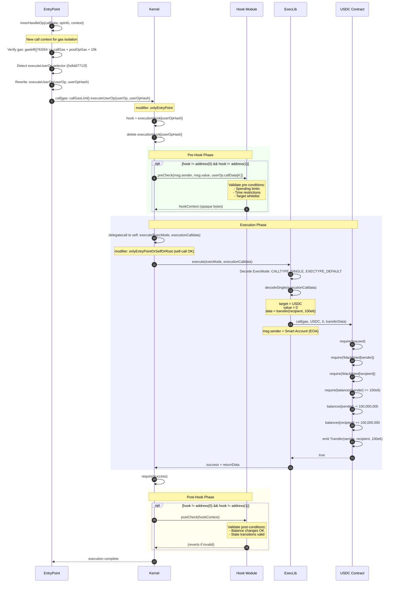
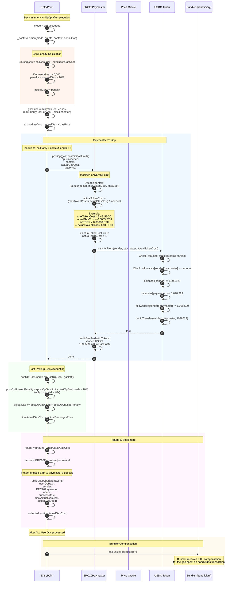
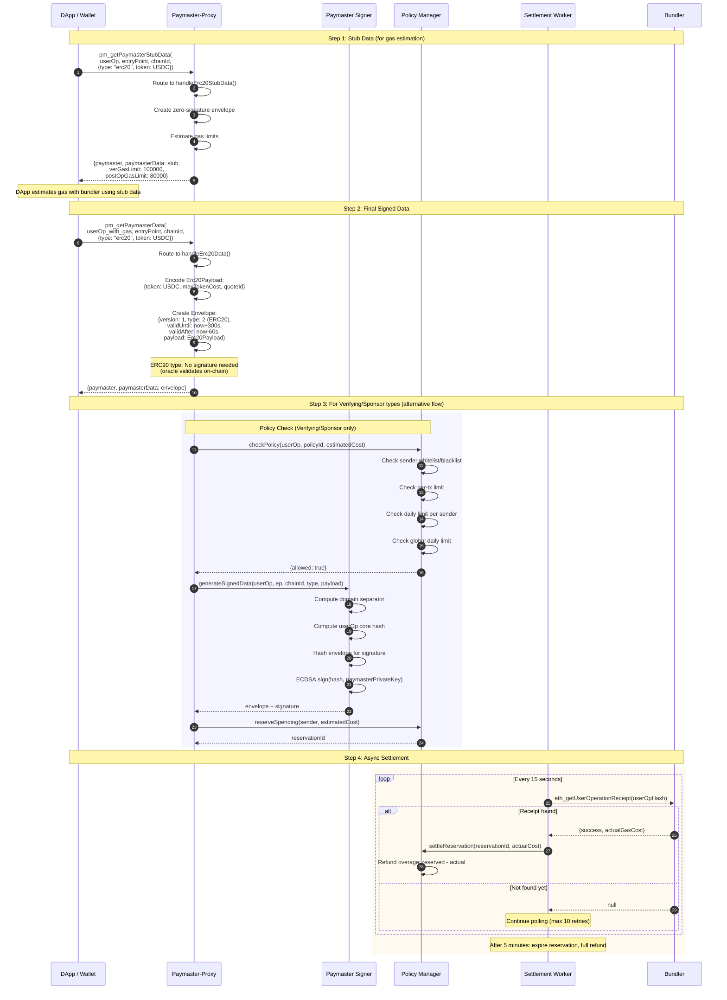
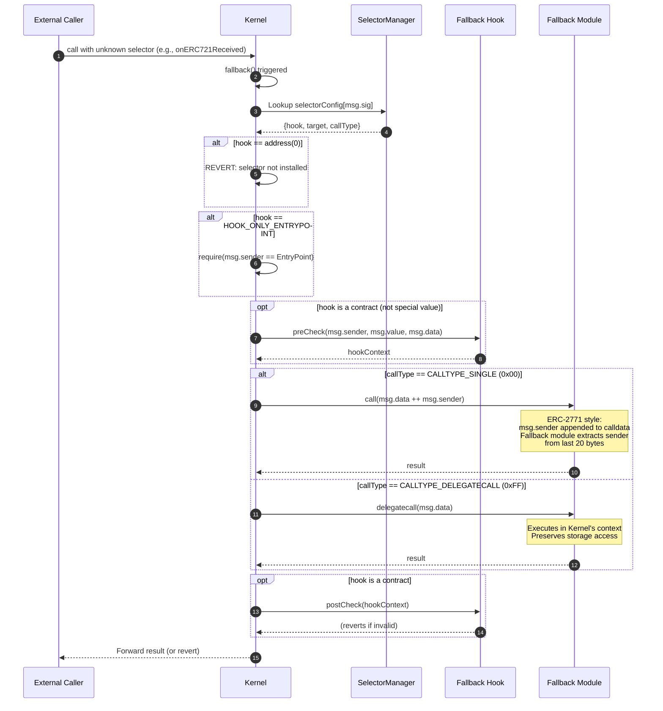
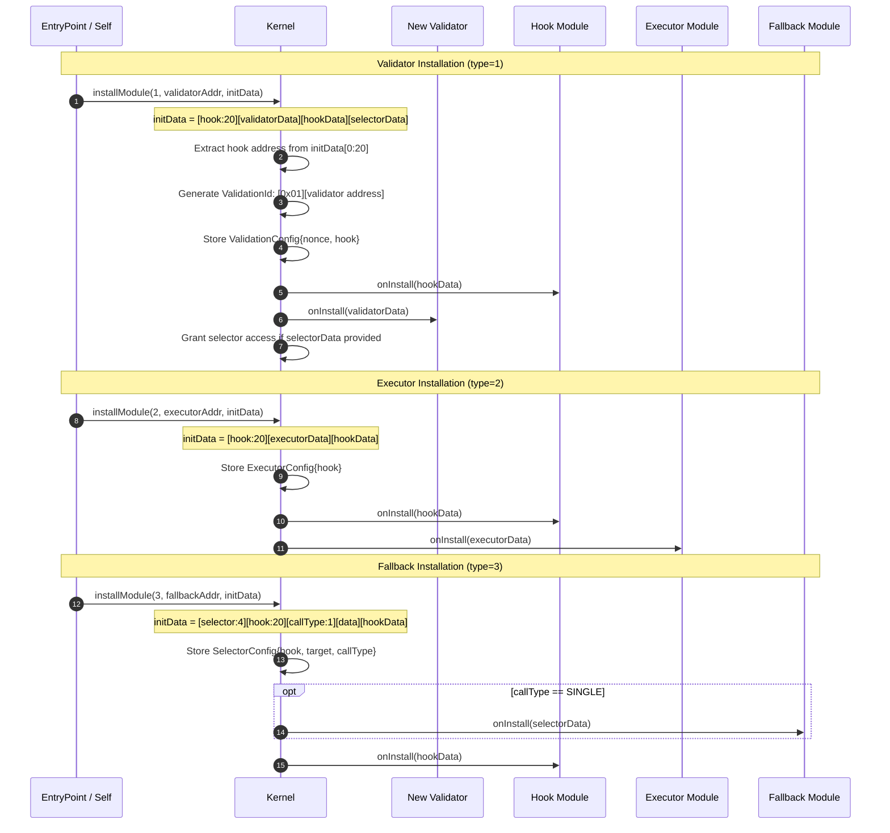

# ERC-4337 + EIP-7702 시퀀스 다이어그램

> 한국어 번역본 (원문: ERC4337_EIP7702_SEQUENCE_DIAGRAM.md)
>
> ⚠️ 상태: 번역 동기화 대기(legacy). 최신 구현 기준은 영문 정본을 우선 확인:
> - `docs/claude/spec/ERC4337_EIP7702_COMPLETE_FLOW.md`
> - `docs/claude/spec/ERC4337_EIP7702_SEQUENCE_DIAGRAM.md`
>
> 연동 메모 (2026-03-02):
> - 오프체인 인프라(Bundler/SDK/Proxy) 정합성은 **PARTIAL**
> - 상세 근거: `docs/claude/spec/EIP-4337_7579_통합_스펙준수_보고서.md` §11.2.4, §11.3
> - 세부 점검표: `docs/claude/spec/EIP-4337_7579_코드정합성_검토결과_2026-03-02.md`

## 1. 전체 End-to-End 흐름 (개요)



---

## 2. EIP-7702 위임 설정 (상세)



---

## 3. 커널 검증 흐름 (상세)



---

## 4. 커널 실행 흐름 (상세)



---

## 5. PostOp 및 정산 흐름 (상세)



---

## 6. Paymaster-Proxy 오프체인 흐름 (상세)



---

## 7. Fallback 모듈 흐름



---

## 8. 모듈 설치 흐름



---

## 범례

### 참여자

| 색상 | 구성요소 | 계층 |
|-------|-----------|-------|
| 기본 | DApp, Wallet, User | 오프체인 클라이언트 |
| 기본 | Bundler, Paymaster-Proxy | 오프체인 인프라 |
| 기본 | EntryPoint, Kernel | 온체인 코어 |
| 기본 | Validator, Hook, Paymaster | 온체인 모듈 |
| 기본 | USDC, Oracle | 온체인 의존성 |

### 메시지 타입

| 화살표 | 의미 |
|-------|---------|
| `→` (실선) | 동기 호출 |
| `-->` (점선) | 반환값 |
| `rect` | 논리 단계 그룹 |
| `opt` | 선택 사항 (조건부) |
| `alt` | 대체 경로 |
| `loop` | 반복 동작 |

### 주요 주소 (로컬 개발)

```
EntryPoint:        0xEf6817fe73741A8F10088f9511c64b666a338A14
Kernel:            0xCf7Ed3AccA5a467e9e704C703E8D87F634fB0Fc9
ECDSA Validator:   0x5FC8d32690cc91D4c39d9d3abcBD16989F875707
Kernel Factory:    0xDc64a140Aa3E981100a9becA4E685f962f0cF6C9
```
