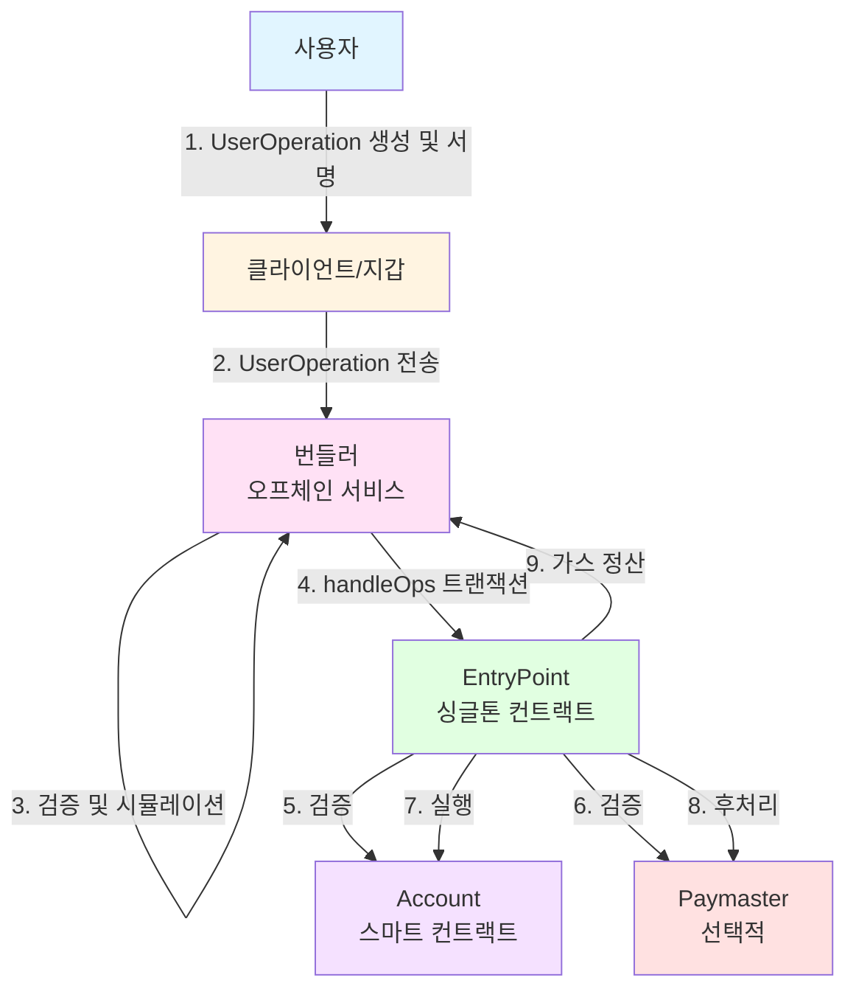
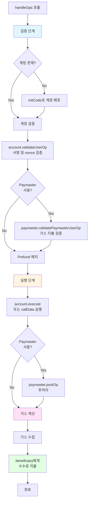
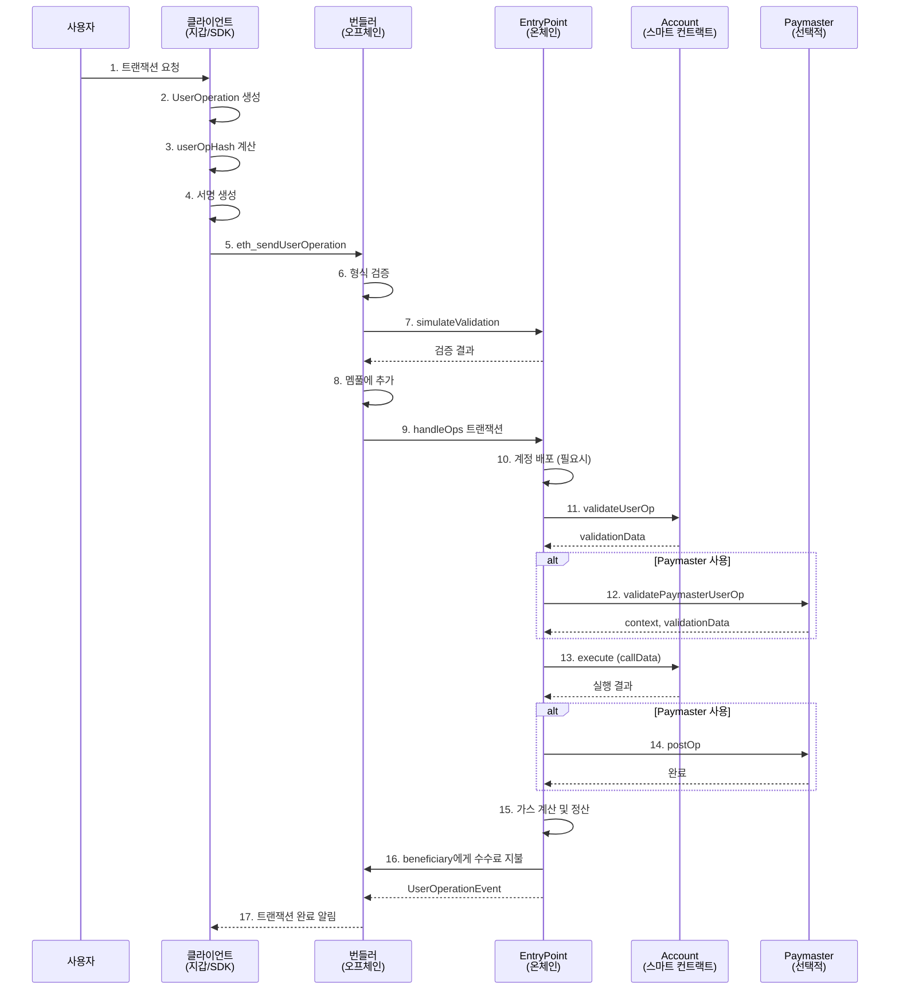
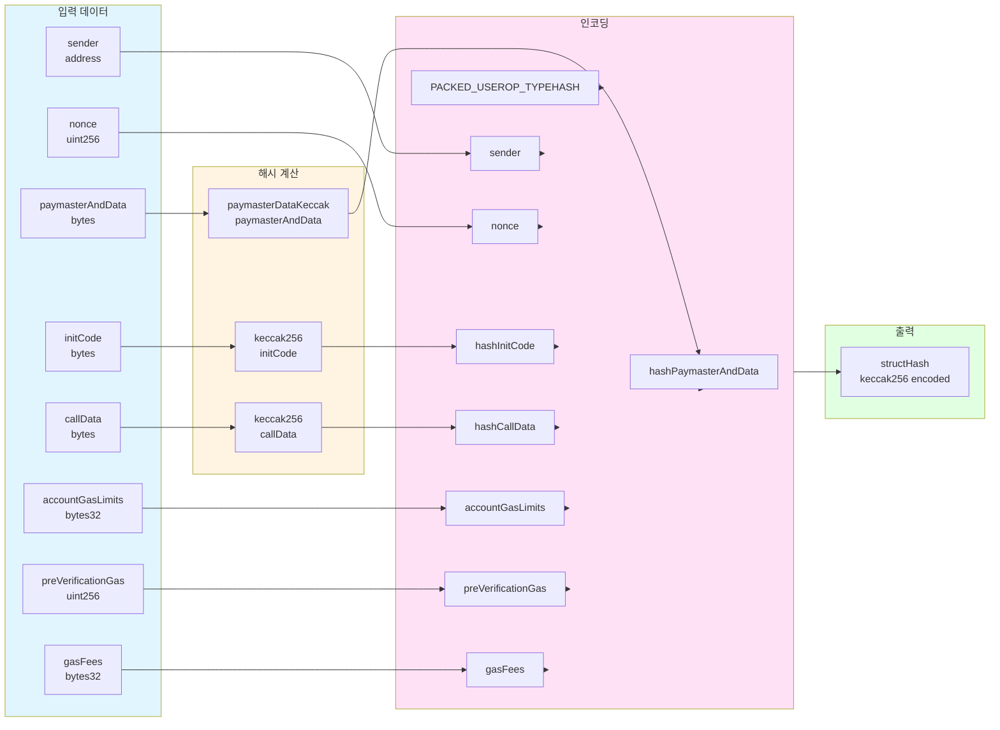
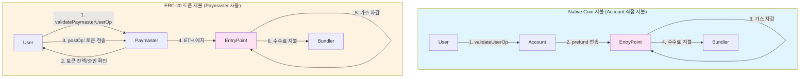

# ERC-4337: Account Abstraction Implementation Guide

## 개요

ERC-4337은 이더리움 프로토콜 레벨 변경 없이 계정 추상화(Account Abstraction)를 구현하는 표준입니다. 이 문서는 ERC-4337을 구현하고 사용하기 위한 기술 스펙, 사용자 플로우, 그리고 트랜잭션 메시지 포맷을 정리합니다.

### 핵심 개념

- **UserOperation**: EOA 트랜잭션을 대체하는 의사 트랜잭션 객체
- **EntryPoint**: UserOperation을 처리하는 싱글톤 컨트랙트
- **Bundler**: UserOperation을 수집하고 표준 트랜잭션으로 번들링하는 오프체인 서비스
- **Paymaster**: 사용자 대신 가스를 지불하는 선택적 컨트랙트
- **Account**: ERC-4337을 구현하는 스마트 컨트랙트 계정

### ERC-4337 아키텍처



---

## 1. 스펙 구현을 위한 스펙 정리

### 1.1 UserOperation 구조체

UserOperation은 계정 추상화의 핵심 데이터 구조입니다. Packed 형식을 사용하여 가스 비용을 최적화합니다.

#### PackedUserOperation 구조

```solidity
struct PackedUserOperation {
    address sender;              // 계정 주소
    uint256 nonce;               // nonce = uint192(key) || uint64(sequence)
    bytes initCode;              // 계정 생성 코드 (factory || factoryCalldata)
    bytes callData;              // 실행할 호출 데이터
    bytes32 accountGasLimits;    // uint128(verificationGasLimit) || uint128(callGasLimit)
    uint256 preVerificationGas;  // 번들러 보상용 가스
    bytes32 gasFees;             // uint128(maxPriorityFeePerGas) || uint128(maxFeePerGas)
    bytes paymasterAndData;      // paymaster(20) || verificationGasLimit(16) || postOpGasLimit(16) || paymasterData
    bytes signature;             // 서명 데이터
}
```

#### 필드 상세 설명

| 필드 | 타입 | 설명 |
|------|------|------|
| `sender` | address | UserOperation을 실행할 계정 주소. 이미 배포되어 있거나 `initCode`로 배포될 주소여야 함 |
| `nonce` | uint256 | 재전송 방지를 위한 논스. `uint192(key) || uint64(sequence)` 형식으로, EntryPoint는 각 `key`별로 `sequence`를 독립적으로 추적 |
| `initCode` | bytes | 계정이 아직 배포되지 않은 경우, `factory(20) || factoryCalldata` 형식. EIP-7702의 경우 `0x7702 || optionalPayload` |
| `callData` | bytes | 계정에서 실행할 메서드 호출 데이터. `IAccountExecute.executeUserOp.selector`로 시작하면 EntryPoint가 래핑하여 전달 |
| `accountGasLimits` | bytes32 | `uint128(verificationGasLimit) || uint128(callGasLimit)`로 패킹된 가스 한도 |
| `preVerificationGas` | uint256 | 번들러가 부담하는 오버헤드 가스 (배치 처리, 직렬화 등) |
| `gasFees` | bytes32 | `uint128(maxPriorityFeePerGas) || uint128(maxFeePerGas)`로 패킹된 EIP-1559 가스 수수료 |
| `paymasterAndData` | bytes | Paymaster 사용 시: `paymaster(20) || verificationGasLimit(16) || postOpGasLimit(16) || paymasterData`. 선택적으로 `paymasterSignature` 포함 가능 |
| `signature` | bytes | 계정이 `userOpHash`에 대해 생성한 서명 |

#### PaymasterAndData 인코딩

Paymaster를 사용하는 경우:

```
paymasterAndData = paymaster(20 bytes) 
                || verificationGasLimit(16 bytes)
                || postOpGasLimit(16 bytes)
                || paymasterData(variable)
                || [optional] paymasterSignature(variable)
                || uint16(paymasterSignature.length)
                || PAYMASTER_SIG_MAGIC (0x22e325a297439656)
```

#### UserOperation 구조 다이어그램

```mermaid
graph LR
    subgraph UserOperation["PackedUserOperation"]
        A[sender<br/>address] --> B[nonce<br/>uint256<br/>key||sequence]
        B --> C[initCode<br/>bytes<br/>factory||calldata]
        C --> D[callData<br/>bytes]
        D --> E[accountGasLimits<br/>bytes32<br/>verification||call]
        E --> F[preVerificationGas<br/>uint256]
        F --> G[gasFees<br/>bytes32<br/>priority||maxFee]
        G --> H[paymasterAndData<br/>bytes]
        H --> I[signature<br/>bytes]
    end
    
    subgraph PackedFields["패킹된 필드"]
        J[accountGasLimits<br/>uint128||uint128]
        K[gasFees<br/>uint128||uint128]
        L[paymasterAndData<br/>paymaster||limits||data||sig]
    end
    
    E -.->|패킹| J
    G -.->|패킹| K
    H -.->|인코딩| L
    
    style UserOperation fill:#e1f5ff
    style PackedFields fill:#fff4e1
```

### 1.2 EntryPoint 인터페이스

EntryPoint는 UserOperation을 처리하는 싱글톤 컨트랙트입니다.

#### 주요 메서드

```solidity
interface IEntryPoint {
    // UserOperation 배치 실행 (서명 집계 없음)
    function handleOps(
        PackedUserOperation[] calldata ops,
        address payable beneficiary
    ) external;
    
    // UserOperation 배치 실행 (서명 집계 사용)
    function handleAggregatedOps(
        UserOpsPerAggregator[] calldata opsPerAggregator,
        address payable beneficiary
    ) external;
    
    // UserOperation의 해시 계산
    function getUserOpHash(
        PackedUserOperation calldata userOp
    ) external view returns (bytes32);
    
    // 현재 실행 중인 UserOperation 해시 조회
    function getCurrentUserOpHash() external view returns (bytes32);
    
    // 계정 주소 계산 (counterfactual)
    function getSenderAddress(bytes memory initCode) external;
}
```

#### EntryPoint 처리 플로우



1. **검증 단계 (Validation Phase)**
   - 계정이 존재하지 않으면 `initCode`로 배포
   - `account.validateUserOp()` 호출하여 서명 및 nonce 검증
   - Paymaster가 있으면 `paymaster.validatePaymasterUserOp()` 호출
   - 필요한 prefund를 EntryPoint에 예치

2. **실행 단계 (Execution Phase)**
   - `account.execute()` 또는 `callData` 직접 실행
   - Paymaster가 있으면 `paymaster.postOp()` 호출
   - 가스 비용 정산 및 수수료 지불

### 1.3 Account 인터페이스

스마트 컨트랙트 계정은 `IAccount` 인터페이스를 구현해야 합니다.

```solidity
interface IAccount {
    function validateUserOp(
        PackedUserOperation calldata userOp,
        bytes32 userOpHash,
        uint256 missingAccountFunds
    ) external returns (uint256 validationData);
}
```

#### validateUserOp 반환값 (validationData)

`validationData`는 32바이트로 패킹된 검증 결과입니다:

```
validationData = aggregatorOrSigFail(20 bytes) 
              || validUntil(6 bytes) 
              || validAfter(6 bytes)
```

- `aggregatorOrSigFail`: 
  - `0x00...00`: 서명 검증 성공
  - `0x00...01`: 서명 검증 실패 (SIG_VALIDATION_FAILED)
  - 그 외: 서명 집계기(aggregator) 주소
- `validUntil`: 이 UserOperation이 유효한 마지막 타임스탬프 (0 = 무제한)
- `validAfter`: 이 UserOperation이 유효해지는 첫 타임스탬프

#### Account 실행 메서드

계정은 다음 중 하나의 실행 메서드를 제공해야 합니다:

```solidity
// 단일 호출
function execute(address target, uint256 value, bytes calldata data) external;

// 배치 호출
function executeBatch(Call[] calldata calls) external;

// 또는 callData가 IAccountExecute.executeUserOp.selector로 시작하는 경우
// EntryPoint가 자동으로 래핑하여 전달
```

### 1.4 Paymaster 인터페이스 (선택적)

Paymaster는 사용자 대신 가스를 지불하는 컨트랙트입니다.

```solidity
interface IPaymaster {
    function validatePaymasterUserOp(
        PackedUserOperation calldata userOp,
        bytes32 userOpHash,
        uint256 maxCost
    ) external returns (bytes memory context, uint256 validationData);
    
    function postOp(
        PostOpMode mode,
        bytes calldata context,
        uint256 actualGasCost
    ) external;
}
```

#### ERC-20 토큰 기반 가스 지불

Paymaster가 ERC-20 토큰으로 가스를 받는 경우, 다음 메커니즘이 사용됩니다:

**1. 토큰 가격 결정 (Exchange Rate)**

Paymaster는 Oracle을 통해 토큰/ETH 환율을 조회합니다:

```solidity
function getTokenAmountRequired(address token, uint256 ethCost) 
    public view returns (uint256) 
{
    // Oracle에서 토큰 가격 조회 (tokens per ETH)
    uint256 tokenPrice = _getTokenPrice(token, config.oracle);
    
    // 기본 토큰 양 계산
    uint256 baseAmount = (ethCost * tokenPrice) / 1e18;
    
    // Markup 적용 (예: 1% = 100, 100% = 10000)
    uint256 withMarkup = (baseAmount * (PRICE_DENOMINATOR + config.priceMarkup)) 
                        / PRICE_DENOMINATOR;
    
    return withMarkup;
}
```

**2. validatePaymasterUserOp에서 검증**

```solidity
function validatePaymasterUserOp(
    PackedUserOperation calldata userOp,
    bytes32 userOpHash,
    uint256 maxCost
) external view returns (bytes memory context, uint256 validationData) {
    // paymasterAndData에서 토큰 주소 파싱
    address token = _parseToken(userOp.paymasterAndData);
    
    // 필요한 토큰 양 계산
    uint256 tokenAmount = getTokenAmountRequired(token, maxCost);
    
    // 사용자 잔액 및 승인 확인
    require(IERC20(token).balanceOf(userOp.sender) >= tokenAmount, 
            "Insufficient token balance");
    require(IERC20(token).allowance(userOp.sender, address(this)) >= tokenAmount,
            "Insufficient allowance");
    
    // context에 정보 저장 (postOp에서 사용)
    context = abi.encode(userOp.sender, token, tokenAmount, maxCost);
    return (context, 0);
}
```

**3. postOp에서 실제 토큰 전송**

```solidity
function postOp(
    PostOpMode mode,
    bytes calldata context,
    uint256 actualGasCost
) external {
    if (mode == PostOpMode.postOpReverted) {
        return; // 실패 시 토큰 전송하지 않음
    }
    
    (address sender, address token, uint256 maxTokenAmount, uint256 maxCost) =
        abi.decode(context, (address, address, uint256, uint256));
    
    // 실제 가스 비용에 비례하여 토큰 양 계산
    uint256 actualTokenAmount = (maxTokenAmount * actualGasCost) / maxCost;
    
    // 사용자로부터 토큰 전송
    IERC20(token).safeTransferFrom(sender, address(this), actualTokenAmount);
    
    emit GasPaidWithToken(sender, token, actualTokenAmount, actualGasCost);
}
```

**4. Exchange Rate 관리**

Exchange rate는 다음과 같은 방식으로 관리됩니다:

- **Oracle 기반**: Chainlink, Uniswap TWAP 등 외부 Oracle 사용
- **고정 환율**: Paymaster가 직접 설정 (단순한 경우)
- **동적 업데이트**: 관리자가 주기적으로 업데이트

```solidity
// paymasterAndData에 exchangeRate 포함 (32 bytes)
// exchangeRate = tokens per ETH (1e18 기준)
// 예: 1 ETH = 2000 USDC인 경우, exchangeRate = 2000 * 1e6 (USDC decimals)
```

**5. Markup 및 수수료**

Paymaster는 운영 비용을 충당하기 위해 markup을 적용할 수 있습니다:

```solidity
uint256 constant PRICE_DENOMINATOR = 10000;

// 예: 1% markup
uint256 priceMarkup = 100; // 1%

// 계산
uint256 finalAmount = (baseAmount * (PRICE_DENOMINATOR + priceMarkup)) 
                     / PRICE_DENOMINATOR;
```

또는 고정 수수료(constantFee)를 추가할 수 있습니다:

```solidity
uint256 costInToken = getCostInToken(actualGasCost, exchangeRate) + constantFee;
```

---

## 2. 사용자 측면의 Flow

### 2.1 전체 플로우 다이어그램



### 2.2 단계별 상세 플로우

#### Step 1: UserOperation 생성

클라이언트는 사용자의 의도를 UserOperation으로 변환합니다.

```typescript
// 의사 코드
const userOp: PackedUserOperation = {
    sender: accountAddress,
    nonce: await entryPoint.getNonce(accountAddress, 0),
    initCode: accountExists ? "0x" : factoryAddress + factoryCalldata,
    callData: encodeFunctionCall(target, value, data),
    accountGasLimits: packGasLimits(verificationGasLimit, callGasLimit),
    preVerificationGas: estimatedPreVerificationGas,
    gasFees: packGasFees(maxPriorityFeePerGas, maxFeePerGas),
    paymasterAndData: usePaymaster ? encodePaymasterData(...) : "0x",
    signature: "0x" // 아직 서명하지 않음
};
```

#### Step 2: userOpHash 계산 및 서명

EntryPoint의 `getUserOpHash()` 메서드를 사용하거나, 오프체인에서 계산합니다.

```solidity
// EntryPoint 내부 로직
function getUserOpHash(PackedUserOperation calldata userOp) 
    external view returns (bytes32) 
{
    return keccak256(abi.encodePacked(
        "\x19\x01",
        DOMAIN_SEPARATOR,
        hash(userOp)
    ));
}

// hash(userOp) 계산
bytes32 hash = keccak256(encode(userOp));
// encode(userOp)는 UserOperationLib.encode() 참조
```

서명 생성:

```typescript
const userOpHash = getUserOpHash(userOp, entryPointAddress, chainId);
const signature = await account.signMessage(userOpHash);
userOp.signature = signature;
```

#### Step 3: 번들러로 전송

번들러는 JSON-RPC 엔드포인트를 제공합니다.

```typescript
// eth_sendUserOperation
const response = await bundler.sendUserOperation(userOp, entryPointAddress);
const userOpHash = response.userOpHash;
```

번들러는 다음을 수행합니다:
1. 기본 형식 검증
2. `simulateValidation()` 호출로 검증 시뮬레이션
3. 멤풀에 추가
4. 다른 UserOperation과 함께 번들링 준비

#### Step 4: 번들러의 트랜잭션 제출

번들러는 여러 UserOperation을 하나의 트랜잭션으로 번들링합니다.

```solidity
// 번들러가 호출하는 트랜잭션
entryPoint.handleOps(userOps, beneficiary);
```

#### Step 5: EntryPoint 검증 단계

EntryPoint는 각 UserOperation에 대해:

1. **계정 배포** (필요시)
   ```solidity
   if (initCode.length != 0 && sender.code.length == 0) {
       sender = senderCreator.createSender(initCode);
   }
   ```

2. **계정 검증**
   ```solidity
   uint256 missingAccountFunds = calculatePrefund(userOp);
   validationData = IAccount(sender).validateUserOp(
       userOp, 
       userOpHash, 
       missingAccountFunds
   );
   ```

3. **Paymaster 검증** (있는 경우)
   ```solidity
   (context, paymasterValidationData) = IPaymaster(paymaster)
       .validatePaymasterUserOp(userOp, userOpHash, maxCost);
   ```

#### Step 6: EntryPoint 실행 단계

검증이 성공하면 실행합니다:

1. **계정 실행**
   ```solidity
   if (callData starts with executeUserOp.selector) {
       IAccountExecute(sender).executeUserOp(userOp, userOpHash);
   } else {
       Exec.call(sender, 0, callData, callGasLimit);
   }
   ```

2. **Paymaster 후처리** (있는 경우)
   ```solidity
   IPaymaster(paymaster).postOp(PostOpMode.opSucceeded, context, actualGasCost);
   ```

3. **가스 정산**
   - 사용자 또는 Paymaster로부터 가스 비용 수집
   - 번들러(beneficiary)에게 수수료 지불

#### 가스 계산 메커니즘

EntryPoint는 실제 사용된 가스를 다음과 같이 계산합니다:

**1. 실행 단계에서 가스 측정**

```solidity
function innerHandleOp(
    bytes memory callData,
    UserOpInfo memory opInfo,
    bytes calldata context
) external returns (uint256 actualGasCost) {
    uint256 preGas = gasleft();
    
    // 계정 실행
    if (callData.length > 0) {
        Exec.call(mUserOp.sender, 0, callData, callGasLimit);
    }
    
    // 실제 사용된 가스 계산
    uint256 actualGas = preGas - gasleft() + opInfo.preOpGas;
    return _postExecution(mode, opInfo, context, actualGas);
}
```

**2. 최종 가스 비용 계산 (_postExecution)**

```solidity
function _postExecution(
    PostOpMode mode,
    UserOpInfo memory opInfo,
    bytes memory context,
    uint256 actualGas  // 실행에 사용된 가스
) internal returns (uint256 actualGasCost) {
    uint256 preGas = gasleft();
    uint256 gasPrice = _getUserOpGasPrice(mUserOp);
    
    // 1. 미사용 실행 가스 페널티 추가
    uint256 executionGasUsed = actualGas - opInfo.preOpGas;
    actualGas += _getUnusedGasPenalty(executionGasUsed, mUserOp.callGasLimit);
    
    // 2. Paymaster postOp 실행 (있는 경우)
    if (paymaster != address(0) && context.length > 0) {
        // postOp 호출 전 가스 비용 계산 (임시)
        actualGasCost = actualGas * gasPrice;
        
        uint256 postOpPreGas = gasleft();
        IPaymaster(paymaster).postOp(mode, context, actualGasCost, gasPrice);
        
        // postOp에서 사용된 가스 추가
        uint256 postOpGasUsed = postOpPreGas - gasleft();
        uint256 postOpUnusedGasPenalty = _getUnusedGasPenalty(
            postOpGasUsed, 
            mUserOp.paymasterPostOpGasLimit
        );
        actualGas += postOpUnusedGasPenalty;
    }
    
    // 3. _postExecution 자체에서 사용된 가스 추가
    actualGas += preGas - gasleft();
    
    // 4. 최종 가스 비용 계산
    actualGasCost = actualGas * gasPrice;
    
    // 5. Prefund와 비교하여 정산
    uint256 prefund = opInfo.prefund;
    if (prefund < actualGasCost) {
        // Prefund 부족 처리
    } else {
        uint256 refund = prefund - actualGasCost;
        _incrementDeposit(refundAddress, refund);
    }
    
    return actualGasCost;
}
```

**3. 가스 가격 계산**

```solidity
function _getUserOpGasPrice(MemoryUserOp memory mUserOp) 
    internal view returns (uint256) 
{
    uint256 maxFeePerGas = mUserOp.maxFeePerGas;
    uint256 maxPriorityFeePerGas = mUserOp.maxPriorityFeePerGas;
    
    // EIP-1559: min(maxFeePerGas, maxPriorityFeePerGas + block.basefee)
    return min(maxFeePerGas, maxPriorityFeePerGas + block.basefee);
}
```

**4. 미사용 가스 페널티**

사용자가 설정한 가스 한도보다 적게 사용한 경우, 페널티가 부과됩니다:

```solidity
uint256 constant UNUSED_GAS_PENALTY_PERCENT = 10;  // 10%
uint256 constant PENALTY_GAS_THRESHOLD = 40000;     // 40k 가스

function _getUnusedGasPenalty(uint256 gasUsed, uint256 gasLimit) 
    internal pure returns (uint256) 
{
    // Threshold 이하의 미사용 가스는 페널티 없음
    if (gasLimit <= gasUsed + PENALTY_GAS_THRESHOLD) {
        return 0;
    }
    
    uint256 unusedGas = gasLimit - gasUsed;
    // 미사용 가스의 10%를 페널티로 부과
    uint256 unusedGasPenalty = (unusedGas * UNUSED_GAS_PENALTY_PERCENT) / 100;
    return unusedGasPenalty;
}
```

**가스 계산 공식 요약:**

```
actualGas = 
    preOpGas +                          // 검증 단계에서 사용된 가스
    (preGas - gasleft()) +              // 실행 단계에서 사용된 가스
    unusedExecutionGasPenalty +          // 미사용 실행 가스 페널티
    postOpGasUsed +                      // postOp에서 사용된 가스 (있는 경우)
    unusedPostOpGasPenalty +             // 미사용 postOp 가스 페널티 (있는 경우)
    _postExecutionOverhead               // _postExecution 자체 오버헤드

actualGasCost = actualGas * gasPrice

gasPrice = min(maxFeePerGas, maxPriorityFeePerGas + block.basefee)
```

#### 가스 계산 플로우 다이어그램

```mermaid
flowchart TD
    Start[innerHandleOp 시작] --> PreGas1[preGas = gasleft]
    PreGas1 --> Execute[계정 실행<br/>Exec.call]
    Execute --> CalcBaseGas[actualGas = preGas - gasleft<br/>+ opInfo.preOpGas]
    
    CalcBaseGas --> PostExec[_postExecution 호출]
    PostExec --> PreGas2[preGas = gasleft]
    PreGas2 --> CalcGasPrice[gasPrice = min<br/>maxFeePerGas,<br/>maxPriorityFee + basefee]
    
    CalcGasPrice --> CheckUnused{실행 가스<br/>미사용?}
    CheckUnused -->|Yes| AddPenalty1[미사용 가스 페널티<br/>10% 추가]
    CheckUnused -->|No| CheckPaymaster{Paymaster<br/>사용?}
    AddPenalty1 --> CheckPaymaster
    
    CheckPaymaster -->|Yes| TempCost[actualGasCost =<br/>actualGas * gasPrice]
    TempCost --> PostOpPreGas[postOpPreGas = gasleft]
    PostOpPreGas --> CallPostOp[paymaster.postOp 호출]
    CallPostOp --> PostOpUsed[postOpGasUsed =<br/>postOpPreGas - gasleft]
    PostOpUsed --> CheckPostOpUnused{postOp 가스<br/>미사용?}
    CheckPostOpUnused -->|Yes| AddPenalty2[미사용 postOp<br/>가스 페널티 추가]
    CheckPostOpUnused -->|No| AddPostOpGas[actualGas +=<br/>postOpGasUsed]
    AddPenalty2 --> AddPostOpGas
    
    CheckPaymaster -->|No| AddOverhead
    AddPostOpGas --> AddOverhead[actualGas +=<br/>preGas - gasleft]
    
    AddOverhead --> FinalCalc[actualGasCost =<br/>actualGas * gasPrice]
    FinalCalc --> CheckPrefund{prefund >=<br/>actualGasCost?}
    
    CheckPrefund -->|Yes| Refund[refund = prefund -<br/>actualGasCost]
    Refund --> ReturnCost[actualGasCost 반환]
    
    CheckPrefund -->|No| RevertOrUsePrefund[revert 또는<br/>prefund 전액 차감]
    RevertOrUsePrefund --> ReturnCost
    
    style Start fill:#e1f5ff
    style Execute fill:#fff4e1
    style CalcGasPrice fill:#ffe1f5
    style FinalCalc fill:#e1ffe1
    style ReturnCost fill:#f5e1ff
```



**참고사항:**

- `preOpGas`: 검증 단계(`validateUserOp`, `validatePaymasterUserOp`)에서 사용된 가스는 `opInfo.preOpGas`에 저장됩니다
- 페널티는 사용자가 과도한 가스 한도를 설정하는 것을 방지하기 위한 메커니즘입니다
- 실제 가스 비용은 항상 `prefund`를 초과할 수 없습니다 (초과 시 revert 또는 prefund 전액 차감)

#### 가스 정산 상세

EntryPoint는 각 UserOperation에서 수집한 가스를 `beneficiary`에게 지불합니다:

```solidity
function handleOps(
    PackedUserOperation[] calldata ops,
    address payable beneficiary
) external {
    uint256 collected = 0;
    
    // 각 UserOperation 실행 및 가스 수집
    for (uint256 i = 0; i < ops.length; i++) {
        collected += _executeUserOp(i, ops[i], opInfos[i]);
    }
    
    // 번들러에게 수집된 가스 지불
    _compensate(beneficiary, collected);
}

function _compensate(address payable beneficiary, uint256 amount) internal {
    require(beneficiary != address(0), "AA90 invalid beneficiary");
    (bool success,) = beneficiary.call{value: amount}("");
    require(success, "AA91 failed send to beneficiary");
}
```

**가스 수집 메커니즘:**

1. **Account가 직접 지불하는 경우**:
   - Account가 EntryPoint에 prefund로 예치한 ETH에서 차감
   - `validateUserOp()`에서 `missingAccountFunds`만큼 전송

2. **Paymaster가 지불하는 경우**:
   - Paymaster가 EntryPoint에 예치한 ETH에서 차감
   - ERC-20 토큰으로 지불하는 경우, Paymaster가 토큰을 받고 자체적으로 ETH로 교환

**Beneficiary 지불:**

- **Native Coin (ETH)**: EntryPoint는 항상 native coin으로 beneficiary에게 지불합니다
- **지불 시점**: 모든 UserOperation 실행이 완료된 후 일괄 지불
- **지불 금액**: `collected` 변수에 누적된 모든 UserOperation의 가스 비용 합계

**ERC-20 기반 가스 지불 흐름:**

```mermaid
sequenceDiagram
    participant User as 사용자<br/>(ERC-20 보유)
    participant Paymaster as Paymaster<br/>컨트랙트
    participant Oracle as Oracle<br/>(가격 조회)
    participant EntryPoint as EntryPoint
    participant Bundler as Bundler<br/>(beneficiary)
    
    User->>Paymaster: 1. validatePaymasterUserOp
    Paymaster->>Oracle: 1-1. 토큰/ETH 환율 조회
    Oracle-->>Paymaster: exchangeRate
    Paymaster->>Paymaster: 1-2. 토큰 양 계산<br/>baseAmount = ethCost * rate<br/>withMarkup = baseAmount * (1 + markup)
    Paymaster->>Paymaster: 1-3. 잔액/승인 확인
    Paymaster-->>EntryPoint: context, validationData
    
    EntryPoint->>EntryPoint: 2. UserOperation 실행
    EntryPoint->>Paymaster: 3. postOp 호출
    Paymaster->>Paymaster: 3-1. 실제 토큰 양 계산<br/>actualTokenAmount =<br/>maxTokenAmount * actualGasCost / maxCost
    Paymaster->>User: 3-2. ERC20.transferFrom<br/>토큰 전송
    User-->>Paymaster: 토큰 전송 완료
    
    Note over Paymaster: Paymaster는 토큰을 받고<br/>필요시 DEX에서 ETH로 교환
    
    Paymaster->>EntryPoint: 4. ETH 예치 (또는 이미 예치됨)
    EntryPoint->>EntryPoint: 5. Paymaster 예치금에서<br/>가스 비용 차감
    EntryPoint->>Bundler: 6. beneficiary에게<br/>ETH 전송 (수수료)
    
    style User fill:#e1f5ff
    style Paymaster fill:#fff4e1
    style EntryPoint fill:#ffe1f5
    style Bundler fill:#e1ffe1
```

**참고사항:**

- EntryPoint는 항상 native coin으로 작동합니다
- ERC-20 토큰 지불은 Paymaster가 처리하는 오프체인/온체인 교환 메커니즘입니다
- 일부 체인(예: StableNet)은 NativeCoinAdapter를 통해 native coin을 ERC-20 인터페이스로 제공할 수 있습니다

---

## 3. Transaction 메시지 포맷

### 3.1 UserOperation 인코딩

UserOperation은 서명을 위해 특정 방식으로 인코딩됩니다.

#### UserOperation 인코딩 프로세스



#### TypeHash 정의

```solidity
bytes32 constant PACKED_USEROP_TYPEHASH = keccak256(
    "PackedUserOperation(address sender,uint256 nonce,bytes initCode,bytes callData,bytes32 accountGasLimits,uint256 preVerificationGas,bytes32 gasFees,bytes paymasterAndData)"
);
```

#### 인코딩 함수

```solidity
function encode(PackedUserOperation calldata userOp, bytes32 overrideInitCodeHash) 
    internal pure returns (bytes memory) 
{
    bytes32 hashInitCode = overrideInitCodeHash != 0 
        ? overrideInitCodeHash 
        : keccak256(userOp.initCode);
    bytes32 hashCallData = keccak256(userOp.callData);
    bytes32 hashPaymasterAndData = paymasterDataKeccak(userOp.paymasterAndData);
    
    return abi.encode(
        PACKED_USEROP_TYPEHASH,
        userOp.sender,
        userOp.nonce,
        hashInitCode,
        hashCallData,
        userOp.accountGasLimits,
        userOp.preVerificationGas,
        userOp.gasFees,
        hashPaymasterAndData
    );
}
```

**주의사항:**
- `initCode`, `callData`, `paymasterAndData`는 해시값으로 인코딩됩니다
- `paymasterAndData`의 경우, `paymasterSignature`는 해시 계산에서 제외됩니다 (사용자가 서명하지 않음)

### 3.2 userOpHash 계산

`userOpHash`는 EIP-712 스타일의 구조화된 메시지 해시입니다.

#### userOpHash 계산 프로세스

```mermaid
flowchart TD
    Start[UserOperation 입력] --> EncodeUserOp[UserOperation 인코딩<br/>encode userOp]
    EncodeUserOp --> StructHash[structHash =<br/>keccak256 encoded]
    
    StructHash --> DomainSep[Domain Separator 생성]
    DomainSep --> DomainHash[domainSeparator =<br/>keccak256 EIP712Domain<br/>name: Account Abstraction<br/>version: 1<br/>chainId: chainId<br/>verifyingContract: EntryPoint]
    
    DomainHash --> FinalHash[userOpHash =<br/>keccak256<br/>0x1901 ||<br/>domainSeparator ||<br/>structHash]
    
    FinalHash --> Sign[서명 생성<br/>sign userOpHash]
    Sign --> End[서명된 UserOperation]
    
    style Start fill:#e1f5ff
    style EncodeUserOp fill:#fff4e1
    style StructHash fill:#ffe1f5
    style DomainHash fill:#e1ffe1
    style FinalHash fill:#f5e1ff
    style Sign fill:#ffe1e1
```

```solidity
function getUserOpHash(PackedUserOperation calldata userOp) 
    external view returns (bytes32) 
{
    bytes32 domainSeparator = keccak256(abi.encode(
        keccak256("EIP712Domain(string name,string version,uint256 chainId,address verifyingContract)"),
        keccak256("Account Abstraction"),
        keccak256("1"),
        chainId,
        address(this) // EntryPoint 주소
    ));
    
    bytes32 structHash = keccak256(encode(userOp, 0));
    
    return keccak256(abi.encodePacked(
        "\x19\x01",
        domainSeparator,
        structHash
    ));
}
```

#### 오프체인 계산 (TypeScript 예시)

```typescript
import { keccak256, defaultAbiCoder } from "ethers";

const PACKED_USEROP_TYPEHASH = keccak256(
    "PackedUserOperation(address sender,uint256 nonce,bytes initCode,bytes callData,bytes32 accountGasLimits,uint256 preVerificationGas,bytes32 gasFees,bytes paymasterAndData)"
);

function getUserOpHash(
    userOp: PackedUserOperation,
    entryPoint: string,
    chainId: number
): string {
    const domainSeparator = keccak256(
        defaultAbiCoder.encode(
            ["bytes32", "bytes32", "bytes32", "uint256", "address"],
            [
                keccak256("EIP712Domain(string name,string version,uint256 chainId,address verifyingContract)"),
                keccak256("Account Abstraction"),
                keccak256("1"),
                chainId,
                entryPoint
            ]
        )
    );
    
    const structHash = keccak256(encodeUserOp(userOp, true));
    
    return keccak256(
        Buffer.concat([
            Buffer.from("1901", "hex"),
            Buffer.from(domainSeparator.slice(2), "hex"),
            Buffer.from(structHash.slice(2), "hex")
        ])
    );
}
```

### 3.3 서명 생성

계정은 `userOpHash`에 대해 서명을 생성합니다.

#### ECDSA 서명 (일반적인 경우)

```typescript
import { ecsign, toRpcSig } from "ethereumjs-util";

const messageHash = getUserOpHash(userOp, entryPointAddress, chainId);
const privateKey = Buffer.from(accountPrivateKey, "hex");
const sig = ecsign(Buffer.from(messageHash.slice(2), "hex"), privateKey);
const signature = toRpcSig(sig.v, sig.r, sig.s); // 65 bytes
```

#### 서명 집계 (Aggregator 사용)

서명 집계를 사용하는 경우, 여러 UserOperation의 서명을 하나로 집계할 수 있습니다.

```solidity
struct UserOpsPerAggregator {
    PackedUserOperation[] userOps;
    IAggregator aggregator;
    bytes signature; // 집계된 서명
}
```

### 3.4 번들러 트랜잭션 포맷

번들러는 표준 이더리움 트랜잭션을 사용하여 EntryPoint의 `handleOps()`를 호출합니다.

#### 트랜잭션 구조

```typescript
const tx = {
    to: entryPointAddress,
    data: entryPoint.interface.encodeFunctionData("handleOps", [
        userOps,           // PackedUserOperation[]
        beneficiaryAddress // address payable
    ]),
    gasLimit: estimatedGas,
    maxFeePerGas: maxFeePerGas,
    maxPriorityFeePerGas: maxPriorityFeePerGas,
    nonce: bundlerNonce,
    chainId: chainId
};
```

#### handleOps 함수 시그니처

```solidity
function handleOps(
    PackedUserOperation[] calldata ops,
    address payable beneficiary
) external;
```

번들러는:
1. 여러 UserOperation을 하나의 `ops` 배열로 묶습니다
2. `beneficiary`는 번들러 자신 또는 지정된 주소입니다
3. 트랜잭션 수수료는 `beneficiary`에게 지불됩니다

#### Beneficiary 가스 지급 메커니즘

EntryPoint는 모든 UserOperation 실행 후 수집된 가스를 `beneficiary`에게 native coin으로 지불합니다:

```solidity
function handleOps(
    PackedUserOperation[] calldata ops,
    address payable beneficiary
) external {
    uint256 collected = 0;
    
    // 검증 및 실행 단계
    for (uint256 i = 0; i < ops.length; i++) {
        // 각 UserOperation에서 가스 수집
        collected += _executeUserOp(i, ops[i], opInfos[i]);
    }
    
    // 번들러에게 수집된 가스 지불 (native coin)
    _compensate(beneficiary, collected);
}

function _compensate(address payable beneficiary, uint256 amount) internal {
    require(beneficiary != address(0), "AA90 invalid beneficiary");
    (bool success,) = beneficiary.call{value: amount}("");
    require(success, "AA91 failed send to beneficiary");
}
```

**가스 수집 계산:**

각 UserOperation에서 수집되는 가스는 다음과 같이 계산됩니다:

```solidity
// 실제 사용된 가스
uint256 actualGasUsed = preVerificationGas + verificationGas + executionGas + postOpGas;

// 실제 가스 비용 (EIP-1559)
uint256 actualGasCost = actualGasUsed * effectiveGasPrice;

// collected에 누적
collected += actualGasCost;
```

**ERC-20 토큰 지불 시나리오:**

Paymaster가 ERC-20 토큰으로 가스를 받는 경우:

1. **validatePaymasterUserOp**: 사용자의 토큰 잔액/승인 확인
2. **postOp**: 사용자로부터 토큰 전송 (`IERC20.transferFrom`)
3. **Paymaster 내부**: 토큰을 받고, 필요시 DEX에서 ETH로 교환
4. **EntryPoint 예치**: Paymaster가 EntryPoint에 ETH 예치 (또는 이미 예치되어 있음)
5. **가스 차감**: EntryPoint가 Paymaster 예치금에서 가스 비용 차감
6. **Beneficiary 지불**: EntryPoint가 수집한 ETH를 beneficiary에게 전송

**Native Coin 지불 시나리오:**

Account가 직접 지불하는 경우:

1. **validateUserOp**: Account가 EntryPoint에 prefund 전송
2. **가스 차감**: EntryPoint가 Account 예치금에서 가스 비용 차감
3. **Beneficiary 지불**: EntryPoint가 수집한 ETH를 beneficiary에게 전송

#### 가스 지불 흐름 비교



**참고사항:**

- EntryPoint는 항상 native coin (ETH)으로 작동합니다
- ERC-20 토큰 지불은 Paymaster가 처리하는 별도 메커니즘입니다
- Beneficiary는 항상 native coin을 받습니다
- 일부 체인에서는 NativeCoinAdapter를 통해 native coin을 ERC-20 인터페이스로 제공할 수 있지만, EntryPoint 레벨에서는 여전히 native coin으로 처리됩니다

### 3.5 가스 계산

#### preVerificationGas

번들러가 부담하는 오버헤드 가스를 포함합니다:

```
preVerificationGas = 
    baseTxGas +                    // 기본 트랜잭션 가스
    calldataGas +                  // callData 직렬화 가스
    entryPointExecutionGas +      // EntryPoint 실행 오버헤드
    paymasterContextGas            // Paymaster 컨텍스트 가스 (있는 경우)
```

#### accountGasLimits

```
accountGasLimits = uint128(verificationGasLimit) || uint128(callGasLimit)
```

- `verificationGasLimit`: `validateUserOp()` 호출에 사용되는 가스
- `callGasLimit`: 실제 실행(`callData`)에 사용되는 가스

#### gasFees

```
gasFees = uint128(maxPriorityFeePerGas) || uint128(maxFeePerGas)
```

EIP-1559 스타일의 가스 수수료입니다.

### 3.6 Nonce 관리

Nonce는 `uint192(key) || uint64(sequence)` 형식입니다.

```solidity
// EntryPoint에서 nonce 조회
function getNonce(address sender, uint192 key) external view returns (uint256);

// Nonce 증가
// EntryPoint가 자동으로 처리
```

각 `key`별로 `sequence`가 독립적으로 추적되므로, 병렬 UserOperation이 가능합니다.

---

## 4. 구현 체크리스트

### 4.1 Account 구현

- [ ] `IAccount` 인터페이스 구현
- [ ] `validateUserOp()` 메서드 구현
  - [ ] EntryPoint에서만 호출 가능하도록 검증
  - [ ] 서명 검증 로직
  - [ ] Nonce 검증 로직
  - [ ] `validationData` 반환
- [ ] 실행 메서드 구현 (`execute` 또는 `executeBatch`)
- [ ] Paymaster 지원 (선택적)

### 4.2 EntryPoint 통합

- [ ] EntryPoint 주소 확인
- [ ] `getUserOpHash()` 사용 또는 오프체인 계산
- [ ] Nonce 관리 (`getNonce()` 사용)
- [ ] Prefund 관리 (필요시)

### 4.3 클라이언트 구현

- [ ] UserOperation 생성 로직
- [ ] `userOpHash` 계산
- [ ] 서명 생성 및 검증
- [ ] 번들러 통신 (JSON-RPC)
- [ ] 가스 추정
- [ ] 에러 처리

### 4.4 번들러 구현 (선택적)

- [ ] UserOperation 멤풀 관리
- [ ] `simulateValidation()` 호출
- [ ] 번들링 로직
- [ ] 트랜잭션 제출
- [ ] 수수료 최적화

---

## 5. 보안 고려사항

### 5.1 서명 검증

- `userOpHash`는 EntryPoint 주소와 Chain ID를 포함하므로, 리플레이 공격을 방지합니다
- 서명은 항상 `userOpHash`에 대해 생성해야 합니다

### 5.2 Nonce 관리

- Nonce는 EntryPoint에서만 증가시켜야 합니다
- Account는 `validateUserOp()`에서 nonce를 검증해야 합니다

### 5.3 가스 추정

- `preVerificationGas`를 과소 추정하면 번들러가 손실을 볼 수 있습니다
- `verificationGasLimit`과 `callGasLimit`을 충분히 설정해야 합니다

### 5.4 Paymaster 보안

- Paymaster는 `validatePaymasterUserOp()`에서 가스 비용을 검증해야 합니다
- `postOp()`에서 실제 가스 비용을 정산해야 합니다

---

## 6. 참고 자료

- [ERC-4337 공식 스펙](https://eips.ethereum.org/EIPS/eip-4337)
- [ERC-4337 GitHub](https://github.com/eth-infinitism/account-abstraction)
- [EntryPoint 컨트랙트](https://github.com/eth-infinitism/account-abstraction/blob/develop/contracts/core/EntryPoint.sol)
- [UserOperationLib](https://github.com/eth-infinitism/account-abstraction/blob/develop/contracts/core/UserOperationLib.sol)

---

## 부록: 주요 상수 및 매직 넘버

```solidity
// Paymaster 서명 매직 넘버
bytes8 constant PAYMASTER_SIG_MAGIC = 0x22e325a297439656;

// 서명 검증 실패 코드
uint256 constant SIG_VALIDATION_FAILED = 1;

// EIP-7702 매직 프리픽스
bytes2 constant EIP7702_PREFIX = 0x7702;
```
