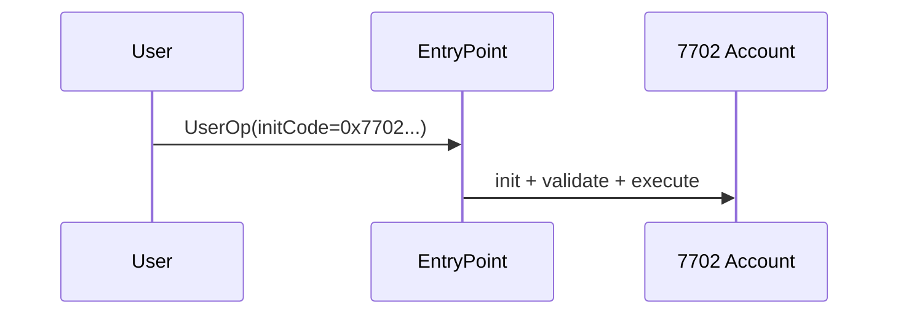
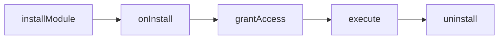

# EIP-7702 + ERC-4337 + ERC-7579
기존 EOA를 Smart Account로

---

## 오늘의 목표
- BD: 사업기회 발굴
- 개발: 구현 경로 이해
- CTO: 아키텍처/리스크 의사결정

---

## 왜 지금 필요한가
- EOA UX 한계: 복구/권한분리/자동화 부족
- CA 한계: 주소 이전 비용

---

## 큰 그림

---

## 핵심 개념 1: EIP-7702
- EOA 주소 유지
- delegate code 설정

---

## 핵심 개념 2: ERC-7579 Kernel
- Validator/Executor/Hook/Fallback/Policy/Signer
- 모듈형 확장 계정

---

## 핵심 개념 3: ERC-4337
- UserOperation
- Bundler, EntryPoint, Paymaster

---

## 왜 조합이 강한가
- 7702: 전환 비용 최소화
- 7579: 기능 확장
- 4337: 운영/비용/UX

---

## PoC 코드 맵
- `poc-contract/`: 온체인 로직
- `stable-platform/`: bundler/paymaster 운영

---

## 트랜잭션 모델
- 4337 PackedUserOperation 필드 중심

---

## 필수 필드
- `sender`
- `nonce`
- `callData`
- `accountGasLimits`
- `preVerificationGas`
- `gasFees`
- `signature`

---

## 옵션 필드
- `initCode` (온보딩)
- `paymasterAndData` (가스 대납)

---

## 7702 온보딩 흐름

---

## EVM 처리 절차
- `simulateValidation`
- `handleOps`
- `validateUserOp`
- `executeUserOp`
- 정산

---

## Kernel 내부 검증 포인트
- validation type
- nonce
- selector 접근권한

---

## Kernel 내부 실행 포인트
- hook pre/post
- executor/fallback 라우팅

---

## 장점 요약
- 주소 연속성
- 모듈 확장성
- 운영 최적화

---

## 단점/주의점 요약
- 체인 의존성
- delegate 변경 리스크
- 권한 정책 복잡도

---

## 모듈 카탈로그 (Validator)
- ECDSA
- MultiSig
- Weighted
- WebAuthn
- MultiChain

---

## 모듈 카탈로그 (Executor/Hook/Fallback)
- SessionKey / RecurringPayment
- SpendingLimit / Audit / Policy / HealthFactor
- TokenReceiver / FlashLoan

---

## 설치 라이프사이클

---

## 권한 위임 시나리오
- root key + session key + policy 결합

---

## Paymaster 정책
- whitelist / blacklist
- max gas / max cost
- daily / global limit

---

## Bundler 검증
- format
- reputation
- state
- simulation
- opcode

---

## 호환성 전략
- ERC-1271
- fallback/adapter
- legacy dApp 점진 전환

---

## 보안/운영 필수 통제
- module allowlist
- 긴급 nonce invalidation
- 감사로그/모니터링

---

## BD 인사이트
- 온보딩 friction 감소
- sponsored tx 성장 실험

---

## 개발 로드맵
- MVP: ECDSA + sponsor paymaster
- v2: session key + limits
- v3: multi-sig + 고급 정책

---

## CTO 의사결정 프레임
- 주소 유지 필요성
- 운영 복잡도 감당 가능성
- 정책 거버넌스 체계

---

## 결론
- 7702는 전환
- 7579는 확장
- 4337은 운영
- 균형 설계가 성공 핵심
