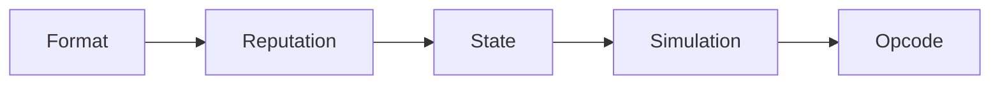

# Engineering Track
구현 관점에서 보는 7702 + 7579 + 4337

---

## 구현 순서
1. 7702 delegate 세팅
2. Kernel initialize(root validator)
3. 필수 모듈 설치
4. bundler/paymaster 연동
5. 모니터링/리스크 컨트롤

---

## 최소 구현 스택
- Account: Kernel + ECDSAValidator
- Infra: EntryPoint + Bundler
- Cost: SponsorPaymaster + policy

---

## UserOperation 필수 필드
- `sender`, `nonce`, `callData`
- `accountGasLimits`, `preVerificationGas`, `gasFees`
- `signature`

---

## 온보딩 필드
- `initCode = 0x7702 + initPayload` (조건부)
- `paymasterAndData` (대납 시)

---

## 검증 파이프라인

---

## Kernel 제어 포인트
- validation type/nonce
- selector grantAccess
- install/uninstall lifecycle

---

## 테스트 우선순위
1. validateUserOp 실패 케이스
2. paymaster 한도 초과 거절
3. session key 만료/회수
4. ERC-1271/토큰 수신 호환

---

## 운영 체크
- 실패율 대시보드
- 정책 거절률 모니터링
- incident runbook(Nonce invalidation)

---

## Engineering 결론
- 기능보다 먼저 "검증/정책/관측성"을 설계
